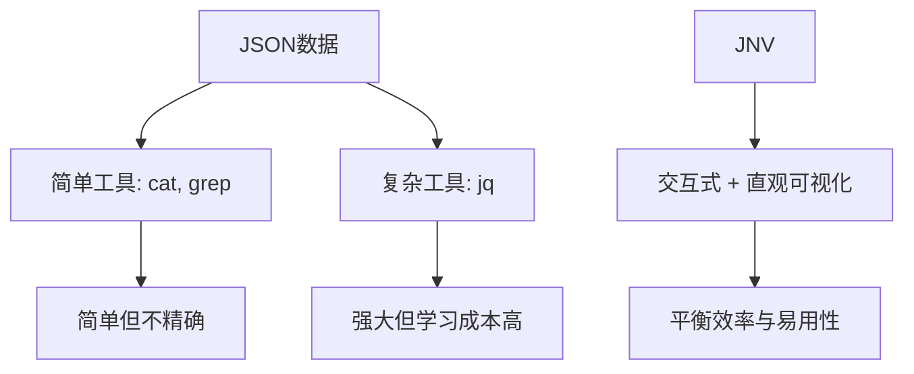
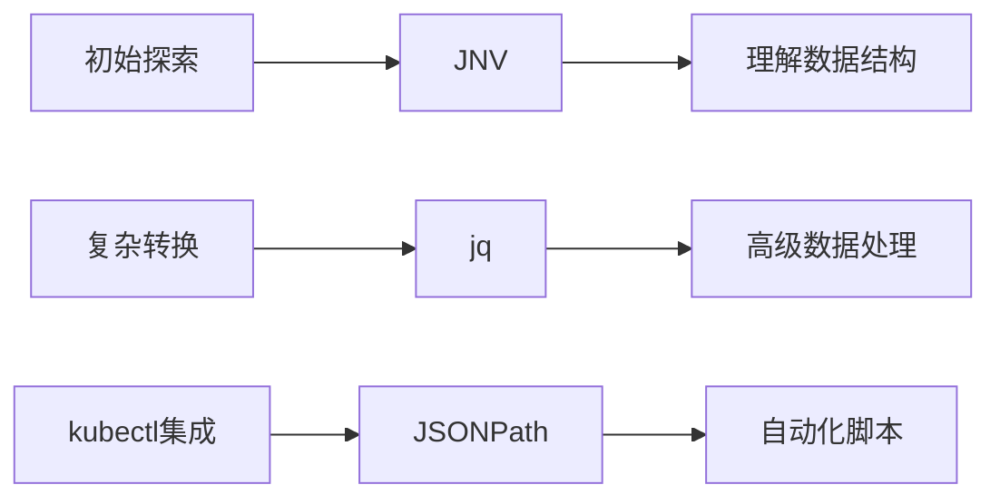

在处理复杂的JSON数据结构时，我们常常需要高效的工具来帮助我们浏览和过滤信息。JNV (JSON Navigator) 作为一款现代化的交互式JSON浏览工具，提供了强大而直观的功能，可以显著提升数据探索效率。本文将深入探讨JNV的技术原理、架构设计以及在复杂环境如Kubernetes中的应用场景。

<!--more-->

## JNV的本质与设计哲学

JNV (JSON Navigator) 的名称直观地反映了其核心目的：提供一种导航JSON数据的方式。从更深层次看，JNV体现了一种工具设计的哲学 —— 在复杂性和易用性之间找到平衡点。

### 从问题到解决方案

在数据处理领域，我们常常面临这样的矛盾：

- 数据结构越来越复杂（尤其是嵌套的JSON对象）
- 现有工具要么过于简单（如`cat`和`grep`），要么学习曲线陡峭（如`jq`）
- 工程师需要快速理解数据结构并提取关键信息

传统的JSON处理方式主要有两条路径：



JNV的创新在于它提供了第三条路径：通过交互式界面和直观的可视化，让用户能够即时看到数据结构，并通过简单的交互构建查询。

### JNV的技术架构

JNV是用Rust编写的，这一选择带来了高性能和内存安全性，即使处理大型JSON文件也能保持响应迅速。

从版本0.3.0开始，JNV放弃了对libjq的依赖，转而使用纯Rust实现的[jaq](https://github.com/01mf02/jaq)作为jq过滤器的解析和执行引擎。这一变化简化了构建过程，消除了对C依赖的需求。

JNV的核心组件包括：

1. **JSON解析器**：负责将输入的JSON数据解析为内存中的数据结构
2. **交互式界面**：基于终端UI库构建的用户界面
3. **查询引擎**：解析和执行jq风格的查询
4. **自动完成系统**：分析JSON结构提供上下文相关的补全建议

## 深入理解JNV的功能机制

### JSON解析与呈现

JNV采用了流式解析技术，这使得它能够处理单个大型JSON对象，也能处理多个JSON对象（如JSON Lines格式）。这是通过Rust的[StreamDeserializer](https://docs.rs/serde_json/latest/serde_json/struct.StreamDeserializer.html)实现的。

解析后的JSON被组织成一个树形结构，类似于：

```
Root
├── Object
│   ├── Key1: Value1
│   └── Key2: 
│       └── Array
│           ├── Item1
│           └── Item2
└── ...
```

这种树形结构使得用户可以通过折叠/展开节点的方式浏览复杂数据，而不会被所有细节同时淹没。

### 查询执行流程

当用户输入查询（如`.items[0].metadata.name`）时，JNV的处理流程如下：

1. **解析查询**：将查询字符串转换为抽象语法树(AST)
2. **验证语法**：检查查询是否符合jq语法规则
3. **执行查询**：将查询应用到当前JSON数据上
4. **呈现结果**：将执行结果以格式化方式显示在界面上

这一过程是实时的，用户每次修改查询，都会立即看到结果变化，这大大加速了探索和迭代过程。

## JNV与jq的关系：互补而非替代

值得注意的是，JNV并非试图完全替代jq，而是提供了一种互补的工具。

### 功能对比

| 功能 | JNV | jq |
|-----|-----|-----|
| 交互式界面 | ✅ | ❌ |
| 完整的jq语法支持 | 部分（基础操作） | ✅（完整） |
| 直观的数据结构浏览 | ✅ | ❌ |
| 高级数据转换（map, reduce等） | ❌（目前版本） | ✅ |
| 学习曲线 | 平缓 | 陡峭 |

JNV的价值在于它的探索性质，它让用户能够：
1. 直观地理解JSON结构
2. 交互式构建基本查询
3. 通过复制功能，将构建好的查询用于其他工具（如jq）中进行更高级的处理

这种工作流程特别适合那些需要频繁处理未知结构JSON数据的开发者和运维人员。

## 在Kubernetes环境中的高级应用

Kubernetes生态系统生成大量复杂的JSON数据，这使得JNV成为K8s管理员的理想工具。

### 资源探索模式

在学习和探索Kubernetes资源模型时，JNV提供了独特的优势：

```bash
# 探索Pod资源的完整结构
kubectl get pod <pod-name> -o json | jnv
```

通过这种方式，用户可以直观地理解Pod的组成部分，从`.metadata`到`.spec`再到`.status`，每个字段的关系和嵌套层次一目了然。

### 故障排查模式

当Kubernetes集群出现问题时，快速定位信息至关重要：

```bash
# 检查Pod状态条件
kubectl get pod <problem-pod> -o json | jnv
# 在JNV中导航到 .status.conditions 查看详细状态
```

与传统方法相比，JNV允许工程师在数据中"游走"，而不是被迫预先知道确切的路径。

### 复杂查询构建

对于需要构建复杂查询的场景，JNV可以作为"查询构建器"：

1. 使用JNV交互式浏览数据结构
2. 逐步构建查询，实时查看结果
3. 使用`Ctrl+Q`复制构建好的jq过滤器
4. 将过滤器用于更复杂的命令行操作

例如，首先在JNV中探索：

```bash
kubectl get pods -o json | jnv
# 在JNV中构建查询 .items[].metadata.name
```

然后复制查询，用于更复杂的操作：

```bash
kubectl get pods -o json | jq '.items[] | select(.status.phase=="Running") | .metadata.name'
```

## JSONPath与JNV：Kubernetes中的实用比较

在Kubernetes环境中，除了jq和JNV，还有另一个常用的查询语言：JSONPath。kubectl原生支持JSONPath，这使得它在某些场景下非常实用。

### JSONPath基础

JSONPath的基本语法与JNV中使用的jq语法有所不同：

```bash
# 使用JSONPath获取所有Pod名称
kubectl get pods -o jsonpath='{.items[*].metadata.name}'

# 等效的jq查询（在JNV中可以交互构建）
kubectl get pods -o json | jq '.items[].metadata.name'
```

### 处理多值输出

JSONPath在处理多个值时，默认会将它们连接在一起。要解决这个问题，可以使用range迭代器：

```bash
# 使用range让每个条件类型单独一行
kubectl get pod <pod-name> -o jsonpath='{range .status.conditions[*]}{.type}{"\n"}{end}'
```

这种格式化能力在复杂数据处理中非常有用。

### JNV、jq和JSONPath的选择策略

在Kubernetes环境中，这三种工具的最佳使用场景是：

- **JNV**：用于初始探索、理解结构和交互式构建基本查询
- **jq**：用于复杂的数据转换和高级过滤
- **JSONPath**：用于直接与kubectl集成的简单查询，尤其是在脚本中



## 技术实践：JNV的高级使用技巧

### 处理大型JSON文件

当处理大型JSON文件时，JNV的性能表现取决于几个因素：

1. **文件大小**：由于JNV将整个文件加载到内存，非常大的文件可能导致性能下降
2. **结构复杂性**：深度嵌套的JSON对象会增加渲染复杂度
3. **查询复杂性**：复杂查询可能需要更多计算资源

针对这些挑战，可以采用以下策略：

- 使用`--max-streams`参数限制处理的JSON对象数量
- 先使用jq预处理，减小数据集：`cat large.json | jq 'some_filter' | jnv`
- 增加缩进（`-i`参数）提高可读性

### 与其他工具集成

JNV可以无缝集成到更大的工作流程中：

```bash
# 将JNV与grep结合使用
kubectl get pods -o json | jnv  # 探索结构
kubectl get pods -o json | jq '.items[].metadata.name' | grep pattern  # 应用过滤

# 将JNV与watch结合，实现实时监控
watch 'kubectl get pod problem-pod -o json | jq ".status.conditions"'
```

### 快捷键与效率技巧

熟练使用JNV的快捷键可以显著提高效率：

- **Ctrl+C**：退出JNV
- **Ctrl+Q**：复制当前jq过滤器到剪贴板
- **Ctrl+O**：复制当前JSON到剪贴板
- **Shift+↑/↓**：在编辑模式和查看模式之间切换
- **Enter**：在查看模式中折叠/展开节点
- **Tab**：在编辑模式中触发自动完成
- **Ctrl+P/N**：全部展开/折叠JSON结构

### 与终端复用器的集成

对于使用终端复用器（如tmux或Zellij）的用户，可能会遇到快捷键冲突。例如，如果Zellij已经使用了`Ctrl+Q`和`Ctrl+O`，可以在Zellij配置中重新映射这些键：

```kdl
// Zellij config.kdl示例
keybinds {
    normal {
        // 将Ctrl+Q改为Alt+Q
        unbind "Ctrl q"
        bind "Alt q" { SwitchToMode "session"; }
        
        // 将Ctrl+O改为Alt+O
        unbind "Ctrl o"
        bind "Alt o" { SwitchToMode "pane"; }
    }
}
```

## JNV的未来发展与局限性

JNV作为一个相对新的工具，仍在不断发展中。目前的一些局限性包括：

1. **不完整的jq支持**：由于使用jaq替代libjq，某些高级jq功能尚未支持
2. **有限的自动完成**：当前版本仅支持基本路径的自动完成
3. **固定的快捷键**：缺乏自定义快捷键的能力

然而，这些局限并不影响JNV作为探索工具的核心价值。事实上，它的设计理念正是专注于做好一件事：让JSON数据探索变得简单直观。

### JNV与未来的AI集成可能性

随着AI技术的发展，我们可以展望JNV未来可能的发展方向：

1. **智能数据分析**：自动识别数据中的关键字段和异常
2. **自然语言查询**：允许用户使用自然语言描述他们想要的数据
3. **自适应界面**：根据用户行为模式自动调整界面和功能

这些创新可能使JNV从一个简单的浏览工具演变为一个智能数据分析助手，进一步降低数据处理的门槛。

## 结论

JNV代表了一种面向未来的工具设计理念：通过直观的交互界面，使复杂数据变得可理解、可探索。它并非追求成为最强大的JSON处理工具，而是致力于成为最能帮助用户理解数据的工具。

在Kubernetes等复杂系统的管理中，JNV提供了一个宝贵的"探索视角"，让工程师能够更快地理解系统状态、识别问题并构建有效的查询。它不是要取代jq或JSONPath，而是与它们协同工作，形成一个更完整的数据处理工具链。

对于数据驱动的组织和工程师，掌握JNV这样的工具意味着能够更快速地从数据中获取洞察，而这正是现代技术环境中的关键竞争力。

你是否考虑过，在面对日益复杂的数据结构时，我们的工具选择如何影响我们的工作效率和认知负担？JNV这类工具的出现，不仅仅是技术上的进步，更代表了一种以人为本的工具设计哲学：技术应该适应人类的思维方式，而不是强迫人类适应晦涩的技术语法。

如果你在处理复杂JSON数据（特别是Kubernetes环境中）时遇到困难，不妨尝试JNV，体验这种交互式探索带来的效率提升。你可能会发现，有时候最好的工具不是功能最多的，而是最符合你思维方式的那一个。

你有没有尝试使用JNV或类似工具来处理复杂数据结构？它如何改变了你的工作方式？欢迎在评论中分享你的经验和见解。
