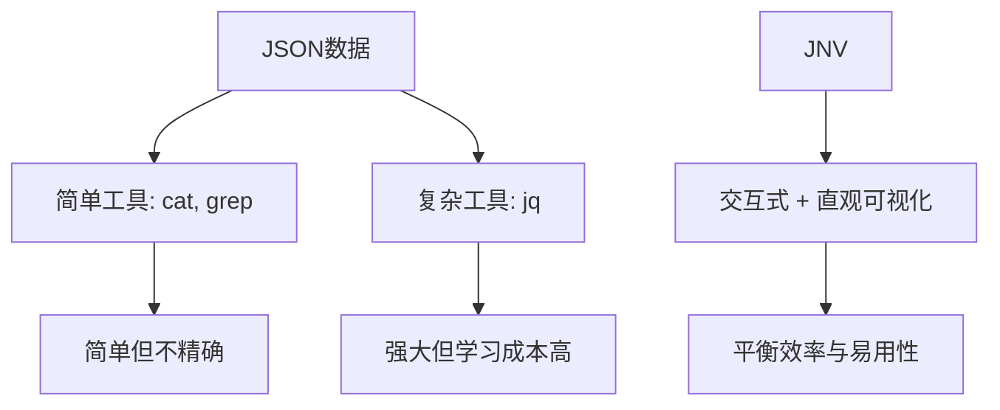

При работе со сложными структурами данных JSON нам часто требуются эффективные инструменты, помогающие просматривать и фильтровать информацию. JNV (JSON Navigator), современный интерактивный инструмент для просмотра JSON, предоставляет мощные и интуитивно понятные функции, позволяющие значительно повысить эффективность работы с данными. В этой статье мы рассмотрим технические принципы, архитектурный дизайн и сценарии применения JNV в сложных средах, таких как Kubernetes.

<! --подробнее-->

## Природа и философия дизайна JNV

Название JNV (JSON Navigator) интуитивно отражает его основную цель: предоставить способ навигации по данным JSON. На более глубоком уровне JNV воплощает философию дизайна инструментов - поиск баланса между сложностью и простотой использования.

### От проблемы к решению

В области обработки данных мы часто сталкиваемся с таким парадоксом:

- структуры данных становятся все более сложными (особенно вложенные JSON-объекты).
- Существующие инструменты либо слишком просты (например, `cat` и `grep`), либо имеют крутую кривую обучения (например, `jq`).
- Инженерам необходимо быстро разбираться в структурах данных и извлекать ключевую информацию

Существует два основных пути к традиционной обработке JSON:



Инновационность JNV заключается в том, что он предоставляет третий путь: через интерактивные интерфейсы и интуитивно понятные визуализации, которые позволяют пользователям мгновенно увидеть структуру данных и строить запросы с помощью простых взаимодействий.

### Техническая архитектура JNV

JNV написан на языке Rust, что обеспечивает высокую производительность и безопасность памяти, а также сохраняет отзывчивость даже при работе с большими JSON-файлами.

Начиная с версии 0.3.0, JNV отказался от зависимости от libjq в пользу чистой Rust-реализации [jaq](https://github.com/01mf02/jaq) в качестве механизма разбора и выполнения фильтров jq. Это изменение упрощает процесс сборки и устраняет необходимость в C-зависимостях.

Основные компоненты JNV включают:

1. **JSON-парсер**: отвечает за разбор входящих JSON-данных в структуры данных в памяти.
2. **Интерактивный интерфейс**: пользовательский интерфейс, построенный на основе библиотеки Terminal UI
3. **движок запросов**: анализирует и выполняет запросы в стиле jq
4. **система автодополнения**: анализирует структуры JSON для предоставления контекстно-зависимых дополнительных предложений

## Глубокое понимание функциональных механизмов JNV

### Парсинг и рендеринг JSON

JNV использует технологию потокового разбора, что позволяет ему работать как с одним большим объектом JSON, так и с несколькими объектами JSON (например, формат JSON Lines). Это достигается с помощью [StreamDeserializer](https://docs.rs/serde_json/latest/serde_json/struct.StreamDeserializer.html) в Rust.

Разобранный JSON организуется в древовидную структуру, подобную:

```
Root
├── Object
│   ├── Key1: Value1
│   └── Key2: 
│       └── Array
│           ├── Item1
│           └── Item2
└── ...
```

Такая древовидная структура позволяет пользователям ориентироваться в сложных данных, сворачивая/разворачивая узлы и не перегружаясь всеми деталями сразу.

### Поток выполнения запросов

Когда пользователь вводит запрос (например, `.items[0].metadata.name`), поток обработки JNV выглядит следующим образом:

1. **Разбор запроса**: преобразование строки запроса в дерево абстрактного синтаксиса (AST)
2. **Проверка синтаксиса**: проверка соответствия запроса правилам синтаксиса jq.
3. **Выполнить запрос**: применить запрос к текущим данным JSON
4. **Вывести результат**: отобразить результат выполнения в интерфейсе в отформатированном виде

Этот процесс происходит в режиме реального времени, каждый раз, когда пользователь изменяет запрос, он/она сразу же видит изменение результата, что значительно ускоряет процесс исследования и итерации.

## Взаимоотношения между JNV и jq: дополняют, а не заменяют друг друга

Стоит отметить, что JNV не пытается полностью заменить jq, а скорее является дополняющим инструментом.

### Сравнение функциональности

| Features | JNV | jq |
| -----|-----|-----|-----|
| Интерактивный интерфейс | ✅ | ❌ |
| Полная поддержка синтаксиса jq | Частичная (основные операции) | ✅ (полная) |
Интуитивно понятный просмотр структур данных | ✅ | ❌ | ❌ |
| Расширенные преобразования данных (map, reduce и т.д.) | ❌ (текущая версия) | ✅ | ✅ |
| Кривая обучения | Плавная | Крутая |

Ценность JNV заключается в его исследовательском характере, который позволяет пользователям:
1. интуитивно понимать структуры JSON
2. создавать базовые запросы в интерактивном режиме
3. использовать созданные запросы для более сложной обработки в других инструментах (например, jq) посредством репликации.

Этот рабочий процесс особенно хорошо подходит для разработчиков и операционного персонала, которым приходится часто работать с данными JSON неизвестной структуры.

## Расширенные приложения в средах Kubernetes

Экосистема Kubernetes генерирует большие объемы сложных JSON-данных, что делает JNV идеальным инструментом для администраторов K8s.

### Режим исследования ресурсов

JNV предлагает уникальные преимущества при изучении и исследовании модели ресурсов Kubernetes:

```bash
# 探索Pod资源的完整结构
kubectl get pod <pod-name> -o json | jnv
```.

Таким образом, пользователи могут наглядно представить себе компоненты бода, от `.metadata` до `.spec` и `.status`, с одной стороны, и взаимосвязь каждого поля и уровень вложенности с другой. .

### Режим устранения неполадок

Когда в кластере Kubernetes возникает проблема, очень важно быстро найти информацию:

```bash
# 检查Pod状态条件
kubectl get pod <problem-pod> -o json | jnv
# 在JNV中导航到 .status.conditions 查看详细状态
```.

В отличие от традиционных методов, JNV позволяет инженерам "пробираться" через данные, а не знать точный путь заранее.

### Построение сложных запросов

JNV можно использовать в качестве "конструктора запросов" для сценариев, в которых необходимо построить сложные запросы:

1. используйте JNV для интерактивного просмотра структур данных
2. пошаговое построение запросов и просмотр результатов в режиме реального времени
3. используйте `Ctrl+Q` для копирования построенного jq-фильтра
4. используйте фильтры для более сложных операций в командной строке

Например, сначала изучите JNV:

```bash
kubectl get pods -o json | jnv
# 在JNV中构建查询 .items[].metadata.name
```

Затем скопируйте запрос для более сложных операций:

```bash
kubectl get pods -o json | jq '.items[] | select(.status.phase=="Running") | .metadata.name'
```

## JSONPath против JNV: практическое сравнение в Kubernetes

В средах Kubernetes, помимо jq и JNV, существует еще один часто используемый язык запросов: JSONPath. kubectl нативно поддерживает JSONPath, что делает его очень полезным в некоторых сценариях.

### Основы JSONPath

Основной синтаксис JSONPath отличается от синтаксиса jq, используемого в JNV:

```bash
# 使用JSONPath获取所有Pod名称
kubectl get pods -o jsonpath='{.items[*].metadata.name}'

# 等效的jq查询（在JNV中可以交互构建）
kubectl get pods -o json | jq '.items[].metadata.name'
```.

### Обработка многозначного вывода

JSONPath по умолчанию конкатенирует несколько значений при их обработке. Чтобы обойти это, используйте итератор диапазона:

```bash
# 使用range让每个条件类型单独一行
kubectl get pod <pod-name> -o jsonpath='{range .status.conditions[*]}{.type}{"\n"}{end}'
```.

Эта возможность форматирования очень полезна при обработке сложных данных.

### Стратегии выбора для JNV, jq и JSONPath

Наилучшим сценарием использования этих трех инструментов в среде Kubernetes является:

- **JNV**: для первоначального изучения, понимания структуры и интерактивного построения базовых запросов
- **JQ**: для сложных преобразований данных и расширенной фильтрации
- **JSONPath**: для простых запросов, которые интегрируются непосредственно с kubectl, особенно в скриптах

```mermaid
graph LR
    A[初始探索] --> B[JNV]
    C[复杂转换] --> D[jq]
    E[kubectl集成] --> F[JSONPath]
    B --> G[理解数据结构]
    D --> H[高级数据处理]
    F --> I[自动化脚本]
```.

## Технические практики: продвинутые советы по использованию JNV

### Работа с большими файлами JSON

При обработке больших файлов JSON производительность JNV зависит от нескольких факторов:

1. **Размер файла**: поскольку JNV загружает весь файл в память, очень большие файлы могут привести к снижению производительности.
2. **Сложность структуры**: глубоко вложенные JSON-объекты увеличивают сложность рендеринга.
3. **Сложность запросов**: сложные запросы могут потребовать больше вычислительных ресурсов

Для решения этих проблем можно использовать следующие стратегии:

- Ограничьте количество обрабатываемых JSON-объектов с помощью параметра __PROTECTED_INLINE_CODE__19__.
- Сначала используйте препроцессинг jq для уменьшения набора данных: `cat large.json | jq 'some_filter' | jnv`.
- Увеличьте отступы (параметр `-i`) для улучшения читабельности

### Интеграция с другими инструментами

JNV можно легко интегрировать в более крупные рабочие процессы:

```bash
# 将JNV与grep结合使用
kubectl get pods -o json | jnv  # 探索结构
kubectl get pods -o json | jq '.items[].metadata.name' | grep pattern  # 应用过滤

# 将JNV与watch结合，实现实时监控
watch 'kubectl get pod problem-pod -o json | jq ".status.conditions"'
```.

### Краткое описание и советы по эффективности

Умелое использование клавиш быстрого доступа JNV может значительно повысить эффективность работы:

- **Ctrl+C**: выход из JNV.
- **Ctrl+Q**: скопировать текущий jq-фильтр в буфер обмена.
- **Ctrl+O**: скопировать текущий JSON в буфер обмена
- **Shift+↑/↓**: переключение между режимом редактирования и режимом просмотра
- **Enter**: свернуть/развернуть узлы в режиме просмотра
- **Tab**: запуск автозаполнения в режиме редактирования
- **Ctrl+P/N**: развернуть/свернуть всю структуру JSON

### Интеграция с терминальными мультиплексорами

Для пользователей, использующих терминальные мультиплексоры, такие как tmux или Zellij, могут возникнуть конфликты между ярлыками. Например, если Zellij уже использует `Ctrl+Q` и `Ctrl+O`, можно переназначить эти клавиши в конфигурации Zellij:

```kdl
// Zellij config.kdl示例
keybinds {
    normal {
        // 将Ctrl+Q改为Alt+Q
        unbind "Ctrl q"
        bind "Alt q" { SwitchToMode "session"; }
        
        // 将Ctrl+O改为Alt+O
        unbind "Ctrl o"
        bind "Alt o" { SwitchToMode "pane"; }
    }
}
```.

## Будущее JNV и ограничения

JNV все еще развивается как относительно новый инструмент. Некоторые из текущих ограничений включают:

1. **неполная поддержка jq**: из-за использования jaq вместо libjq, некоторые продвинутые функции jq пока не поддерживаются
2. **ограниченное автодополнение**: текущая версия поддерживает только автодополнение основных путей
3. **Неисправленные ярлыки**: отсутствие возможности настраивать ярлыки

Однако эти ограничения не умаляют основной ценности JNV как инструмента для исследования. На самом деле, философия его дизайна сосредоточена на том, чтобы сделать хорошо только одну вещь: сделать исследование данных JSON простым и интуитивно понятным.

### JNV и будущие возможности интеграции с искусственным интеллектом

По мере развития технологий ИИ мы можем с нетерпением ждать возможных будущих направлений развития JNV:

1. **Интеллектуальный анализ данных**: автоматическое определение ключевых полей и аномалий в данных
2. **Запросы на естественном языке**: предоставление пользователям возможности описывать нужные им данные на естественном языке
3. **Адаптивный интерфейс**: автоматическая адаптация интерфейса и функциональности на основе моделей поведения пользователей

Эти инновации могут позволить JNV превратиться из простого инструмента просмотра в интеллектуального помощника по анализу данных, что еще больше снизит порог обработки данных.

## Заключение

JNV представляет собой философию разработки инструментов, ориентированных на будущее: сделать сложные данные понятными и доступными для изучения с помощью интуитивно понятного интерактивного интерфейса. Он не стремится стать самым мощным инструментом для обработки JSON, а скорее стремится стать инструментом, который лучше всего помогает пользователям понять данные.

В управлении сложными системами, такими как Kubernetes, JNV обеспечивает бесценную "исследовательскую перспективу", которая позволяет инженерам быстрее понять состояние системы, выявить проблемы и построить эффективные запросы. Он не предназначен для замены jq или JSONPath, а скорее для работы в тандеме с ними, чтобы сформировать более полный набор инструментов для обработки данных.

Для организаций и инженеров, ориентированных на работу с данными, освоение таких инструментов, как JNV, означает возможность более быстрого извлечения информации из данных, что является ключевой компетенцией в современном технологическом ландшафте.

Задумывались ли вы о том, как выбор инструментов влияет на нашу производительность и когнитивную нагрузку при работе со все более сложными структурами данных? Появление таких инструментов, как JNV, - это не просто технологический прогресс, а философия разработки инструментов, ориентированная на человека: технологии должны быть адаптированы к тому, как человек мыслит, а не заставлять его приспосабливаться к непонятному техническому синтаксису.

Если вы испытываете трудности при работе со сложными JSON-данными (особенно в среде Kubernetes), попробуйте JNV и оцените эффективность, которую дает такое интерактивное исследование. Вы можете обнаружить, что иногда лучший инструмент - это не тот, у которого больше возможностей, а тот, который лучше всего соответствует вашему образу мышления.

Пробовали ли вы использовать JNV или аналогичный инструмент для работы со сложными структурами данных? Как это изменило вашу работу? Не стесняйтесь делиться своим опытом и соображениями в комментариях.
