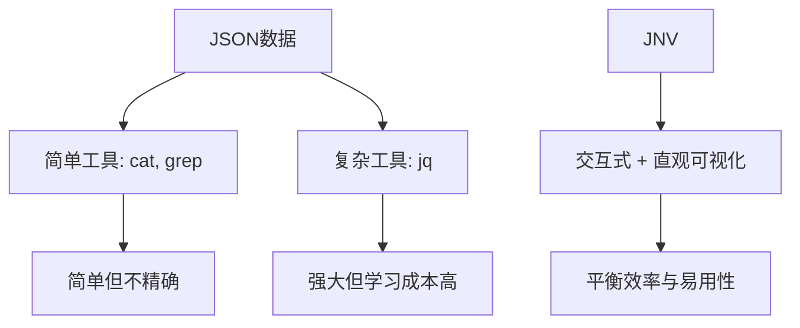
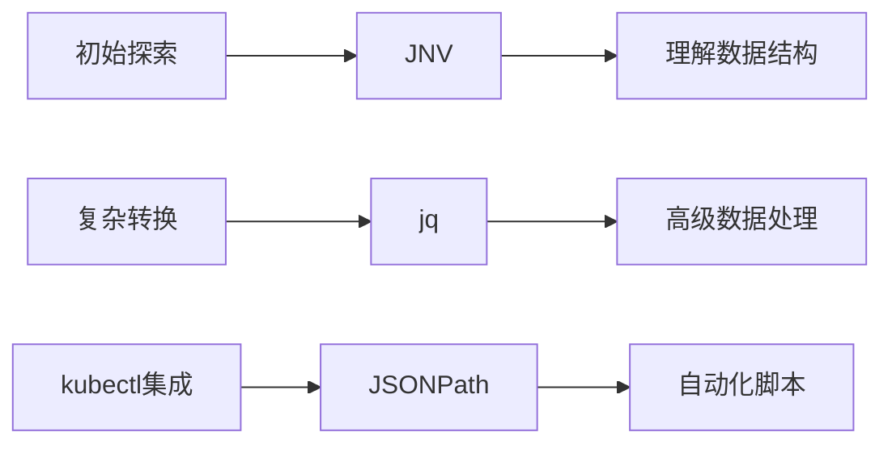

При работе со сложными структурами данных JSON нам часто требуются эффективные инструменты, помогающие просматривать и фильтровать информацию. JNV (JSON Navigator), современный интерактивный инструмент просмотра JSON, предоставляет мощные и интуитивно понятные функции, позволяющие значительно повысить эффективность работы с данными. В этой статье мы рассмотрим технические принципы, архитектурный дизайн и сценарии применения JNV в сложных средах, таких как Kubernetes.

<!--more-->

## JNV的本质与设计哲学

Название JNV (JSON Navigator) интуитивно отражает его основную цель: предоставить способ навигации по данным JSON. На более глубоком уровне JNV воплощает философию разработки инструментов - поиск баланса между сложностью и простотой использования.

### 从问题到解决方案

В области обработки данных мы часто сталкиваемся с этим парадоксом:

- Все более сложные структуры данных (особенно вложенные объекты JSON)
- Существующие инструменты либо слишком просты (например, `cat` и `grep`), либо требуют длительного обучения (например, `jq`).
- Инженерам необходимо быстро разбираться в структурах данных и извлекать ключевую информацию

Существует два основных пути традиционной обработки JSON:



Инновационность JNV заключается в том, что он предоставляет третий путь: благодаря интерактивному интерфейсу и интуитивной визуализации он позволяет пользователям мгновенно увидеть структуру данных и создавать запросы с помощью простых взаимодействий.

### JNV的技术架构

JNV написан на языке Rust, что обеспечивает высокую производительность и безопасность памяти, а также сохраняет отзывчивость даже при работе с большими JSON-файлами.

Начиная с версии 0.3.0, JNV отказался от зависимости от libjq в пользу чистой Rust-реализации [jaq](https://github.com/01mf02/jaq) в качестве механизма разбора и выполнения фильтров jq. Это изменение упрощает процесс сборки и устраняет необходимость в C-зависимостях.

Основные компоненты JNV включают:

1. **JSON-парсер**: отвечает за разбор входных JSON-данных в структуры данных в памяти.
2. **Интерактивный интерфейс**: пользовательский интерфейс, построенный на основе библиотеки terminal UI
3. **движок запросов**: анализирует и выполняет запросы в стиле jq
4. **система автодополнения**: анализирует JSON-структуры для предоставления контекстно-зависимых дополнительных предложений

## 深入理解JNV的功能机制

### JSON解析与呈现

В JNV используется технология потокового разбора, которая позволяет работать как с одним большим объектом JSON, так и с несколькими объектами JSON (например, в формате JSON Lines). Это достигается с помощью [StreamDeserializer](https://docs.rs/serde_json/latest/serde_json/struct.StreamDeserializer.html) в Rust.

Разобранный JSON организуется в древовидную структуру, похожую на:

```
Root
├── Object
│   ├── Key1: Value1
│   └── Key2: 
│       └── Array
│           ├── Item1
│           └── Item2
└── ...
```

Такая древовидная структура позволяет пользователям ориентироваться в сложных данных, сворачивая и разворачивая узлы, не перегружаясь всеми деталями сразу.

### 查询执行流程

Когда пользователь вводит запрос (например, `.items[0].metadata.name`), JNV обрабатывает его следующим образом:

1. **Разбор запроса**: преобразование строки запроса в дерево абстрактного синтаксиса (AST)
2. **Проверка синтаксиса**: проверка соответствия запроса правилам синтаксиса jq.
3. **Выполнить запрос**: применить запрос к текущим данным JSON.
4. **Вывести результат**: отобразить результат выполнения в интерфейсе в отформатированном виде.

Этот процесс происходит в режиме реального времени, и каждый раз, когда пользователь изменяет запрос, он сразу же видит, как меняются результаты, что значительно ускоряет процесс исследования и итераций.

## JNV与jq的关系：互补而非替代

Стоит отметить, что JNV не пытается полностью заменить jq, а скорее является дополнительным инструментом.

### 功能对比

| Функции | JNV | jq |
|-----|-----|-----|
| Интерактивный интерфейс | ✅ | ❌ | ❌ |
| Полная поддержка синтаксиса jq | Частичная (основные операции) | ✅ (полная) |
Интуитивно понятный просмотр структур данных | ✅ | ❌ | ❌ |
| Расширенные преобразования данных (map, reduce и т.д.) | ❌ (текущая версия) | ✅ | ✅ |
| Кривая обучения | Плавная | Крутая |

Ценность JNV заключается в его исследовательском характере, который позволяет пользователям:
1. интуитивно понимать структуры JSON
2. строить базовые запросы в интерактивном режиме
3. использовать построенные запросы для более сложной обработки в других инструментах (например, jq) с помощью функции репликации

Этот рабочий процесс особенно удобен для разработчиков и операционного персонала, которым приходится часто иметь дело с JSON-данными неизвестной структуры.

## 在Kubernetes环境中的高级应用

Экосистема Kubernetes генерирует множество сложных JSON-данных, что делает JNV идеальным инструментом для администраторов K8s.

### 资源探索模式

JNV предлагает уникальные преимущества при изучении и освоении ресурсной модели Kubernetes:

```bash
# 探索Pod资源的完整结构
kubectl get pod <pod-name> -o json | jnv
```

Таким образом, пользователи могут интуитивно понять все составляющие Pod, от `.metadata` до `.spec` и `.status`, а также взаимосвязи и уровни вложенности каждого поля с первого взгляда.

### 故障排查模式

При возникновении проблем с кластером Kubernetes очень важно быстро найти нужную информацию:

```bash
# 检查Pod状态条件
kubectl get pod <problem-pod> -o json | jnv
# 在JNV中导航到 .status.conditions 查看详细状态
```

В отличие от традиционных методов, JNV позволяет инженерам "пробираться" через данные, а не знать точный путь заранее.

### 复杂查询构建

JNV можно использовать в качестве "конструктора запросов" для сценариев, в которых необходимо создавать сложные запросы:

1. Используйте JNV для интерактивного просмотра структур данных
2. пошаговое построение запросов и просмотр результатов в реальном времени
3. использование `Ctrl+Q` для копирования созданного jq-фильтра
4. использование фильтров для более сложных операций в командной строке

Например, сначала исследуйте в JNV:

```bash
kubectl get pods -o json | jnv
# 在JNV中构建查询 .items[].metadata.name
```

Затем запрос копируется для выполнения более сложных операций:

```bash
kubectl get pods -o json | jq '.items[] | select(.status.phase=="Running") | .metadata.name'
```

## JSONPath与JNV：Kubernetes中的实用比较

В средах Kubernetes, помимо jq и JNV, существует еще один часто используемый язык запросов: JSONPath. kubectl нативно поддерживает JSONPath, что делает его очень полезным в некоторых сценариях.

### JSONPath基础

Основной синтаксис JSONPath отличается от синтаксиса jq, используемого в JNV:

```bash
# 使用JSONPath获取所有Pod名称
kubectl get pods -o jsonpath='{.items[*].metadata.name}'

# 等效的jq查询（在JNV中可以交互构建）
kubectl get pods -o json | jq '.items[].metadata.name'
```

### 处理多值输出

JSONPath по умолчанию конкатенирует несколько значений при работе с ними. Чтобы обойти это, можно использовать итератор диапазона:

```bash
# 使用range让每个条件类型单独一行
kubectl get pod <pod-name> -o jsonpath='{range .status.conditions[*]}{.type}{"\n"}{end}'
```

Эта возможность форматирования очень полезна при обработке сложных данных.

### JNV、jq和JSONPath的选择策略

Наилучшими сценариями использования этих трех инструментов в среде Kubernetes являются:

- **JNV**: для первоначального изучения, понимания структуры и интерактивного построения базовых запросов
- **jq**: для сложных преобразований данных и расширенной фильтрации
- **JSONPath**: для простых запросов, которые интегрируются непосредственно с kubectl, особенно в скриптах



## 技术实践：JNV的高级使用技巧

### 处理大型JSON文件

При обработке больших файлов JSON производительность JNV зависит от нескольких факторов:

1. **Размер файла**: поскольку JNV загружает весь файл в память, очень большие файлы могут привести к снижению производительности.
2. **Структурная сложность**: Глубоко вложенные JSON-объекты могут увеличить сложность рендеринга
3. **Сложность запросов**: сложные запросы могут потребовать больше вычислительных ресурсов

Для решения этих проблем можно использовать следующие стратегии:

- Используйте параметр `-max-streams`, чтобы ограничить количество обрабатываемых JSON-объектов.
- Сначала используйте предварительную обработку jq, чтобы уменьшить набор данных: `cat large.json | jq 'some_filter' | jnv`.
- Увеличьте отступы (параметр `-i`) для улучшения читабельности

### 与其他工具集成

JNV можно легко интегрировать в более крупные рабочие процессы:

```bash
# 将JNV与grep结合使用
kubectl get pods -o json | jnv  # 探索结构
kubectl get pods -o json | jq '.items[].metadata.name' | grep pattern  # 应用过滤

# 将JNV与watch结合，实现实时监控
watch 'kubectl get pod problem-pod -o json | jq ".status.conditions"'
```

### 快捷键与效率技巧

Умелое использование сочетаний клавиш JNV может значительно повысить эффективность работы:

- **Ctrl+C**: выйти из JNV
- **Ctrl+Q**: скопировать текущий jq-фильтр в буфер обмена
- **Ctrl+O**: скопировать текущий JSON в буфер обмена
- **Shift+↑/↓**: переключение между режимом редактирования и режимом просмотра
- **Enter**: свернуть/развернуть узлы в режиме просмотра
- **Tab**: запуск автозаполнения в режиме редактирования
- **Ctrl+P/N**: развернуть/свернуть все структуры JSON

### 与终端复用器的集成

Для пользователей, использующих терминальные мультиплексоры, такие как tmux или Zellij, может возникнуть конфликт клавиш быстрого доступа. Например, если в Zellij уже используются `Ctrl+Q` и `Ctrl+O`, можно переназначить эти клавиши в конфигурации Zellij:

```kdl
// Zellij config.kdl示例
keybinds {
    normal {
        // 将Ctrl+Q改为Alt+Q
        unbind "Ctrl q"
        bind "Alt q" { SwitchToMode "session"; }
        
        // 将Ctrl+O改为Alt+O
        unbind "Ctrl o"
        bind "Alt o" { SwitchToMode "pane"; }
    }
}
```

## JNV的未来发展与局限性

JNV, будучи относительно новым инструментом, все еще развивается. Некоторые из существующих ограничений включают:

1. **Неполная поддержка jq**: из-за использования jaq вместо libjq, некоторые продвинутые функции jq пока не поддерживаются.
2. **Ограниченное автодополнение**: текущая версия поддерживает только автодополнение основных путей.
3. **Неисправленные ярлыки**: отсутствие возможности настраивать ярлыки.

Однако эти ограничения не умаляют основных достоинств JNV как инструмента исследования. На самом деле, философия его дизайна направлена на то, чтобы хорошо делать только одну вещь: делать исследование данных JSON простым и интуитивно понятным.

### JNV与未来的AI集成可能性

С развитием технологий искусственного интеллекта мы можем с нетерпением ждать возможного будущего направления развития JNV:

1. **Интеллектуальный анализ данных**: автоматически определяет ключевые поля и аномалии в данных
2. **Запрос на естественном языке**: позволяет пользователям описывать нужные им данные на естественном языке
3. **Адаптивный интерфейс**: автоматическая адаптация интерфейса и функциональности на основе моделей поведения пользователей

Эти инновации могут позволить JNV превратиться из простого инструмента просмотра в интеллектуальный помощник анализа данных, что еще больше снизит барьеры для обработки данных.

## 结论

JNV представляет собой философию разработки инструментов, ориентированных на будущее: сделать сложные данные понятными и доступными для изучения с помощью интуитивно понятного интерактивного интерфейса. Он не стремится стать самым мощным инструментом для обработки JSON, но стремится стать инструментом, который лучше всего помогает пользователям понять данные.

При управлении сложными системами, такими как Kubernetes, JNV предоставляет бесценный "обзор открытий", который позволяет инженерам быстрее понять состояние системы, выявить проблемы и построить эффективные запросы. Он не предназначен для замены jq или JSONPath, а скорее работает в тандеме с ними для создания более полного набора инструментов для обработки данных.

Для организаций и инженеров, ориентированных на работу с данными, освоение таких инструментов, как JNV, означает возможность быстрее извлекать информацию из данных, что является ключевой компетенцией в современном технологическом ландшафте.

Задумывались ли вы о том, как выбор инструментов влияет на нашу производительность и когнитивную нагрузку при работе с все более сложными структурами данных? Появление таких инструментов, как JNV, - это не просто технологическое достижение, а философия разработки инструментов, ориентированная на человека: технологии должны быть адаптированы к человеческому образу мышления, а не заставлять людей приспосабливаться к непонятному техническому синтаксису.

Если вы испытываете трудности при работе со сложными данными JSON (особенно в среде Kubernetes), попробуйте JNV и ощутите, как повышается эффективность интерактивного исследования. Вы можете обнаружить, что иногда лучший инструмент - это не тот, у которого больше возможностей, а тот, который лучше всего соответствует вашему образу мышления.

Пробовали ли вы использовать JNV или аналогичные инструменты для работы со сложными структурами данных? Как это изменило вашу работу? Не стесняйтесь делиться своим опытом и соображениями в комментариях.