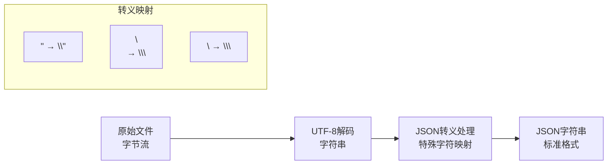
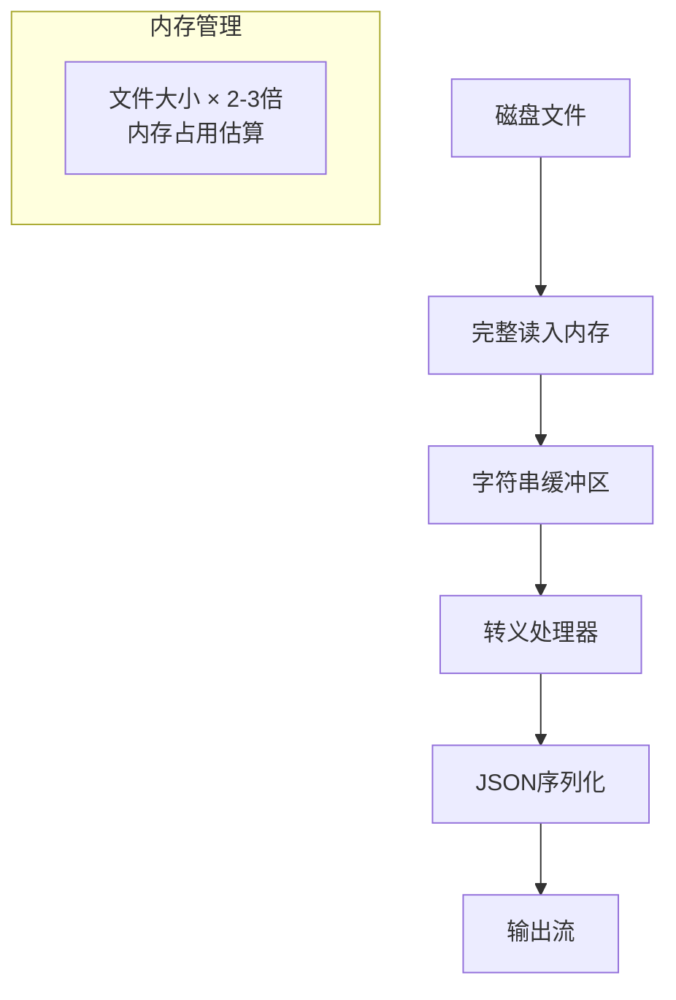
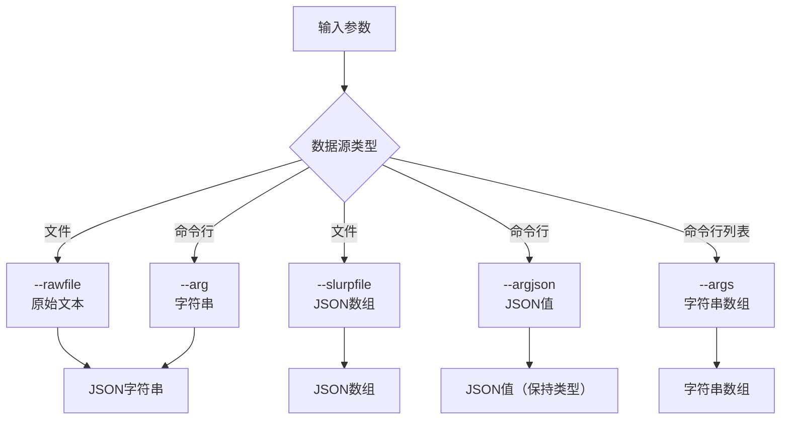
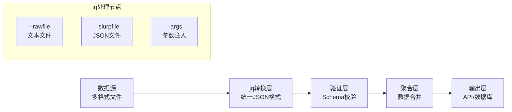

在现代数据处理流程中，文件格式转换是一个基础但关键的环节。当我们需要将各种格式的原始数据转换为结构化的JSON格式时，jq工具提供了一系列强大的文件处理参数。本文将深入探讨jq的文件处理机制，特别是`--rawfile`系列参数的工作原理和应用场景。

<!--more-->

## 核心概念：数据类型转换的本质

### JSON转义机制的物理过程

当我们使用`--rawfile`处理文件时，jq实际上执行了一个复杂的字符编码转换过程：



这个过程解决了一个根本问题：如何安全地将任意文本内容嵌入到JSON结构中，而不破坏JSON的语法完整性。

### 内存处理模型

jq的文件处理采用全加载模式：



这种设计的优势是处理简单、可靠，劣势是大文件会消耗大量内存。

## 参数体系：不同数据源的处理策略

### --rawfile vs --slurpfile：原始文本与结构化数据

两者的根本区别在于数据解释层面：

**--rawfile原理：**
- 跳过JSON解析，直接处理字节流
- 适用于任意文本格式（日志、配置、文档）
- 输出保证是合法的JSON字符串

**--slurpfile原理：**
- 先进行JSON解析验证
- 将多个JSON对象组装成数组
- 输出是JSON数据结构，不是字符串

实际应用中的选择逻辑：

```bash
# 处理任意文本文件 → 使用 --rawfile
jq -n --rawfile log app.log '{log_content: $log}'

# 处理已知JSON文件 → 使用 --slurpfile  
jq -n --slurpfile data records.json '{all_records: $data}'
```

### 参数类型系统

jq的参数处理实现了一个简单但完整的类型系统：



这个类型系统的设计哲学是：**明确的类型转换，避免隐式猜测**。

## 深度应用：构建数据处理管道

### 配置文件聚合系统

现代应用常常需要将多个配置源聚合成统一的配置对象：

```bash
# 聚合多种配置源
jq -n \
  --rawfile app_config config/app.yml \
  --rawfile database_config config/database.conf \
  --slurpfile feature_flags config/features.json \
  --arg environment "production" \
  --argjson version "2.1.0" \
  '{
    application: {
      config: $app_config,
      database: $database_config,
      features: $feature_flags[0],
      environment: $environment,
      version: $version,
      loaded_at: now
    }
  }'
```

这种模式在微服务架构中特别有用，可以在容器启动时动态生成完整的配置文件。

### 日志聚合与结构化

将非结构化日志转换为结构化数据：

```bash
# 构建日志分析数据包
jq -n \
  --rawfile error_log logs/error.log \
  --rawfile access_log logs/access.log \
  --arg host "$(hostname)" \
  --argjson timestamp "$(date +%s)" \
  '{
    logs: {
      errors: $error_log,
      access: $access_log
    },
    metadata: {
      host: $host,
      collected_at: $timestamp,
      format_version: "1.0"
    }
  }'
```

### 文档生成系统

技术文档的自动化生成和发布：

```bash
# 生成完整的文档包
jq -n \
  --rawfile readme README.md \
  --rawfile changelog CHANGELOG.md \
  --rawfile license LICENSE \
  --slurpfile api_docs docs/api/*.json \
  --arg version "$(git describe --tags)" \
  '{
    documentation: {
      readme: $readme,
      changelog: $changelog,
      license: $license,
      api: $api_docs,
      version: $version,
      generated_at: now
    }
  }'
```

## 性能优化与最佳实践

### 内存使用优化

对于大文件处理，需要考虑内存限制：

```bash
# 检查文件大小
ls -lh large_file.log

# 如果文件过大，考虑分片处理
split -l 10000 large_file.log chunk_
for chunk in chunk_*; do
  jq -n --rawfile content "$chunk" '{chunk_data: $content}' >> processed.json
done
```

### 错误处理策略

生产环境中的健壮性处理：

```bash
# 带错误检查的处理流程
process_file() {
  local file=$1
  if [[ ! -f "$file" ]]; then
    echo '{"error": "file_not_found", "file": "'$file'"}' 
    return 1
  fi
  
  jq -n --rawfile content "$file" '{
    content: $content,
    file_info: {
      name: "'$file'",
      size: "'$(stat -f%z "$file" 2>/dev/null || stat -c%s "$file")'",
      processed_at: now
    }
  }' 2>/dev/null || echo '{"error": "processing_failed", "file": "'$file'"}'
}
```

## 架构模式：数据处理管道设计

### 管道式数据转换

将jq文件处理集成到更大的数据处理流程中：



### 微服务配置管理

在容器化环境中的配置管理模式：

```dockerfile
# Dockerfile中的配置聚合
RUN jq -n \
  --rawfile app_config /config/app.yml \
  --arg pod_name "$HOSTNAME" \
  --argjson replica_count "$REPLICAS" \
  '{config: $app_config, runtime: {pod: $pod_name, replicas: $replica_count}}' \
  > /runtime/config.json
```

## AI时代的数据处理展望

随着大语言模型的普及，文件到JSON的转换将在以下场景中变得更加重要：

### 训练数据准备
将各种格式的文档转换为模型训练所需的JSON格式，jq的文件处理能力为数据预处理提供了标准化的工具链。

### API集成
大模型API通常要求JSON格式的输入，jq可以作为数据适配层，将传统系统的输出转换为AI友好的格式。

### 知识库构建
企业知识库的构建需要将散布在各种文件中的信息结构化，jq的批量处理能力为这类任务提供了基础工具支持。

## 技术演进的思考

jq工具的设计体现了Unix哲学中"做好一件事"的理念。在数据处理日益复杂的今天，这种专注的工具设计反而显得更加珍贵。它提醒我们：有时候最好的解决方案不是构建一个包罗万象的巨型系统，而是设计几个可以完美协作的小工具。

当我们在构建现代数据处理系统时，是否也应该思考：如何在追求功能完整性的同时，保持工具的简洁性和可组合性？
