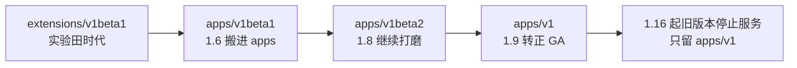

写 K8s YAML 时你一定疑惑过：为什么 Pod 的 `apiVersion` 是光秃秃的 `v1`，Deployment 却要写 `apps/v1`？这个分组是谁定的、有什么用？这篇文章从一条报错出发，把 API 分组的规律讲清楚，再往下挖一层——你会看到 Kubernetes 官方设计提案里的一段历史，和一个「没有名字的组」背后的兼容性承诺。

<!--more-->

## 从一条报错说起

练习环境里创建一个 Deployment，撞上了这条报错：

```
Error from server (BadRequest): error when creating "deployment.yaml":
deployment in version "v1" cannot be handled as a Deployment:
no kind "deployment" is registered for version "apps/v1" in scheme ...
```

YAML 里写的明明是 `apiVersion: apps/v1`，问题出在哪？出在另一行——`kind: deployment`，**小写了**。

Kubernetes 内部用「组 + 版本 + Kind」三元组（GVK）做精确查找，`kind` 大小写敏感且必须与注册名完全一致：注册表里有 `Deployment`，没有 `deployment`，于是查找落空。以后见到 `no kind "X" is registered for version "Y"`，排查就是二选一：

1. **kind 拼写或大小写错了**（本例，改成 `Deployment` 即解）
2. **这个 kind 真的不在这个组里**——比如 `apiVersion: v1` 配 `kind: Deployment`

第二种情况，就要求你知道「谁住在哪个组」。

## 分组的地图

用 `kubectl api-versions` 看一眼集群里注册的组，会发现命名有三种画风：

```
v1                                ← 没有斜杠
apps/v1  batch/v1  autoscaling/v2 ← 短名 + 斜杠
networking.k8s.io/v1              ← 域名式 + 斜杠
rbac.authorization.k8s.io/v1
```

这不是随意的，而是三个时代的地层：

| 地层 | 组名形式 | 常住居民 | 由来 |
|------|---------|---------|------|
| 核心组（core）| 无组名，只写 `v1` | Pod、Service、ConfigMap、Secret、Namespace、PV/PVC | 最早的老城区 |
| 早期命名组 | 短名：`apps`、`batch`、`autoscaling` | Deployment、StatefulSet、DaemonSet；Job、CronJob；HPA | 第一批新区 |
| 域名式组 | `networking.k8s.io` 等 | Ingress、NetworkPolicy；Role、RoleBinding | 后来的规范：组名用域名，第三方扩展（CRD）也用自己的域名 |

区分核心组的特征是**没有斜杠**（不是「没有点号」——`apps/v1` 也没有点号）。这个差别还体现在 API 的 URL 路径上，官方文档原文：

> "The core (also called legacy) group is found at REST path **/api/v1**... The named groups are at REST path **/apis/**$GROUP_NAME/$VERSION"

核心组独享 `/api`，其他所有组共用 `/apis`——一个字母 s 的差别，就是老城区与新城区的界碑。注意官方给核心组的别名：**legacy（遗留）组**。这个词暗示了一段历史。

## 分组是被逼出来的

一个自然的疑问：分组是必须的吗？没有它 K8s 就实现不了吗？

**不是。** 证据是 Kubernetes 自己：**早期的 K8s 只有一个不分组的 `/api/v1`，所有资源都挤在里面，照样运行**。分组是 1.1 版本前后才引入的，官方设计提案（今存于 kubernetes/design-proposals-archive）的第一句话就是动机：

> "**Breaking the monolithic v1 API into modular groups**..."（把单体的 v1 API 拆成模块化的组）

提案列出的目标里，有三条最能说明分组解决了什么：

1. **不同组按不同速度演进**——Pod 这类基础资源几乎冻结，Deployment 这类编排资源快速迭代，拆开后互不拖累
2. **允许同名 Kind 在不同组共存**——历史上 Ingress 就同时存在于 `extensions/v1beta1` 和 `networking.k8s.io/v1beta1`，没有组名前缀就「撞车」了
3. **组可以单独启用/禁用**——为将来把巨型 API Server 拆小铺路

所以，分组不是编程语言的技术限制（有种流行说法称它是「Go 语言的硬性要求」——不成立，单体时代的 K8s 同样是 Go 写的），而是一个**API 治理决策**：当一个系统的 API 注定要长大、要演化、要接纳第三方扩展时，就必须给它设计「行政区划」。

## 没有名字的组：一块兼容性活化石

那核心组为什么没有组名？常见的解释是「Pod 太常用，官方让你少打几个字」。设计提案里写的真实原因要动人得多：

> "**For backward compatibility**, v1 objects belong to the group with an empty name, **so existing v1 config files will remain valid**."

核心组的正式组名是**空字符串**。分组机制引入时，世界上已经存在大量写着 `apiVersion: v1` 的配置文件——让老组「没有名字」，这些文件就一个字都不用改。你今天写的 `apiVersion: v1`，语法上和 K8s 1.0 时代完全相同——**核心组的「无名」，本身就是一条向后兼容承诺的活化石**。

两个实用推论：

1. `apiVersion: core/v1` 是**不合法**的写法，提交会报错——那个组的名字就是空的，不是 "core"（core 只是口头称呼）
2. **RBAC 授权时，核心组要写空字符串**。这是新手第一大坑，官方示例自带注释：

```yaml
rules:
- apiGroups: [""] # "" indicates the core API group ← 写 "v1" 或 "core" 都不生效
  resources: ["pods"]
  verbs: ["get", "watch", "list"]
- apiGroups: ["apps"]
  resources: ["deployments"]
  verbs: ["get", "list"]
```

顺带说，RBAC 按组授权正是分组的另一重红利：应用组授权给开发者、网络组授权给网络管理员、权限组只留给集群管理员——没有分组，这种「微隔离」无从谈起。

## 多版本共存的真相

分组的另一半价值在斜杠后面的版本号上。一个资源可以同时提供多个 API 版本（`v1beta1`、`v1`……），但别误会成「集群里存了两份对象」。官方文档说得很清楚：

> "**All the different versions are actually representations of the same persisted data.** The API server may serve the same underlying data through multiple API versions."

同一个对象在存储里只有一份，API Server 根据你请求的版本**实时转换表示形式**。多版本共存的是「说明书」，不是「实体」。这让平滑升级成为可能：新旧版本的说明书同时有效一段时间，用户逐步迁移，旧版最终退役。

Deployment 本身就是这套机制最完整的展品——它搬过三次家：



每一步旧版本都与新版本并行服务过一段时间，靠的就是「同一份数据、多种表示」。而且官方弃用指南记录着：正是升到 `apps/v1` 时，`spec.selector` 变成了「必填且创建后不可变」——今天新手撞到的 selector 报错，源头是那次转正时的规则收紧。

## 速查工具箱

不确定某个 Kind 住在哪个组？别背，问集群：

```bash
kubectl explain deployment | head -3   # 直接显示 GROUP/VERSION
kubectl api-resources                  # 全部资源 → 组 的对照总表
kubectl api-versions                   # 集群注册的所有 组/版本
```

高频组的最小记忆集：**core（无名）管基础，apps 管工作负载，batch 管任务，networking 管网络，rbac 管权限**。其余的，交给上面三条命令。

## 总结

`apiVersion` 这个字段可以理解为「这份 YAML 对应哪本说明书」：斜杠前是**行政区划**（哪个组），斜杠后是**说明书版本**。API Server 拿它精确定位到解析规则，所以组、版本、Kind 三者错一个都会「查无此人」。

而这套机制的形状是历史塑造的：单体 API 被拆成组，是为了让不同资源按不同速度演化；核心组没有名字，是为了让最早的用户一行配置都不用改。下次写下 `apiVersion: v1` 时，你写的其实是 Kubernetes 十年没有食言的一句承诺。

---

留一个动手练习：在你的集群上跑 `kubectl api-resources | head -30`，数一数输出里有几种组名画风，再挑一个你没见过的组，用 `kubectl explain <资源名>` 看看它的说明书——它属于哪个「地层」？
