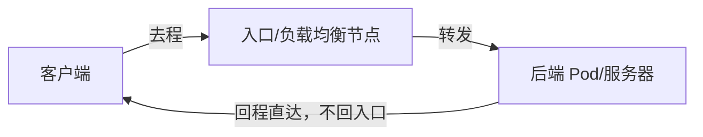

游戏、直播、海量 UDP——当连接数冲上去，节点日志里迟早会出现一行冷冰冰的 `nf_conntrack: table full, dropping packet`，然后就是玄学掉线。这篇文章讲清 conntrack 的容量瓶颈，以及应对它的三级手段：调参、换引擎、改架构——顺便拆一个危险的「偏方」：为什么**绝不能**对 K8s 的 Service 流量开 NOTRACK。

<!--more-->

## 瓶颈在哪：账本是有页数的

前篇讲过（[《数据包的导航软件》](/2026/07/nat-conntrack-explained/)），conntrack 是内核里的连接账本：每条连接（精确到五元组）占一条记录，NAT 的回程还原全靠它。账本放在内存里，页数有上限：

```bash
cat /proc/sys/net/netfilter/nf_conntrack_max   # 账本最大条目数
sudo conntrack -C                              # 当前已用条目数
```

两个细节让高并发场景特别容易撞上限：

1. **UDP 也记账**。UDP 明明无连接，conntrack 仍会给每个五元组伪造一条「虚拟连接」记录——游戏、直播的海量 UDP 流照样消耗账本
2. **死连接占着页**。TCP 已建立连接的默认跟踪超时长达数天，客户端异常断开后，记录还会占着位置慢慢等过期

2 的两个细节层层叠加，牵出一个数学关系：单条记录的超时时间 × 新连接建立速率 = 账本中的**稳态水位**。如果水位接近 `nf_conntrack_max`，新包直接被丢——不是变慢，是无声无息地断——这种场景最典型的代表就是 **SYN flood**（TCP 洪水攻击）：大量半开连接挤进 `SYN_SENT` 状态，每条赖满 120 秒才超时回收，即便每条都在被「清理」，只要来水的速度超过排水的速度，水位就会涨破上限。这也是为什么板斧一要同时调大上限**和**缩短超时——前者把池子挖深，后者把排水阀拧大，两条腿走路才能扛住这种「去程洪流」。

## 板斧一：给账本扩容（治标，最常用）

```bash
# 扩大条目上限（默认值通常远小于高并发需求）
sysctl -w net.netfilter.nf_conntrack_max=1048576

# 缩短已建立连接的跟踪超时（默认可长达 5 天，改为 1 小时）
sysctl -w net.netfilter.nf_conntrack_tcp_timeout_established=3600
```

内存代价不大（每条记录约几百字节），大多数场景调完就够用。注意 `nf_conntrack_buckets`（哈希桶数）最好随 max 同步调大，否则储物柜没变多、只是每柜挂的链表更长，查找变慢。

## 危险偏方：NOTRACK——以及为什么 Service 流量碰不得

iptables 的 raw 表里有个 `NOTRACK` 动作：在记账**之前**拦住数据包，让它完全跳过 conntrack——不记账、不占条目，像高速路的 ETC 通道，性能极好。

于是有人想：把 NodePort 流量也 NOTRACK 掉，账本不就永远不满了？

**千万不要。** 回忆前篇的核心规律：**去程查规则，回程查账本**。K8s Service 的流量在去程被 DNAT（有时还有 SNAT）改写过地址，回程包**全靠账本还原**。开了 NOTRACK：


一句话：**凡是被 NAT 改写过的流量，账本就是它回家的路**；NOTRACK 等于把路拆了。它的正确用武之地是**不需要 NAT 还原**的高频流量——典型如节点自身发起的健康检查、监控采集这类「发出去不求还原」的短连接。

## 板斧二：换转发引擎（治本之一）

kube-proxy 在 Linux 上有三种模式，这里要修正一个流传很广的旧结论：

| 模式 | 机制 | 现状（以官方文档为准）|
|------|------|------|
| **iptables** | 线性规则链 | 默认模式。**性能已大幅改进**——官方原话：*"the performance of iptables mode has improved greatly since the ipvs mode was first introduced"*，并建议在考虑换引擎时「优先试 iptables 而非 ipvs」 |
| **ipvs** | 内核级四层负载均衡器，哈希查找 | 如今的主卖点不是「更快」，而是**更多负载均衡算法**：rr、wrr、lc（最少连接）、wlc、sh（源地址哈希）等十余种 |
| **nftables** | netfilter 的新一代规则引擎 | **v1.33 起 stable**，要求内核 5.13+，是 iptables 的官方继任方向 |

「iptables 慢、ipvs 快」是几年前的结论，如今选型逻辑变成了：**默认 iptables 够用；需要高级负载均衡算法选 ipvs；新集群、新内核可以直接上 nftables。** 注意三者都构建在 netfilter 之上，**都离不开 conntrack**——换引擎优化的是规则匹配效率，不解决账本容量问题（账本问题回到板斧一）。

## 板斧三：DSR——让回程绕开账本（治本之二，架构级）

前两板斧都在「账本」框架内腾挪，第三板斧直接改变流量的几何形状。

**DSR（Direct Server Return，服务器直接返回）**：入口节点只负责把**去程**包转给后端，后端处理完，把**回程**包直接发给客户端——完全不经过入口节点。



回程不过入口节点，就**不需要入口节点的账本做还原**——conntrack 的容量和性能瓶颈被整体绕开。大型游戏、直播平台的接入层普遍采用这个思路（如 IPVS 的 DR 模式、各云厂商的 DSR 型负载均衡）。

代价是网络要求变高：回程包以真实服务地址直发客户端，要求后端的源地址对客户端可路由、TCP 会话信息对得上——通常需要专门的网络设计（VIP 绑定、二层可达或隧道），不是改个参数就能开的。

## 三板斧决策表

| 情况 | 动作 |
|------|------|
| 偶发 table full，业务量中等 | 板斧一：调大 `nf_conntrack_max` + 缩短超时 |
| Service 数量成千上万，规则匹配成为瓶颈 | 板斧二：评估 nftables（v1.33+ stable）或 ipvs |
| 需要 lc/sh 等高级负载均衡算法 | 板斧二：ipvs |
| 百万级并发接入，账本机制本身撑不住 | 板斧三：接入层上 DSR 架构 |
| 节点自身的高频探测/采集流量污染账本 | NOTRACK（仅限**无需 NAT 还原**的流量）|
| K8s Service 业务流量 | **永远不要 NOTRACK** |

## 总结

conntrack 的容量问题本质是「有状态」的代价：NAT 的魔法依赖账本，账本就有写满的一天。三板斧对应三种哲学——**扩账本**（调参）、**换记账员**（引擎）、**少记账**（DSR 让回程根本不需要账本）。而 NOTRACK 这个「不记账」的极端手段，只属于那些从一开始就不欠账（不做 NAT）的流量。

排查时的顺口溜：先 `conntrack -C` 对照 `nf_conntrack_max` 看是否真的满了，再看 dmesg 有没有 `table full`，然后按决策表逐级升级手段——从改一行 sysctl 到改整个接入架构之间，还有很长的缓冲带。

---

留一个动手练习：在一台测试机上把 `nf_conntrack_max` 临时调到一个很小的值（比如 256），然后用压测工具发起几百条并发连接，观察 dmesg 里的 `table full` 日志和实际的连接失败现象——再把参数调回去，感受一下这个「无声瓶颈」被触发和解除的全过程。
