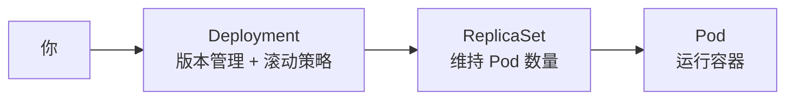
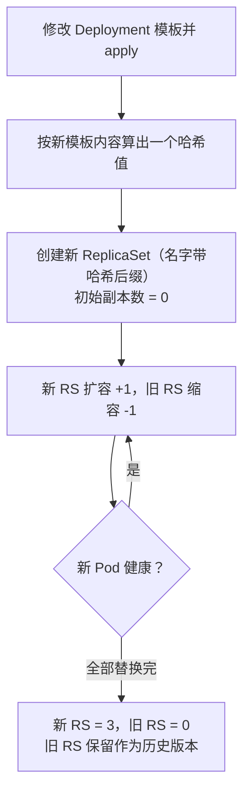

用 `kubectl edit` 改了 ReplicaSet 的配置，保存成功，然后——Pod 纹丝不动。等十分钟，还是不动。这不是 bug，而是 Kubernetes 故意的。理解了这件事背后的「控制链」设计，你会发现 K8s 里一大批反直觉现象瞬间变得顺理成章。

<!--more-->

## 一个让新手挠头的现象

假设你在练习环境里有一个叫 `my-replicaset` 的 ReplicaSet，管着 3 个 Pod。你想改一下容器镜像，于是：

```bash
kubectl edit replicaset my-replicaset
# 修改 spec.template 里的镜像，保存退出
# 提示：replicaset.apps/my-replicaset edited
```

编辑成功了。然后你满怀期待地查看 Pod：

```bash
kubectl get pods
# 3 个 Pod 安然无恙，还是旧镜像，一点要重启的意思都没有
```

第一反应可能是：是不是要等一个刷新周期？**答案是：不用等，等多久都不会变。** ReplicaSet 永远不会因为你改了配置就去更新已有的 Pod。

## 图纸改了，房子不会自动重盖

要理解这个现象，关键是搞清 ReplicaSet 的职责边界。

ReplicaSet（副本集）的工作逻辑简单到近乎固执：**数一数现在有几个活着的 Pod，跟期望数量比对，少了就补，多了就删。** 仅此而已。

它手里确实有一份 Pod 模板（`spec.template`），但那只是「补建新 Pod 时用的图纸」。它**从不检查**已经在跑的 Pod 是否和图纸一致。用盖房子打比方：

- 你改了图纸（`spec.template`）
- 但已经盖好的房子（运行中的 Pod）不会自动重盖
- 只有当某间房子塌了（Pod 被删除或崩溃），施工队才会**按新图纸**盖一间新的

所以对于直接管理的 ReplicaSet，让新配置生效的办法就是「拆房子」：

```bash
kubectl delete pod <某个旧 Pod>
# ReplicaSet 发现少了一个，立刻按新模板补建一个
# 逐个删除，服务就不会中断
```

这时你可能会问：那滚动更新呢？不是说 K8s 改了配置会自动平滑升级吗？——没错，但那是 **Deployment** 的本事，不是 ReplicaSet 的。

## 控制链：每一层只做一件事

Kubernetes 的工作负载不是一个孤立对象，而是一条「控制链」，每层只负责一件事：



- **Pod**：干活的，只管跑容器
- **ReplicaSet**：数数的，只管「现在有几个」
- **Deployment**：管版本的，负责「怎么从旧版本平滑换到新版本」

它们之间靠一个叫 `ownerReferences`（属主引用）的字段串起来——每个资源身上都记着「谁是我爹」。查看方式：

```bash
kubectl get replicaset my-replicaset -o yaml | grep -A 5 ownerReferences
```

- 输出为空 → 这是个**独立的** ReplicaSet，自己管自己，改配置后要手动删 Pod
- 输出指向某个 Deployment → 它是 Deployment 自动创建的「孩子」，**千万别直接改它**——你改完几秒后，Deployment 控制器会发现它和自己记录的不一致，把你的修改原样改回去

顺带说一句实话：生产环境里几乎没人直接创建 ReplicaSet。Kubernetes 官方文档原话是「你可能永远不需要直接操作 ReplicaSet 对象——用 Deployment 代替」。会 `kubectl edit replicaset` 的场景，基本只剩认证考试和练习题。

## Deployment 的滚动更新是怎么玩的

当你修改 Deployment 的 Pod 模板（比如换镜像）并 `kubectl apply` 后，Deployment 并不会去「通知」旧 ReplicaSet 更新，而是玩了一手漂亮的接力：



整个过程「先建后拆」，服务不中断。你可以开两个终端亲眼看这场接力：

```bash
# 终端1：看滚动进度
kubectl rollout status deployment/my-app

# 终端2：看新旧 ReplicaSet 的副本数此消彼长
kubectl get rs -w
```

注意最后一步：**旧 ReplicaSet 不会被删除**，而是副本数缩到 0，留在集群里。为什么留着？这就引出了整个设计里最精妙的部分。

## ReplicaSet 就是版本历史本身

Kubernetes 并没有一个独立的「版本数据库」来存 Deployment 的历史配置。所谓的版本历史（Revision），**物理上就是那一排副本数为 0 的旧 ReplicaSet**——每一个旧 RS 冻结着一份当年的 Pod 模板。

如果你熟悉 git，这套机制会让你会心一笑：

| Git | Kubernetes | 说明 |
|-----|-----------|------|
| commit（不可变快照）| ReplicaSet | 一个 RS 冻结一份 Pod 模板 |
| commit hash | RS 名字的哈希后缀 | 由模板内容算出，内容相同则哈希相同 |
| 分支指针（HEAD）| Deployment | 只指向「当前应该是哪个版本」 |
| `git revert` | `kubectl rollout undo` | 回滚产生新版本号，指回旧模板 |
| 历史清理 | `revisionHistoryLimit` | 默认保留最近 10 版，更老的自动回收 |

「内容寻址」这点尤其漂亮：当你回滚到一个和历史某版**完全相同**的模板时，Deployment 算出的哈希会命中已存在的旧 RS，于是直接复用它、重新扩容——就像 git 对相同内容不会重复存储一样。

这个视角还能直接推出两条实用结论：

1. **别手动删除旧 ReplicaSet**。删掉当前版本的 RS，Deployment 会立刻重建（它要维持现状）；但删掉历史版本的 RS，**那一页历史就永久丢了**，`kubectl rollout undo` 再也回不到那个版本——历史的「存档」就是旧 RS 本身，没有别处备份。
2. **也不用担心旧 RS 堆积**。`spec.revisionHistoryLimit`（默认 10）会让超龄的历史版本被自动垃圾回收，无需人工清理。

## 常用操作速查

| 你想做什么 | 正确命令 | 错误做法 |
|-----------|---------|---------|
| 更新配置让它生效 | 改 Deployment + `kubectl apply` | 直接改子 ReplicaSet（会被改回）|
| 不改配置，强制重启全部 Pod | `kubectl rollout restart deployment/<名字>` | 手动逐个 `delete pod` |
| 回滚到上一版 | `kubectl rollout undo deployment/<名字>` | 手工改回旧配置再 apply |
| 观察滚动进度 | `kubectl rollout status` / `kubectl get rs -w` | 干等 |
| 判断 RS 是否独立 | 查 `ownerReferences` 是否为空 | 看名字猜 |

补充一个相关的常见坑：**通过环境变量注入的 ConfigMap，改了之后 Pod 里也不会生效**——环境变量只在 Pod 启动时读取一次。原理和本文完全一致：已经跑起来的 Pod 不会被追溯更新，用 `rollout restart` 触发一轮滚动更新即可。

## 总结：行为跟着控制链走

回顾开头的困惑，其实这一路上每个「反直觉现象」都是孤立看待单个资源造成的：

- **改了 RS，Pod 不动** → RS 的职责里根本没有「版本对齐」这一环
- **改了 Deployment 的子 RS，几秒后被改回去** → 上面还有 Deployment 在盯着
- **删了旧 RS，历史就丢了** → 旧 RS 本身就是历史存档

Kubernetes 的资源从来不是孤立对象，而是靠 `ownerReferences`（谁管我）、label selector（我管谁）、模板哈希（我是哪个版本）三根线串起来的控制链。拿到任何资源，先问一句「它在哪条链的哪一环」，行为就全部可以预测了。

而对日常使用者，结论可以浓缩成一句话：**操作控制链的最顶层（Deployment），观察中间层（ReplicaSet），别碰最底层（Pod）。**

---

留一个动手练习：在测试集群里对一个 Deployment 连续做两次镜像修改，再执行一次 `kubectl rollout undo`，全程用 `kubectl get rs -w` 观察——你能对照 git 类比表，说出每一个 ReplicaSet 分别对应「哪个 commit」吗？
