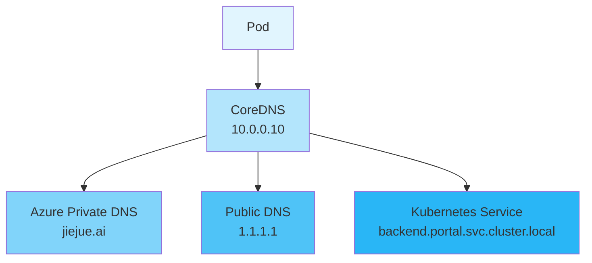

在一个平常的工作日，开发团队遇到了一个奇怪的问题：Kubernetes 集群中的某个 Pod 突然无法访问外部域名了。这个问题看似简单，实则涉及到了 Kubernetes DNS、Azure Private DNS 和服务发现等多个知识点。让我们一起来看看如何诊断和解决这个问题。

<!--more-->

## 问题现象

开发人员发现，在尝试从 Pod 内访问外部域名时，遇到了域名解析失败的错误：

```bash
$ curl https://product-service-test.jiejue.ai
curl: (6) Could not resolve host:product-service-test.jiejue.ai
```

## 深入排查

### 第一步：验证 DNS 查询

首先，我们使用 `nslookup` 命令来检查域名解析：

```bash
$ nslookupproduct-service-test.jiejue.ai
Server:         10.0.0.10
Address:        10.0.0.10:53

** server can't findproduct-service-test.jiejue.ai: NXDOMAIN
```

这里我们看到了第一个关键信息：默认 DNS 服务器是 `10.0.0.10`，它返回了 NXDOMAIN（域名不存在）的错误。

### 第二步：尝试其他 DNS 服务器

接着，我们尝试使用公共 DNS 服务器（如 Cloudflare 的 1.1.1.1）：

```bash
$ nslookupproduct-service-test.jiejue.ai 1.1.1.1
Server:         1.1.1.1
Address:        1.1.1.1:53

Non-authoritative answer:
Name:  product-service-test.jiejue.ai
Address: 21.274.30.143
```

有意思的是，使用公共 DNS 服务器可以正确解析域名！这说明问题不在域名本身，而是在集群的 DNS 配置上。

### 第三步：深入分析 DNS 查询过程

使用 `dig` 命令获取更详细的 DNS 查询信息：

```bash
$ dig @10.0.0.10product-service-test.jiejue.ai

;; AUTHORITY SECTION:
jiejue.ai.    10    IN    SOA    azureprivatedns.net. azureprivatedns-host.microsoft.com. 1 3600 300 2419200 10
```

这里我们发现了问题的根源：`jiejue.ai` 域名在 Azure Private DNS Zones 中被定义了！这就解释了为什么集群内的 DNS 服务器无法解析这个域名。

## 问题原因

当我们在 Azure 中创建了 Private DNS Zone 后，即使只有一条 SOA（Start of Authority，权威起始）记录，它也会接管整个域名的解析权限。这意味着：

1. 所有对 `*.jiejue.ai` 的 DNS 查询都会被路由到 Azure Private DNS
2. 如果在 Private DNS Zone 中找不到对应的记录，查询就会失败
3. DNS 服务器不会再向外部 DNS 服务器查询

这就像是在说："这个域名归我管了！"，但实际上又没有配置具体的解析记录。

## 解决方案

有两种解决方案：

1. 如果这个域名确实需要通过公网访问：

   - 删除 Azure Private DNS Zone 中的 `jiejue.ai` 记录
   - 或者只保留特定的子域名（如 `internal.jiejue.ai`）用于内部服务
2. 如果这是内部服务：

   - 在 Azure Private DNS Zone 中添加对应的 DNS 记录
   - 确保记录指向正确的内部 IP 地址

## 扩展知识：Kubernetes 服务发现

在排查过程中，我们还发现了一个更好的方案。由于目标服务实际上部署在同一个 Kubernetes 集群中，我们可以使用 Kubernetes 的服务发现机制来访问它。

Kubernetes 提供了一个统一的服务发现格式：

```
<service-name>.<namespace>.svc.cluster.local
```

例如：

```bash
$ curl http://api-service.frontend.svc.cluster.local
```

这种方式有几个重要优势：

1. **可靠性**：不依赖外部 DNS 解析
2. **安全性**：集群内部通信，无需经过公网
3. **性能**：直接使用集群内部网络
4. **一致性**：在任何 Kubernetes 集群中都是标准格式

## 最佳实践建议

1. **DNS 配置管理**：

   - 在使用 Azure Private DNS Zone 时，要明确规划哪些域名用于内部服务
   - 避免在 Private DNS Zone 中创建可能与公网域名冲突的记录
2. **服务访问策略**：

   - 集群内部服务优先使用 Kubernetes 服务发现机制
   - 为内部服务使用专门的内部域名（如 `.internal.company.com`）
   - 使用 CoreDNS 的自定义配置来处理特殊的 DNS 需求
3. **故障排查流程**：

   - 使用 `nslookup` 和 `dig` 等工具收集详细信息
   - 检查不同 DNS 服务器的响应差异
   - 查看 DNS 配置和云服务提供商的相关设置

## 需要注意的点

在实际操作中，还需要注意以下几点：

1. 修改 DNS 配置可能会影响到整个集群的网络通信
2. 在生产环境中修改 DNS 设置前，建议先在测试环境验证
3. 保持良好的文档记录，包括 DNS 配置的变更历史

通过这次故障排查，我们不仅解决了具体问题，还加深了对 Kubernetes 网络和 DNS 解析机制的理解。这些知识在日常运维和问题排查中都会很有帮助。

## 技术图解

在这里我们用一张图，展示 DNS 解析流程和 Kubernetes 服务发现机制。



希望这篇文章对你理解和解决 Kubernetes 中的 DNS 问题有所帮助。如果你有任何问题，欢迎在评论区讨论！
