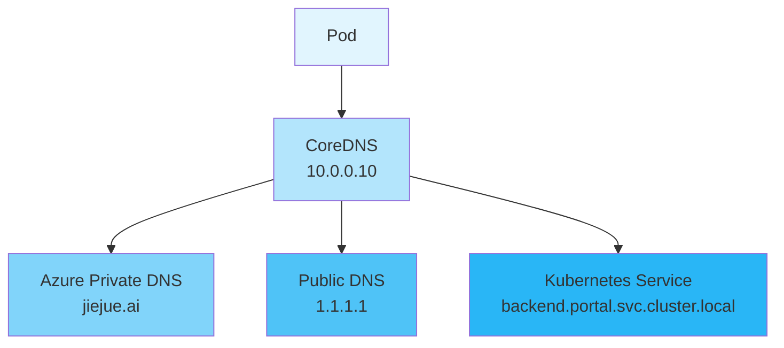

В обычный будний день команда разработчиков столкнулась со странной проблемой: одна из подсистем в кластере Kubernetes вдруг не смогла получить доступ к внешнему домену. Казалось бы, это простая проблема, но она затрагивает Kubernetes DNS, Azure Private DNS и обнаружение служб. Давайте рассмотрим, как диагностировать и решить эту проблему.

<!--more-->

## 问题现象

Разработчики обнаружили, что при попытке получить доступ к внешнему домену из Pod они сталкиваются с ошибкой разрешения домена:

```bash
$ curl https://product-service-test.jiejue.ai
curl: (6) Could not resolve host:product-service-test.jiejue.ai
```

## 深入排查

### 第一步：验证 DNS 查询

Сначала мы используем команду `nslookup` для проверки разрешения доменных имен:

```bash
$ nslookupproduct-service-test.jiejue.ai
Server:         10.0.0.10
Address:        10.0.0.10:53

** server can't findproduct-service-test.jiejue.ai: NXDOMAIN
```

Здесь мы видим первый ключевой фрагмент информации: DNS-сервером по умолчанию является `10.0.0.10`, который возвращает ошибку NXDOMAIN (доменное имя не существует).

### 第二步：尝试其他 DNS 服务器

Далее мы попробуем использовать публичный DNS-сервер (например, 1.1.1.1 от Cloudflare):

```bash
$ nslookupproduct-service-test.jiejue.ai 1.1.1.1
Server:         1.1.1.1
Address:        1.1.1.1:53

Non-authoritative answer:
Name:  product-service-test.jiejue.ai
Address: 21.274.30.143
```

Интересно, что доменное имя правильно разрешается с помощью публичного DNS-сервера! Это говорит о том, что проблема заключается не в самом доменном имени, а в конфигурации DNS кластера.

### 第三步：深入分析 DNS 查询过程

Для получения более подробной информации о DNS-запросах используйте команду `dig`:

```bash
$ dig @10.0.0.10product-service-test.jiejue.ai

;; AUTHORITY SECTION:
jiejue.ai.    10    IN    SOA    azureprivatedns.net. azureprivatedns-host.microsoft.com. 1 3600 300 2419200 10
```

Здесь мы обнаружили источник проблемы: домен `jiejue.ai` был определен в частных DNS-зонах Azure! Это объясняет, почему DNS-серверы в кластере не могут разрешить этот домен.

## 问题原因

Когда мы создаем частную зону DNS в Azure, она принимает на себя полномочия разрешения для всего домена, даже если в нем есть только одна запись SOA (Start of Authority). Это означает:

1. все DNS-запросы для `*.jiejue.ai` будут направляться в Azure Private DNS.
2. если соответствующая запись не найдена в частной зоне DNS, запрос завершится неудачей
3. DNS-сервер больше не будет запрашивать внешние DNS-серверы

Это все равно что сказать: "Я владею этим доменом!" но без настройки конкретной записи разрешения.

## 解决方案

Есть два решения:

1. Если к доменному имени необходимо получить доступ через публичную сеть:

- Удаление записей `jiejue.ai` из частной зоны DNS Azure
   - или оставить только определенные поддомены (например, `internal.jiejue.ai`) для внутренних служб.
2. если это внутренняя служба:

- Добавьте соответствующие DNS-записи в частную зону DNS Azure.
   - Убедитесь, что запись указывает на правильный внутренний IP-адрес

## 扩展知识：Kubernetes 服务发现

В процессе устранения неполадок мы также нашли лучшее решение. Поскольку целевая служба фактически развернута в том же кластере Kubernetes, мы можем получить к ней доступ с помощью механизма обнаружения служб Kubernetes.

Kubernetes предоставляет единый формат для обнаружения сервисов:

```
<service-name>.<namespace>.svc.cluster.local
```

Пример:

```bash
$ curl http://api-service.frontend.svc.cluster.local
```

У такого подхода есть несколько важных преимуществ:

1. **Надежность**: не зависит от внешнего разрешения DNS
2. **Безопасность**: внутренняя связь кластера без прохождения через публичную сеть
3. **Производительность**: использование внутренней сети кластера напрямую
4. **Согласованность**: стандартный формат в любом кластере Kubernetes

## 最佳实践建议

1. **Управление конфигурацией DNS**:

- При использовании частной DNS-зоны Azure четко планируйте, какие доменные имена будут использоваться для внутренних служб.
   - Избегайте создания в частной зоне DNS записей, которые могут конфликтовать с общедоступными доменными именами.
2. **Политика доступа к службам**:

- Приоритет обнаружения служб Kubernetes для внутренних кластерных служб
   - Используйте выделенные внутренние доменные имена для внутренних служб (например, `.internal.company.com`).
   - Используйте пользовательские конфигурации CoreDNS для обработки особых требований DNS.
3. **Процесс устранения неполадок**:

- Используйте такие инструменты, как `nslookup` и `dig`, чтобы собрать подробную информацию.
   - Проверка различий в ответах разных DNS-серверов
   - Проверка конфигурации DNS и настроек поставщика облачных услуг

## 需要注意的点

На практике необходимо обратить внимание на следующие моменты:

1. изменение конфигурации DNS может повлиять на сетевую связь всего кластера.
2. рекомендуется проверять настройки DNS в тестовой среде, прежде чем изменять их в производственной среде.
3. ведите хорошую документацию, включая историю изменений конфигурации DNS.

В процессе устранения неполадок мы не только решили конкретные проблемы, но и углубили свое понимание сети Kubernetes и механизма разрешения DNS. Эти знания будут очень полезны при ежедневном поиске и устранении неисправностей в процессе эксплуатации и обслуживания.

## 技术图解

Здесь мы используем диаграмму, чтобы показать процесс разрешения DNS и механизм обнаружения сервисов Kubernetes.



Надеюсь, эта статья помогла вам понять и решить проблемы с DNS в Kubernetes. Если у вас остались вопросы, не стесняйтесь обсуждать их в разделе комментариев!