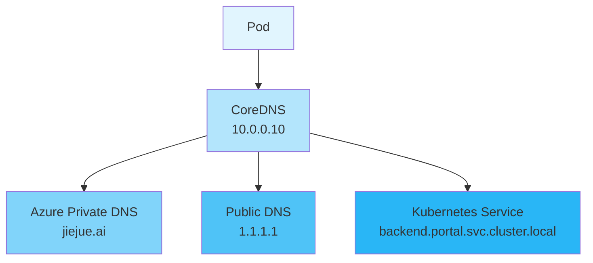

В обычный будний день команда разработчиков столкнулась со странной проблемой: одна из подсистем в кластере Kubernetes вдруг не смогла получить доступ к внешнему домену. Казалось бы, это простая проблема, но она затрагивает Kubernetes DNS, Azure Private DNS и обнаружение служб. Давайте рассмотрим, как диагностировать и решить эту проблему.

<! --подробнее-->

## Проблемное явление

Разработчик обнаружил, что при попытке получить доступ к внешнему доменному имени из Pod он сталкивается с ошибкой разрешения домена:

```bash
$ curl https://product-service-test.jiejue.ai
curl: (6) Could not resolve host:product-service-test.jiejue.ai
```.

## Устранение неполадок

### Первый шаг: проверка DNS-запроса

Сначала мы используем команду `nslookup` для проверки разрешения доменных имен:

```bash
$ nslookupproduct-service-test.jiejue.ai
Server:         10.0.0.10
Address:        10.0.0.10:53

** server can't findproduct-service-test.jiejue.ai: NXDOMAIN
```

Здесь мы видим первую ключевую информацию: DNS-сервером по умолчанию является `10.0.0.10`, который возвращает ошибку NXDOMAIN (доменное имя не существует).

### Шаг 2: Попробуйте другие DNS-серверы

Далее мы попробовали использовать публичный DNS-сервер (например, 1.1.1.1 от Cloudflare):

```bash
$ nslookupproduct-service-test.jiejue.ai 1.1.1.1
Server:         1.1.1.1
Address:        1.1.1.1:53

Non-authoritative answer:
Name:  product-service-test.jiejue.ai
Address: 21.274.30.143
```

Интересно, что использование публичного DNS-сервера разрешает доменное имя правильно! Это указывает на то, что проблема заключается не в самом доменном имени, а в конфигурации DNS в кластере.

### Шаг 3: Глубокий анализ процесса DNS-запроса

Используйте команду `dig`, чтобы получить более подробную информацию о DNS-запросах:

```bash
$ dig @10.0.0.10product-service-test.jiejue.ai

;; AUTHORITY SECTION:
jiejue.ai.    10    IN    SOA    azureprivatedns.net. azureprivatedns-host.microsoft.com. 1 3600 300 2419200 10
```

Здесь мы находим источник проблемы: доменное имя `jiejue.ai` определено в частных DNS-зонах Azure! Это объясняет, почему DNS-серверы в кластере не могут разрешить это доменное имя.

## Причина проблемы

Когда мы создаем частную зону DNS в Azure, даже если в ней есть только одна запись SOA (Start of Authority), она принимает на себя полномочия разрешения для всего доменного имени. Это означает:

1. все DNS-запросы для `*.jiejue.ai` будут направляться в Azure Private DNS
2. если соответствующая запись не найдена в частной зоне DNS, запрос не выполняется
3. DNS-сервер больше не запрашивает внешние DNS-серверы

Это все равно что сказать: "Я владею этим доменом!" но без фактической настройки конкретной записи разрешения.

## Решение

Есть два решения:

1. Если к этому домену необходим доступ через публичную сеть:

   - Удалите запись `jiejue.ai` в частной зоне DNS Azure.
   - Или просто сохраните определенные поддомены (например, `internal.jiejue.ai`) для внутренних служб.
2. если это внутренняя служба:

   - Добавьте соответствующие DNS-записи в частной DNS-зоне Azure.
   - Убедитесь, что запись указывает на правильный внутренний IP-адрес

## Расширенные знания: обнаружение служб Kubernetes

В процессе устранения неполадок мы также нашли лучшее решение. Поскольку целевая служба на самом деле развернута в том же кластере Kubernetes, мы можем использовать механизм обнаружения служб Kubernetes для доступа к ней.

Kubernetes предоставляет единый формат для обнаружения сервисов:

```
<service-name>.<namespace>.svc.cluster.local
```.

Пример:

```bash
$ curl http://api-service.frontend.svc.cluster.local
```

У этого подхода есть несколько важных преимуществ:

1. **Надежность**: не зависит от внешнего разрешения DNS
2. **Безопасность**: внутренняя связь кластера без прохождения через публичную сеть
3. **Производительность**: напрямую используется внутренняя сеть кластера.
4. **Согласованность**: стандарт для любого кластера Kubernetes

## Рекомендации по лучшей практике

1. **Управление конфигурацией DNS**:

   - При использовании частной DNS-зоны Azure четко планируйте, какие доменные имена будут использоваться для внутренних служб.
   - Избегайте создания в частной зоне DNS записей, которые могут конфликтовать с общедоступными доменными именами.
2. **Политика доступа к службам**:

   - Приоритет обнаружения служб Kubernetes для кластеризованных внутренних служб
   - Используйте выделенные внутренние доменные имена для внутренних сервисов (например, `.internal.company.com`).
   - Используйте пользовательские конфигурации CoreDNS для обработки особых требований к DNS.
3. **Процесс устранения неполадок**:

   - Соберите подробную информацию с помощью таких инструментов, как `nslookup` и `dig`.
   - Проверьте различия в ответах от разных DNS-серверов
   - Просмотрите конфигурацию и настройки DNS у поставщика облачных услуг.

## Обратите внимание

На практике вам также необходимо обратить внимание на следующие моменты:

1. Изменение конфигурации DNS может повлиять на сетевую связь всего кластера.
2. прежде чем изменять настройки DNS в производственной среде, рекомендуется проверить их в тестовой среде.
3. ведите хорошую документацию, включая историю изменений конфигурации DNS.

В ходе этой работы мы не только решили конкретные проблемы, но и углубили свое понимание сети Kubernetes и механизма разрешения DNS. Эти знания будут очень полезны в повседневной работе и устранении неполадок.

## Технические диаграммы

Здесь мы используем диаграмму, чтобы показать процесс разрешения DNS и механизм обнаружения сервисов Kubernetes.



Надеюсь, эта статья помогла вам понять и решить проблемы с DNS в Kubernetes. Если у вас остались вопросы, не стесняйтесь обсуждать их в разделе комментариев!
