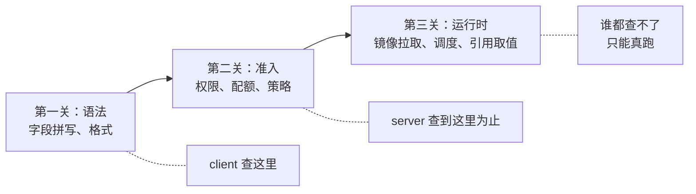

`kubectl` 的 `--dry-run` 参数有 `client` 和 `server` 两个档位。很多人用过 `client` 生成 YAML 模板，却说不清 `server` 到底多做了什么、又有什么做不到。这篇文章用一个「新员工入职」的比喻讲透它们的分工，顺便划清一条很多老手都会踩的能力边界。

<!--more-->

## 从一段帮助文本说起

翻看 `kubectl create --help`，你会看到这样一段：

```
--dry-run='none':
    Must be "none", "server", or "client". If client strategy, only print
    the object that would be sent, without sending it. If server strategy,
    submit server-side request without persisting the resource.
```

client 是「只打印、不发送」，server 是「发送但不落盘（persisting，即写入集群的数据库 etcd）」。字面意思都懂，但两者实际的检查深度差在哪里？

## 一个比喻：新员工入职

把「你提交一份 YAML」想象成「一个新员工要入职一家公司」。

**`--dry-run=client`：在楼下咖啡厅看入职手册。**

新员工还没进公司大门，坐在楼下翻《入职手册》：部门列表齐不齐、表格格式对不对。他没刷工卡、没进电梯，公司里今天发生了什么他一概不知。

对应到 kubectl：**完全在本地完成**。检查 YAML 语法、必填字段、字段类型——不连接集群，所以集群里的一切（权限、配额、策略）都无从校验。

```bash
# 最常见用途：生成一份拼写正确的模板
kubectl create deployment demo --image=nginx --dry-run=client -o yaml
```

**`--dry-run=server`：完整走一遍入职流程，但不办入职。**

新员工刷工卡进楼（认证）、在前台登记（鉴权）、被 HR 领着参观所有部门、参加入职培训（准入检查）——流程一步不落。但走到最后一步，HR 喊停：「今天到此为止，你的名字**不录入员工系统**。」

对应到 kubectl：请求**真正发到 API Server**，走完认证、鉴权、准入控制（admission，集群的「政策审查关卡」）、模式校验（schema validation）的全部流程，只在写入 etcd 前的最后一刻截住。

Kubernetes 官方文档的定义原文是：

> "Dry run mode helps to evaluate a request through the typical request stages (admission chain, validation, merge conflicts) up until persisting objects to storage."

这个比喻还能顺带解释一个常见疑惑：为什么用了 `server` 模式，审计日志里还有记录？——因为他虽然没入职，**门禁系统里留下了刷卡记录**。认证鉴权真实发生了，审计（audit）自然有账。同样，dry-run 请求所需的 RBAC 权限和真实请求完全一致，官方文档明确写着 *"Authorization for dry-run and non-dry-run requests is identical"*。

## 关键边界：三关模型

到这里容易产生一个误解：「server 模式走了全流程，那它通过 = 部署一定成功吧？」

**不是。** 一份 YAML 从提交到跑起来，其实要过三关：



server dry-run 的能力上限就是第二关。第三关的典型「漏网之鱼」：

- **引用了不存在的 ConfigMap**：server dry-run 照样放行。官方文档的措辞很精确——*"If you reference a ConfigMap that doesn't exist... **the Pod won't start**"*，注意是「Pod 起不来」而不是「请求被拒绝」。检查发生在节点上的 kubelet，那是运行时的事。
- **镜像地址拼错**：准入链不拉镜像，`ImagePullBackOff` 要等 Pod 调度到节点后才暴露。
- **环境变量的实际取值**：dry-run 只校验「这个字段合不合法」，不做「值的代入」——环境变量从 ConfigMap 里取到什么，要等容器真正启动那一刻。

用入职比喻说：参观再仔细，也看不出**他明天要服务的客户到底存不存在**——那得真上岗才知道。

所以一句话划界：**client 查「你写得对不对」，server 查「集群收不收」，「跑不跑得起来」永远要到第三关才见分晓。**

## server 模式真正的杀手锏

既然第三关查不了，server 模式的价值在哪？在于第二关里藏着一整条 client 永远无法感知的「准入流水线」：

- **配额检查**：这个 namespace 的资源配额（ResourceQuota）还够不够
- **安全策略**：Pod Security Admission 允不允许你这样的安全配置
- **自定义策略**：集群管理员挂载的校验规则（比如「镜像必须来自私有仓库」这类 Gatekeeper/Kyverno 策略）
- **自动修改**：修改型准入控制器（mutating webhook）会给你的对象注入内容——填默认值、加 sidecar 容器等

最后一条引出一个实战宝藏技巧：

```bash
kubectl apply -f app.yaml --dry-run=server -o yaml
```

返回的**不是你写的 YAML**，而是走完整条准入链、被填充和改写之后的「最终形态」。想知道自己提交的配置到了集群里会长成什么样，这是唯一的官方途径。而且官方保证校验发生在修改之后（*"validating admission controllers check the request post-mutation"*），所以这份输出的可信度很高。

日常还有一个它的「马甲」值得知道：

```bash
kubectl diff -f app.yaml
```

`kubectl diff` 底层就是发一次 server dry-run，把「将会成为的对象」和「集群里现有的对象」做对比输出。提交变更前跑一次 diff，是很多团队流水线里的标配检查。

## 速查表

| 你想做什么 | 用哪个 |
|-----------|--------|
| 生成一份拼写正确的 YAML 骨架 | `--dry-run=client -o yaml` |
| 提交前确认「集群会不会拒收」 | `--dry-run=server` |
| 查看配置被集群改写后的最终形态 | `--dry-run=server -o yaml` |
| 对比这次变更会改动什么 | `kubectl diff -f` |
| 确认跑起来是否正常 | 没有捷径，部署后观察 |

极简口诀：**client 是离线查字典，server 是在线走流程；字典查语法，流程查政策，跑起来另说。**

## 总结

`--dry-run` 的两档，对应「入职」的两个阶段：client 在楼下看手册，server 进楼走完全部流程但不办入职。server 模式远比 client 严格——认证、鉴权、配额、策略、自动改写全部真实发生——但它的终点是「写入数据库之前」，运行时的世界（镜像、调度、引用取值）它一步也进不去。

理解了这条边界，你就不会再把「dry-run 通过」误当成「部署必成」，也知道排查问题时该往哪一关去找。

---

留一个动手练习：找一个测试集群，写一份引用了不存在 ConfigMap 的 Pod YAML，分别跑 `--dry-run=client`、`--dry-run=server`、真实 `apply` 三次，观察三次的结果分别停在哪一关——和文中的三关模型对得上吗？
