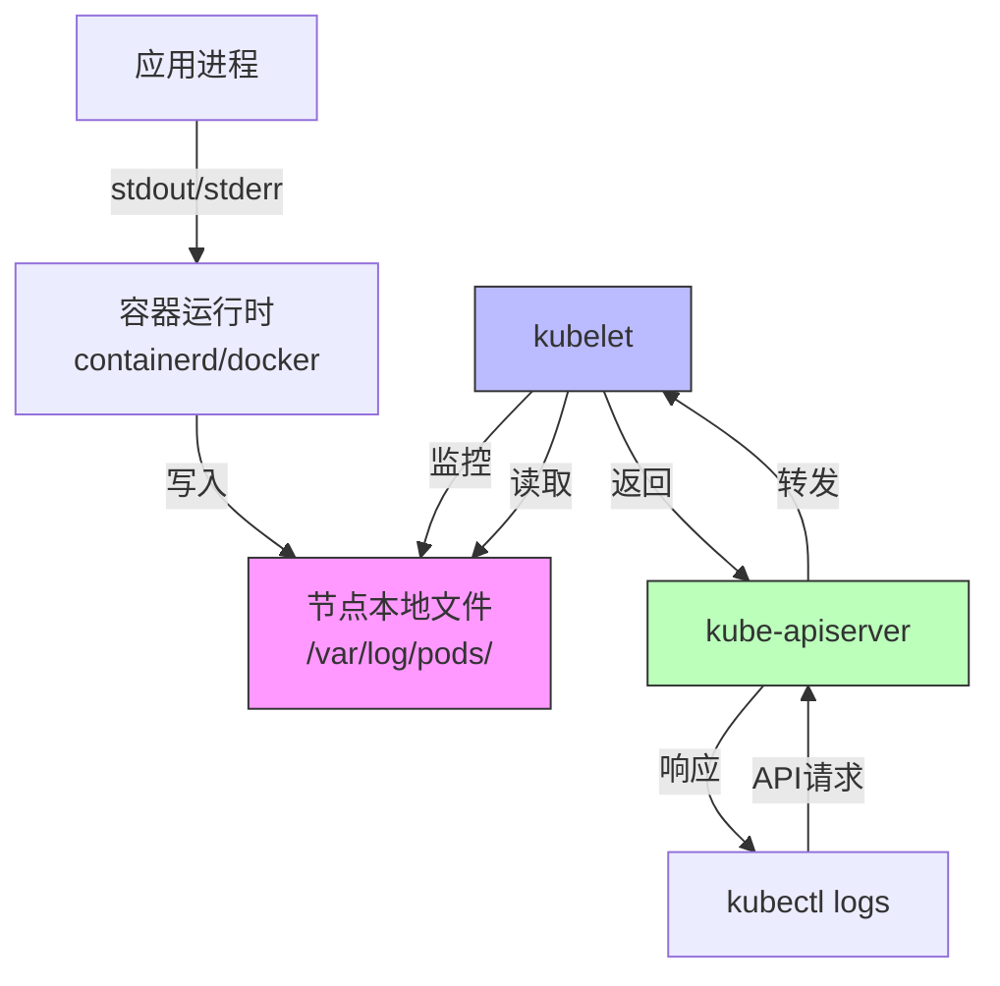
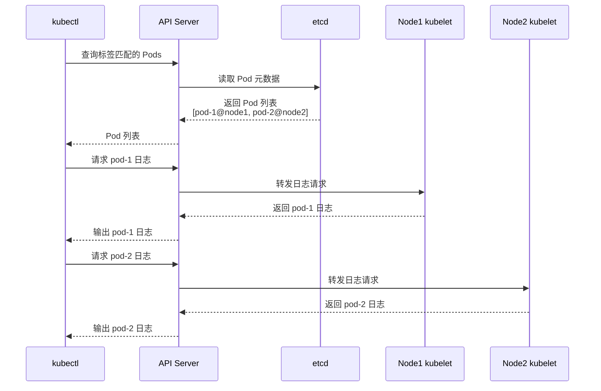
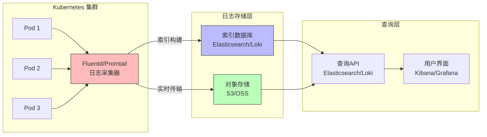

在容器化时代，日志查询从简单的文件读取演变成了分布式系统的复杂问题。本文将深入探讨 Kubernetes 日志系统的设计原理、实现机制，以及如何在生产环境中构建高效的日志查询方案。

<!--more-->

## 日志系统的本质：信息处理的物质基础

从历史唯物主义角度看，日志系统的演进反映了生产力发展的必然规律：

### 单机时代：直接文件访问

```
应用进程 → 文件系统 → 日志文件
```

运维人员可以直接登录服务器，用 `tail`、`grep` 等工具查看日志。这种方式的**物质基础**是：
- 应用和日志存储在同一物理位置
- 信息传递路径短、延迟低
- 运维人员与服务器的物理距离可控

### 容器时代：间接抽象访问

```
应用容器 → 容器运行时 → kubelet → API Server → kubectl
```

物质条件发生了根本变化：
- 容器的临时性：随时可能被销毁和重建
- 存储的分离性：容器文件系统与宿主机隔离
- 访问的间接性：需要通过多层抽象才能获取日志

这种**物质基础的变化**决定了我们必须重新设计日志访问机制。

## Kubernetes 日志架构的实现机制

### 容器日志的存储路径

当你运行 `kubectl logs` 时，实际发生了什么？让我们追踪整个数据流：



**关键路径解析**：

1. **应用层**：应用将日志输出到标准输出（stdout）和标准错误（stderr）
2. **容器运行时层**：容器运行时（如 containerd）捕获这些输出，写入节点本地文件系统
3. **存储层**：日志文件实际位置在 `/var/log/pods/<namespace>_<pod-name>_<pod-uid>/<container-name>/`
4. **控制平面**：kubectl 通过 API Server 向目标节点的 kubelet 发起请求
5. **数据返回**：kubelet 读取本地文件系统的日志，通过 API Server 返回给 kubectl

### 时间参数的底层实现

当你使用 `--since-time` 或 `--since` 参数时：

```bash
kubectl logs pod-name --since=1h
```

**实现原理**：

1. kubectl 将时间参数转换为 Unix 时间戳
2. 通过 HTTP 请求传递给 API Server：
   ```
   GET /api/v1/namespaces/{ns}/pods/{pod}/log?sinceSeconds=3600
   ```
3. API Server 转发请求到目标节点的 kubelet
4. kubelet 调用容器运行时的 API
5. 容器运行时读取日志文件，**从文件头开始扫描**，找到匹配时间戳的位置
6. 从该位置开始返回日志内容

**性能考量**：

这种设计导致的问题：
- 每次查询都需要从文件开头扫描（O(n) 复杂度）
- 大日志文件会显著增加响应时间
- 无法利用索引加速查询

这正是为什么生产环境需要专门的日志系统（如 ELK、Loki）的原因——它们通过**索引**和**时间序列优化**解决了这个问题。

### 标签选择器的实现机制

```bash
kubectl logs -l app=order-service
```

**执行流程**：



**关键机制**：

1. **元数据查询**：kubectl 首先通过 API Server 向 etcd 查询符合标签条件的所有 Pod
2. **串行获取**：对每个 Pod **串行**发起日志请求（而非并行）
3. **输出合并**：kubectl 将所有 Pod 的日志**按时间混合输出**

**性能瓶颈**：

- Pod 数量多时，查询时间线性增长
- 网络往返延迟累积（RTT × Pod数量）
- 无法保证不同 Pod 日志的全局时间顺序

## 生产环境的日志策略

### 架构设计的物质条件分析

为什么 `kubectl logs` 不适合生产环境的长期日志查询？

**物质矛盾**：
1. **存储容量**：节点本地磁盘空间有限，日志会被轮转删除
2. **查询效率**：无索引的文件扫描无法满足大规模查询需求
3. **数据持久性**：Pod 销毁时日志也随之丢失
4. **集中分析**：无法跨集群、跨时间段做关联分析

**解决方案的物质基础**：

集中式日志系统（如 ELK、Loki）通过以下方式解决矛盾：



**架构优势的物质依据**：

1. **存储分离**：日志存储到廉价的对象存储（S3/OSS），突破本地磁盘限制
2. **索引加速**：通过倒排索引（Elasticsearch）或标签索引（Loki）实现快速查询
3. **数据持久**：日志生命周期与 Pod 解耦，支持长期归档
4. **批量处理**：采集器批量传输日志，减少网络开销
5. **分布式查询**：支持并行查询多个数据分片

### 混合方案：实时与历史的统一

生产环境的最佳实践：

```bash
# 实时排障：使用 kubectl logs（低延迟）
kubectl logs -f app-pod --since=5m

# 历史分析：使用集中式日志系统（支持复杂查询）
# 在 Kibana/Grafana 中查询过去一周的错误日志
```

**策略依据**：

- **实时日志**（最近1小时）：需要**极低延迟**，直接从 kubelet 获取
- **近期日志**（1小时-24小时）：可以接受**秒级延迟**，从日志采集器缓冲区获取
- **历史日志**（>24小时）：可以接受**更高延迟**，从归档存储查询

这种分层设计符合**信息处理的经济规律**：热数据高成本高性能，冷数据低成本低性能。

## 常见参数的性能影响分析

### `--tail=N` 的实现成本

```bash
kubectl logs pod-name --tail=100
```

**实现方式**：
1. kubelet 打开整个日志文件
2. **从文件末尾反向读取**，直到找到第100行的位置
3. 从该位置开始正向返回日志

**时间复杂度**：O(文件大小)（即使只要最后100行）

**优化建议**：如果只需要最新日志，使用 `--since=5m` 通常比 `--tail=1000` 更高效。

### `--previous` 的风险

```bash
kubectl logs pod-name --previous
```

**实现机制**：
- 容器运行时保留上一次容器的日志文件
- 通常在 `/var/log/pods/` 目录下以 `.log.1` 或类似后缀保存

**风险点**：
1. **不保证存在**：如果容器从未重启过，该文件不存在
2. **可能被清理**：节点磁盘压力大时，旧日志文件可能被提前删除
3. **时间错配**：日志时间戳可能与当前时区不一致

### `--timestamps` 的开销

```bash
kubectl logs pod-name --timestamps
```

**影响分析**：
- **网络传输**：每行日志增加约30字节的时间戳前缀
- **格式化开销**：kubelet 需要为每行日志添加时间信息
- **建议**：生产环境**始终启用**，便于后续分析，额外开销可以接受

## 高级技巧：命令行日志分析

### 技巧1：并行查询多个 Pod

标准的标签选择器是串行查询，可以用 shell 脚本实现并行：

```bash
#!/bin/bash
# 获取所有 Pod 名称
PODS=$(kubectl get pods -l app=order-service -o name)

# 并行查询（需要安装 GNU parallel）
echo "$PODS" | parallel -j 10 \
  "kubectl logs {} --since=1h --timestamps > {/.}_logs.txt"

# 合并并按时间排序
cat *_logs.txt | sort -k1,1 > all_logs_sorted.txt
```

### 技巧2：实时监控错误日志

```bash
# 实时跟踪并过滤错误
kubectl logs -f app-pod | grep -i "error\|exception" --color=always
```

### 技巧3：统计日志中的错误类型

```bash
kubectl logs app-pod --since=1h \
  | grep -i error \
  | awk '{print $5}' \
  | sort | uniq -c | sort -rn
```

**输出示例**：
```
245 NullPointerException
89 TimeoutException
34 DatabaseConnectionError
```

## 日志系统的未来演进

### 当前方案的局限性

从信息处理的角度看，当前方案存在的根本矛盾：

1. **集中与分散的矛盾**：
   - 应用日志分散在各个节点
   - 查询需要集中处理
   - 传统方案通过日志采集器"物理转移"数据来解决

2. **实时与历史的矛盾**：
   - 实时日志需要低延迟
   - 历史日志需要低成本
   - 当前通过分层存储"分而治之"

3. **结构与非结构的矛盾**：
   - 日志本质是非结构化文本
   - 查询需要结构化索引
   - 需要额外的解析和索引构建

### AI 时代的日志系统展望

**大语言模型的潜在应用**：

1. **智能日志解析**：
   ```
   用户：为什么订单服务在早上8点出现大量超时？
   AI：分析了234万条日志后发现：数据库连接池在7:58耗尽，
       根本原因是定时任务配置错误导致并发查询激增。
   ```

2. **自动关联分析**：
   - 跨服务的调用链分析
   - 错误模式识别
   - 异常预警

3. **自然语言查询**：
   ```
   "找出所有支付失败的订单，按失败原因分类"
   → 自动转换为复杂的日志查询语句
   ```

**技术挑战**：
- 海量日志的实时处理（每秒GB级别）
- 模型推理的成本控制
- 敏感信息的隐私保护

**可能的解决路径**：
- 边缘计算：在日志产生端直接做初步分析
- 增量学习：持续优化日志解析模型
- 联邦学习：在不暴露原始日志的情况下训练模型

## 实战案例：排查生产故障

### 场景：订单服务突然大量超时

**第一步：快速定位时间范围**

```bash
# 查看最近1小时的错误日志
kubectl logs -l app=order-service --since=1h \
  | grep -i "timeout\|error" \
  | head -20
```

**第二步：确认问题开始时间**

```bash
# 查看完整日志并统计每分钟的错误数
kubectl logs -l app=order-service --since=2h --timestamps \
  | grep -i timeout \
  | awk '{print substr($1,12,5)}' \
  | uniq -c
```

**输出示例**：
```
   5 13:45
   8 13:46
  89 13:47  ← 问题开始时间
 234 13:48
 345 13:49
```

**第三步：查看数据库服务日志**

```bash
# 检查数据库服务在同一时间的状态
kubectl logs -n database db-pod \
  --since-time="2025-11-22T13:46:00Z" \
  --timestamps \
  | grep -i "connection\|pool"
```

**第四步：检查是否有容器重启**

```bash
# 查看重启前的日志
kubectl get pods -l app=order-service
# 如果发现有重启（RESTARTS > 0）
kubectl logs order-service-abc123 --previous
```

**第五步：保存现场**

```bash
# 导出完整日志用于后续分析
kubectl logs -l app=order-service \
  --since-time="2025-11-22T13:45:00Z" \
  --all-containers=true \
  --prefix=true \
  > incident_2025-11-22_order_timeout.log
```

## 总结：日志系统的本质

从历史唯物主义视角看，日志系统的演进反映了生产方式的变革：

1. **单机时代**：简单的因果关系，直接的信息访问
2. **分布式时代**：复杂的系统关联，间接的信息获取
3. **云原生时代**：动态的资源调度，抽象的访问接口

`kubectl logs` 作为 Kubernetes 的原生工具，满足了**快速排障**的基本需求，但在**历史查询**、**批量分析**、**长期归档**等方面存在天然局限。

生产环境的日志策略应该是：
- **短期实时**：kubectl logs（分钟级）
- **中期分析**：集中式日志系统（小时到天级）
- **长期归档**：对象存储（周到年级）

这种分层设计符合信息处理的经济规律，在成本与性能之间找到平衡点。

理解底层原理，才能在复杂场景下做出正确的技术决策。希望这篇深度分析能帮助你构建更可靠的可观测性体系。

---

**延伸阅读建议**：
- Kubernetes 官方文档：[Logging Architecture](https://kubernetes.io/docs/concepts/cluster-administration/logging/)
- CNCF 项目：[Loki](https://grafana.com/oss/loki/) - 专为 Kubernetes 设计的日志系统
- 论文：《The Google File System》- 理解分布式存储的基础
