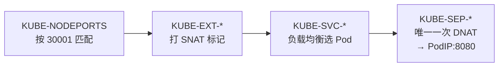

`targetPort`、`port`、`nodePort`——一个 NodePort 类型的 Service 里挤着三个端口，谁在容器里、谁在节点上、谁又「哪儿都不在」？这篇文章用一张三分法表格讲清它们，再往下挖一层：很多教程（甚至 AI）都会告诉你流量「先转发给 ClusterIP、再转发给 Pod」——**数据包层面这是错的**，我们用 kube-proxy 的源码把真相摆出来。

<!--more-->

## 三个端口的三分法

一份典型的 NodePort Service：

```yaml
apiVersion: v1
kind: Service
metadata:
  name: web
spec:
  type: NodePort
  selector:
    app: web
  ports:
  - port: 80          # Service 的端口
    targetPort: 8080  # 容器的端口
    nodePort: 30001   # 节点的端口（不写则从 30000-32767 随机分配）
```

三者的本质区别，一张表说清：

| 端口 | 长在哪 | 本质 | 谁来访问 |
|------|--------|------|---------|
| `targetPort: 8080` | **容器里** | **真端口**——应用进程真实监听着它 | 最终收流量的就是它 |
| `port: 80` | **ClusterIP 上** | **虚端口**——只存在于内核的转发规则里 | 集群内部：`ClusterIP:80` 或 `服务名:80` |
| `nodePort: 30001` | **节点 IP 上** | **规则端口**——同样没有进程监听（见下文） | 集群外部：`任意节点IP:30001` |

关键认知：**三个端口里只有一个是「真的」**。`targetPort` 背后有应用进程在 `listen()`；另外两个都只是内核转发规则里的匹配条件。

ClusterIP 本身也是如此——它是一个**虚拟 IP**，不绑在任何网卡上，`ip addr` 里找不到它。它只活在 kube-proxy 写入内核的规则里，作用是「匹配到这个目标地址的包，改写后转给某个 Pod」。

## 「两次转发」的传说，与一次 DNAT 的真相

流传很广的一种解释（教程里有、AI 也常这么讲）：

> 外部流量到达 `NodeIP:30001`，先被**转发给 `ClusterIP:80`**，再由 ClusterIP **转发给 `PodIP:8080`**——两次转发/两次 DNAT。

听起来顺理成章，但去翻 kube-proxy 的源码（iptables 模式的 `proxier.go`），会发现整个文件里**只有一条 DNAT 规则**，长在最末端的 endpoint 链（`KUBE-SEP-*`）里：

```
-j DNAT --to-destination <PodIP:targetPort>
```

NodePort 流量的真实路径是一串**规则链跳转**：



也就是说：NodePort 流量在**逻辑上**复用了 Service 的负载均衡链（这是「先经过 Service」说法的来源），但在**数据包层面**，目标地址只被改写一次——从 `NodeIP:30001` 直接变成 `PodIP:8080`。**ClusterIP 从头到尾没有出现在包头里。**

「链的跳转」和「地址的改写」是两回事——把前者当成后者，就造出了「两次转发」的传说。

## nodePort 上没有人在监听

另一个常见误解：「kube-proxy 在节点上**监听** 30001 端口」。

实际上，iptables 模式的 kube-proxy 源码里**没有任何打开 socket 的代码**——流量到达节点后，在进入任何用户态程序之前，就被内核的 netfilter 规则拦截并改写了。你 `netstat` 查 30001，很可能什么进程都看不到，但访问它就是通的。这也是 K8s 网络「反直觉」的根源之一：**大量工作发生在内核规则里，而不是进程里。**

## 默认配置有个代价：客户端 IP 没了

官方教程里有个很好的实验：部署一个回显客户端地址的服务，从外部访问 NodePort，结果：

```
client_address=10.240.0.5   ← 不是你的公网 IP，是集群内部 IP！
```

原因是默认配置下，入站流量在节点上**同时挨了两刀**：

- **DNAT**：目标从 `NodeIP:30001` 改成 `PodIP:8080`（让包找到 Pod）
- **SNAT**：源从 `客户端IP` 改成 `节点IP`（官方教程原文：*"node2 replaces the source IP address (SNAT) in the packet with its own IP address"*）

为什么要动源地址？kube-proxy 源码的注释一句话说破：*"we need to masquerade, **in case we cross nodes**"*——你访问的是 node2，但被选中的 Pod 可能在 node1 上。如果不把源改成 node2，node1 上的 Pod 会把响应**直接发给客户端**，而客户端只认得 node2，这个「从没握过手」的响应包会被直接丢弃。SNAT 保证了回程原路返回 node2，由它还原地址。

代价就是：**Pod 看到的客户端 IP 是节点 IP，真实来源丢了**。想保留客户端 IP，用：

```yaml
spec:
  externalTrafficPolicy: Local
```

`Local` 模式下节点只把流量转给**本节点上的 Pod**，不跨节点、不做 SNAT，源 IP 得以保留。但天下没有免费的午餐——如果这个节点上恰好没有该服务的 Pod，**流量直接丢弃**。这是一对典型的取舍：

| | `Cluster`（默认）| `Local` |
|---|---|---|
| 客户端真实 IP | 丢失（被 SNAT）| **保留** |
| 任意节点可入 | ✓ | 只有跑着 Pod 的节点可入 |
| 负载均衡 | 全集群均衡 | 仅本节点内 |

## 速查

```bash
kubectl get svc web                        # 看 port/nodePort 分配
kubectl get endpointslices                 # 看背后真实的 PodIP:targetPort 列表
sudo iptables-save | grep 30001            # 亲眼看 nodePort 的匹配规则（无监听进程）
```

## 总结

- **三分法**：`targetPort` 是容器里的真端口，`port` 是 ClusterIP 上的虚端口，`nodePort` 是节点上的规则端口——三个里只有一个有进程在听
- **一次改写**：NodePort 流量逻辑上借道 Service 的负载均衡链，物理上只做一次 DNAT，直达 `PodIP:targetPort`，ClusterIP 不进包头
- **默认丢源 IP**：入站被 DNAT + SNAT 双重改写，是为了跨节点转发时回程不迷路；要保源 IP 就用 `externalTrafficPolicy: Local`，代价是没有本地 Pod 的节点会丢包

文中反复出现的 DNAT、SNAT、「回程还原」到底是怎么运作的？那是一套比 Kubernetes 更古老、也更通用的 Linux 机制——下一篇《[数据包的导航软件：DNAT、SNAT 与 conntrack](/2026/07/nat-conntrack-explained/)》专门讲它。

---

留一个动手练习：在测试集群里给一个 NodePort Service 部署回显客户端 IP 的后端（官方教程用的是 `agnhost netexec`），分别在 `externalTrafficPolicy: Cluster` 和 `Local` 下从集群外访问，对比 `client_address` 的变化——再故意从一个没有该 Pod 的节点访问 `Local` 模式的服务，验证「丢包」是否真的发生。
