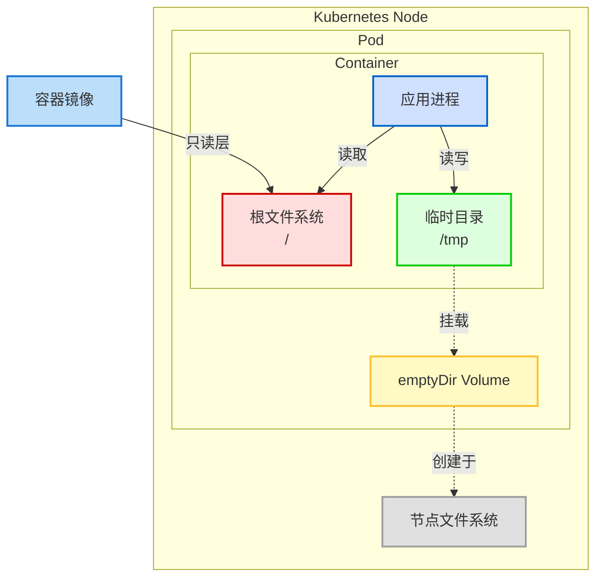
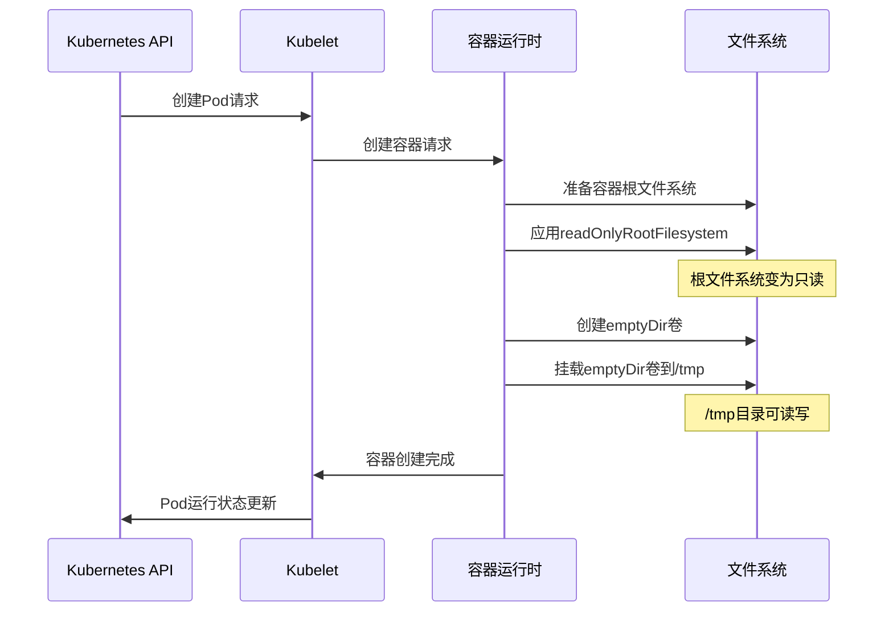
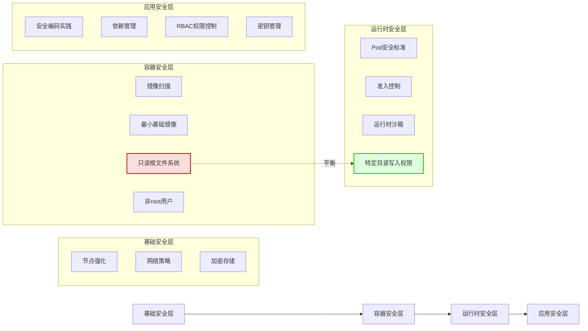

在构建Kubernetes安全架构时，容器文件系统的权限管理是一个关键考量点。特别是在实施零信任安全模型的环境中，只读根文件系统（readOnlyRootFilesystem）是一项重要的安全加固措施。然而，这种安全设置往往会与应用程序的功能需求产生冲突，尤其是对临时文件存储的需求。本文将深入探讨如何在保持高安全标准的同时，为容器提供必要的`/tmp`目录写入权限。

<!--more-->

## 容器安全与临时存储的平衡挑战

容器技术的普及带来了前所未有的应用部署便利性，但同时也引入了新的安全挑战。与传统虚拟机相比，容器共享主机内核，安全边界相对较薄，使得容器内文件系统的权限控制变得尤为重要。

```yaml
securityContext
  readOnlyRootFilesystem: true
```

在Kubernetes的安全最佳实践中，通过上述设置只读根文件系统已经成为标准做法。这一配置能有效防止：

1. 运行时恶意程序修改容器内系统文件
2. 供应链攻击导致的未授权代码执行
3. 应用程序漏洞被利用后的权限提升
4. 容器突破（container breakout）攻击的前期准备

然而，这种安全措施与现实应用需求之间存在天然的矛盾。几乎所有现代应用程序，无论是基于Java、Python、Node.js还是其他技术栈，都依赖于`/tmp`目录进行临时文件操作。这些操作可能包括：

- 文件上传处理（如图片处理前的临时存储）
- 日志轮转（log rotation）的中间文件
- 进程间通信（IPC）的套接字文件
- JIT（即时编译）缓存
- 数据库事务日志
- 会话状态管理

## 深入理解Kubernetes卷与安全上下文

在解决这一矛盾之前，让我们先深入理解Kubernetes中的两个关键概念：卷（Volumes）和安全上下文（SecurityContext）。

### 卷的工作原理

Kubernetes卷是对容器原生存储机制的抽象和扩展。当我们在Pod规范中定义一个卷时，Kubernetes会：

1. 在Pod所在节点上创建或连接相应的存储资源
2. 将该存储资源挂载到Pod的文件系统命名空间
3. 根据`volumeMounts`配置，将卷映射到容器内的指定路径

对于`emptyDir`类型的卷，Kubernetes会在Pod启动时在节点上创建一个空目录。这个目录的生命周期与Pod绑定——Pod终止时，相应的`emptyDir`卷也会被删除。重要的是，这个目录是在容器运行时创建和挂载的，因此不受容器镜像内文件系统只读限制的影响。

### 安全上下文的执行机制

当我们设置`securityContext.readOnlyRootFilesystem: true`时，Kubernetes通过容器运行时（如containerd或Docker）在启动容器时应用这一限制。这一设置通过Linux内核的挂载命名空间（mount namespace）功能实现，具体而言：

1. 容器运行时会使用只读（read-only）选项挂载容器的根文件系统
2. 这一操作发生在容器进程启动之前，作为容器初始化的一部分
3. 一旦应用，容器内的所有进程都无法写入根文件系统

然而，关键在于：**卷挂载发生在文件系统被标记为只读之后**。这意味着通过卷挂载的目录不受只读根文件系统限制的影响，可以保持其独立的权限设置。

## 解决方案：使用emptyDir卷实现安全与功能的平衡

基于上述原理，我们可以设计一个既满足安全要求又不影响应用功能的解决方案：使用`emptyDir`卷挂载到容器的`/tmp`目录。

### 详细配置示例与解析

以下是一个完整的Deployment示例，包含了只读根文件系统和`/tmp`目录可写的设置：

```yaml
apiVersion: apps/v1
kind: Deployment
metadata:
  name: secure-app
  labels:
    app: secure-app
spec:
  replicas: 3
  selector:
    matchLabels:
      app: secure-app
  template:
    metadata:
      labels:
        app: secure-app
    spec:
      # Pod级别安全设置
      securityContext:
        # 可选的Pod级别安全设置
        runAsNonRoot: true
        seccompProfile:
          type: RuntimeDefault
      containers:
      - name: app
        image: your-secure-app:1.2.3
        ports:
        - containerPort: 8080
        # 容器级别安全设置
        securityContext:
          # 启用只读根文件系统
          readOnlyRootFilesystem: true
          # 禁止权限提升
          allowPrivilegeEscalation: false
          # 移除所有Linux能力
          capabilities:
            drop:
            - ALL
        # 挂载临时目录
        volumeMounts:
        - name: tmp-volume
          mountPath: /tmp
      # 定义卷
      volumes:
      - name: tmp-volume
        # 使用emptyDir作为临时存储
        emptyDir: {}
```

这个配置中的关键部分是：

1. `securityContext`部分定义了`readOnlyRootFilesystem: true`：将容器的根文件系统设置为只读
2. `volumes`部分定义了一个名为`tmp-volume`的`emptyDir`卷
3. `volumeMounts`将该卷挂载到容器的`/tmp`路径

当容器启动时，Kubernetes会创建一个空目录并将其挂载到容器内的`/tmp`路径。由于这个目录是通过卷挂载的，它不受只读根文件系统限制的影响，应用程序可以在其中正常读写文件。

### emptyDir的高级配置选项

对于更高安全要求或特殊性能需求的环境，`emptyDir`卷还支持一些高级配置选项：

#### 内存存储（Memory-backed）临时文件系统

在某些高性能场景下，可能需要更快的`/tmp`目录I/O性能。可以通过配置`emptyDir.medium`为`Memory`，使用内存作为存储介质：

```yaml
volumes:
- name: tmp-volume
  emptyDir:
    medium: Memory
```

这将使用tmpfs（内存文件系统）而非磁盘来存储临时文件，提供更高的I/O性能，但会消耗节点的内存资源。

#### 存储大小限制

为了防止应用程序无限制地写入临时文件导致节点存储耗尽，可以设置`emptyDir.sizeLimit`限制卷的最大大小：

```yaml
volumes:
- name: tmp-volume
  emptyDir:
    sizeLimit: 1Gi  # 限制为1GB
```

当临时文件总大小接近或超过这一限制时，Kubernetes会触发驱逐机制，重启或调度Pod到其他节点。

## 安全影响分析

在实施这一解决方案时，需要考虑其对整体安全态势的影响：

### 安全增强点

1. **维持最小权限原则**：除了显式允许写入的`/tmp`目录外，其他文件系统区域仍然是只读的
2. **防止持久化攻击**：`emptyDir`卷中的内容在Pod终止时会被清除，降低了攻击持久化的风险
3. **资源限制**：可以通过`sizeLimit`防止拒绝服务攻击（如恶意填充磁盘）

### 潜在安全注意点

1. **临时文件敏感数据泄露**：应用程序可能在`/tmp`中写入敏感数据，需要确保应用自身正确处理临时文件
2. **节点间Pod迁移**：当Pod从一个节点迁移到另一个节点时，`emptyDir`中的数据不会被保留
3. **多容器Pod共享**：在多容器Pod中，所有容器可以访问同一个`emptyDir`卷，需要考虑容器间数据隔离

## 实施最佳实践

在不同环境中实施这一解决方案时，可以参考以下最佳实践：

### 生产环境配置建议

1. **结合其他安全设置**：将只读根文件系统与其他安全设置（如非root用户、seccomp、AppArmor等）一起使用
2. **监控临时目录使用**：设置对`/tmp`目录使用的监控，及时发现异常模式
3. **定期安全扫描**：使用容器安全扫描工具检查镜像和运行中的容器
4. **为不同目的使用不同卷**：如果应用需要多个可写目录，为每个目录创建单独的卷，而不是只依赖`/tmp`

### 审计与合规

为了满足安全审计和合规要求，可以：

1. 在Pod注解中记录为什么需要`/tmp`可写的业务理由
2. 通过准入控制器（如OPA Gatekeeper）强制要求只读根文件系统的配置
3. 实施Pod安全标准（Pod Security Standards）的Restricted配置文件
4. 保留容器运行时日志，记录所有对`/tmp`目录的文件操作

## 常见应用案例分析

不同类型的应用程序对`/tmp`目录的依赖方式不同，以下是一些常见应用的应对策略：

### Java应用

Java应用程序通常使用`/tmp`目录作为默认的临时文件位置。可以通过设置JVM参数`-Djava.io.tmpdir`指定其他位置：

```yaml
containers:
- name: java-app
  image: java-app:1.0
  env:
  - name: JAVA_OPTS
    value: "-Djava.io.tmpdir=/app/temp"
  volumeMounts:
  - name: app-temp
    mountPath: /app/temp
volumes:
- name: app-temp
  emptyDir: {}
```

### Web服务器

Nginx、Apache等Web服务器使用临时目录存储客户端上传文件、代理缓存等。需要修改其配置指向可写位置：

```yaml
volumeMounts:
- name: nginx-temp
  mountPath: /var/cache/nginx
- name: nginx-run
  mountPath: /var/run
```

### 数据库容器

数据库如PostgreSQL、MySQL等需要写入日志和临时数据。除了主数据目录外，通常还需要挂载：

```yaml
volumeMounts:
- name: postgres-data
  mountPath: /var/lib/postgresql/data
- name: postgres-temp
  mountPath: /tmp
- name: postgres-run
  mountPath: /var/run/postgresql
```

## 未来发展与AI应用展望

随着容器安全标准的不断演进和AI应用在Kubernetes中的广泛部署，临时存储需求也在发生变化：

### Kubernetes安全发展趋势

1. **不可变基础设施**：只读文件系统是不可变基础设施理念的一部分，未来会有更多工具支持这一模式
2. **运行时沙箱**：像gVisor、Kata Containers等提供更强隔离的容器运行时正变得越来越普及
3. **动态准入控制**：基于机器学习的异常检测可能会取代静态策略，更智能地控制文件系统访问

### AI应用特殊需求

AI应用如模型训练和推理服务对临时存储有特殊需求：

1. **大模型缓存**：大型AI模型需要高性能临时存储来缓存中间结果
2. **GPU内存溢出**：当GPU内存不足时，AI框架会将数据溢出到磁盘
3. **分布式训练同步**：分布式训练可能使用文件系统进行状态同步

对于这些应用，除了基本的`emptyDir`配置外，还可能需要：

```yaml
volumes:
- name: ai-temp
  emptyDir:
    medium: Memory
    sizeLimit: 20Gi
```

## 结论

在Kubernetes环境中实现容器安全与应用功能的平衡是一项持续挑战。通过深入理解卷挂载机制与安全上下文，我们可以设计出既满足严格安全要求又不影响应用正常运行的部署配置。

使用`emptyDir`卷挂载到`/tmp`目录是一种简单而有效的解决方案，它允许保持根文件系统只读的同时，为应用程序提供必要的临时文件写入能力。通过正确配置和遵循最佳实践，可以在不牺牲安全性的前提下满足应用的功能需求。

这种方法不仅适用于`/tmp`目录，还可以扩展到任何应用程序需要写入的目录，为构建安全、稳定的Kubernetes环境提供了可行路径。

## 需要配图的位置

1. 在"容器安全与临时存储的平衡挑战"部分后：需要一张展示容器安全层次与文件系统权限关系的图表
2. 在"深入理解Kubernetes卷与安全上下文"部分：需要一张展示卷挂载与容器文件系统关系的技术图解
3. 在"安全影响分析"部分前：需要一张对比实施前后安全状态的对比图

## Mermaid图解

### 卷挂载与只读文件系统的关系



### 安全上下文与卷的执行顺序



### 安全增强措施层次


