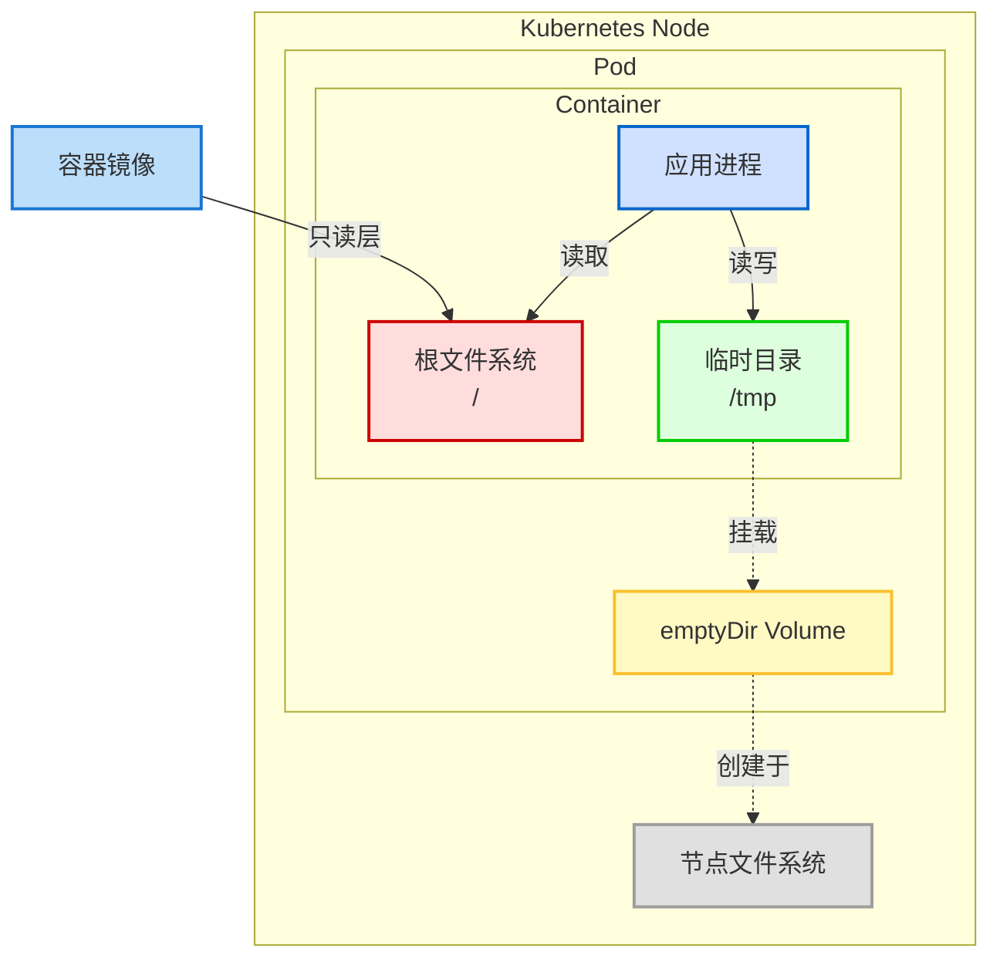

Управление разрешениями файловой системы контейнера - ключевой момент при построении архитектуры безопасности Kubernetes. Особенно в средах, реализующих модель безопасности с нулевым доверием, файловая система readOnlyRootFilesystem является важной мерой усиления безопасности. Однако такая настройка безопасности часто вступает в конфликт с функциональными требованиями приложений, особенно в отношении хранения временных файлов. В этой статье мы рассмотрим, как предоставить контейнерам необходимые `/tmp` разрешения на запись в каталог, сохраняя при этом высокие стандарты безопасности.

<! -еще-->

## Проблема баланса между безопасностью контейнеров и временным хранением данных

Популярность контейнерной технологии привела к беспрецедентной простоте развертывания приложений, но при этом появились и новые проблемы безопасности. По сравнению с традиционными виртуальными машинами контейнеры совместно используют ядро хоста и имеют относительно тонкие границы безопасности, что делает контроль разрешений файловых систем внутри контейнеров особенно важным.

```yaml
securityContext
  readOnlyRootFilesystem: true
```.

В лучших практиках безопасности Kubernetes стало стандартной практикой устанавливать корневую файловую систему только для чтения с помощью вышеуказанной настройки. Такая конфигурация эффективно предотвращает:

1. вредоносные программы, работающие во время выполнения, могут изменять системные файлы внутри контейнера
2. несанкционированное выполнение кода в результате атак по цепочке поставок
3. повышение привилегий после использования уязвимостей приложения
4. подготовка атаки на прорыв контейнера

Однако существует естественное противоречие между такими мерами безопасности и требованиями реальных приложений. Почти все современные приложения, будь то основанные на Java, Python, Node.js или других технологических стеках, используют каталог __PROTECTED_INLINE_CODE__12__ для операций с временными файлами. Эти операции могут включать:

- обработка загружаемых файлов (например, временное хранение перед обработкой изображений)
- Промежуточные файлы для ротации журнала
- Сокетные файлы для межпроцессного взаимодействия (IPC)
- JIT (Just-In-Time) кэширование
- Журналы транзакций базы данных
- Управление состоянием сеанса

## Более глубокое понимание томов и контекстов безопасности Kubernetes

Прежде чем разрешить этот конфликт, давайте погрузимся в понимание двух ключевых концепций Kubernetes: Volumes и SecurityContext.

### Как работают тома

Тома Kubernetes - это абстракция и расширение собственного механизма хранения контейнера. Когда мы определяем том в спецификации подката, Kubernetes будет:

1. создаст или подключит соответствующий ресурс хранения на узле, где находится Pod
2. смонтирует этот ресурс хранения в пространстве имен файловой системы бода
3. сопоставит том с указанным путем внутри контейнера на основе конфигурации `volumeMounts`.

Для томов типа `emptyDir` Kubernetes создает пустой каталог на узле при запуске Pod. Жизненный цикл этой директории связан с подкастом - когда подкаст завершается, соответствующий том `emptyDir` также удаляется. Важно отметить, что этот каталог создается и монтируется во время работы контейнера, и поэтому на него не влияют ограничения файловой системы в образе контейнера, связанные с доступом только для чтения.

### Механизм выполнения контекстов безопасности

Когда мы устанавливаем `securityContext.readOnlyRootFilesystem: true`, Kubernetes применяет это ограничение при запуске контейнеров через среду выполнения контейнеров (например, containerd или Docker). Эта настройка реализуется через функцию пространства имен монтирования ядра Linux, а именно:

1. корневая файловая система контейнера монтируется с опцией "только для чтения", когда контейнер запущен
2. эта операция выполняется до запуска процесса контейнера, как часть инициализации контейнера
3. после этого все процессы внутри контейнера не могут записывать в корневую файловую систему.

Ключевым моментом, однако, является то, что **монтирование тома происходит после того, как файловая система была помечена как доступная только для чтения**. Это означает, что каталоги, смонтированные через тома, не подвержены ограничению корневой файловой системы только для чтения и могут сохранять свои независимые настройки разрешений.

## Решение: Баланс безопасности и функциональности с помощью томов emptyDir

Основываясь на вышеизложенном принципе, мы можем разработать решение, удовлетворяющее требованиям безопасности без ущерба для функциональности приложения: использовать том `emptyDir` для монтирования в каталог `/tmp` контейнера.

### Подробный пример конфигурации с пояснениями

Ниже приведен полный пример развертывания с настройками корневой файловой системы только для чтения и записи в каталог `/tmp`:

```yaml
apiVersion: apps/v1
kind: Deployment
metadata:
  name: secure-app
  labels:
    app: secure-app
spec:
  replicas: 3
  selector:
    matchLabels:
      app: secure-app
  template:
    metadata:
      labels:
        app: secure-app
    spec:
      # Pod级别安全设置
      securityContext:
        # 可选的Pod级别安全设置
        runAsNonRoot: true
        seccompProfile:
          type: RuntimeDefault
      containers:
      - name: app
        image: your-secure-app:1.2.3
        ports:
        - containerPort: 8080
        # 容器级别安全设置
        securityContext:
          # 启用只读根文件系统
          readOnlyRootFilesystem: true
          # 禁止权限提升
          allowPrivilegeEscalation: false
          # 移除所有Linux能力
          capabilities:
            drop:
            - ALL
        # 挂载临时目录
        volumeMounts:
        - name: tmp-volume
          mountPath: /tmp
      # 定义卷
      volumes:
      - name: tmp-volume
        # 使用emptyDir作为临时存储
        emptyDir: {}
```.

Ключевой частью этой конфигурации является:

1. раздел `securityContext` определяет `readOnlyRootFilesystem: true`: устанавливает корневую файловую систему контейнера в режим "только для чтения".
2. в разделе `volumes` определен том `emptyDir` с именем `tmp-volume`.
3. `volumeMounts` монтирует том по `/tmp` пути контейнера

При запуске контейнера Kubernetes создает пустой каталог и монтирует его к `/tmp` пути внутри контейнера. Поскольку этот каталог монтируется через том, на него не распространяется ограничение корневой файловой системы только для чтения, и приложения могут нормально читать и записывать файлы в нем.

### Дополнительные параметры конфигурации для emptyDir

Для сред с повышенными требованиями к безопасности или особой производительностью том `emptyDir` также поддерживает некоторые дополнительные параметры конфигурации:

#### Хранимая в памяти (Memory-backed) временная файловая система.

В некоторых высокопроизводительных сценариях может потребоваться более высокая производительность ввода-вывода `/tmp` каталога. Память можно использовать в качестве носителя информации, настроив `emptyDir.medium` на `Memory`:

```yaml
volumes:
- name: tmp-volume
  emptyDir:
    medium: Memory
```.

Это позволит использовать tmpfs (файловую систему в памяти) вместо диска для хранения временных файлов, обеспечивая более высокую производительность ввода-вывода, но потребляя ресурсы памяти узла.

#### Ограничение размера хранилища

Чтобы предотвратить запись приложениями неограниченного количества временных файлов, в результате чего у узла может закончиться хранилище, вы можете установить `emptyDir.sizeLimit` для ограничения максимального размера тома:

```yaml
volumes:
- name: tmp-volume
  emptyDir:
    sizeLimit: 1Gi  # 限制为1GB
```

Когда общий размер временных файлов приближается к этому пределу или превышает его, Kubernetes запускает механизм выселения, перезапуская или назначая Pod другому узлу.

## Анализ влияния на безопасность

При внедрении данного решения необходимо учитывать его влияние на общую систему безопасности:

### Точки усиления безопасности

1. **Сохранение принципа наименьших привилегий**: за исключением каталога `/tmp`, где явно разрешена запись, остальные области файловой системы остаются доступными только для чтения
2. **Предотвращение атак на постоянство**: содержимое тома `emptyDir` стирается при завершении работы бода, что снижает риск атак на постоянство
3. **Ограничение ресурсов**: атаки типа "отказ в обслуживании" (например, злонамеренное заполнение дисков) можно предотвратить с помощью `sizeLimit`.

### Потенциальные замечания по безопасности

1. **Утечка конфиденциальных данных из временного файла**: приложения могут записывать конфиденциальные данные в `/tmp`, необходимо убедиться, что приложение само правильно обрабатывает временный файл.
2. **Внутриузловая миграция бодов**: при миграции бода с одного узла на другой данные в `emptyDir` не будут сохранены.
3. **Многоконтейнерный Pod Sharing**: в многоконтейнерном Pod все контейнеры имеют доступ к одному и тому же `emptyDir`, поэтому необходимо учитывать межконтейнерную изоляцию данных.

## Лучшие практики реализации

При реализации данного решения в различных средах можно воспользоваться следующими передовыми методами:

### Рекомендации по конфигурации для производственных сред

1. **В сочетании с другими настройками безопасности**: используйте корневую файловую систему только для чтения в сочетании с другими настройками безопасности (например, не корневые пользователи, seccomp, AppArmor и т. д.).
2. **Мониторинг использования временных каталогов**: настройте мониторинг использования каталогов `/tmp` для своевременного выявления аномальных закономерностей.
3. **Периодическое сканирование безопасности**: используйте инструмент Container Security Scan для проверки образов и запущенных контейнеров.
4. **Используйте разные тома для разных целей**: если приложению требуется несколько каталогов с возможностью записи, создайте отдельные тома для каждого каталога, а не полагайтесь только на `/tmp`.

### Аудит и соответствие

Чтобы соответствовать требованиям аудита безопасности и нормативно-правового соответствия, вы можете:

1. документировать бизнес-причину, по которой требуется `/tmp` writable в аннотации Pod
2. обеспечить конфигурацию корневой файловой системы только для чтения с помощью контроллера доступа (например, OPA Gatekeeper)
3. применение стандартов безопасности Pod (Pod Security Standards) для файлов конфигурации Restricted
4. ведение журналов выполнения контейнера всех файловых операций над каталогом `/tmp`

## Примеры общего использования

Различные типы приложений по-разному используют каталог `/tmp`, и ниже приведены стратегии для работы с некоторыми распространенными приложениями:

### Java-приложения

Java-приложения часто используют каталог `/tmp` в качестве места по умолчанию для временных файлов. Другие места могут быть указаны с помощью параметра JVM `-Djava.io.tmpdir`:

```yaml
containers:
- name: java-app
  image: java-app:1.0
  env:
  - name: JAVA_OPTS
    value: "-Djava.io.tmpdir=/app/temp"
  volumeMounts:
  - name: app-temp
    mountPath: /app/temp
volumes:
- name: app-temp
  emptyDir: {}
```.

### Веб-сервер

Веб-серверы, такие как Nginx, Apache и т. д., используют временные каталоги для хранения файлов загрузки клиентов, кэшей прокси-серверов и т. д. Их конфигурация должна быть изменена, чтобы указать на место, доступное для записи:

```yaml
volumeMounts:
- name: nginx-temp
  mountPath: /var/cache/nginx
- name: nginx-run
  mountPath: /var/run
```.

### Контейнер базы данных

Базы данных, такие как PostgreSQL, MySQL и т. д., нуждаются в записи журналов и временных данных. В дополнение к основному каталогу данных обычно требуются монтируемые каталоги:

```yaml
volumeMounts:
- name: postgres-data
  mountPath: /var/lib/postgresql/data
- name: postgres-temp
  mountPath: /tmp
- name: postgres-run
  mountPath: /var/run/postgresql
```.

## Будущее развитие и перспективы применения ИИ

По мере развития стандартов безопасности контейнеров и широкого развертывания приложений искусственного интеллекта в Kubernetes требования к временному хранению данных меняются:

### Тенденции безопасности Kubernetes

1. **Изменяемая инфраструктура**: файловые системы, доступные только для чтения, являются частью концепции неизменяемой инфраструктуры, и в будущем все больше инструментов будут поддерживать эту модель
2. **Песочница для выполнения**: все более популярными становятся контейнерные режимы выполнения, такие как gVisor, Kata Containers и т. д., обеспечивающие более надежную изоляцию.
3. **Динамический контроль доступа**: обнаружение аномалий на основе машинного обучения может заменить статические политики для более интеллектуального контроля доступа к файловой системе

### Специфические требования к приложениям ИИ

Приложения ИИ, такие как сервисы обучения моделей и выводов, имеют особые потребности во временном хранении данных:

1. **Кэширование больших моделей**: большие модели ИИ требуют высокопроизводительного временного хранения для кэширования промежуточных результатов.
2. **Переполнение памяти GPU**: системы искусственного интеллекта переполняют данные на диск при нехватке памяти GPU.
3. **Синхронизация распределенного обучения**: распределенное обучение может использовать файловые системы для синхронизации состояния.

Для этих приложений в дополнение к базовой конфигурации `emptyDir` вам могут понадобиться:

```yaml
volumes:
- name: ai-temp
  emptyDir:
    medium: Memory
    sizeLimit: 20Gi
```.

## Заключение

Достижение баланса между безопасностью контейнеров и функциональностью приложений в среде Kubernetes является постоянной задачей. Более глубокое понимание механизмов монтирования томов и контекстов безопасности позволит нам разрабатывать конфигурации развертывания, отвечающие строгим требованиям безопасности без ущерба для работоспособности приложений.

Использование монтирования тома `emptyDir` к каталогу `/tmp` - это простое, но эффективное решение, которое позволяет обеспечить необходимую возможность записи временных файлов для приложения, сохраняя корневую файловую систему доступной только для чтения. При правильной настройке и соблюдении лучших практик функциональные требования приложения могут быть удовлетворены без ущерба для безопасности.

Этот подход применим не только к каталогу `/tmp`, но может быть распространен на любой каталог, в который приложению необходимо записывать данные, обеспечивая жизнеспособный путь к созданию безопасной и стабильной среды Kubernetes.

## Места, которые необходимо отобразить

1. после раздела "Проблемы балансировки безопасности контейнеров и временного хранения": необходима диаграмма, показывающая иерархию безопасности контейнеров в сравнении с разрешениями файловой системы.
2. в разделе "Более глубокое понимание томов Kubernetes и контекстов безопасности": необходима техническая диаграмма, показывающая связь между монтированием томов и файловыми системами контейнеров.
3. в разделе "Анализ влияния на безопасность": необходима сравнительная диаграмма, сравнивающая состояние безопасности до и после внедрения.

## Диаграмма русалки

### Монтирование томов в сравнении с файловыми системами только для чтения



### Порядок выполнения контекстов безопасности и томов

```mermaid
sequenceDiagram
    participant API as Kubernetes API
    participant Kubelet
    participant CRI as 容器运行时
    participant FS as 文件系统
    
    API->>Kubelet: 创建Pod请求
    Kubelet->>CRI: 创建容器请求
    CRI->>FS: 准备容器根文件系统
    CRI->>FS: 应用readOnlyRootFilesystem
    Note over FS: 根文件系统变为只读
    CRI->>FS: 创建emptyDir卷
    CRI->>FS: 挂载emptyDir卷到/tmp
    Note over FS: /tmp目录可读写
    CRI->>Kubelet: 容器创建完成
    Kubelet->>API: Pod运行状态更新
``` ## Порядок выполнения контекста безопасности с томом

### Иерархия улучшений безопасности

```mermaid
graph LR
    A[基础安全层] --> B[容器安全层] --> C[运行时安全层] --> D[应用安全层]
    
    subgraph "基础安全层"
        A1[节点强化]
        A2[网络策略]
        A3[加密存储]
    end
    
    subgraph "容器安全层"
        B1[镜像扫描]
        B2[最小基础镜像]
        B3[只读根文件系统]
        B4[非root用户]
    end
    
    subgraph "运行时安全层"
        C1[Pod安全标准]
        C2[准入控制]
        C3[运行时沙箱]
        C4[特定目录写入权限]
    end
    
    subgraph "应用安全层"
        D1[安全编码实践]
        D2[依赖管理]
        D3[RBAC权限控制]
        D4[密钥管理]
    end
    
    style B3 fill:#ffdddd,stroke:#cc0000,stroke-width:2px
    style C4 fill:#ddffdd,stroke:#00cc00,stroke-width:2px
    
    B3 -.->|平衡| C4
```
