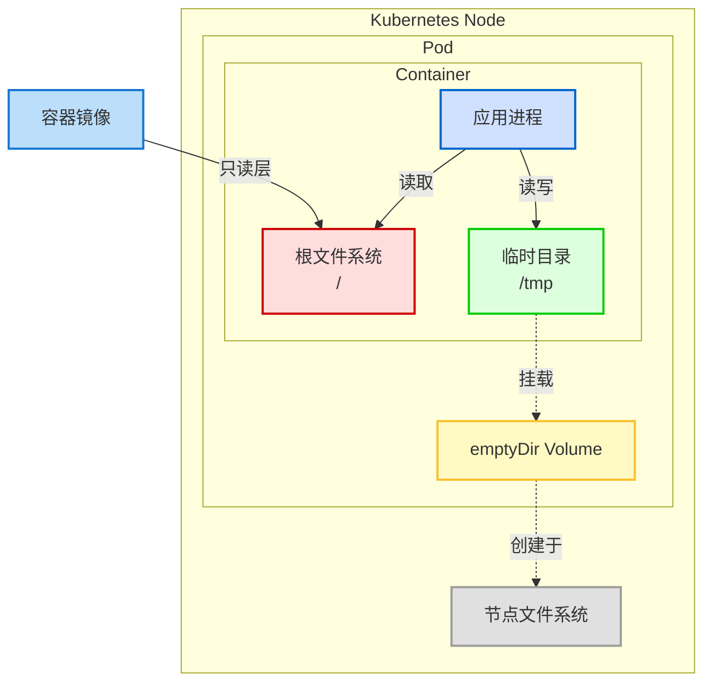
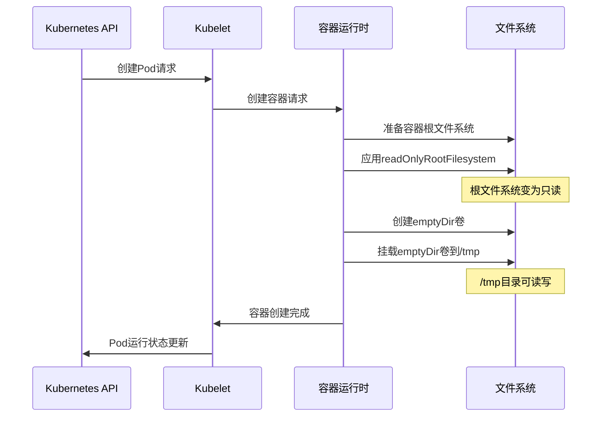
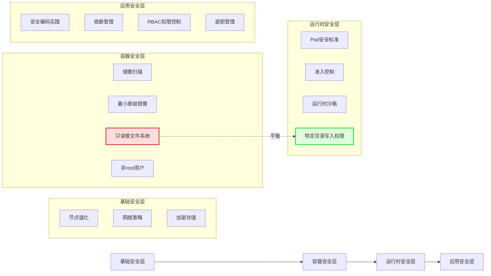

Управление правами доступа к файловой системе контейнера является ключевым моментом при построении архитектуры безопасности Kubernetes. Особенно в средах, реализующих модель безопасности с нулевым доверием, файловая система readOnlyRootFilesystem является важной мерой усиления безопасности. Однако такая настройка безопасности часто противоречит функциональным требованиям приложений, особенно в отношении хранения временных файлов. В этой статье мы подробно рассмотрим, как предоставить контейнерам необходимые разрешения на запись в каталог `/tmp`, сохраняя при этом высокие стандарты безопасности.

<!--more-->

## 容器安全与临时存储的平衡挑战

Популярность контейнерной технологии привела к беспрецедентной простоте развертывания приложений, но при этом появились и новые проблемы безопасности. По сравнению с традиционными виртуальными машинами контейнеры совместно используют ядро хоста и имеют относительно тонкие границы безопасности, что делает контроль разрешений файловой системы внутри контейнеров особенно важным.

```yaml
securityContext
  readOnlyRootFilesystem: true
```

В лучших практиках безопасности Kubernetes стало стандартной практикой настраивать корневую файловую систему только для чтения с помощью вышеуказанной настройки. Такая конфигурация эффективно предотвращает:

1. вредоносные программы, модифицирующие системные файлы внутри контейнера
2. несанкционированное выполнение кода в результате атаки по цепочке поставок
3. повышение привилегий после использования уязвимости приложения
4. подготовка к атакам на прорыв контейнера

Однако между этой мерой безопасности и требованиями реальных приложений существует естественное противоречие. Почти все современные приложения, основанные на Java, Python, Node.js или других технологических стеках, используют каталог `/tmp` для операций с временными файлами. Эти операции могут включать:

- Обработка загружаемых файлов (например, временное хранение перед обработкой изображений)
- Промежуточные файлы для ротации журнала
- Сокетные файлы для межпроцессного взаимодействия (IPC)
- JIT (Just-In-Time) кэширование
- Журналы транзакций базы данных
- Управление состоянием сеанса

## 深入理解Kubernetes卷与安全上下文

Прежде чем разрешить этот парадокс, давайте погрузимся в понимание двух ключевых концепций Kubernetes: томов и SecurityContext.

### 卷的工作原理

Тома Kubernetes - это абстракция и расширение собственного механизма хранения контейнера. Когда мы определяем том в спецификации подката, Kubernetes будет:

1. создайте или подключитесь к соответствующему ресурсу хранения на узле, где расположен Pod
2. смонтируйте ресурс хранения в пространстве имен файловой системы бода
3. сопоставьте том с указанным путем в контейнере в соответствии с конфигурацией `volumeMounts`.

Для томов типа `emptyDir` Kubernetes создает пустой каталог на узле при запуске Pod. Жизненный цикл этого каталога привязан к Pod - когда Pod завершается, соответствующий том `emptyDir` также удаляется. Важно отметить, что эта директория создается и монтируется во время работы контейнера, поэтому на нее не влияют ограничения файловой системы в образе контейнера, связанные с доступом только для чтения.

### 安全上下文的执行机制

Когда мы устанавливаем значение `securityContext.readOnlyRootFilesystem: true`, Kubernetes применяет это ограничение при запуске контейнеров через контейнерную среду исполнения, такую как containerd или Docker. Эта настройка реализована через функцию пространства имен монтирования ядра Linux, а именно:

1. корневая файловая система контейнера монтируется с опцией "только для чтения" при запуске контейнера
2. эта операция выполняется до запуска процесса контейнера, как часть инициализации контейнера
3. после применения этой опции все процессы внутри контейнера не могут записывать в корневую файловую систему

Однако ключевым моментом является то, что **монтирование тома происходит после того, как файловая система была помечена как доступная только для чтения**. Это означает, что на каталоги, смонтированные через тома, не распространяется ограничение корневой файловой системы "только чтение" и они могут сохранять свои независимые настройки прав доступа.

## 解决方案：使用emptyDir卷实现安全与功能的平衡

Исходя из вышеизложенного принципа, мы можем разработать решение, которое отвечает требованиям безопасности, не влияя на функциональность приложения: использовать том `emptyDir`, смонтированный в директорию `/tmp` контейнера.

### 详细配置示例与解析

Ниже приведен пример полного развертывания с настройками корневой файловой системы только для чтения и директории `/tmp` для записи:

```yaml
apiVersion: apps/v1
kind: Deployment
metadata:
  name: secure-app
  labels:
    app: secure-app
spec:
  replicas: 3
  selector:
    matchLabels:
      app: secure-app
  template:
    metadata:
      labels:
        app: secure-app
    spec:
      # Pod级别安全设置
      securityContext:
        # 可选的Pod级别安全设置
        runAsNonRoot: true
        seccompProfile:
          type: RuntimeDefault
      containers:
      - name: app
        image: your-secure-app:1.2.3
        ports:
        - containerPort: 8080
        # 容器级别安全设置
        securityContext:
          # 启用只读根文件系统
          readOnlyRootFilesystem: true
          # 禁止权限提升
          allowPrivilegeEscalation: false
          # 移除所有Linux能力
          capabilities:
            drop:
            - ALL
        # 挂载临时目录
        volumeMounts:
        - name: tmp-volume
          mountPath: /tmp
      # 定义卷
      volumes:
      - name: tmp-volume
        # 使用emptyDir作为临时存储
        emptyDir: {}
```

Ключевой частью этой конфигурации является:

1. В разделе `ecurityContext` определяется `readOnlyRootFilesystem: true`: устанавливает корневую файловую систему контейнера в режим "только для чтения".
2. В разделе `volumes` определяется том `emptyDir` с именем `tmp-volume
3. `volumeMounts` монтирует том по пути `/tmp` контейнера

Когда контейнер запускается, Kubernetes создает пустой каталог и монтирует его по пути `/tmp` внутри контейнера. Поскольку этот каталог монтируется через том, на него не распространяется ограничение корневой файловой системы только для чтения, и приложения могут нормально читать и записывать в него файлы.

### emptyDir的高级配置选项

Для сред с повышенными требованиями к безопасности или особой производительностью том `emptyDir` также поддерживает некоторые расширенные параметры конфигурации:

#### 内存存储（Memory-backed）临时文件系统

В некоторых высокопроизводительных сценариях может потребоваться более высокая производительность ввода-вывода каталога `/tmp`. Можно использовать память в качестве носителя, настроив `emptyDir.medium` на `Memory`:

```yaml
volumes:
- name: tmp-volume
  emptyDir:
    medium: Memory
```

При этом для хранения временных файлов вместо диска будет использоваться tmpfs (файловая система в памяти), что обеспечит более высокую производительность ввода-вывода, но потребует ресурсов памяти узла.

#### 存储大小限制

Чтобы предотвратить запись приложениями неограниченного количества временных файлов, которые могут привести к нехватке места на узле, вы можете установить `emptyDir.sizeLimit` для ограничения максимального размера тома:

```yaml
volumes:
- name: tmp-volume
  emptyDir:
    sizeLimit: 1Gi  # 限制为1GB
```

Когда общий размер временного файла приближается к этому пределу или превышает его, Kubernetes запускает механизм выселения, чтобы перезапустить или отправить Pod на другой узел.

## 安全影响分析

При внедрении этого решения необходимо учитывать его влияние на общую систему безопасности:

### 安全增强点

1. **Сохранение принципа наименьших привилегий**: за исключением каталога `/tmp`, где явно разрешена запись, остальные области файловой системы остаются доступными только для чтения
2. **Предотвращение атак сохранения**: содержимое тома `emptyDir` стирается при завершении работы Pod, что снижает риск атак сохранения.
3. **Ограничение ресурсов**: атаки типа "отказ в обслуживании" (например, злонамеренное заполнение дисков) могут быть предотвращены с помощью `sizeLimit`.

### 潜在安全注意点

1. **Утечка конфиденциальных данных из временных файлов**: приложения могут записывать конфиденциальные данные в `/tmp`, необходимо убедиться, что приложение само корректно работает с временными файлами
2. **Внутриузловая миграция бодов**: при миграции бода с одного узла на другой данные в `emptyDir` не сохраняются.
3. **Multi-Container Pod Sharing**: в многоконтейнерных стручках все контейнеры имеют доступ к одному и тому же тому `emptyDir`, поэтому необходимо учитывать межконтейнерную изоляцию данных.

## 实施最佳实践

При внедрении данного решения в различных средах можно руководствоваться следующими передовыми методами:

### 生产环境配置建议

1. **Вместе с другими настройками безопасности**: используйте корневую файловую систему только для чтения в сочетании с другими настройками безопасности (например, пользователи, не входящие в root, seccomp, AppArmor и т. д.).
2. **Мониторинг использования временных каталогов**: настройте мониторинг использования каталога `/tmp` для своевременного выявления аномальных закономерностей
3. **Периодическое сканирование безопасности**: используйте инструменты сканирования безопасности контейнеров для проверки образов и запущенных контейнеров.
4. **Используйте разные тома для разных целей**: если приложению требуется несколько каталогов, доступных для записи, создайте отдельные тома для каждого каталога, а не полагайтесь только на `/tmp`.

### 审计与合规

Чтобы соответствовать требованиям аудита безопасности и нормативно-правового соответствия, это возможно:

1. Документирование бизнес-причины, по которой `/tmp` должен быть доступен для записи, в аннотации Pod
2. Обеспечение конфигурации корневой файловой системы только для чтения с помощью контроллера доступа (например, OPA Gatekeeper)
3. применение конфигурационного файла Restricted для стандартов безопасности Pod (PSS)
4. ведение журналов всех файловых операций в каталоге `/tmp` во время выполнения контейнера

## 常见应用案例分析

Различные типы приложений по-разному используют каталог `/tmp`, и ниже описаны стратегии работы с некоторыми распространенными приложениями:

### Java应用

Java-приложения обычно используют каталог `/tmp` в качестве места по умолчанию для временных файлов. Другие места могут быть указаны с помощью параметра JVM `-Djava.io.tmpdir`:

```yaml
containers:
- name: java-app
  image: java-app:1.0
  env:
  - name: JAVA_OPTS
    value: "-Djava.io.tmpdir=/app/temp"
  volumeMounts:
  - name: app-temp
    mountPath: /app/temp
volumes:
- name: app-temp
  emptyDir: {}
```

### Web服务器

Веб-серверы, такие как Nginx, Apache и т. д., используют временные каталоги для хранения файлов загрузки клиентов, кэша прокси-серверов и т. д. Вам нужно изменить его конфигурацию, чтобы указать на место, доступное для записи:

```yaml
volumeMounts:
- name: nginx-temp
  mountPath: /var/cache/nginx
- name: nginx-run
  mountPath: /var/run
```

### 数据库容器

Базы данных, такие как PostgreSQL, MySQL и т. д., нуждаются в записи журналов и временных данных. В дополнение к основному каталогу данных обычно требуются монтируемые каталоги:

```yaml
volumeMounts:
- name: postgres-data
  mountPath: /var/lib/postgresql/data
- name: postgres-temp
  mountPath: /tmp
- name: postgres-run
  mountPath: /var/run/postgresql
```

## 未来发展与AI应用展望

По мере развития стандартов безопасности контейнеров и широкого развертывания приложений искусственного интеллекта в Kubernetes требования к временному хранению данных меняются:

### Kubernetes安全发展趋势

1. **Изменяемая инфраструктура**: файловые системы, доступные только для чтения, являются частью концепции неизменяемой инфраструктуры, и в будущем все больше инструментов будут поддерживать эту модель
2. **Песочницы**: все более популярными становятся контейнерные среды исполнения, такие как gVisor, Kata Containers и т. д., которые обеспечивают большую изоляцию.
3. **Динамический контроль доступа**: обнаружение аномалий на основе машинного обучения может заменить статические политики для более интеллектуального контроля доступа к файловой системе

### AI应用特殊需求

Приложения ИИ, такие как обучение моделей и сервисы вывода, испытывают особые потребности во временном хранении данных:

1. **Кэширование больших моделей**: большие модели ИИ требуют высокопроизводительного временного хранилища для кэширования промежуточных результатов
2. **Переполнение памяти GPU**: системы ИИ могут переполнять данные на диск при нехватке памяти GPU
3. **Распределенная синхронизация обучения**: распределенное обучение может использовать файловые системы для синхронизации состояния

Для таких приложений может потребоваться не только базовая конфигурация `emptyDir`:

```yaml
volumes:
- name: ai-temp
  emptyDir:
    medium: Memory
    sizeLimit: 20Gi
```

## 结论

Достижение баланса между безопасностью контейнеров и функциональностью приложений в среде Kubernetes является постоянной задачей. Благодаря более глубокому пониманию механизмов монтирования томов и контекстов безопасности мы можем разрабатывать конфигурации развертывания, отвечающие строгим требованиям безопасности без ущерба для работоспособности приложений.

Монтирование в каталог `/tmp` с помощью тома `emptyDir` - это простое, но эффективное решение, которое позволяет приложениям записывать необходимые временные файлы, сохраняя корневую файловую систему доступной только для чтения. При правильной настройке и соблюдении лучших практик функциональные требования приложения могут быть удовлетворены без ущерба для безопасности.

Этот подход применим не только к каталогу `/tmp`, но может быть распространен на любой каталог, в который приложение должно записывать данные, обеспечивая жизнеспособный путь к созданию безопасной и стабильной среды Kubernetes.

## 需要配图的位置

1. после раздела "Проблемы балансировки безопасности контейнеров и временного хранения": нужна диаграмма, показывающая иерархию безопасности контейнеров в сравнении с разрешениями файловой системы
2. после раздела "Понимание томов Kubernetes и контекстов безопасности": нужна техническая диаграмма, показывающая связь между монтированием томов и файловыми системами контейнеров.
3. перед разделом "Анализ влияния на безопасность": необходима сравнительная диаграмма, сравнивающая состояние безопасности до и после внедрения.

## Mermaid图解

### 卷挂载与只读文件系统的关系



### 安全上下文与卷的执行顺序



### 安全增强措施层次

