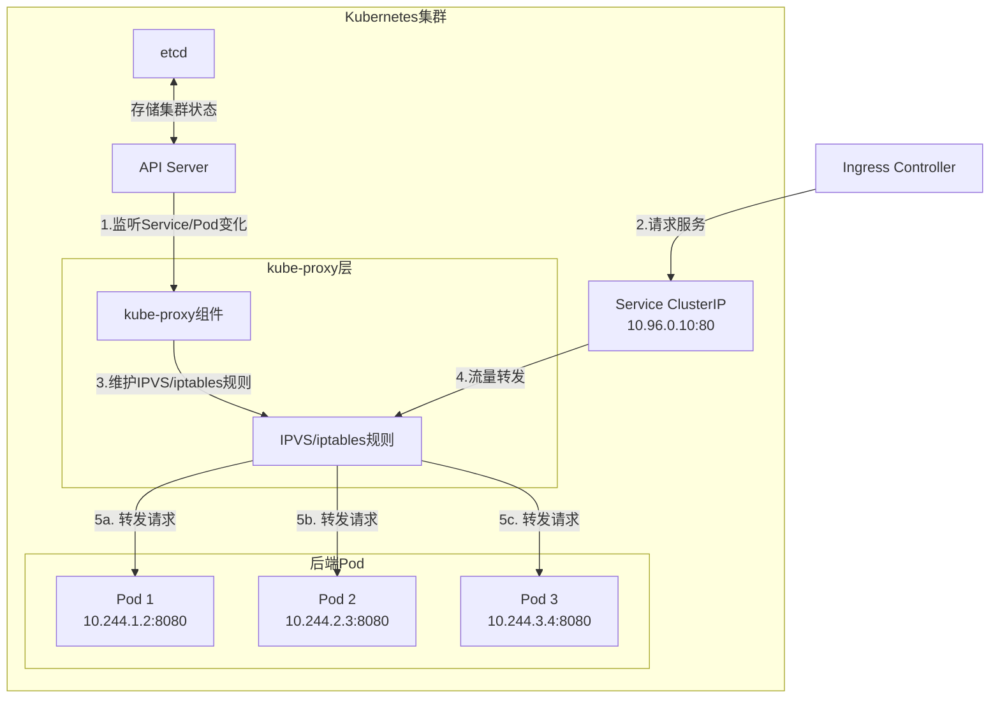

在Kubernetes中，你选择的Service类型可能比想象中更重要 —— 它不仅影响应用的可访问性，还直接关系到架构效率和成本。我们今天深入讨论一个常被误解的问题：**为什么ClusterIP类型的Service也能实现负载均衡？**

<!--more-->

## 从一个架构调整的疑问说起

最近在调整Azure AKS集群的网络架构时，我遇到了一个有趣的问题。原先的架构是：

```
App Gateway → Ingress → Internal Load Balancer (Service) → Pods
```

而架构师希望改为：

```
App Gateway → Ingress → 直接到Pods (跳过LB)
```

这个提议引发了一个基础但关键的问题：**Ingress是否必须通过Service与Pod连接？**如果是，我们是否可以使用不同类型的Service来优化架构？

## Kubernetes中的Service类型

在Kubernetes中，Service是将流量路由到Pod的抽象层。常见的Service类型包括：

1. **ClusterIP**（默认）：只在集群内部可访问
2. **NodePort**：通过节点IP和指定端口访问
3. **LoadBalancer**：创建外部负载均衡器（如Azure Load Balancer）
4. **ExternalName**：将Service映射到外部DNS名称

对于上述架构变更需求，我们选择了ClusterIP类型来替代Internal Load Balancer。这不仅简化了架构，还降低了成本。但这引出了一个更深层次的问题：**ClusterIP如何实现流量分发？**

## ClusterIP的负载均衡机制

很多人误以为ClusterIP没有负载均衡功能，因为它不使用外部负载均衡器。事实上，ClusterIP确实提供了负载均衡，只是通过不同的机制实现。

下面这张图展示了ClusterIP Service如何分发流量：



### 工作原理详解

1. **Service资源创建**
   - 当创建ClusterIP Service时，Kubernetes分配一个虚拟IP
   - 这个IP只在集群内可见

2. **kube-proxy的角色**
   - 每个节点都运行kube-proxy组件
   - 监听API Server中Service和Endpoints的变化
   - 更新节点上的网络规则

3. **流量转发机制**
   - **iptables模式**（默认）：创建iptables规则，随机转发流量
   - **IPVS模式**：使用Linux内核IP Virtual Server模块，提供更多负载均衡算法
   - **userspace模式**：旧模式，性能较差，不常用

想象kube-proxy就像一个网络"感应器"，持续监控集群中Service和Pod的变化，并动态更新转发规则。

## iptables vs IPVS：两种负载均衡实现

### iptables模式

在默认的iptables模式下，kube-proxy创建的规则大致如下：

```bash
# 伪代码示例
-A KUBE-SERVICES -d 10.96.0.10/32 -p tcp -m tcp --dport 80 -j KUBE-SVC-XXX
-A KUBE-SVC-XXX -m statistic --mode random --probability 0.33333 -j KUBE-SEP-POD1
-A KUBE-SVC-XXX -m statistic --mode random --probability 0.50000 -j KUBE-SEP-POD2
-A KUBE-SVC-XXX -j KUBE-SEP-POD3
```

这些规则通过概率分配实现流量的随机分发。

### IPVS模式

IPVS（IP Virtual Server）是Linux内核中的一个模块，用于实现传输层负载均衡。相比iptables：
- 使用哈希表作为底层数据结构，更高效
- 支持更多负载均衡算法：
  - rr：轮询（默认）
  - lc：最少连接
  - dh：目标哈希
  - sh：源哈希
  - sed：最短期望延迟
  - nq：永不排队

要启用IPVS模式，需在kube-proxy配置中设置：

```yaml
mode: ipvs
```

## 配置ClusterIP实现会话亲和性

如果希望来自同一客户端的请求始终发送到同一个Pod，可以配置SessionAffinity：

```yaml
apiVersion: v1
kind: Service
metadata:
  name: my-service
spec:
  selector:
    app: MyApp
  sessionAffinity: ClientIP  # 基于客户端IP的会话亲和性
  ports:
  - port: 80
    targetPort: 8080
```

注意，Kubernetes目前只支持两种sessionAffinity值：`None`（默认）和`ClientIP`。

## ClusterIP vs LoadBalancer：如何选择？

**LoadBalancer优势**：
- 可直接从外部网络访问
- 可能提供更多高级功能（SSL终止、高级监控等）

**ClusterIP优势**：
- 避免额外的云提供商负载均衡器成本
- 减少网络路径中的跳转层
- 对于内部服务足够使用

**选择建议**：
- 如果服务需要直接从外部访问 → LoadBalancer
- 如果服务只需要内部访问或已有Ingress作为入口 → ClusterIP

## 实际应用：优化Azure AKS架构

对于最初的问题，我们使用ClusterIP类型的Service替代了Internal Load Balancer：

```yaml
apiVersion: v1
kind: Service
metadata:
  name: api-service
spec:
  type: ClusterIP  # 默认类型，不需要外部LB
  selector:
    app: api-app
  ports:
  - port: 80
    targetPort: 8080
```

然后，在Ingress配置中引用这个Service：

```yaml
apiVersion: networking.k8s.io/v1
kind: Ingress
metadata:
  name: api-ingress
spec:
  rules:
  - http:
      paths:
      - path: /api
        pathType: Prefix
        backend:
          service:
            name: api-service
            port:
              number: 80
```

这样，我们成功地实现了架构简化：`App Gateway → Ingress → ClusterIP Service → Pods`，同时保留了负载均衡功能。

## 总结

Kubernetes的网络设计展现了其优雅之处 - 根据不同的需求提供不同级别的网络抽象。ClusterIP不仅是最简单的Service类型，也是内部服务负载均衡的有力工具。它通过kube-proxy在节点层面实现流量分发，无需依赖外部负载均衡器。

了解这些底层机制，能帮助我们做出更明智的架构决策，既保证系统稳定性，又控制基础设施成本。

**你的Kubernetes服务架构是否也存在优化空间？不妨从Service类型的选择开始思考。**

---

**补充资料**：
- [Kubernetes官方文档：Service](https://kubernetes.io/docs/concepts/services-networking/service/)
- [深入了解kube-proxy模式](https://kubernetes.io/docs/concepts/services-networking/service/#proxy-mode-ipvs)
