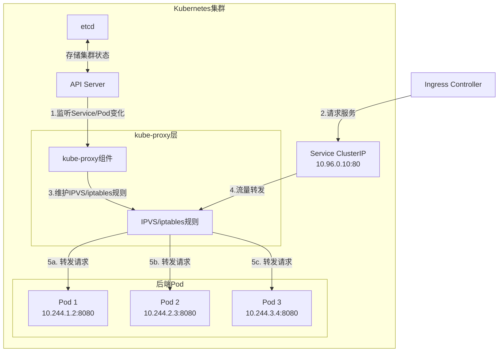

В Kubernetes тип выбранной службы может быть важнее, чем вы думаете - он не только влияет на доступность приложений, но и напрямую связан с эффективностью архитектуры и стоимостью. Сегодня мы разберемся в часто непонятном вопросе:** Почему балансировка нагрузки возможна и при использовании служб типа ClusterIP? **

<!--more-->

## 从一个架构调整的疑问说起

Недавно, настраивая сетевую архитектуру кластера Azure AKS, я столкнулся с интересной проблемой. Первоначальная архитектура была следующей:

```
App Gateway → Ingress → Internal Load Balancer (Service) → Pods
```

И архитектор хочет читать:

```
App Gateway → Ingress → 直接到Pods (跳过LB)
```

Это предложение поднимает основной, но критически важный вопрос:** Должен ли Ingress подключаться к бодам через сервисы? **Если да, то можем ли мы использовать другой тип сервисов для оптимизации архитектуры?

## Kubernetes中的Service类型

В Kubernetes Service - это уровень абстракции, который направляет трафик на поды. К распространенным типам сервисов относятся:

1. **ClusterIP** (по умолчанию): доступен только в пределах кластера
2. **NodePort**: доступ через IP-адрес узла и указанный порт.
3. **LoadBalancer**: создает внешний балансировщик нагрузки (например, Azure Load Balancer).
4. **ExternalName**: сопоставляет службу с внешним DNS-именем.

В соответствии с вышеуказанными требованиями к изменению архитектуры, мы выбрали тип ClusterIP для замены Internal Load Balancer, что не только упрощает архитектуру, но и снижает стоимость. Но это приводит к более глубокому вопросу: **Как ClusterIP обеспечивает распределение трафика? **

## ClusterIP的负载均衡机制

Многие ошибочно полагают, что ClusterIP не обладает возможностями балансировки нагрузки, поскольку не использует внешний балансировщик нагрузки. На самом деле ClusterIP обеспечивает балансировку нагрузки, просто с помощью другого механизма.

На следующей схеме показано, как служба ClusterIP распределяет трафик:



### 工作原理详解

1. **Создание ресурса службы**.
   - Когда создается служба ClusterIP, Kubernetes присваивает ей виртуальный IP.
   - Этот IP виден только в пределах кластера

2. **Роли kube-proxy**.
   - На каждом узле работает компонент kube-proxy
   - Прослушивание изменений в сервисах и конечных точках на сервере API
   - Обновление сетевых правил на узлах

3. **Механизм переадресации трафика**.
   - **iptables mode** (по умолчанию): создает правила iptables для случайной пересылки трафика
   - **IPVS mode**: использование модуля Linux kernel IP Virtual Server, обеспечивает больше алгоритмов балансировки нагрузки
   - **режим пользовательского пространства**: старый режим, низкая производительность, не часто используется

Представьте себе kube-proxy как сетевой "датчик", который постоянно отслеживает изменения в сервисах и стручках в кластере и динамически обновляет правила переадресации.

## iptables vs IPVS：两种负载均衡实现

### iptables模式

В режиме iptables по умолчанию kube-proxy создает правила примерно следующим образом:

```bash
# 伪代码示例
-A KUBE-SERVICES -d 10.96.0.10/32 -p tcp -m tcp --dport 80 -j KUBE-SVC-XXX
-A KUBE-SVC-XXX -m statistic --mode random --probability 0.33333 -j KUBE-SEP-POD1
-A KUBE-SVC-XXX -m statistic --mode random --probability 0.50000 -j KUBE-SEP-POD2
-A KUBE-SVC-XXX -j KUBE-SEP-POD3
```

Эти правила позволяют распределять трафик случайным образом с помощью вероятностных назначений.

### IPVS模式

IPVS (IP Virtual Server) - это модуль в ядре Linux для реализации балансировки нагрузки на транспортном уровне. По сравнению с iptables:
- Использует хэш-таблицу в качестве базовой структуры данных, более эффективен.
- Поддерживает больше алгоритмов балансировки нагрузки:
  - rr: опрос (по умолчанию)
  - lc: наименее подключенный
  - dh: хэш назначения
  - sh: хэш источника
  - sed: минимальная ожидаемая задержка
  - nq: никогда не ставить в очередь

Чтобы включить режим IPVS, задайте его в конфигурации kube-proxy:

```yaml
mode: ipvs
```

## 配置ClusterIP实现会话亲和性

Если вы хотите, чтобы запросы от одного и того же клиента всегда отправлялись на один и тот же бод, вы можете настроить SessionAffinity:

```yaml
apiVersion: v1
kind: Service
metadata:
  name: my-service
spec:
  selector:
    app: MyApp
  sessionAffinity: ClientIP  # 基于客户端IP的会话亲和性
  ports:
  - port: 80
    targetPort: 8080
```

Обратите внимание, что в настоящее время Kubernetes поддерживает только два значения sessionAffinity: `None` (по умолчанию) и `ClientIP`.

## ClusterIP vs LoadBalancer：如何选择？

Преимущество **LoadBalancer**:
- Возможность прямого доступа из внешних сетей.
- Могут быть доступны более продвинутые функции (завершение SSL, расширенный мониторинг и т.д.)

Преимущество **ClusterIP**:
- Избегайте дополнительных расходов на балансировщик нагрузки облачного провайдера
- Сокращение количества уровней переходов по сетевому маршруту
- Достаточно для внутренних служб

**Выберите рекомендации**:
- Если служба требует прямого внешнего доступа → LoadBalancer
- Если служба требует только внутреннего доступа или уже имеет Ingress в качестве точки входа → ClusterIP

## 实际应用：优化Azure AKS架构

Для решения начальной задачи мы использовали службу типа ClusterIP вместо внутреннего балансировщика нагрузки:

```yaml
apiVersion: v1
kind: Service
metadata:
  name: api-service
spec:
  type: ClusterIP  # 默认类型，不需要外部LB
  selector:
    app: api-app
  ports:
  - port: 80
    targetPort: 8080
```

Затем ссылайтесь на эту службу в конфигурации Ingress:

```yaml
apiVersion: networking.k8s.io/v1
kind: Ingress
metadata:
  name: api-ingress
spec:
  rules:
  - http:
      paths:
      - path: /api
        pathType: Prefix
        backend:
          service:
            name: api-service
            port:
              number: 80
```

Таким образом, нам удалось добиться упрощения архитектуры: `App Gateway → Ingress → ClusterIP Service → Pods`, сохранив при этом функциональность балансировки нагрузки.

## 总结

Сетевой дизайн Kubernetes демонстрирует свою элегантность, предоставляя различные уровни сетевой абстракции в зависимости от требований. ClusterIP - это не только самый простой тип сервиса, но и мощный инструмент для балансировки нагрузки внутренних сервисов. Он позволяет распределять трафик на уровне узла через kube-proxy, избавляя от необходимости полагаться на внешние балансировщики нагрузки.

Понимание этих основополагающих механизмов поможет нам принимать более разумные архитектурные решения, чтобы обеспечить стабильность системы и контролировать расходы на инфраструктуру.

**Есть ли место для оптимизации и в архитектуре сервисов Kubernetes? Неплохо было бы задуматься о выборе типа сервиса. **

---

**Дополнительная информация**:
- [Официальная документация Kubernetes: Service](https://kubernetes.io/docs/concepts/services-networking/service/)
- [Глубокое погружение в модель kube-proxy](https://kubernetes.io/docs/concepts/services-networking/service/#proxy-mode-ipvs)