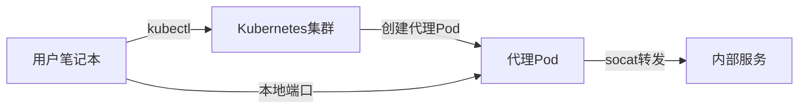

你是否曾经需要临时访问公司内网的服务，却苦于没有合适的工具？特别是当VPN因为安全限制无法使用，或者你只需要短暂地连接到特定服务时？本文将介绍一种基于Kubernetes和Fish Shell的解决方案，让你能够安全、便捷地通过K8s集群代理访问内网服务。

<!--more-->

## 问题背景

现代企业IT架构中，内部服务通常位于安全隔离的网络环境中，不能直接从外部访问。以下是一些常见的访问内网服务的方式：

1. **VPN连接**：传统方案，但往往涉及复杂的安装和配置，在企业环境中可能因安全政策而受限
2. **堡垒机**：需要额外的基础设施维护
3. **SSH隧道**：配置繁琐，不便于管理
4. **专用网关**：成本高，部署复杂

而如果公司已经部署了Kubernetes集群，我们可以借助它作为访问内网的"桥梁"，实现简单高效的内网服务访问。

## 优雅的解决方案：k8s_proxy

由于Kubernetes集群通常同时连接着外部网络和内部网络，我们可以创建一个临时Pod作为代理，并利用`kubectl port-forward`命令将内部服务映射到本地端口。为了简化这一过程，我们开发了一个Fish Shell函数`k8s_proxy`。

由于Kubernetes集群通常同时连接着外部网络和内部网络，我们可以创建一个临时Pod作为代理，并利用`kubectl port-forward`命令将内部服务映射到本地端口。为了简化这一过程，我们开发了一个Fish Shell函数`k8s_proxy`。

### 解决方案架构



### 代码实现

这是完整的Fish Shell函数实现：

```fish
function k8s_proxy
    # 设置默认值
    set -l env ""
    set -l ip ""
    set -l local_port 5433   # 本地端口默认为5433
    set -l remote_port 5432  # 远程端口默认为5432
    set -l service_name "service" # 服务名称默认值

    # 用户可以指定参数
    if test (count $argv) -ge 2
        set env $argv[1]
        set ip $argv[2]
        
        # 如果提供了第三个参数，设置为本地端口
        if test (count $argv) -ge 3
            set local_port $argv[3]
        end
        
        # 如果提供了第四个参数，设置为远程端口
        if test (count $argv) -ge 4
            set remote_port $argv[4]
        end

        # 如果提供了第五个参数，设置为服务名称
        if test (count $argv) -ge 5
            set service_name $argv[5]
        end
        
        echo "目标环境: $env"
        echo "目标IP: $ip"
        echo "本地端口: $local_port"
        echo "远程服务端口: $remote_port"
        echo "服务名称: $service_name"
    else
        echo "用法: k8s_proxy <环境> <IP> [本地端口=5433] [远程端口=5432] [服务名称=service]"
        return 1
    end

    echo "创建临时代理Pod..."

    # 创建临时YAML文件
    set -l tmp_yaml (mktemp)
    echo "apiVersion: v1
kind: Pod
metadata:
  name: socat-proxy
  labels:
    app: temp-$service_name-proxy
spec:
  containers:
  - name: socat
    image: alpine:latest
    command:
    - sh
    - -c
    - |
      apk add --no-cache socat
      socat TCP-LISTEN:5432,fork TCP:$ip:$remote_port &
      sleep infinity
    ports:
    - containerPort: 5432" >$tmp_yaml

    # 我们不再需要切换全局context，而是在每个命令中指定context
    # 这使脚本在多tmux窗口环境中更可靠
    set -l k8s_context your-cluster-$env

    # 应用YAML创建Pod，显式指定context
    kubectl --context=$k8s_context apply -f $tmp_yaml >/dev/null

    # 删除临时YAML文件
    rm $tmp_yaml

    # 等待Pod就绪，显式指定context
    echo "等待代理Pod就绪..."
    kubectl --context=$k8s_context wait --for=condition=Ready pod/socat-proxy --timeout=60s >/dev/null

    if test $status -ne 0
        echo "错误: Pod未能在规定时间内就绪"
        kubectl --context=$k8s_context delete pod socat-proxy >/dev/null 2>&1
        return 1
    end

    echo "代理就绪！现在可以通过localhost:$local_port连接到服务"
    echo "连接信息："
    echo "  主机: localhost"
    echo "  端口: $local_port"
    echo "  远程服务: $ip:$remote_port"
    echo ""
    echo "按Ctrl+C终止代理并清理资源"

    # 启动端口转发，显式指定context
    kubectl --context=$k8s_context port-forward pod/socat-proxy $local_port:5432

    # 清理函数
    function cleanup
        echo ""
        echo "清理资源..."
        kubectl --context=$k8s_context delete pod socat-proxy >/dev/null 2>&1
        echo "代理已关闭，资源已清理"
        return 0
    end

    # 如果port-forward正常退出，清理资源
    cleanup

    # 不再需要切换回原始context，因为我们没有改变全局context
end
```

## 如何使用

### 快速上手

假设你是一名开发人员，需要临时访问测试环境中的一个内网服务。以下是使用步骤：

1. 将上面的函数保存到`~/.config/fish/functions/k8s_proxy.fish`文件中
2. 在Fish Shell中重新加载函数：`source ~/.config/fish/functions/k8s_proxy.fish`
3. 使用命令连接到服务：`k8s_proxy dev 10.0.0.15 8080 8080 api-service`

这个命令会：
- 在`dev`环境创建一个代理Pod
- 连接到IP为`10.0.0.15`的服务
- 将远程的`8080`端口映射到本地的`8080`端口
- 使用`api-service`作为服务标识名

连接建立后，你就可以通过`localhost:8080`访问内网服务了！

### 不同场景的使用示例

1. **连接数据库**：
   ```fish
   k8s_proxy prod 10.0.0.100 5433 5432 postgres
   ```

2. **访问内部API**：
   ```fish
   k8s_proxy dev 10.0.0.50 3000 3000 api
   ```

3. **连接Redis**：
   ```fish
   k8s_proxy test 10.0.0.200 6379 6379 redis
   ```

## 多终端环境下的健壮性

在企业环境中，开发人员经常使用tmux或类似工具同时管理多个终端会话。这容易导致一个问题：当你在一个窗口中运行代理，在另一个窗口切换kubectl context时，可能会影响代理连接。

这是因为kubectl的context是全局共享的，存储在`~/.kube/config`文件中。一个终端的更改会影响所有终端。

我们的解决方案是：不修改全局context，而是在每个kubectl命令中显式指定`--context`参数。这样，即使在其他窗口切换了context，代理连接仍然能正常工作。

## 安全考量

使用Kubernetes作为代理访问内网服务提供了便利，但也需要注意相关的安全风险和防护措施：

### 潜在风险
- 如果用户拥有创建Pod的权限，理论上可以访问集群所在网络的任何服务
- 代理连接可能不易于审计和监控
- 可能被滥用创建大量代理Pod

### 安全最佳实践
1. **实施严格的RBAC策略**：
   - 限制哪些用户可以创建Pod和执行端口转发
   - 限制可使用的命名空间
   - 禁止创建特权容器

2. **启用审计日志**：
   - 记录所有Pod创建和端口转发操作
   - 将日志集成到安全监控系统

3. **临时性使用**：
   - 确保代理连接临时使用，用完即关
   - 代理Pod不应长时间运行

4. **网络策略**：
   - 使用Kubernetes网络策略限制Pod的网络访问范围

在企业环境中，这种方案通常结合Azure AD或其他身份认证系统与Kubernetes RBAC集成，确保用户只能访问其被授权的资源，提供了额外的安全保障。

## 为什么选择Fish Shell？

你可能注意到我们选择了Fish Shell而不是更常见的Bash来实现这个功能。这是有原因的：

1. **更友好的语法**：Fish的语法更加一致和直观，减少了常见的Bash陷阱
2. **内置的自动补全**：无需额外配置即可获得强大的自动补全功能
3. **彩色提示**：默认提供易读的彩色输出，提升用户体验
4. **变量处理更简单**：`set`命令的语法比Bash的变量赋值更加清晰
5. **内置列表支持**：原生支持列表数据结构，简化了参数处理

如果你还没有尝试过Fish Shell，这是一个很好的起点。它既保留了Shell的强大功能，又提供了更现代化的用户体验。

## 小结

通过结合Kubernetes和Fish Shell，我们创建了一个简单而强大的工具，用于安全地访问内网服务。这个方案特别适合以下场景：

- 临时访问内部服务进行调试或数据查询
- 在无法使用VPN的环境中工作
- 需要快速简便地连接到不同环境的服务
- 希望避免复杂配置和安装额外软件

与传统方法相比，这种基于k8s的代理方案具有零侵入性、即用即走、利用现有基础设施等优势，值得企业开发和运维团队考虑采用。

---

你认为这种方案如何？有没有其他访问内网服务的方法值得分享？欢迎在评论区留言讨论！

**注意**：请确保在使用前了解你所在组织的安全策略，并获得相应的授权。
