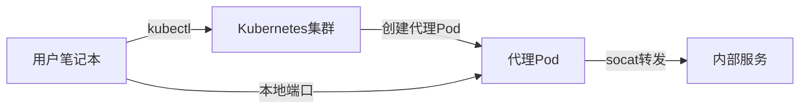

Вам когда-нибудь требовался временный доступ к сервису во внутренней сети вашей компании, но вы не могли найти подходящий инструмент? Особенно когда VPN недоступна из-за ограничений безопасности или вам нужно подключиться к определенному сервису только на короткий промежуток времени? В этой статье мы представим решение на базе Kubernetes и Fish Shell, которое позволит вам безопасно и легко получить доступ к сервисам интрасети через кластерный прокси K8s.

<!--more-->

## 问题背景

В современных корпоративных ИТ-архитектурах внутренние службы обычно располагаются в защищенной и изолированной сетевой среде и не могут быть доступны напрямую извне. Вот несколько распространенных способов доступа к службам интрасети:

1. **Подключение VPN**: традиционное решение, но часто требует сложной установки и настройки, а в корпоративных средах может быть ограничено политиками безопасности
2. **Fortress**: требует дополнительного обслуживания инфраструктуры
3. **SSH-туннель**: громоздкий в настройке и непростой в управлении
4. **Частный шлюз**: высокая стоимость и сложность развертывания

Если в компании развернут кластер Kubernetes, мы можем использовать его в качестве "моста" к интрасети, обеспечивая простой и эффективный доступ к интранет-сервисам.

## 优雅的解决方案：k8s_proxy

Поскольку кластеры Kubernetes обычно подключены как к внешним, так и к внутренним сетям, мы можем создать временный Pod для работы в качестве прокси и сопоставить внутренние сервисы с локальными портами с помощью команды `kubectl port-forward`. Чтобы упростить этот процесс, мы разработали функцию Fish Shell `k8s_proxy`.

Поскольку кластеры Kubernetes обычно подключены как к внешним, так и к внутренним сетям, мы можем создать временный Pod для работы в качестве прокси и сопоставить внутренние сервисы с локальными портами с помощью команды `kubectl port-forward`. Чтобы упростить этот процесс, мы разработали функцию Fish Shell `k8s_proxy`.

### 解决方案架构



### 代码实现

Это полная реализация функции Fish Shell:

```fish
function k8s_proxy
    # 设置默认值
    set -l env ""
    set -l ip ""
    set -l local_port 5433   # 本地端口默认为5433
    set -l remote_port 5432  # 远程端口默认为5432
    set -l service_name "service" # 服务名称默认值

# 用户可以指定参数
    if test (count $argv) -ge 2
        set env $argv[1]
        set ip $argv[2]
        
        # 如果提供了第三个参数，设置为本地端口
        if test (count $argv) -ge 3
            set local_port $argv[3]
        end
        
        # 如果提供了第四个参数，设置为远程端口
        if test (count $argv) -ge 4
            set remote_port $argv[4]
        end

# 如果提供了第五个参数，设置为服务名称
        if test (count $argv) -ge 5
            set service_name $argv[5]
        end
        
        echo "目标环境: $env"
        echo "目标IP: $ip"
        echo "本地端口: $local_port"
        echo "远程服务端口: $remote_port"
        echo "服务名称: $service_name"
    else
        echo "用法: k8s_proxy <环境> <IP> [本地端口=5433] [远程端口=5432] [服务名称=service]"
        return 1
    end

echo "Creating Temporary Proxy Pod..."

# 创建临时YAML文件
    set -l tmp_yaml (mktemp)
    echo "apiVersion: v1
kind: Pod
metadata:
  name: socat-proxy
  labels:
    app: temp-$service_name-proxy
spec:
  containers:
  - name: socat
    image: alpine:latest
    command:
    - sh
    - -c
    - |
      apk add --no-cache socat
      socat TCP-LISTEN:5432,fork TCP:$ip:$remote_port &
      sleep infinity
    ports:
    - containerPort: 5432" >$tmp_yaml

# 我们不再需要切换全局context，而是在每个命令中指定context
    # 这使脚本在多tmux窗口环境中更可靠
    set -l k8s_context your-cluster-$env

# 应用YAML创建Pod，显式指定context
    kubectl --context=$k8s_context apply -f $tmp_yaml >/dev/null

# 删除临时YAML文件
    rm $tmp_yaml

# 等待Pod就绪，显式指定context
    echo "等待代理Pod就绪..."
    kubectl --context=$k8s_context wait --for=condition=Ready pod/socat-proxy --timeout=60s >/dev/null

if test $status -ne 0
        echo "Ошибка: Под не был готов в указанное время"
        kubectl --context=$k8s_context delete pod socat-proxy >/dev/null 2>&1
        вернуть 1
    конец

echo "Прокси готов! Теперь вы можете подключиться к сервису через localhost:$local_port"
    echo "Информация о подключении:"
    echo " Host: localhost"
    echo " Порт: $local_port"
    echo " Удаленный сервис: $ip:$remote_port"
    echo ""
    echo "Нажмите Ctrl+C, чтобы завершить работу прокси и очистить ресурсы"

# 启动端口转发，显式指定context
    kubectl --context=$k8s_context port-forward pod/socat-proxy $local_port:5432

# 清理函数
    function cleanup
        echo ""
        echo "清理资源..."
        kubectl --context=$k8s_context delete pod socat-proxy >/dev/null 2>&1
        echo "代理已关闭，资源已清理"
        return 0
    end

# 如果port-forward正常退出，清理资源
    cleanup

# 不再需要切换回原始context，因为我们没有改变全局context
end
```

## 如何使用

### 快速上手

Предположим, вы разработчик и вам нужен временный доступ к службе интрасети в вашей тестовой среде. Вот шаги по его использованию:

1. Сохраните приведенные выше функции в файле `~/.config/fish/functions/k8s_proxy.fish`.
2. Перезагрузите функции в Fish Shell: `source ~/.config/fish/functions/k8s_proxy.fish`.
3. Подключитесь к сервису командой: `k8s_proxy dev 10.0.0.15 8080 8080 api-service`.

Эта команда выполнит:
- Создаст прокси-под в среде `dev`.
- Подключится к сервису с IP-адресом `10.0.0.15
- Сопоставить удаленный порт `8080` с локальным портом `8080`.
- Используйте `api-service` в качестве идентификатора сервиса.

Как только соединение будет установлено, вы сможете получить доступ к службе интрасети через `localhost:8080`!

### 不同场景的使用示例

1. **连接数据库**：
   ```fish
   k8s_proxy prod 10.0.0.100 5433 5432 postgres
   ```

2. **访问内部API**：
   ```fish
   k8s_proxy dev 10.0.0.50 3000 3000 api
   ```

3. **连接Redis**：
   ```fish
   k8s_proxy test 10.0.0.200 6379 6379 redis
   ```

## 多终端环境下的健壮性

В корпоративных средах разработчики часто используют tmux или аналогичные инструменты для управления несколькими терминальными сессиями одновременно. Это, как правило, приводит к проблеме: когда вы запускаете агента в одном окне и переключаете контекст kubectl в другом окне, это может повлиять на подключение агента.

Это происходит потому, что контекст kubectl разделяется глобально и хранится в файле `~/.kube/config`. Изменения в одном терминале влияют на все терминалы.

Наше решение: вместо того, чтобы изменять глобальный контекст, явно указывайте параметр `--context` в каждой команде kubectl. Таким образом, прокси-соединение будет работать, даже если контекст будет переключен в другое окно.

## 安全考量

Использование Kubernetes в качестве прокси-сервера для доступа к службам интрасети обеспечивает удобство, но также требует внимания к сопутствующим рискам и мерам безопасности:

### 潜在风险
- 如果用户拥有创建Pod的权限，理论上可以访问集群所在网络的任何服务
- 代理连接可能不易于审计和监控
- 可能被滥用创建大量代理Pod

### 安全最佳实践
1. **实施严格的RBAC策略**：
   - 限制哪些用户可以创建Pod和执行端口转发
   - 限制可使用的命名空间
   - 禁止创建特权容器

2. **Включите журнал аудита**:
   - Регистрируйте все операции по созданию бодов и переадресации портов.
   - Интегрируйте ведение журнала в систему мониторинга безопасности

3. **Временное использование**:
   - Убедитесь, что прокси-соединения используются на временной основе и закрываются по окончании использования.
   - Прокси-подсистемы не должны работать в течение длительных периодов времени

4. **Сетевая политика**:
   - Ограничение области сетевого доступа бода с помощью сетевых политик Kubernetes

В корпоративных средах это решение часто сочетается с Azure AD или другими системами аутентификации, интегрированными с Kubernetes RBAC, чтобы гарантировать, что пользователи могут получить доступ только к тем ресурсам, на которые они имеют право, обеспечивая дополнительную безопасность.

## 为什么选择Fish Shell？

Вы, наверное, заметили, что для этой статьи мы выбрали не более распространенный Bash, а Fish Shell. Этому есть причина:

1. **Более дружественный синтаксис**: синтаксис Fish стал более последовательным и интуитивно понятным, что уменьшает количество распространенных ошибок в Bash.
2. **Встроенный автодополнитель**: мощные функции автодополнения без дополнительной настройки.
3. **Цветовые подсказки**: по умолчанию обеспечивает легко читаемый цветной вывод для повышения удобства работы пользователя.
4. **Удобная работа с переменными**: синтаксис команды `set` намного понятнее, чем назначение переменных в Bash.
5. **Встроенная поддержка списков**: встроенная поддержка списочных структур данных упрощает работу с параметрами.

Если вы еще не пробовали Fish Shell, это отличное место для начала. Он сохраняет мощь оболочки, но при этом обеспечивает более современный пользовательский опыт.

## 小结

Объединив Kubernetes и Fish Shell, мы создали простой, но мощный инструмент для безопасного доступа к интранет-сервисам. Это решение особенно подходит для следующих сценариев:

- Временный доступ к внутренним службам для отладки или запроса данных
- Работа в средах, где VPN недоступны
- Необходимо быстро и легко подключаться к службам в различных средах
- Хотите избежать сложной настройки и установки дополнительного программного обеспечения

По сравнению с традиционными подходами, это агентское решение на базе k8s обладает такими преимуществами, как отсутствие интрузивности, готовность к использованию и использование существующей инфраструктуры, что делает его целесообразным для корпоративных команд разработчиков и операторов, чтобы рассмотреть возможность его внедрения.

---

Что вы думаете об этом варианте? Есть ли другие способы доступа к службам интрасети, которыми стоит поделиться? Не стесняйтесь оставлять сообщения в разделе комментариев, чтобы обсудить их!

**ПРИМЕЧАНИЕ**: Перед использованием убедитесь, что вы ознакомлены с политикой безопасности вашей организации и соответствующим образом авторизованы.