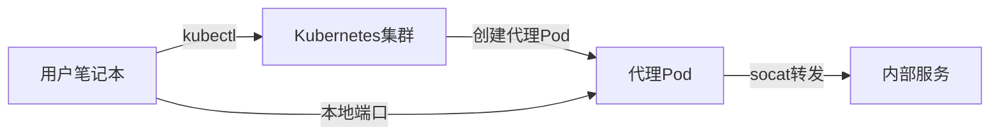

Вам когда-нибудь требовался временный доступ к сервису во внутренней сети вашей компании, но вы не могли найти подходящий инструмент? Особенно когда VPN недоступна из-за ограничений безопасности или вам нужно подключиться к определенному сервису только на короткий промежуток времени? В этой статье мы представим решение на базе Kubernetes и Fish Shell, которое позволит вам безопасно и легко получить доступ к сервисам интрасети через кластерный прокси K8s.

<! --подробнее-->

## История проблемы

В современных корпоративных ИТ-архитектурах внутренние службы обычно располагаются в защищенной и изолированной сетевой среде и не могут быть доступны напрямую извне. Вот несколько распространенных способов доступа к службам интрасети:

1. **VPN-соединение**: традиционное решение, но часто требует сложной установки и настройки, что может быть ограничено в корпоративной среде из-за политик безопасности.
2. **Фортресс**: требует дополнительного обслуживания инфраструктуры
3. **SSH-туннель**: громоздкий в настройке и непростой в управлении
4. **Частный шлюз**: высокая стоимость и сложность развертывания

Если в вашей компании уже развернут кластер Kubernetes, мы можем использовать его в качестве "моста" для доступа к интрасети, чтобы обеспечить простой и эффективный доступ к интранет-сервисам.

## Элегантное решение: k8s_proxy

Поскольку кластеры Kubernetes часто подключены как к внешним, так и к внутренним сетям, мы можем создать временный pod в качестве прокси и использовать команду __PROTECTED_INLINE_CODE__5__ для сопоставления внутренних сервисов с локальными портами. Чтобы упростить этот процесс, мы разработали функцию Fish Shell `k8s_proxy`.

Поскольку кластеры Kubernetes часто подключены как к внешним, так и к внутренним сетям, мы можем создать временный Pod в качестве прокси и сопоставить внутренние сервисы с локальными портами с помощью команды `kubectl port-forward`. Чтобы упростить этот процесс, мы разработали функцию Fish Shell `k8s_proxy`.

### Архитектура решения



### Реализация кода

Это полная реализация функции Fish Shell:

```fish
function k8s_proxy
    # 设置默认值
    set -l env ""
    set -l ip ""
    set -l local_port 5433   # 本地端口默认为5433
    set -l remote_port 5432  # 远程端口默认为5432
    set -l service_name "service" # 服务名称默认值

    # 用户可以指定参数
    if test (count $argv) -ge 2
        set env $argv[1]
        set ip $argv[2]
        
        # 如果提供了第三个参数，设置为本地端口
        if test (count $argv) -ge 3
            set local_port $argv[3]
        end
        
        # 如果提供了第四个参数，设置为远程端口
        if test (count $argv) -ge 4
            set remote_port $argv[4]
        end

        # 如果提供了第五个参数，设置为服务名称
        if test (count $argv) -ge 5
            set service_name $argv[5]
        end
        
        echo "目标环境: $env"
        echo "目标IP: $ip"
        echo "本地端口: $local_port"
        echo "远程服务端口: $remote_port"
        echo "服务名称: $service_name"
    else
        echo "用法: k8s_proxy <环境> <IP> [本地端口=5433] [远程端口=5432] [服务名称=service]"
        return 1
    end

    echo "创建临时代理Pod..."

    # 创建临时YAML文件
    set -l tmp_yaml (mktemp)
    echo "apiVersion: v1
kind: Pod
metadata:
  name: socat-proxy
  labels:
    app: temp-$service_name-proxy
spec:
  containers:
  - name: socat
    image: alpine:latest
    command:
    - sh
    - -c
    - |
      apk add --no-cache socat
      socat TCP-LISTEN:5432,fork TCP:$ip:$remote_port &
      sleep infinity
    ports:
    - containerPort: 5432" >$tmp_yaml

    # 我们不再需要切换全局context，而是在每个命令中指定context
    # 这使脚本在多tmux窗口环境中更可靠
    set -l k8s_context your-cluster-$env

    # 应用YAML创建Pod，显式指定context
    kubectl --context=$k8s_context apply -f $tmp_yaml >/dev/null

    # 删除临时YAML文件
    rm $tmp_yaml

    # 等待Pod就绪，显式指定context
    echo "等待代理Pod就绪..."
    kubectl --context=$k8s_context wait --for=condition=Ready pod/socat-proxy --timeout=60s >/dev/null

    if test $status -ne 0
        echo "错误: Pod未能在规定时间内就绪"
        kubectl --context=$k8s_context delete pod socat-proxy >/dev/null 2>&1
        return 1
    end

    echo "代理就绪！现在可以通过localhost:$local_port连接到服务"
    echo "连接信息："
    echo "  主机: localhost"
    echo "  端口: $local_port"
    echo "  远程服务: $ip:$remote_port"
    echo ""
    echo "按Ctrl+C终止代理并清理资源"

    # 启动端口转发，显式指定context
    kubectl --context=$k8s_context port-forward pod/socat-proxy $local_port:5432

    # 清理函数
    function cleanup
        echo ""
        echo "清理资源..."
        kubectl --context=$k8s_context delete pod socat-proxy >/dev/null 2>&1
        echo "代理已关闭，资源已清理"
        return 0
    end

    # 如果port-forward正常退出，清理资源
    cleanup

    # 不再需要切换回原始context，因为我们没有改变全局context
end
```

## Как использовать

### Быстрый старт

Допустим, вы разработчик и вам нужен временный доступ к службе интрасети в тестовой среде. Вот шаги по его использованию:

1. Сохраните приведенную выше функцию в файле __PROTECTED_INLINE_CODE__9__.
2. Перезагрузите функцию в Fish Shell: `source ~/.config/fish/functions/k8s_proxy.fish`.
3. Подключитесь к сервису с помощью команды: __PROTECTED_INLINE_CODE__11__.

Эта команда выполнит:
- `dev` среда для создания прокси Под
- Подключитесь к сервису с IP `10.0.0.15`.
- Сопоставьте удаленный `8080` порт с локальным `8080` портом.
- Используйте `api-service` в качестве имени идентификатора службы

После установления соединения вы можете получить доступ к службе интрасети через `localhost:8080`!

### Примеры использования в различных сценариях

1. **Подключение к базе данных**:
   ```fish
   k8s_proxy prod 10.0.0.100 5433 5432 postgres
   ```.

2. **Доступ к внутреннему API**:
   ```fish
   k8s_proxy dev 10.0.0.50 3000 3000 api
   ```

3. **Подключение к Redis**:
   ```fish
   k8s_proxy test 10.0.0.200 6379 6379 redis
   ```.

## Устойчивость в многотерминальной среде

В корпоративных средах разработчики часто используют tmux или аналогичные инструменты для управления несколькими терминальными сессиями одновременно. Это, как правило, приводит к проблеме: когда вы запускаете агента в одном окне и переключаете контекст kubectl в другом окне, это может повлиять на подключение агента.

Это происходит потому, что контекст kubectl является глобально общим и хранится в файле `~/.kube/config`. Изменения в одном терминале влияют на все терминалы.

Наше решение: вместо того чтобы изменять глобальный контекст, явно указывайте параметр `--context` в каждой команде kubectl. Таким образом, прокси-соединения будут работать даже при переключении контекста в других окнах.

## Соображения безопасности

Использование Kubernetes в качестве прокси для доступа к внутренним сервисам обеспечивает удобство, но вы также должны знать о связанных с этим рисках безопасности и мерах предосторожности:

### Потенциальные риски
- Если у пользователя есть разрешение на создание подкластера, он теоретически может получить доступ к любой службе в сети, где расположен кластер.
- Прокси-соединения может быть нелегко контролировать и аудировать
- Прокси-соединения может быть нелегко аудировать и контролировать Прокси-подсистемы могут быть использованы для создания большого количества прокси-подсистем.

### Лучшие практики безопасности
1. **Введите строгую политику RBAC**:
   - Ограничьте круг пользователей, которые могут создавать подсистемы и выполнять проброс портов.
   - Ограничьте пространства имен, которые могут быть использованы.
   - Запретите создание контейнеров с привилегиями.

2. **Включите ведение журнала аудита**:
   - Вести журнал всех операций по созданию подсистем и переадресации портов.
   - Интегрируйте ведение журнала в систему мониторинга безопасности

3. **Временное использование**:
   - Убедитесь, что прокси-соединения используются на временной основе и закрываются по их истечении.
   - Прокси-подсистемы не должны работать в течение длительных периодов времени

4. **Сетевая политика**:
   - Используйте сетевые политики Kubernetes для ограничения доступа к сети для бодов.

В корпоративных средах это решение часто сочетается с Azure AD или другими системами аутентификации, интегрированными с Kubernetes RBAC, чтобы гарантировать, что пользователи могут получить доступ только к тем ресурсам, на которые они имеют право, обеспечивая дополнительный уровень безопасности.

## Почему стоит выбрать Fish Shell?

Вы, наверное, заметили, что для этой функциональности мы выбрали Fish Shell, а не более распространенный Bash. Этому есть причина:

1. **Более дружелюбный синтаксис**: синтаксис Fish более последовательный и интуитивно понятный, что позволяет избежать распространенных подводных камней Bash.
2. **Встроенное автодополнение**: мощное автодополнение без дополнительных настроек.
3. **Цветовые подсказки**: по умолчанию обеспечивает легко читаемый цветной вывод для повышения удобства работы пользователя.
4. **Удобная работа с переменными**: синтаксис команды `set` намного понятнее, чем назначение переменных в Bash.
5. **Встроенная поддержка списков**: встроенная поддержка списочных структур данных упрощает работу с параметрами.

Если вы еще не пробовали Fish Shell, это отличное место для начала. Он сохраняет мощь оболочки, обеспечивая при этом более современный пользовательский опыт.

## Резюме

Объединив Kubernetes и Fish Shell, мы создали простой, но мощный инструмент для безопасного доступа к службам интрасети. Это решение особенно подходит для следующих сценариев:

- Временный доступ к внутренним сервисам для отладки или запроса данных
- Работа в средах, где VPN недоступны
- Необходимо быстро и легко подключаться к службам в различных средах
- Желание избежать сложной настройки и установки дополнительного программного обеспечения

По сравнению с традиционными методами это прокси-решение на базе k8s обладает такими преимуществами, как отсутствие интрузивности, готовность к использованию и использование существующей инфраструктуры, что делает его достойным рассмотрения для внедрения командами разработчиков и операторов предприятий.

---

Что вы думаете об этом решении? Есть ли другие способы доступа к службам интрасети, о которых стоит рассказать? Не стесняйтесь оставлять сообщения в разделе комментариев, чтобы обсудить их!

**Примечание**: Убедитесь, что вы понимаете политику безопасности вашей организации и получите соответствующую авторизацию перед использованием.
