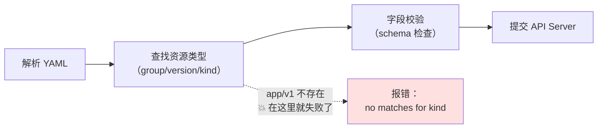
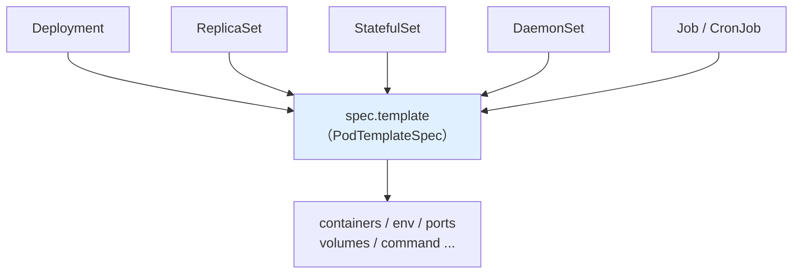
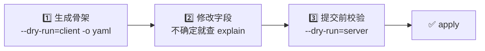

`apps` 还是 `app`？`replicas` 还是 `replica`？`env` 为什么不是 `envs`？写 Kubernetes YAML 时，这些单词就像地雷一样埋在手指底下。这篇文章告诉你：与其背单词，不如记住「两个工具、两种角色」——让 kubectl 自己告诉你正确答案。

<!--more-->

## 一条把人带偏的报错

事情从一份手写的 ReplicaSet 配置开始。文件看起来平平无奇：

```yaml
apiVersion: app/v1
kind: ReplicaSet
metadata:
  name: web-rs
  labels:
    app: myapp
spec:
  templace:
    metadata:
      labels:
        app: myapp
    spec:
      containers:
      - name: web-container
        image: nginx
  replica: 3
  selector:
    matchLabels:
      app: myapp
```

执行创建命令，得到这样一条报错：

```
error: resource mapping not found for name: "web-rs" namespace: "" from "rs.yaml":
no matches for kind "ReplicaSet" in version "app/v1"
ensure CRDs are installed first
```

「ensure CRDs are installed first」——确保先安装 CRD？一个刚接触 K8s 的人看到这句话，很可能真的跑去搜「ReplicaSet CRD 怎么安装」，然后越查越迷糊：ReplicaSet 明明是内置资源，哪来的 CRD？

真相是：这份 YAML 里藏着三个拼写错误，而报错信息一个都没有直说。

## 三个错误，为什么只报了一个？

这份 YAML 的三个错分别是：

1. `apiVersion: app/v1` → 应为 `apps/v1`（少了个 s）
2. `templace:` → 应为 `template`（手滑打错）
3. `replica: 3` → 应为 `replicas: 3`（少了个 s）

但 kubectl 只报了第一个，而且报得很含糊。这不是巧合，而是校验管道（validation pipeline）的顺序决定的：



`app/v1` 这个 API 组（group）不存在，第二步就直接失败了，后面的字段校验根本没跑到。所以 `templace` 和 `replica` 这两个错被完全掩盖。

那句误导性的「ensure CRDs are installed first」也有它的道理：自定义资源（CRD，用户自行扩展的资源类型）本来就可以定义任意的组名，kubectl 遇到一个不认识的 `app/v1`，无法区分「你拼错了」和「这是个还没安装的扩展资源」，只能两头都提一嘴。可惜提示的重点放在了后者，把人带向了错误的方向。

顺带一提：如果只改好 `apps/v1` 这一处再重新执行，现代版本的 kubectl 会立刻把剩下两个错都揪出来——`unknown field "spec.templace"`、`unknown field "spec.replica"`，一目了然。所以遇到这类报错，改一个就重跑一次，不要指望一次报全。

## 为什么 K8s 的字段名这么「善变」？

修好这份 YAML 之后，一个自然的疑问是：这些字段到底有没有规律？能不能总结成「都加 s，除了个别特例」？

乍一看好像可以——`containers`、`volumes`、`ports` 都是复数。但马上就会撞上反例：`env` 明明可以写多个环境变量，为什么是单数？`command` 明明是个数组，为什么也是单数？

深入对比后会发现一个更准确的规律：

> **字段名描述的是「概念的数量」，不是「数据结构的类型」。**

用几个典型字段验证一下：

| 字段 | 数据结构 | 名字 | 语义解释 |
|------|---------|------|---------|
| `containers` | 数组 | 复数 | 多个容器，各自独立 |
| `ports` | 数组 | 复数 | 多个端口，各自独立 |
| `command` | 数组 | **单数** | 一条命令，只是被拆成了参数数组 |
| `env` | 数组 | **单数** | 一个「环境」整体，里面装着多个变量 |
| `labels` | 键值对 | 复数 | 多个标签 |
| `selector` | 对象 | 单数 | 一个选择器 |
| `template` | 对象 | 单数 | 一个 Pod 模板 |
| `replicas` | 整数！ | 复数 | 表示「副本们的数量」 |

看 `command` 这个例子最有说服力：`["nginx", "-g", "daemon off;"]` 在数据上是三个元素，但在概念上就是**一条**命令——所以是单数。`env` 同理：environment 在这里是集合名词，指「这个容器的环境」这一个整体。它们不是不讲理的特例，恰恰是这条规律最讲理的证明。

至于 `apps/v1` 的 `apps`——它不属于单复数语法问题，而是 API 组的专有名字，就叫 `apps`（还有 `batch`、`networking.k8s.io` 等等），这个只能记。好在常用的组屈指可数。

## 与其背单词，不如「两个工具、两种角色」

规律归规律，实战中真正可靠的做法是：**不要凭记忆手写 YAML**。kubectl 自带了两个能力，分别扮演两种角色：

### 角色一：模板生成器——`--dry-run=client -o yaml`

需要一份新配置时，让 kubectl 直接生成骨架（`--dry-run=client` 表示只在本地模拟、不真的创建）：

```bash
# 生成一个标准 Deployment 骨架
kubectl create deployment demo --image=nginx --dry-run=client -o yaml

# 生成 Service 同理
kubectl expose deployment demo --port=80 --dry-run=client -o yaml
```

输出的 YAML 里，`apiVersion`、字段拼写、缩进结构全部保证正确，你只需要在上面修改。拼写错误从源头就被消灭了——你根本没有机会打出 `templace`。

这个方法还有一个隐藏的杠杆：**Pod 模板（`spec.template`）是整个工作负载体系的公共核心**。



`kubectl create` 的生成器只覆盖常用资源（deployment、job、cronjob、configmap、secret 等），像 StatefulSet、DaemonSet 就没有对应命令。但没关系——它们的 `spec.template` 部分和 Deployment 完全同构，生成一份 Deployment 骨架，改掉 `kind`，再补上少数差异字段（比如 StatefulSet 的 `serviceName`）就可以了。熟悉一个 Deployment，等于覆盖了六种工作负载的大部分字段。

### 角色二：字典——`kubectl explain`

改配置的过程中，忘了某个字段叫什么、是什么类型，不用打开浏览器搜文档，直接查：

```bash
# 逐层往下查
kubectl explain deployment.spec
kubectl explain deployment.spec.template.spec.containers

# 一次吐出完整字段树，配合搜索使用
kubectl explain deployment --recursive | grep -i port
```

`explain` 的数据直接来自集群的 API Server，版本和你的集群完全一致——比搜索引擎搜到的过时文档可靠得多。

### 最后一道防线：`--dry-run=server`

改完之后、正式提交之前，让服务端做一次完整校验：

```bash
kubectl apply -f my-app.yaml --dry-run=server
```

`server` 模式会把 YAML 发给 API Server 走一遍真实的校验流程（但不真正创建），未知字段、类型错误都会被抓出来，还常常附带拼写建议。

## 总结：一套完整的工作流

把上面的内容串起来，就是一套不依赖记忆力的 YAML 工作流：



1. **生成**：`kubectl create ... --dry-run=client -o yaml`，拿到拼写正确的模板
2. **查询**：`kubectl explain <资源>.<路径>`，随手查字段名和类型
3. **校验**：`--dry-run=server`，提交前抓住手改引入的错误

而那条「语义命名」的规律——字段名跟着概念走，不跟数据结构走——留给你在读别人的 YAML 时用：看到 `command` 是单数，你知道那是「一条命令」；看到 `containers` 是复数，你知道那里可以塞多个容器。理解了命名背后的逻辑，字段名就从需要死记的单词，变成了能读懂的语言。

下次再遇到「no matches for kind ... ensure CRDs are installed first」这样的报错，先别急着查 CRD——检查一下 `apiVersion` 的拼写，往往三秒钟就破案了。

---

留一个小练习：用 `kubectl explain pod.spec --recursive` 浏览一遍 Pod 的完整字段树，找找看除了 `env` 和 `command`，还有没有其他「数组但单数」的字段？它们的命名是否也符合「概念数量」这条规律？
