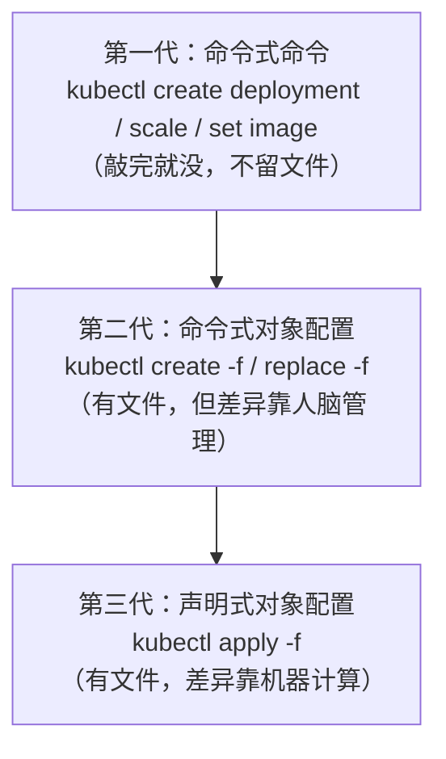
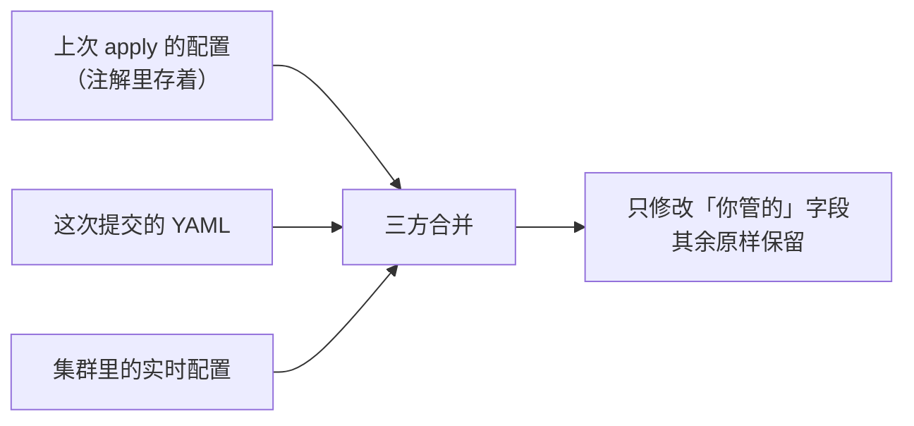

`kubectl create`、`apply`、`replace` 看起来都能「把 YAML 变成集群里的资源」，为什么人人都说「只用 apply 就对了」？这篇文章讲清三个命令的分工，更重要的是——把几条**连官方文档都专门发出警告**的弯路提前铺在你面前，免得你亲自去踩。

<!--more-->

## 三个命令，其实是三代管理方式

Kubernetes 官方把对象管理分成三代，正好对应这三个命令的定位：



- **`create`**：只创建。资源已存在就报错，它不关心「现状」，只看「有没有」
- **`replace`**：全量替换。资源必须已存在，用你的 YAML 整个换掉现有配置
- **`apply`**：创建或增量更新。把你的 YAML 当作「期望状态」，不存在就创建，存在就只改差异

日常结论确实是「用 apply」。但**为什么**推荐 apply、以及 apply 自己也有的坑，才是这篇文章的重点。

## apply 靠什么找到目标资源？

一个常见疑问：apply 更新时，怎么知道集群里哪个资源是「同一个」？要所有字段都匹配吗？

不需要。资源的身份证是四元组：**API 组 + kind + namespace + name**。apply 拿这四样去集群里查——查到了就更新，查不到就创建。其余字段跟身份无关，那是接下来「合并」阶段的事。

## apply 的核心机制：三方合并

第一次 `kubectl apply` 时，除了创建资源，kubectl 还会把你提交的完整配置存进资源的一个注解里：

```
kubectl.kubernetes.io/last-applied-configuration
```

之后每次 apply，它手里就有三份材料做对比：



合并规则可以浓缩成一句话：**谁写的字段归谁管**。

- 你 YAML 里写了的字段 → 按你的值更新
- 你从没写过、由控制器或别人设置的字段 → 原样保留
- **你上次写了、这次删掉的字段 → 被删除**

第三条是重点，下面细说。

## 坑一：「apply 没写的字段一律保留」——错一半

很多教程说「apply 只改你写的，没写的不动」。这句话**只对了一半**，官方文档的示例恰好同时演示了两面：

一个 Deployment 先被 `kubectl apply` 创建（YAML 里含 `minReadySeconds: 5`），之后有人用 `kubectl scale` 把副本数改成了 2。现在你把 YAML 里的 `minReadySeconds` 删掉、再 apply 一次，结果是：

- `replicas: 2` **被保留**——官方原文：*"retains the value... because it is omitted from the configuration file"*。它是 `scale` 命令设置的，你的 YAML 从来没管过它
- `minReadySeconds` **被清除**——官方原文：*"has been cleared"*。它上次在你的 YAML 里，这次不在了，apply 认为你**主动删除**了它

所以准确的说法是：**apply 保留的是「别人设置的」字段，不是「你没写的」字段。** 你曾经 apply 过的字段，从 YAML 里删掉就等于下达删除指令。想「暂时不管某个字段」而把它从 YAML 里注释掉——这不是「不管」，是「删除」。

由此还能推出一条纪律：**用了 apply，就不要再用 `kubectl edit` 手改同一个资源**。你手改的字段如果恰好在 YAML 的管辖范围内，下次 apply 会把它悄悄改回去。

## 坑二：replace 会丢字段——官方警告原文

`replace` 的底层是 HTTP PUT：用你的 YAML **整个替换**现有对象的可写部分。这不只是替换 `spec`——`metadata.labels`、`annotations` 这些你没写的也一并没了。官方文档为此专门挂了一条警告：

> "Updating objects with the replace command **drops all parts of the spec not specified** in the configuration file. This should not be used with objects whose specs are partially managed by the cluster, such as Services..."

翻译成人话：**你的 YAML 少写一个字段，集群里那个字段就没了**。最典型的受害者是 Service——它的 `clusterIP`（还有 LoadBalancer 的 `externalIPs`）是集群分配管理的，而 `clusterIP` 又是不可变字段（官方：*"This field may not be changed through updates"*）。用一份没写 `clusterIP` 的 YAML 去 replace 一个 Service，等着你的就是 `field is immutable` 报错。想用 replace，必须先把这些系统管理的字段抄进你的文件——这份麻烦本身就是官方劝你改用 apply 的理由。

顺带澄清一个衍生误解：有人担心 replace/apply 时漏写容器的 `ports` 会导致「端口不通」。不会——官方对 `containerPort` 的说明是 *"Not specifying a port here **DOES NOT prevent** that port from being exposed"*，容器里监听 `0.0.0.0` 的端口本来就可达。这个字段主要是声明性的，真正依赖它的只有命名端口（Service 的 `targetPort` 按名字引用）和 `hostPort` 等少数场景。

## 坑三：以为 replace 是「删了重建」

replace 常被描述成「搬家：旧的全走、新的全进」。不准确——普通 replace **不删除对象**：UID 不变、创建时间不变，只是配置内容被整体换掉，像「房子不动、家具全换」。

真正的「搬家」是它的暴力变体：

```bash
kubectl replace --force -f app.yaml   # 先 delete 再 create
```

`--force` 会真的删除旧对象再新建：UID 变了、Service 的 ClusterIP 重新分配、关联的子资源级联删除。这两者的差别在生产环境是事故级的，别混用。

## 坑四：`create --save-config` 不是「存在即更新」

有种流传的说法：给 create 加 `--save-config` 就能让它像 apply 一样幂等。看官方对这个参数的说明：

> "the configuration of current object will be **saved in its annotation**... useful when you want to perform kubectl apply on this object **in the future**."

它做的唯一一件事是补写 `last-applied` 注解，**让这个资源将来可以平滑切换到 apply 管理**。create 本身遇到已存在的资源，加不加这个参数都照样报错。

## 速查表

| 场景 | 命令 | 注意 |
|------|------|------|
| 日常创建 + 更新（推荐默认）| `kubectl apply -f` | 删字段 = 从 YAML 移除后 apply |
| 一次性命令行快速创建 | `kubectl create deployment ...` | 已存在会报错；后续想转 apply 加 `--save-config` |
| 明确要全量覆盖 | `kubectl replace -f` | YAML 必须完整，系统管理字段要抄进来 |
| 删了重建（UID 会变）| `kubectl replace --force -f` | 服务中断，慎用 |
| 手改线上资源 | `kubectl edit` | 和 apply 混用会被下次 apply 覆盖 |

## 尾声：这段历史还有下一章

`last-applied` 注解方案有先天局限：差异计算在**客户端**完成，多个人（或多个控制器）同时管理同一资源时，互相看不见对方的「管辖范围」，容易互相覆盖。

Kubernetes 1.22 起正式可用的 **Server-Side Apply** 把合并搬到了服务端：每个字段由 `managedFields` 记录「归谁管」，两个管理者抢同一个字段时会**显式报冲突**而不是静默覆盖。使用方式只是多一个参数：

```bash
kubectl apply --server-side -f app.yaml
```

三代命令的演化，本质是同一个问题的三次回答：**「配置的差异由谁来记？」**——第一代记在人脑里，第二代记在文件里但靠人比对，第三代记在注解里由客户端计算，下一章记在字段所有权里由服务端仲裁。理解了这条线，三个命令什么时候用哪个，就不再需要死记了。

---

留一个动手练习：在测试集群里 apply 一个带 `minReadySeconds` 的 Deployment，用 `kubectl scale` 改副本数，然后从 YAML 里删掉 `minReadySeconds` 再 apply 一次——观察哪个字段留下了、哪个字段消失了，和「谁写的字段归谁管」这条规则对得上吗？
