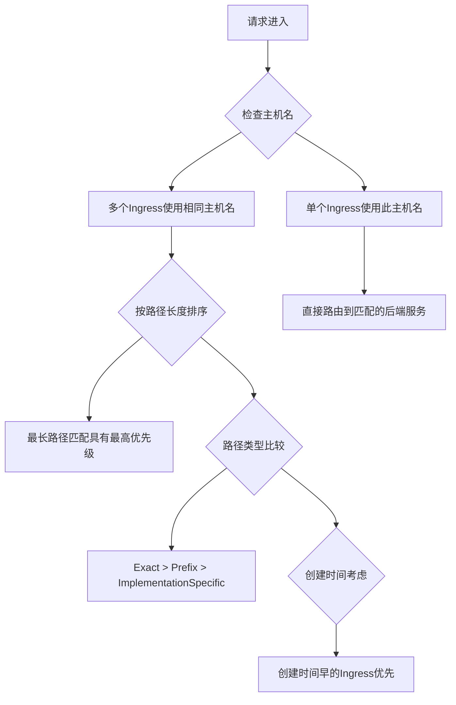

你是否曾经遇到过这样的情况：Kubernetes 服务通过 Service 能正常访问，但经过 Ingress 就返回 404？或者一切配置看起来都正确，但请求就是无法到达目标服务？本文将分享一个常见但很容易被忽略的 Kubernetes Ingress 配置问题及其解决方案。

<!--more-->

## 一个神秘的 404 问题

最近我们在 Azure AKS 环境中遇到了一个令人困惑的问题：我们有一个服务部署在 Kubernetes 集群上，通过标准的 Pod-Service-Ingress-AppGW 架构对外提供服务。

初始状态下，我们以为只有默认地址会返回 404，但实际情况是 Ingress 层的所有请求都返回 404，即使是在其他环境中工作正常的请求也是如此。奇怪的是，当我们直接通过 Service 访问时，一切正常工作。

## 排查过程

我们开始了系统性的排查过程：

1. 首先确认 Pod 状态正常，且能够处理请求
2. 验证 Service 能够正确路由流量到 Pod (通过在 Pod 内部测试)
3. 检查 Ingress 配置是否正确
4. 尝试修改 Ingress 路径规则和重写规则
5. 查看 Nginx 控制器日志和应用日志

最后，我们发现了问题的根本原因：**集群中存在多个 Ingress 资源使用了相同的主机名（hostname）**。其中一个未使用且配置不完善的 Ingress（缺少正确的证书配置等）与我们的主要 Ingress 发生了冲突，导致 Azure Application Gateway 可能将请求路由到了错误的后端。

## Kubernetes Ingress 路由优先级规则

当多个 Ingress 对象共享同一个主机名时，Kubernetes 会按照一系列规则决定哪个 Ingress 处理特定请求。这些规则可能因不同的 Ingress 控制器而略有差异：



### 一般优先级规则

1. **最长路径匹配原则**
   - 更具体/更长的路径比通用/更短的路径优先级高
   - 例如：`/foo/bar` 比 `/foo` 优先级高

2. **路径类型优先级**
   - `Exact` > `Prefix` > `ImplementationSpecific`
   - 精确匹配优先于前缀匹配

3. **创建时间**
   - 在所有其他条件相同的情况下，较早创建的 Ingress 通常优先级更高

### Nginx Ingress Controller 的特定规则

Nginx Ingress Controller（在 AKS 中通常是 nginx-internal 类型）有更复杂的规则：

1. **注解自定义优先级**
   - 可以使用 `nginx.ingress.kubernetes.io/configuration-snippet` 注解设置自定义优先级
   - 使用 `nginx.ingress.kubernetes.io/canary` 相关注解设置金丝雀规则和权重

2. **路径匹配算法**
   - Nginx 使用从最具体到最不具体的规则排序：
     - 精确字符串匹配
     - 前缀匹配，按路径段长度排序（较长的优先）
     - 正则表达式匹配（按定义顺序）

### Azure Application Gateway 的特殊考虑

当 Azure AKS 使用 Application Gateway 作为 Ingress 时，优先级规则还受到额外因素影响：

1. **URL 路径映射优先级**
   - Application Gateway 的路径规则按创建顺序考虑
   - 同一个监听器上的多个路径规则按照定义顺序处理

2. **证书绑定**
   - 具有有效证书绑定的侦听器通常获得更高优先级

这种情况下可能会看到类似这样的错误：`The Common Name of the leaf certificate presented by the backend server does not match the Probe or Backend Setting hostname of the application gateway`，表明 Application Gateway 尝试连接到了错误的后端。

## 如何检测和解决 Ingress 冲突

### 快速检测同主机名的 Ingress

使用以下命令可以快速查找集群中所有使用特定主机名的 Ingress：

```bash
kubectl get ingress --all-namespaces -o json | jq '.items[] | select(.spec.rules[].host=="your-hostname.example.com") | .metadata.name + " in namespace " + .metadata.namespace'
```

这条命令会列出所有使用指定主机名的 Ingress 资源及其所在的命名空间。

### 解决冲突的最佳实践

1. **每个主机名只使用一个 Ingress**
   - 最简单可靠的方法是确保每个主机名只由一个 Ingress 资源使用
   - 如果必须共享主机名，确保路径规则不重叠

2. **明确的命名策略**
   - 为每个 Ingress 使用描述性名称，清楚表明它的用途和目标服务
   - 例如：`api-public-ingress`、`frontend-internal-ingress`

3. **使用标签和命名空间隔离**
   - 通过命名空间和标签隔离不同的 Ingress 资源
   - 定期审查和清理不再使用的 Ingress 资源

4. **监控和日志记录**
   - 监控 Ingress 控制器日志以识别路由冲突
   - 在 Azure 环境中定期检查 Application Gateway 的诊断日志

## 问题解决

在我们的案例中，解决方案简单而有效：删除了那个未使用且配置不完善的共享同一主机名的 Ingress 资源后，所有请求立即开始正常工作。

这个经验教训提醒我们：**在 Kubernetes 中进行故障排除时，不仅要检查直接相关的资源，还要注意可能存在的资源冲突，特别是像 Ingress 这样的路由资源。**

## 总结和建议

Kubernetes Ingress 是连接外部世界和集群内服务的桥梁，正确配置它对于应用的可用性至关重要。当遇到 Ingress 相关问题时：

1. **检查完整路径**：从用户请求到 Pod 响应的完整路径，逐层排查
2. **验证资源配置**：确认所有配置（路径、重写规则、TLS 证书等）正确无误
3. **排查资源冲突**：特别是多个 Ingress 使用相同主机名的情况
4. **利用日志和监控**：Ingress 控制器和应用日志通常包含有价值的线索

希望这篇文章能帮助你在处理 Kubernetes Ingress 配置时避免类似的陷阱。在复杂的微服务架构中，有时最棘手的问题不是配置错误，而是意外的配置冲突。

**思考问题**：在你的 Kubernetes 环境中，是否存在多个 Ingress 资源共享同一主机名？如果有，可以尝试使用本文提供的命令进行检查，也许会发现一些潜在的路由问题。
