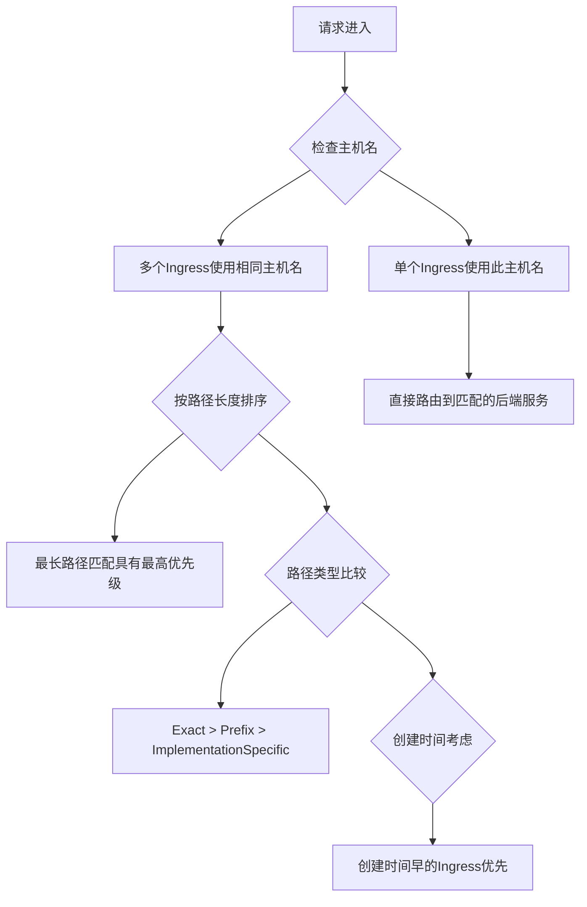

Сталкивались ли вы с ситуацией, когда к сервису Kubernetes можно получить доступ через Service, но после прохождения через Ingress он возвращает 404, или все вроде бы настроено правильно, но запрос просто не может достичь целевого сервиса? В этой статье мы расскажем о распространенной, но легко упускаемой из виду проблеме настройки Kubernetes Ingress и ее решении.

<!--more-->

## 一个神秘的 404 问题

Недавно мы столкнулись с запутанной проблемой в нашей среде Azure AKS: у нас есть служба, развернутая на кластере Kubernetes, которая обслуживается извне через стандартную архитектуру Pod-Service-Ingress-AppGW.

Изначально мы думали, что только адрес по умолчанию будет возвращать 404, но на самом деле все запросы на уровне Ingress возвращают 404, даже те, которые прекрасно работают в других средах. Как ни странно, когда мы обращаемся к нему напрямую через службу, все работает нормально.

## 排查过程

Мы начали планомерный процесс устранения:

1. Сначала убедитесь, что Pod находится в нормальном состоянии и может обрабатывать запросы.
2. убедитесь, что служба может правильно маршрутизировать трафик на Pod (путем тестирования внутри Pod).
3. проверьте, что Ingress настроен правильно.
4. Попробуйте изменить правила пути и правила перезаписи Ingress.
5. просмотрите журналы контроллера Nginx и журналы приложений.

В конце концов мы обнаружили основную причину проблемы: **В кластере было несколько ресурсов Ingress, использующих одно и то же имя хоста**. Один из неиспользуемых и плохо настроенных Ingress (без надлежащей конфигурации сертификата и т. д.) конфликтовал с нашим основным Ingress, заставляя Azure Application Gateway потенциально направлять запросы на неправильный бэкэнд.

## Kubernetes Ingress 路由优先级规则

Когда несколько объектов Ingress имеют одно и то же имя хоста, Kubernetes следует набору правил, чтобы определить, какой из Ingress обрабатывает конкретный запрос. Эти правила могут немного отличаться для разных контроллеров Ingress:



### 一般优先级规则

1. **Принцип подбора самого длинного пути**.
   - Более специфические/длинные пути имеют более высокий приоритет, чем общие/короткие.
   - Например, `/foo/bar` имеет более высокий приоритет, чем `/foo`.

2. **Приоритизация типов путей**.
   - `Точные` > `Префиксные` > `Специфические`
   - Точные совпадения имеют приоритет перед префиксными

3. **Время создания**.
   - При прочих равных условиях ингресс, созданный раньше, обычно имеет более высокий приоритет.

### Nginx Ingress Controller 的特定规则

Контроллер Nginx Ingress Controller (обычно в AKS он имеет тип nginx-internal) имеет более сложные правила:

1. **Аннотация для настройки приоритетов**.
   - Пользовательские приоритеты могут быть установлены с помощью аннотации `nginx.ingress.kubernetes.io/configuration-snippet`.
   - Правила и веса Canary можно задать с помощью аннотации `nginx.ingress.kubernetes.io/canary`.

2. **Алгоритм сопоставления путей**.
   - Nginx использует правила, отсортированные от наиболее специфичных к наименее специфичным:
     - Точное сопоставление строк
     - Сопоставление префиксов, отсортированное по длине сегмента пути (сначала длинные)
     - Сопоставление регулярных выражений (в порядке определения)

### Azure Application Gateway 的特殊考虑

На правила приоритета также влияют дополнительные факторы, когда Azure AKS использует Application Gateway в качестве входа:

1. **Приоритет сопоставления путей URL**.
   - Правила пути шлюза приложений рассматриваются в порядке их создания
   - Несколько правил пути для одного и того же слушателя обрабатываются в том порядке, в котором они определены

2. **Привязка сертификата**.
   - Слушатели с действительными привязками сертификатов обычно имеют более высокий приоритет

В этом случае вы можете увидеть ошибку, подобную этой: `Общее имя листа сертификата, представленного внутренним сервером, не совпадает с именем хоста Probe или Backend Setting на шлюза приложения`, что указывает на то, что шлюз приложения пытается подключиться к неправильному бэкенду.

## 如何检测和解决 Ingress 冲突

### 快速检测同主机名的 Ingress

Используйте следующую команду, чтобы быстро найти все ингрессы в кластере, которые используют определенное имя хоста:

```bash
kubectl get ingress --all-namespaces -o json | jq '.items[] | select(.spec.rules[].host=="your-hostname.example.com") | .metadata.name + " in namespace " + .metadata.namespace'
```

Эта команда перечисляет все ресурсы Ingress, использующие указанное имя хоста, и пространство имен, в котором они находятся.

### 解决冲突的最佳实践

1. **На каждое имя хоста используется только один Ingress**.
   - Самый простой и надежный метод - обеспечить, чтобы каждое имя хоста использовалось только одним ресурсом Ingress.
   - Если имена хостов должны быть общими, убедитесь, что правила путей не пересекаются.

2. **Четкая стратегия именования**.
   - Используйте описательное имя для каждого ингресса, которое четко указывает на его назначение и целевой сервис.
   - Примеры: `api-public-ingress`, `frontend-internal-ingress`.

3. **Использование меток и разделение пространств имен**.
   - Изолируйте различные ресурсы Ingress с помощью пространств имен и меток
   - Регулярно просматривайте и очищайте ресурсы Ingress, которые больше не используются

4. **Мониторинг и ведение журналов**.
   - Контролируйте журналы контроллера входа для выявления конфликтов маршрутизации
   - Периодически проверяйте журналы диагностики шлюза приложений в среде Azure

## 问题解决

В нашем случае решение было простым и эффективным: после удаления неиспользуемого и плохо настроенного ресурса Ingress, использующего то же имя хоста, все запросы сразу же стали работать правильно.

Этот урок - напоминание о том, что **при устранении неполадок в Kubernetes важно не только проверять непосредственно связанные ресурсы, но и быть в курсе возможных конфликтов ресурсов, особенно с маршрутизируемыми ресурсами, такими как Ingress. **

## 总结和建议

Kubernetes Ingress - это мост между внешним миром и службами внутри кластера, и его правильная настройка очень важна для обеспечения доступности приложений. При возникновении проблем, связанных с Ingress:

1. **Проверьте полный путь**: полный путь от пользовательского запроса до ответа Pod, слой за слоем.
2. **Проверка конфигурации ресурсов**: убедитесь, что все конфигурации (пути, правила перезаписи, сертификаты TLS и т. д.) верны.
3. **Устранение конфликтов ресурсов**: особенно если несколько ингрессов используют одно и то же имя хоста.
4. **Используйте протоколирование и мониторинг**: журналы контроллера Ingress и приложений часто содержат ценные подсказки.

Надеемся, эта статья поможет вам избежать подобных ловушек при работе с конфигурациями Kubernetes Ingress. В сложных архитектурах микросервисов иногда самой сложной проблемой является не неправильная конфигурация, а неожиданные конфликты конфигураций.

**Вопрос для размышления**: есть ли в вашей среде Kubernetes несколько ресурсов Ingress, использующих одно и то же имя хоста? Если да, попробуйте проверить их с помощью команд, приведенных в этой статье, и, возможно, обнаружите потенциальные проблемы с маршрутизацией.