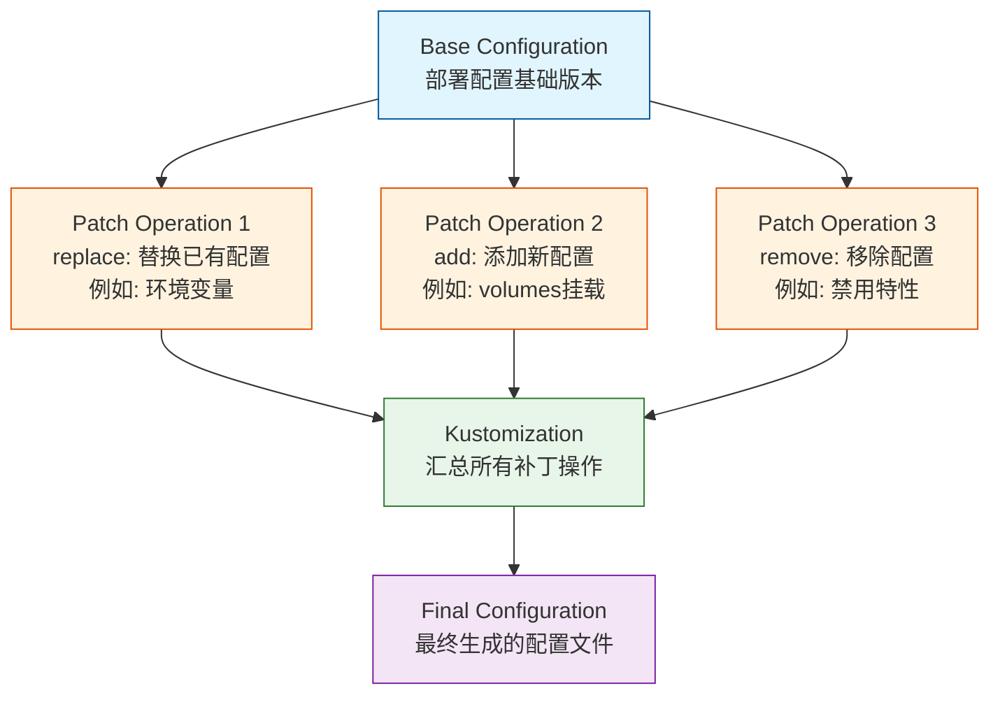

在管理 Kubernetes 配置时，我们经常需要针对不同环境调整配置内容。比如测试环境和生产环境可能需要不同的参数配置，或者某些特性只在特定环境启用。这时候，Kustomize 的补丁（patches）功能就派上用场了。

<!--more-->

## 什么是 Kustomize Patches

Kustomize 补丁是一种声明式的配置修改方式，它允许我们在不直接修改原始 YAML 文件的情况下，对 Kubernetes 资源进行定制化更改。这种方式特别适合管理多环境部署，因为它可以让我们保持基础配置的统一性，同时又能满足不同环境的特殊需求。

## Patches 的常用操作类型

让我们通过实际案例来理解 Kustomize 补丁的几种主要操作类型：

### 1. replace 操作：替换已有配置

`replace` 操作用于替换配置中已存在的值。这在更新环境特定的配置时特别有用，例如修改服务的 URL 或环境变量：

```yaml
patches:
  - target:
      kind: ConfigMap
      name: batch-configmap
    patch: |
      - op: replace
        path: /data/KEY_VAULT_URL
        value: https://example-keyvault.vault.azure.net/
```

在这个例子中，我们替换了配置映射中的 KEY_VAULT_URL 值。`replace` 操作要求目标路径必须已经存在，否则会报错。

### 2. add 操作：添加新配置

`add` 操作用于向资源中添加新的配置项。这在需要为特定环境添加额外功能时非常有用：

```yaml
patches:
  - target:
      kind: Deployment
      name: batch-processing
    patch: |
      - op: add
        path: /spec/template/spec/volumes
        value:
          - name: secrets-store-inline
            csi:
              driver: secrets-store.csi.k8s.io
              readOnly: true
```

这个例子展示了如何向 Deployment 中添加新的 volume 配置。`add` 操作可以在任何有效的 JSON 路径上添加新的元素。

### 3. remove 操作：移除配置

`remove` 操作用于删除不需要的配置项：

```yaml
patches:
  - target:
      kind: Deployment
      name: batch-processing
    patch: |
      - op: remove
        path: /spec/template/spec/volumes/0
```

这个操作会删除指定路径的配置项。使用 `remove` 时要确保目标路径存在，否则会报错。

## 补丁的高级用法

### 1. 条件性补丁

有时我们需要根据特定条件应用补丁。可以使用 target 的选择器来实现：

```yaml
patches:
  - target:
      kind: Deployment
      labelSelector: "environment=production"
    patch: |
      - op: add
        path: /spec/replicas
        value: 3
```

### 2. 数组操作

当操作数组元素时，可以使用特定的语法：

```yaml
patches:
  - target:
      kind: Deployment
      name: batch-processing
    patch: |
      - op: add
        path: /spec/template/spec/containers/0/env/-
        value:
          name: NEW_ENV
          value: "value"
```

这里的 `-` 表示在数组末尾添加元素。

## 最佳实践

在使用 Kustomize 补丁时，有一些重要的最佳实践需要注意：

1. **路径准确性**：确保 JSON 路径完全匹配目标位置，包括大小写。

2. **循序渐进**：当进行复杂的补丁操作时，建议分步进行，每一步都验证生成的配置是否符合预期：
   ```bash
   kubectl kustomize . | kubectl apply --dry-run=client -f -
   ```

3. **版本控制**：将不同环境的补丁文件放在各自的目录中，便于管理和追踪变更。

4. **文档化**：为重要的补丁操作添加注释，说明其用途和影响。

## 补丁操作的常见陷阱

1. **路径不存在**：使用 `replace` 或 `remove` 操作时，确保目标路径存在。

2. **数组索引**：操作数组时要注意索引值，错误的索引会导致操作失败。

3. **值类型**：确保添加或替换的值类型与目标位置匹配。例如，不能用字符串替换数字类型的值。

## 实战提示

在实际项目中，推荐以下工作流程：

1. 先创建基础配置文件（base）
2. 为每个环境创建单独的 kustomization 文件
3. 使用补丁来处理环境特定的变更
4. 在应用变更前，使用 `kubectl kustomize` 预览生成的配置

示例目录结构：
```
deployment/
├── base/
│   ├── deployment.yaml
│   └── kustomization.yaml
├── dev/
│   ├── kustomization-patch.yaml
└── prod/
    └── kustomization-patch.yaml
```

## 总结

Kustomize 的补丁功能为 Kubernetes 配置管理提供了强大而灵活的解决方案。通过恰当使用 `replace`、`add` 和 `remove` 等操作，我们可以有效管理不同环境的配置差异，同时保持基础配置的一致性。关键是要理解每种操作的适用场景，并遵循最佳实践，确保配置管理的可维护性和可靠性。

- 补丁操作流程的示意图


