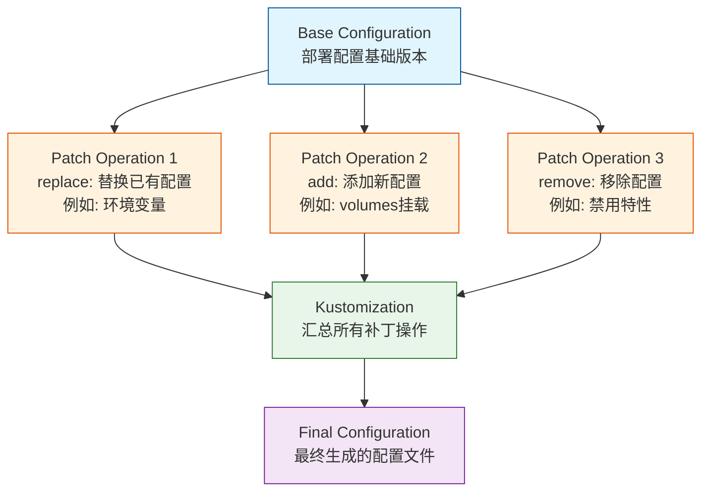

При управлении конфигурациями Kubernetes нам часто приходится настраивать конфигурацию для различных сред. Например, тестовая среда может требовать иных параметров, чем производственная, или определенные функции могут быть включены только в определенных средах. Именно здесь пригодится функция патчей Kustomize.

<!--more-->

## 什么是 Kustomize Patches

Патч Kustomize - это декларативный подход к изменению конфигурации, который позволяет вносить пользовательские изменения в ресурсы Kubernetes без непосредственной модификации исходного YAML-файла. Этот подход особенно хорошо подходит для управления развертываниями в нескольких средах, поскольку он позволяет нам сохранять единую базовую конфигурацию, удовлетворяя при этом специфические потребности различных сред.

## Patches 的常用操作类型

Давайте рассмотрим реальный пример, чтобы понять несколько основных типов операций с патчами Kustomize:

### 1. replace 操作：替换已有配置

Операция `replace` используется для замены значения, которое уже существует в конфигурации. Это особенно полезно при обновлении конфигураций, специфичных для среды, например при изменении URL-адресов служб или переменных окружения:

```yaml
patches:
  - target:
      kind: ConfigMap
      name: batch-configmap
    patch: |
      - op: replace
        path: /data/KEY_VAULT_URL
        value: https://example-keyvault.vault.azure.net/
```

В этом примере мы заменяем значение KEY_VAULT_URL в карте конфигурации. Операция `replace` требует, чтобы путь назначения уже существовал, иначе будет выдана ошибка.

### 2. add 操作：添加新配置

Операция `add` используется для добавления новых элементов конфигурации к ресурсу. Это полезно, когда необходимо добавить дополнительную функциональность в конкретную среду:

```yaml
patches:
  - target:
      kind: Deployment
      name: batch-processing
    patch: |
      - op: add
        path: /spec/template/spec/volumes
        value:
          - name: secrets-store-inline
            csi:
              driver: secrets-store.csi.k8s.io
              readOnly: true
```

В этом примере показано, как добавить новую конфигурацию тома в развертывание. Операция `add` добавляет новый элемент в любой правильный путь JSON.

### 3. remove 操作：移除配置

Операция `remove` используется для удаления ненужных элементов конфигурации:

```yaml
patches:
  - target:
      kind: Deployment
      name: batch-processing
    patch: |
      - op: remove
        path: /spec/template/spec/volumes/0
```

Это действие удаляет элемент конфигурации по указанному пути. При использовании `remove` убедитесь, что путь назначения существует, иначе будет выдано сообщение об ошибке.

## 补丁的高级用法

### 1. 条件性补丁

Иногда нам нужно применить исправления на основе определенных условий. Это можно сделать с помощью селектора целей:

```yaml
patches:
  - target:
      kind: Deployment
      labelSelector: "environment=production"
    patch: |
      - op: add
        path: /spec/replicas
        value: 3
```

### 2. 数组操作

При работе с элементами массива можно использовать особый синтаксис:

```yaml
patches:
  - target:
      kind: Deployment
      name: batch-processing
    patch: |
      - op: add
        path: /spec/template/spec/containers/0/env/-
        value:
          name: NEW_ENV
          value: "value"
```

Здесь `-` означает добавление элементов в конец массива.

## 最佳实践

При использовании патчей Kustomize следует помнить о некоторых важных правилах:

1. **Точность пути**: убедитесь, что путь в JSON точно соответствует целевому местоположению, включая регистр.

2. **循序渐进**：当进行复杂的补丁操作时，建议分步进行，每一步都验证生成的配置是否符合预期：
   ```bash
   kubectl kustomize . | kubectl apply --dry-run=client -f -
   ```

3. **Контроль версий**: разместите файлы патчей для разных сред в собственных каталогах для удобства управления и отслеживания изменений.

4. **Документация**: добавьте примечания к важным операциям патча, описывающие их использование и влияние.

## 补丁操作的常见陷阱

1. **Путь не существует**: убедитесь, что путь назначения существует при использовании операций `замены` или `удаления`.

2. **Индекс массива**: обращайте внимание на значение индекса при работе с массивами, неправильный индекс приведет к сбою операции.

3. **Тип значения**: убедитесь, что тип добавляемого или заменяемого значения соответствует целевому местоположению. Например, нельзя заменить значение типа numeric на строку.

## 实战提示

Для реальных проектов рекомендуется следующая схема работы:

1. сначала создайте базовый файл конфигурации
2. создайте отдельный файл кастомизации для каждого окружения
3. используйте патчи для обработки изменений, специфичных для конкретного окружения
4. используйте `kubectl kustomize` для предварительного просмотра сгенерированной конфигурации перед применением изменений

示例目录结构：
```
deployment/
├── base/
│   ├── deployment.yaml
│   └── kustomization.yaml
├── dev/
│   ├── kustomization-patch.yaml
└── prod/
    └── kustomization-patch.yaml
```

## 总结

Функция исправления Kustomize предоставляет мощное и гибкое решение для управления конфигурацией Kubernetes. Благодаря правильному использованию операций `замены`, `добавления` и `удаления` мы можем эффективно управлять различиями в конфигурации в разных средах, сохраняя при этом согласованность базовой конфигурации. Главное - понимать сценарии каждой операции и следовать лучшим практикам, чтобы управление конфигурацией было удобным и надежным.

- 补丁操作流程的示意图


