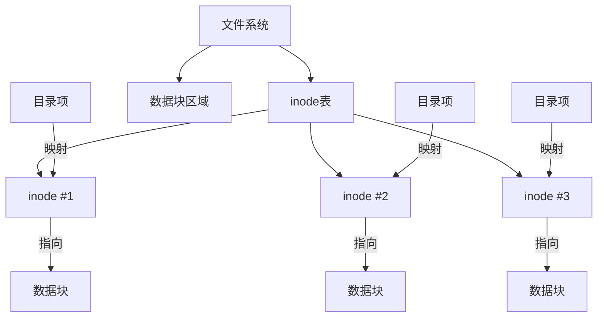
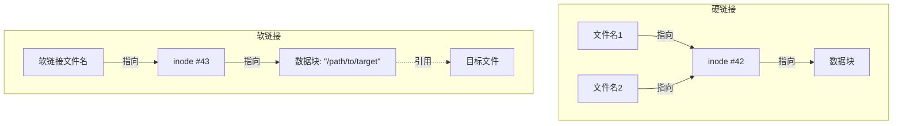

你是否曾经对Linux命令的行为感到困惑？比如为什么`unlink`命令不仅能删除链接文件，还能删除普通文件？为什么有些文件删除后，硬盘空间却没有立即释放？这些疑问都与文件系统的底层原理密切相关。本文将深入探讨Linux文件系统的核心概念，帮助你理解文件、目录、链接背后的运作机制。

<!--more-->

## 从一个困惑的`unlink`操作说起

在Linux/Unix系统中，我们通常使用`rm`命令删除文件。但还有一个较少使用的命令：`unlink`。从字面意思理解，它似乎只会"解除链接"，然而实际上它能删除普通文件，这常常让人感到意外。

以下是一个典型场景：

```bash
# 创建测试文件和目录
touch test
mkdir testfolder
cp test testfolder/

# 查看文件信息
stat testfolder/test
# 显示这是个常规文件，链接数为2

# 使用unlink删除
unlink testfolder/test

# 测试目录现在为空
ls testfolder/
```

为什么名为"unlink"的命令也能删除普通文件？要理解这一点，我们需要深入探讨文件系统的基本概念。

## 文件系统的核心概念：inode

### inode是什么？

可以将inode想象成文件系统中的"身份证"。每个文件在创建时都会被分配一个唯一的inode号，它存储了文件的几乎所有信息，**除了文件名**：

- 文件大小
- 所有者和权限信息
- 时间戳（访问、修改、更改时间）
- 指向实际数据块的指针
- 链接计数（有多少个文件名指向该inode）

值得注意的是，inode不存储文件名。文件名实际上存储在目录结构中。



### 目录是什么？

在Linux文件系统中，目录本身也是一个特殊的文件。目录的内容是一系列的映射关系，将文件名映射到对应的inode号。当我们访问一个文件时，系统会：

1. 在目录文件中查找该文件名
2. 获取对应的inode号
3. 通过inode号找到文件的元数据和数据块位置
4. 读取或写入文件内容

这就解释了为什么在Linux中，同一个文件可以有多个名称（硬链接），而且文件名和文件内容是分开存储的。

## 链接的秘密：硬链接与软链接

Linux提供了两种不同类型的链接机制：硬链接和软链接（符号链接）。它们看起来功能相似，但底层原理完全不同。

### 硬链接：共享inode的多个文件名

硬链接是指多个文件名指向同一个inode。当创建硬链接时，实际上是在目录中创建了一个新的文件名条目，指向现有的inode。

```bash
# 创建一个文件
echo "内容" > original.txt

# 创建硬链接
ln original.txt hardlink.txt

# 两个文件名指向同一个inode
ls -i original.txt hardlink.txt
```

硬链接的特点：

- 共享完全相同的inode号
- 修改任一链接的内容会影响所有硬链接
- inode的链接计数表示有多少个文件名指向它
- 只有当所有硬链接都被删除（链接计数为0）时，文件数据才会被释放
- 不能跨文件系统创建硬链接
- 不能为目录创建硬链接（除了`.`和`..`）

### 软链接：指针文件

软链接（符号链接）是一个特殊类型的文件，其内容是另一个文件的路径。它类似于Windows中的快捷方式。

```bash
# 创建软链接
ln -s original.txt symlink.txt

# 查看软链接的内容
readlink symlink.txt  # 显示 original.txt
```

软链接的特点：

- 有独立的inode，与目标文件不同
- 软链接的内容就是目标文件的路径
- 软链接的大小通常等于路径字符串的长度
- 当目标文件被删除时，软链接仍然存在，但变成"悬空链接"
- 可以跨文件系统创建
- 可以指向目录



## `unlink`命令的真相

现在我们可以理解`unlink`命令的工作原理了。`unlink`是一个底层系统调用的直接包装，它的工作是：

1. 从目录中移除一个文件名条目
2. 减少对应inode的链接计数
3. 如果链接计数变为0，则标记inode和数据块为可回收

所以无论是普通文件、硬链接还是软链接，`unlink`都只是执行同一个操作：删除文件名与inode的关联。这就是为什么`unlink`可以删除任何类型的文件，而不仅仅是链接文件。

```bash
# 查看文件的链接数
stat test
# 如果Links显示为1，unlink后文件数据会被释放
# 如果Links大于1，unlink后文件数据仍然存在，只是少了一个访问路径
```

## `rm`与`unlink`的区别

`rm`命令实际上也是调用`unlink()`系统调用，但它提供了更多功能：

- 可以一次删除多个文件
- 提供交互式确认（`-i`选项）
- 支持强制删除（`-f`选项）
- 支持递归删除目录（`-r`选项）
- 有更多安全检查

因此，日常使用中推荐使用`rm`而不是`unlink`，特别是处理重要文件时。

## 不同存储介质上的文件系统实现

文件系统的inode机制在不同存储介质上有不同的实现方式：

### 传统硬盘(HDD)

在传统机械硬盘上，inode间接关联到物理存储位置：
- inode存储了指向数据块的逻辑指针
- 文件系统驱动将这些逻辑块转换为物理柱面/扇区位置
- 查找文件时需要物理寻道，这是HDD性能瓶颈之一

### 固态硬盘(SSD)

SSD上的文件系统虽然在逻辑结构上保持了inode系统，但底层实现大不相同：
- SSD通过闪存转换层(FTL)将逻辑块地址映射到物理NAND页
- 没有机械寻道，所以随机访问性能大幅提升
- 支持TRIM命令，当文件删除后，操作系统通知SSD这些块可被回收
- 内部磨损均衡机制会重新分配数据，避免单个存储单元过度写入

## 跨平台对比：Windows vs Linux

这些文件系统概念主要适用于Unix/Linux系统，Windows采用不同的文件系统结构：

- Windows NTFS使用主文件表(MFT)而非inode系统
- NTFS文件记录包含属性而非简单的数据块指针
- Windows支持硬链接和符号链接，但使用频率较低
- Windows通常使用回收站机制而非直接unlink文件
- 删除命令使用`del`而非`rm`或`unlink`

## 实用建议

了解文件系统的底层原理后，我们可以得出一些实用建议：

1. 日常使用中，优先选择`rm`而非`unlink`
2. 对重要文件操作，使用`rm -i`获得删除确认
3. 使用`stat`命令查看文件的链接数和其他元数据
4. 了解硬链接和软链接的区别，在适当场景选择合适的链接类型
5. 备份重要数据，尤其是在进行复杂的文件系统操作前

通过理解这些文件系统概念，你可以更安全、更有效地管理Linux系统的文件，避免意外数据丢失，并更好地理解各种文件操作命令的行为。

## 思考问题

当你删除一个正在被某个进程打开的文件时会发生什么？文件数据会立即被释放吗？试着运行一个程序，让它打开一个文件，然后在另一个终端删除该文件，观察系统的行为，看看你能否通过我们讨论的inode和链接知识解释这一现象。

<!-- 在此处添加文件系统结构图，展示inode、数据块和目录条目的关系 -->
