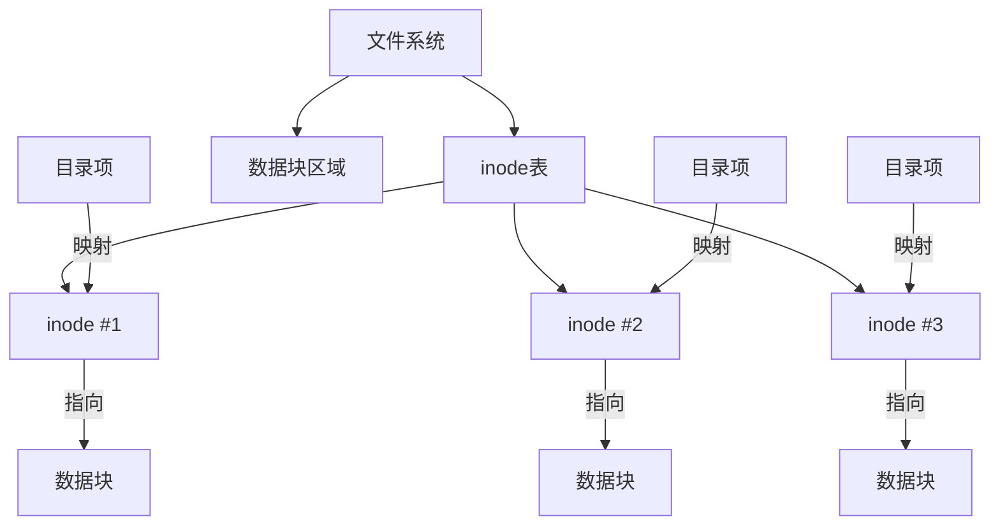
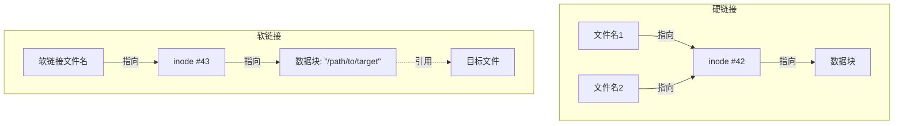

Вы когда-нибудь были озадачены поведением команд Linux? Например, почему команда `unlink` удаляет не только связанные, но и обычные файлы? Почему место на жестком диске не освобождается сразу после удаления некоторых файлов? Все эти вопросы тесно связаны с базовыми принципами работы файловой системы. В этой статье мы рассмотрим основные концепции файловой системы Linux, чтобы помочь вам понять механизмы, лежащие в основе файлов, каталогов и ссылок.

<!--more-->

## 从一个困惑的`unlink`操作说起

В системах Linux/Unix для удаления файлов мы обычно используем команду `rm`. Но есть еще одна команда, которая используется реже: `unlink`. Буквально, кажется, что она только `unlink`, но на самом деле она удаляет обычные файлы, что часто вызывает удивление.

Вот типичный сценарий:

```bash
# 创建测试文件和目录
touch test
mkdir testfolder
cp test testfolder/

# 查看文件信息
stat testfolder/test
# 显示这是个常规文件，链接数为2

# 使用unlink删除
unlink testfolder/test

# 测试目录现在为空
ls testfolder/
```

Почему команда "Разблокировать" удаляет и обычные файлы? Чтобы понять это, нам нужно углубиться в базовые понятия файловой системы.

## 文件系统的核心概念：inode

### inode是什么？

Инод можно считать "удостоверением личности" файловой системы. При создании каждому файлу присваивается уникальный номер inode, в котором хранится почти вся информация о файле, **за исключением имени файла**:

- Размер файла
- Информация о владельце и разрешениях
- Временные метки (время доступа, модификации, изменения)
- Указатель на фактический блок данных
- Количество ссылок (сколько имен файлов указывают на инод)

Стоит отметить, что inode не хранит имена файлов. Имена файлов хранятся в структуре каталогов.



### 目录是什么？

В файловой системе Linux каталог - это особый файл. Содержимое каталога - это серия отношений отображения, которые сопоставляют имена файлов с соответствующими номерами инодов. Когда мы обращаемся к файлу, система:

1. найдите имя файла в файле каталога
2. получите соответствующий номер инода
3. найти метаданные и расположение блока данных файла по номеру inode.
4. прочитать или записать содержимое файла

Это объясняет, почему в Linux один и тот же файл может иметь несколько имен (жестких ссылок), а имя файла хранится отдельно от его содержимого.

## 链接的秘密：硬链接与软链接

Linux предоставляет два различных типа механизмов связывания: жесткие ссылки и мягкие ссылки (символические ссылки). Функционально они кажутся похожими, но в основе лежат совершенно разные принципы.

### 硬链接：共享inode的多个文件名

Жесткие ссылки - это несколько имен файлов, указывающих на один и тот же inode. Когда создается жесткая ссылка, она фактически создает новую запись имени файла в каталоге, указывающую на существующий inode.

```bash
# 创建一个文件
echo "内容" > original.txt

# 创建硬链接
ln original.txt hardlink.txt

# 两个文件名指向同一个inode
ls -i original.txt hardlink.txt
```

Особенности жестких связей:

- Совместное использование одного и того же номера inode
- Изменение содержимого любой ссылки влияет на все жесткие ссылки.
- Количество ссылок на инод показывает, сколько имен файлов на него указывают.
- Данные файла освобождаются только после удаления всех жестких ссылок (счетчик ссылок равен 0).
- Жесткие ссылки нельзя создавать в разных файловых системах
- Жесткие ссылки не могут быть созданы для каталогов (за исключением `. ` и `. `)

### 软链接：指针文件

Мягкая ссылка (символическая ссылка) - это особый тип файла, содержимое которого представляет собой путь к другому файлу. Она похожа на ярлык в Windows.

```bash
# 创建软链接
ln -s original.txt symlink.txt

# 查看软链接的内容
readlink symlink.txt  # 显示 original.txt
```

Особенности мягких ссылок:

- имеет отдельный inode от целевого файла.
- Содержимое мягкой ссылки - это путь к целевому файлу.
- Размер софт-ссылки обычно равен длине строки пути.
- Когда целевой файл удаляется, мягкая ссылка остается, но становится "висячей".
- Может создаваться в разных файловых системах
- Может указывать на каталог



## `unlink`命令的真相

Теперь мы можем понять, как работает команда `unlink`. `unlink` - это прямая обертка для основного системного вызова, который работает:

1. удаляет запись с именем файла из каталога
2. уменьшает счетчик ссылок для соответствующего узла
3. если счетчик ссылок становится равным 0, пометьте этот узел и блок данных как восстанавливаемые

Будь то обычный файл, жесткая или мягкая ссылка, `unlink` выполняет одну и ту же операцию: удаляет связь имени файла с inode. Вот почему `unlink` может удалять файлы любого типа, а не только связанные файлы.

```bash
# 查看文件的链接数
stat test
# 如果Links显示为1，unlink后文件数据会被释放
# 如果Links大于1，unlink后文件数据仍然存在，只是少了一个访问路径
```

## `rm`与`unlink`的区别

Команда `rm` фактически также вызывает системный вызов `unlink()`, но она предоставляет больше функциональности:

- Возможность одновременного удаления нескольких файлов
- Обеспечивает интерактивное подтверждение (опция `-i`)
- Поддерживает принудительное удаление (опция `-f`).
- Поддерживает рекурсивное удаление каталогов (опция `-r`).
- Больше проверок безопасности

По этой причине для повседневного использования рекомендуется использовать `rm`, а не `unlink`, особенно при работе с важными файлами.

## 不同存储介质上的文件系统实现

Механизм inode файловой системы реализован по-разному на разных носителях:

### 传统硬盘(HDD)

На традиционном механическом жестком диске инод косвенно связан с физическим местом хранения данных:
- Инод хранит логический указатель на блок данных.
- Драйвер файловой системы преобразует эти логические блоки в физические колонки/сектора.
- Для поиска файлов требуются физические запросы, что является одним из узких мест в производительности жестких дисков.

### 固态硬盘(SSD)

Хотя файловая система на твердотельных накопителях сохраняет систему inode с точки зрения логической структуры, базовая реализация совершенно иная:
- Твердотельные накопители сопоставляют адреса логических блоков с физическими страницами NAND с помощью Flash Translation Layer (FTL).
- Механический поиск отсутствует, поэтому производительность случайного доступа значительно повышается.
- Поддержка команды TRIM позволяет операционной системе уведомлять SSD о том, что эти блоки могут быть восстановлены при удалении файла.
- Внутренний механизм выравнивания износа перераспределяет данные, чтобы избежать перезаписи отдельных блоков памяти.

## 跨平台对比：Windows vs Linux

Эти концепции файловой системы применимы в основном к системам Unix/Linux; в Windows используется другая структура файловой системы:

- Windows NTFS использует главную файловую таблицу (MFT), а не систему индексов
- Файловые записи NTFS содержат атрибуты, а не простые указатели на блоки данных
- Windows поддерживает как жесткие, так и символические ссылки, но использует их реже
- Windows обычно использует механизм корзины, а не удаляет файлы напрямую.
- В команде удаления используется `del`, а не `rm` или `unlink`.

## 实用建议

Понимание принципов, лежащих в основе файловой системы, позволяет нам выработать некоторые практические рекомендации:

1. Для повседневного использования выбирайте `rm`, а не `unlink`.
2. используйте `rm -i`, чтобы получить подтверждение удаления важных файлов.
3. используйте команду `stat` для просмотра количества ссылок и других метаданных о файле
4. понимать разницу между жесткими и мягкими ссылками и выбирать правильный тип ссылки для нужного сценария
5. создавайте резервные копии важных данных, особенно перед выполнением сложных операций с файловой системой.

Поняв эти концепции файловой системы, вы сможете более безопасно и эффективно управлять файлами в системе Linux, избегать случайной потери данных и лучше понимать поведение различных команд работы с файлами.

## 思考问题

Что происходит при удалении файла, открытого процессом? Данные файла сразу же освобождаются? Попробуйте запустить программу, которая открывает файл, а затем удаляет его на другом терминале, понаблюдайте за поведением системы и посмотрите, сможете ли вы объяснить это явление с помощью ваших знаний об инодах и ссылках, которые мы обсуждали.

<!-- 在此处添加文件系统结构图，展示inode、数据块和目录条目的关系 -->