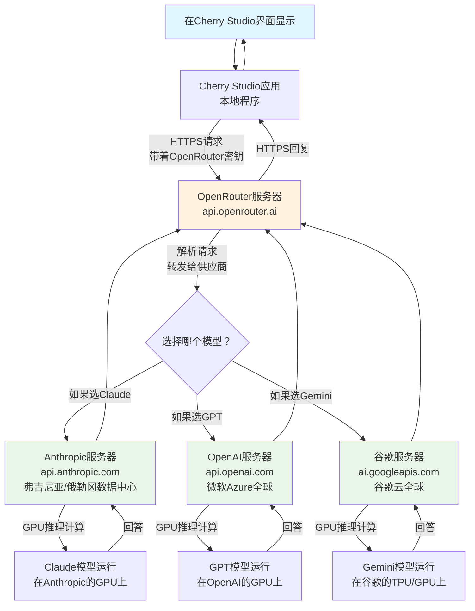
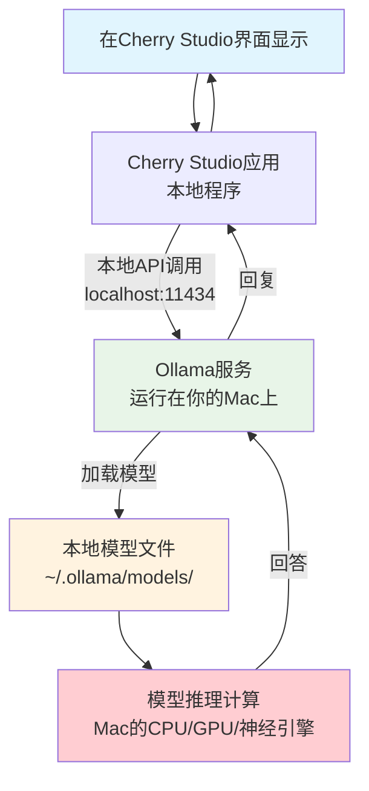

当你在 Cherry Studio 这样的 AI 客户端里打字提问时，有没有好奇过：你的问题是怎么被处理的？算力来自哪里？数据会不会泄露？今天我们用最简单的方式，把这个过程完整地展示给你看。

<!--more-->

## 两种不同的"大脑"

使用 AI 工具时，其实有两种完全不同的方式，就像两种不同的"大脑"：

**云端大脑**：就像请教远方的专家，你的问题需要通过网络发送给遥远的服务器，那里有很强大的计算机来思考你的问题，然后把答案传回来。

**本地大脑**：就像自己的私人助手，直接在你的电脑里思考和回答，不需要联网，也不会把你的问题告诉任何人。

今天我们重点讲讲"本地大脑"是怎么工作的。

## 云端AI的数据之旅

先让我们看看云端AI是怎么处理你的问题的。比如你通过 OpenRouter 这样的服务来使用 Claude 或 GPT：

这个过程就像寄信一样：你把问题写好，通过邮递员（OpenRouter）转交给远方的专家（Anthropic、OpenAI等），专家用他们的超级电脑思考后，再把答案寄回来给你。

## 本地AI的简单世界

但如果你使用本地AI（比如通过 Ollama 运行的模型），情况就简单多了：

这就像在自己家里问自己的私人助手，整个过程都在你的电脑内部完成，没有任何信息会离开你的设备。

## 用生活中的例子来理解

**云端AI** 就像：
- 你有问题时，打电话给远方的专家咨询
- 需要网络连接，可能有通话费
- 专家很厉害，但你需要信任电话公司不会偷听
- 网络不好时可能会断线

**本地AI** 就像：
- 你家里住着一个私人老师
- 不需要打电话，随时可以问
- 虽然可能没有外面的专家那么厉害，但完全保密
- 停电了就用不了，但不受网络影响

## 数据流动的细节

当你使用本地AI时，数据的流动过程是这样的：

1. **输入阶段**：你在 Cherry Studio 里打字，这些文字暂时存储在应用的内存里
2. **传递阶段**：Cherry Studio 通过本地网络接口（类似于内部对讲机）把问题发给 Ollama
3. **处理阶段**：Ollama 把你的问题喂给已经加载在内存中的AI模型
4. **计算阶段**：你的 Mac 电脑的处理器开始工作，一个字一个字地生成回答
5. **返回阶段**：答案通过同样的内部路径返回到 Cherry Studio
6. **显示阶段**：你看到回答逐字出现在屏幕上

整个过程就像在你的电脑内部传递纸条，没有任何信息会"走出家门"。

## 为什么选择本地AI？

**隐私保护**：你的所有对话都只在自己的电脑里，就算是讨论公司机密或个人隐私，也不用担心被第三方看到。

**离线使用**：不需要网络连接，在飞机上、地下室、或者网络不稳定的地方都能正常使用。

**成本控制**：一次购买（或免费下载）模型后，使用多少次都不用额外付费，不像云端服务按使用量收费。

**响应速度**：取决于你的电脑性能，但通常比网络传输更稳定，不会因为网络延迟影响体验。

## 需要了解的限制

当然，本地AI也有一些限制需要了解：

**硬件要求**：你的电脑需要有足够的内存和处理能力。大型模型可能需要16GB甚至32GB的内存才能流畅运行。

**模型能力**：受硬件限制，本地模型通常比云端的超大模型（如GPT-4、Claude等）能力稍弱一些。

**更新频率**：云端模型会不断更新改进，而本地模型需要你手动下载新版本。

## 实际的使用体验

使用本地AI时，你会发现：

**启动时间**：第一次加载模型时可能需要几秒到几分钟，但之后的对话就很快了。

**流式输出**：就像云端AI一样，答案会一个字一个字地出现，而不是让你等很久然后突然显示一大段文字。

**资源占用**：运行时会占用较多内存和CPU/GPU资源，电脑可能会感觉到发热和风扇转动。

## 总结

理解AI工具的数据流向并不复杂：云端AI像是远程咨询专家，而本地AI像是家庭私教。每种方式都有其优势，关键是根据你的需求来选择。

如果你重视隐私、需要离线使用，或者想要控制成本，本地AI是很好的选择。如果你需要最强的AI能力，不介意数据通过网络传输，云端AI可能更适合。

现在你知道了：当你在Cherry Studio里提问时，你的问题到底去了哪里，又是怎么回来的。无论选择哪种方式，你都可以放心使用，因为你已经了解了整个过程的来龙去脉。
