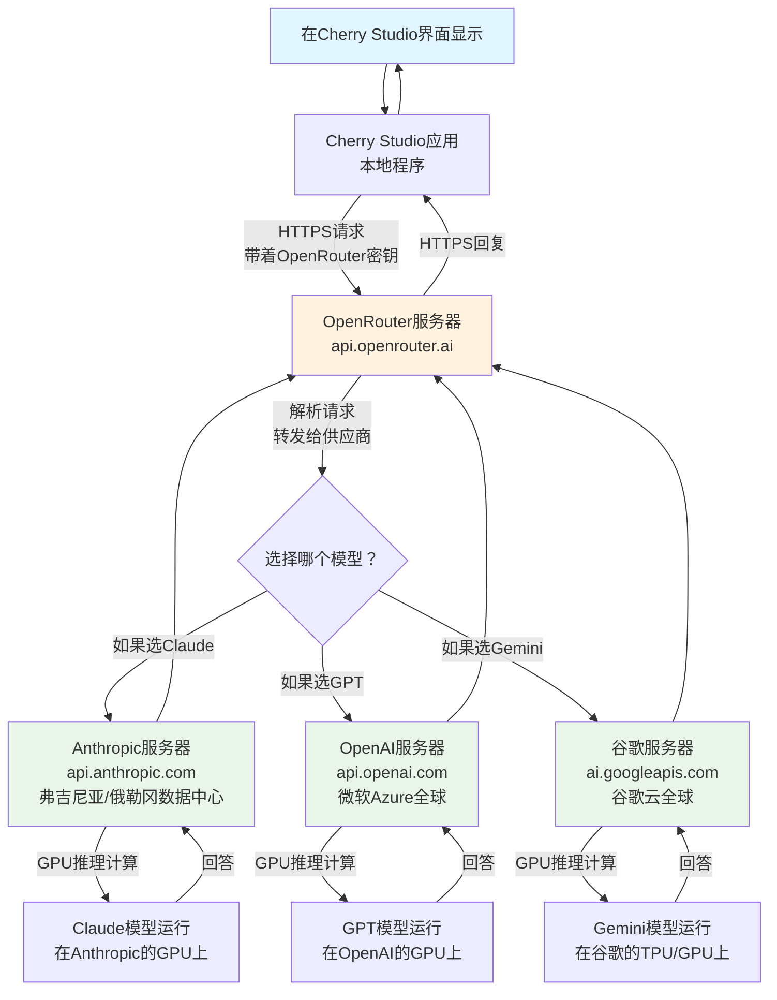
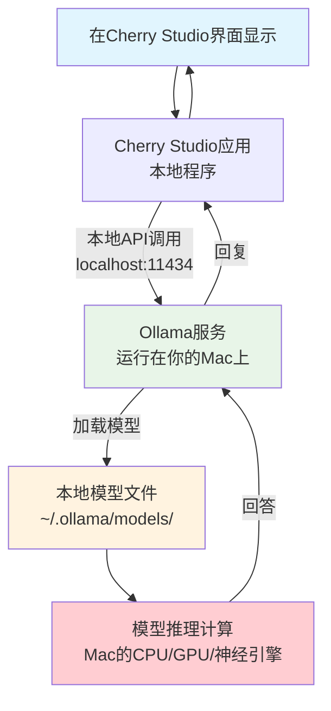

Когда вы вводите вопрос в ИИ-клиент, например Cherry Studio, вы когда-нибудь задумывались: как обрабатывается ваш вопрос? Откуда берутся вычислительные мощности? Не подвергаются ли данные опасности? Сегодня мы покажем вам этот процесс во всей его полноте и в самом простом виде.

<!--more-->

## 两种不同的"大脑"

На самом деле существует два совершенно разных способа использования инструментов ИИ, как два разных "мозга":

**CLOUD BRAIN**: Как и при обращении к далекому эксперту, ваш вопрос должен быть отправлен через Интернет на удаленный сервер, где очень мощные компьютеры обдумывают ваш вопрос и отправляют ответ.

**Локальный мозг**: это как ваш личный помощник, который думает и отвечает прямо в вашем компьютере, не требуя подключения к Интернету и не сообщая никому о ваших вопросах.

Сегодня мы сосредоточимся на том, как работает "местный мозг".

## 云端AI的数据之旅

Давайте сначала посмотрим, как AI в облаке решает вашу проблему. Допустим, вы используете Claude или GPT через службу типа OpenRouter:

Процесс похож на отправку письма: вы пишете вопрос, пересылаете его через почтальона (OpenRouter) удаленному эксперту (Anthropic, OpenAI и т. д.), который обдумывает его с помощью своего суперкомпьютера и отправляет ответ обратно вам.

## 本地AI的简单世界

Но если вы используете собственный ИИ (например, модели, запускаемые через Ollama), ситуация намного проще:

Это все равно что обратиться к своему личному помощнику, не выходя из дома: весь процесс происходит на вашем компьютере, и никакая информация не покидает ваше устройство.

## 用生活中的例子来理解

**Облачный искусственный интеллект** Это как:
- Вы обращаетесь к удаленному эксперту за советом, когда у вас возникает проблема.
- Для этого требуется подключение к интернету, и может взиматься плата за звонок.
- Эксперты - это здорово, но нужно доверять телефонной компании, чтобы она не подслушивала.
- Вас могут отключить, если сеть плохая.

**Локальный искусственный интеллект** Это как:
- У вас дома живет частный репетитор.
- Вам не нужно звонить, вы можете спросить в любое время.
- Возможно, он не так хорош, как специалист со стороны, но зато он полностью конфиденциален.
- Вы не сможете воспользоваться им, если отключат электричество, но интернет на него не влияет.

## 数据流动的细节

Когда вы используете локальный ИИ, данные поступают следующим образом:

1. **Фаза набора текста**: вы набираете текст в Cherry Studio, и он временно сохраняется в памяти приложения
2. **Фаза передачи**: Cherry Studio отправляет ваш вопрос в Ollama через интерфейс локальной сети (подобно внутренней рации).
3. **Фаза обработки**: Ollama передает ваш вопрос уже загруженной в память модели ИИ.
4. **Фаза вычислений**: процессор вашего Mac приступает к работе, генерируя ответ слово за словом.
5. **Фаза возврата**: ответ возвращается в Cherry Studio по тому же внутреннему пути.
6. **Фаза отображения**: вы видите, как ответ слово за словом появляется на экране.

Весь процесс похож на передачу записки внутри вашего компьютера, никакая информация не выходит "за дверь".

## 为什么选择本地AI？

**Защита конфиденциальности**: Все ваши разговоры ведутся только на вашем компьютере, поэтому вы можете не беспокоиться о том, что их увидят третьи лица, даже если вы обсуждаете секреты компании или личную жизнь.

**Оффлайн использование**: не требует подключения к Интернету, отлично работает в самолете, в подвале или там, где Интернет нестабилен.

**Контроль расходов**: купив (или скачав бесплатно) модель один раз, вам не придется доплачивать за то, сколько раз вы ее используете, в отличие от облачных сервисов, которые взимают плату за использование.

**Отзыв**: зависит от производительности вашего компьютера, но обычно более стабилен, чем сетевые передачи, и не влияет на впечатления от использования из-за задержек в сети.

## 需要了解的限制

Конечно, есть некоторые ограничения, которые необходимо понимать при использовании локального ИИ:

**Требования к аппаратному обеспечению**: Ваш компьютер должен обладать достаточным объемом оперативной памяти и вычислительной мощностью. Большие модели могут потребовать 16 или даже 32 Гб оперативной памяти для бесперебойной работы.

**Возможности модели**: из-за аппаратных ограничений локальные модели обычно имеют несколько меньшие возможности, чем очень большие модели в облаке (например, GPT-4, Claude и т. д.).

**Частота обновления**: Облачные модели постоянно обновляются, в то время как локальные модели требуют ручной загрузки новых версий.

## 实际的使用体验

Это можно сделать, используя местный искусственный интеллект:

**Время запуска**: первая загрузка модели может занять от нескольких секунд до нескольких минут, но после этого диалог происходит быстро.

**Потоковый вывод**: как и в случае с облачным ИИ, ответы появляются слово за словом, а не заставляют вас долго ждать, а затем внезапно отображают большой блок текста.

**Использование ресурсов**: Во время работы он будет занимать больше памяти и ресурсов CPU/GPU, а компьютер может нагреваться и вращаться вентилятор.

## 总结

Понять поток данных от инструментов ИИ несложно: облачный ИИ - это как удаленный эксперт-консультант, а локальный ИИ - как частный домашний репетитор. У каждого подхода есть свои преимущества, главное - сделать выбор в зависимости от ваших потребностей.

Локальный ИИ отлично подходит, если вы цените конфиденциальность, хотите использовать его в автономном режиме или контролировать расходы. Если вам нужны самые мощные возможности искусственного интеллекта и вы не против передачи данных по сети, облачный ИИ может оказаться более подходящим вариантом.

Теперь вы знаете: когда вы задаете вопрос в Cherry Studio, куда именно он попадает и как возвращается. Какой бы способ вы ни выбрали, вы можете использовать его с уверенностью, потому что уже знаете все тонкости этого процесса.