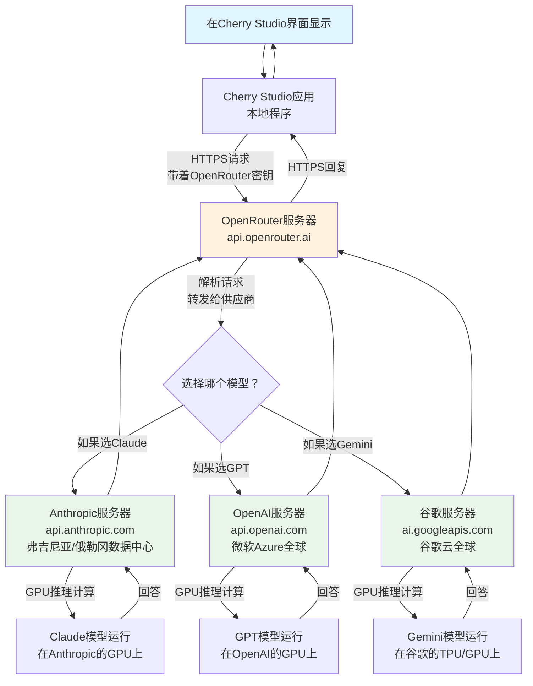

Когда вы вводите вопрос в ИИ-клиент, например Cherry Studio, вы когда-нибудь задумывались: как обрабатывается ваш вопрос? Откуда берутся вычислительные мощности? Не подвергаются ли данные опасности? Сегодня мы покажем вам этот процесс во всей его полноте и в самом простом виде.

<! -еще-->

## Два разных вида "мозгов" ##

Существует два совершенно разных способа использования инструментов ИИ, как и два разных "мозга":

**Облачный мозг**: Как и в случае с удаленным экспертом, ваш вопрос должен быть отправлен через Интернет на удаленный сервер, где очень мощный компьютер обдумывает ваш вопрос и отправляет ответ.

**Локальный мозг**: это как ваш личный помощник, который думает и отвечает прямо в вашем компьютере, не требуя подключения к Интернету и не сообщая никому о своем вопросе.

Сегодня мы сосредоточимся на том, как работает "локальный мозг".

## AI in the Cloud's Data Journey

Давайте начнем с того, как облачный ИИ решает вашу проблему. Допустим, вы используете Claude или GPT через сервис вроде OpenRouter:



Процесс похож на отправку письма: вы пишете свой вопрос, пересылаете его через почтальона (OpenRouter) удаленному эксперту (Anthropic, OpenAI и т. д.), который обдумывает его с помощью своего суперкомпьютера и присылает вам ответ.

## Простой мир локального ИИ

Но если вы используете локальный ИИ (например, модели, запускаемые через Ollama), ситуация намного проще:

```mermaid
graph TD
    A[你的Mac电脑<br/>在Cherry Studio输入问题] --> B[Cherry Studio应用<br/>本地程序]
    
    B -->|本地API调用<br/>localhost:11434| C[Ollama服务<br/>运行在你的Mac上]
    
    C -->|加载模型| D[本地模型文件<br/>~/.ollama/models/]
    
    D --> E[模型推理计算<br/>Mac的CPU/GPU/神经引擎]
    
    E -->|回答| C
    C -->|回复| B
    B --> A[在Cherry Studio界面显示]
    
    style A fill:#e1f5fe
    style C fill:#e8f5e8
    style D fill:#fff3e0
    style E fill:#ffcdd2
```.

Это все равно что попросить личного помощника у себя дома: весь процесс происходит внутри вашего компьютера, и никакая информация не покидает ваше устройство.

## Понимание на примерах из жизни

**Облачный ИИ** Это как:
- Вы обращаетесь к удаленному эксперту за советом, когда у вас возникает проблема.
- Вам нужно подключение к Интернету, и за звонок может взиматься плата.
- Эксперт - это здорово, но вам нужно верить, что телефонная компания не подслушивает.
- Вас могут отключить, если сеть плохая.

**Локальный ИИ** Это как:
- У вас дома живет частный репетитор.
- Вам не нужно звонить, вы можете спросить в любое время.
- Возможно, он не так хорош, как специалист со стороны, но зато он полностью конфиденциален.
- Это не так хорошо, как специалист со стороны, но это полностью конфиденциально.

## Детали потока данных ##

Когда вы используете локальный ИИ, процесс передачи данных выглядит следующим образом:

1. **фаза ввода**: вы вводите текст в Cherry Studio, и он временно сохраняется в памяти приложения
2. **фаза передачи**: Cherry Studio отправляет проблему в Ollama через интерфейс локальной сети (подобно внутренней рации)
3. **Фаза обработки**: Ollama передает ваш вопрос уже загруженной в память модели искусственного интеллекта.
4. **Фаза вычислений**: процессор вашего Mac приступает к работе, генерируя ответ слово за словом.
5. **Фаза возврата**: ответ возвращается в Cherry Studio по тому же внутреннему пути.
6. **Фаза отображения**: вы видите, как ответ слово за словом появляется на экране.

Весь процесс похож на передачу записки внутри компьютера, никакая информация не уходит "за дверь".

## Почему стоит выбрать локальный ИИ?

**Защита конфиденциальности**: все ваши разговоры ведутся на вашем собственном компьютере, поэтому вам не нужно беспокоиться о том, что третьи лица увидят ваши разговоры, даже если они касаются секретов компании или личной жизни.

**Оффлайн-использование**: Не требуется подключение к Интернету, поэтому он отлично работает в самолете, в подвале или там, где Интернет нестабилен.

**Контроль расходов**: купив (или скачав бесплатно) модель один раз, вам не придется доплачивать за то, сколько раз вы ею воспользуетесь, в отличие от облачных сервисов, где плата взимается за использование.

**Отзывчивость**: зависит от производительности вашего компьютера, но обычно более стабильна, чем передача данных по сети, и не влияет на впечатления от использования из-за задержек в сети.

## Ограничения, которые следует знать

Конечно, при использовании локального ИИ есть некоторые ограничения:

**Требования к аппаратному обеспечению**: ваш компьютер должен иметь достаточно оперативной памяти и вычислительной мощности. Большие модели могут потребовать 16 или даже 32 ГБ оперативной памяти для бесперебойной работы.

**Возможности модели**: из-за аппаратных ограничений локальные модели обычно немного уступают по возможностям очень большим моделям в облаке (например, GPT-4, Claude и т. д.).

**Частота обновления**: облачные модели постоянно обновляются и совершенствуются, в то время как локальные модели требуют ручной загрузки новых версий.

## Практический опыт

При использовании локального ИИ вы обнаружите:

**Время запуска**: первая загрузка модели может занять от нескольких секунд до нескольких минут, но после этого диалог происходит быстро.

**Потоковый вывод**: как и в случае с облачным ИИ, ответы появляются слово за словом, а не заставляют вас долго ждать, а затем внезапно отображают большой блок текста.

**Потребление ресурсов**: во время работы игра занимает больше оперативной памяти и ресурсов CPU/GPU, а компьютер может нагреваться и вращаться вентилятор.

## Резюме

Понять поток данных от инструментов ИИ несложно: облачный ИИ похож на удаленного эксперта-консультанта, а локальный ИИ - на частного домашнего репетитора. У каждого подхода есть свои преимущества, и главное - сделать выбор в зависимости от ваших потребностей.

Если вы цените конфиденциальность, нуждаетесь в автономном использовании или хотите контролировать расходы, локальный ИИ - отличный выбор. Если же вам нужны самые мощные возможности искусственного интеллекта и вы не против передачи данных по сети, то, возможно, вам больше подойдет облачный ИИ.

Теперь вы знаете: когда вы задаете вопрос в Cherry Studio, куда именно он попадает и как возвращается обратно. Какой бы способ вы ни выбрали, вы можете использовать его с уверенностью, потому что уже знаете все тонкости этого процесса.
