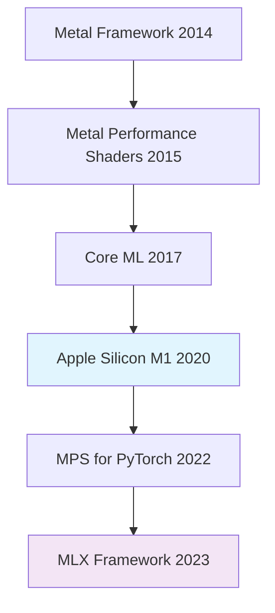
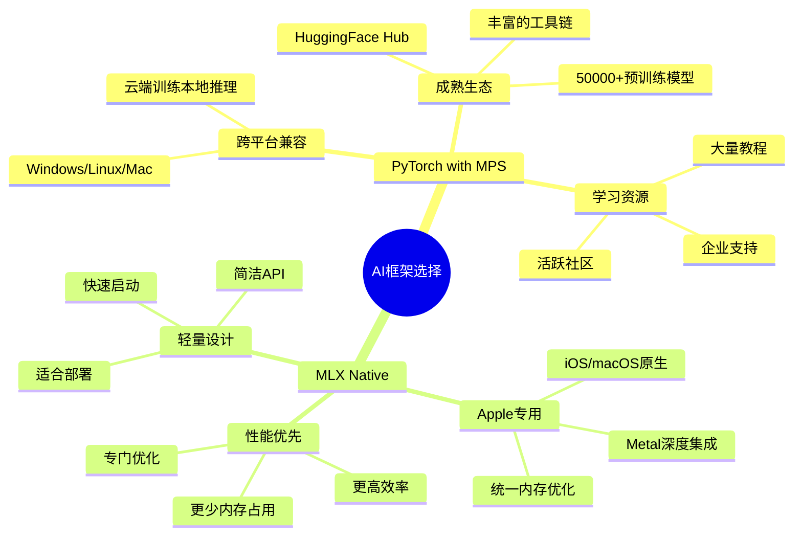
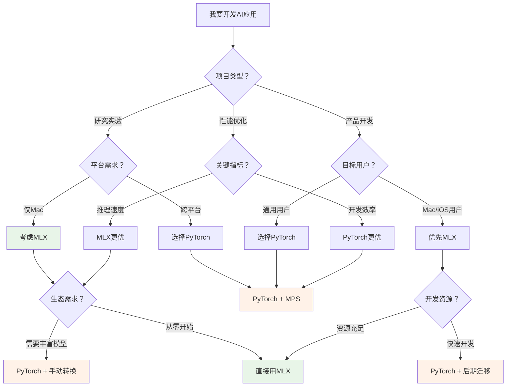
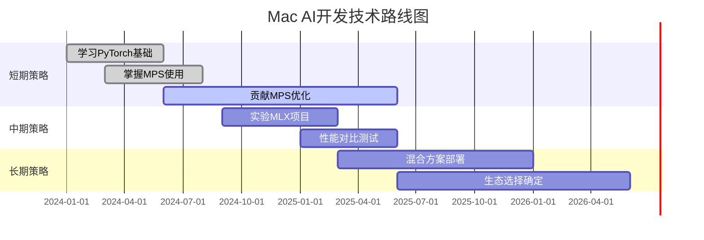

如果你拥有一台搭载M芯片的Mac，你可能已经感受到了苹果芯片在AI任务上的惊人表现。但作为开发者，你是否困惑过：面对MLX和PyTorch两套框架，该如何选择？这不仅仅是一个技术问题，更关乎Mac平台AI生态的未来走向。

<!--more-->

## MPS：苹果为Mac AI加速埋下的种子

首先，我们需要理解什么是MPS（Metal Performance Shaders）。想象一下，传统的电脑就像一个老式工厂，CPU是万能工人，什么活都能干，但速度有限；GPU则像专业流水线，擅长做重复性工作。苹果的MPS，就是让Mac的GPU专门为AI计算开辟了一条"高速公路"。

### MPS与Apple生态的关系

MPS并不是凭空出现的。它建立在苹果多年来在图形处理领域的积累之上：



苹果的策略很清晰：从底层硬件到上层框架，构建一个完全掌控的AI计算栈。M芯片的统一内存架构（CPU和GPU共享内存）为这一战略提供了硬件基础，而MPS则是软件层面的核心技术。

## AI浪潮中的平台之争

随着ChatGPT等大模型引爆AI热潮，开发者们突然发现手中的Mac不再只是"工作电脑"，而是可以运行先进AI模型的"超级计算机"。但问题来了：用什么框架？

### 传统格局：CUDA的统治与挑战

长期以来，AI开发几乎等同于NVIDIA CUDA开发。这就像修路只修一条主干道，所有人都走同一条路：

<div style="background: linear-gradient(135deg, #667eea 0%, #764ba2 100%); padding: 20px; border-radius: 10px; color: white; margin: 20px 0;">
<strong>CUDA生态的优势：</strong><br>
• 成熟的工具链和生态系统<br>
• 丰富的预训练模型库<br>
• 强大的性能优化<br>
• 广泛的社区支持
</div>

但苹果选择了另一条路：自建生态。这就像在CUDA这条主干道旁，苹果修建了一条专为Mac用户设计的"专用车道"。

## 两大框架的正面交锋

现在，Mac开发者面临两个选择：经过MPS优化的PyTorch，或者苹果原生的MLX。这不是简单的技术选择，而是两种哲学的碰撞。

### 生态系统对比



### 性能数据对比

基于Apple官方测试数据，我们可以看到两个框架在同一硬件上的表现差异：

<div style="display: flex; justify-content: space-between; margin: 20px 0;">
<div style="flex: 1; background: #f8f9fa; padding: 15px; margin-right: 10px; border-radius: 8px;">
<h4 style="color: #1976d2; margin-top: 0;">PyTorch MPS</h4>
<ul>
<li><strong>Llama 3.1-8B推理:</strong> ~26 tokens/s</li>
<li><strong>内存效率:</strong> 中等</li>
<li><strong>启动时间:</strong> 较慢</li>
<li><strong>兼容性:</strong> 部分操作需CPU回退</li>
</ul>
</div>
<div style="flex: 1; background: #f3e5f5; padding: 15px; margin-left: 10px; border-radius: 8px;">
<h4 style="color: #7b1fa2; margin-top: 0;">MLX Native</h4>
<ul>
<li><strong>Llama 3.1-8B推理:</strong> ~33 tokens/s</li>
<li><strong>内存效率:</strong> 高</li>
<li><strong>启动时间:</strong> 快</li>
<li><strong>兼容性:</strong> 所有操作原生支持</li>
</ul>
</div>
</div>

### SDPA算法实现质量

在核心的注意力机制（Scaled Dot-Product Attention）实现上，两个框架有明显差异：

**MLX的优势：**
- 原生fused attention kernel
- 支持各种attention变体（Multi-Head、Grouped Query、Multi-Query）
- 高效的KV cache实现
- 无CPU回退需求

**PyTorch MPS的挑战：**
- 部分复杂attention操作仍需CPU执行
- 内存拷贝开销较大
- 某些优化在MPS上未实现
- 容易受macOS更新影响

### 代码风格对比：同样的任务，不同的实现

为了让大家直观感受两个框架的差异，我们来看看同一个任务在两个框架中的实现方式。以一个简单的图像分类模型为例：

**PyTorch + MPS 实现风格：**
```python
import torch
import torch.nn as nn
import torchvision.models as models
from torchvision import transforms

# 检查MPS设备可用性
device = torch.device("mps" if torch.backends.mps.is_available() else "cpu")
print(f"使用设备: {device}")

# 加载预训练模型（丰富的模型库）
model = models.resnet50(pretrained=True)
model.to(device)
model.eval()

# 图像预处理（成熟的工具链）
transform = transforms.Compose([
    transforms.Resize(256),
    transforms.CenterCrop(224),
    transforms.ToTensor(),
    transforms.Normalize(mean=[0.485, 0.456, 0.406], 
                        std=[0.229, 0.224, 0.225])
])

# 推理过程
def classify_image(image_path):
    image = Image.open(image_path)
    input_tensor = transform(image).unsqueeze(0).to(device)
    
    with torch.no_grad():
        outputs = model(input_tensor)
        probabilities = torch.nn.functional.softmax(outputs[0], dim=0)
        
    return probabilities

# 使用方式：直接调用成熟的API
result = classify_image("cat.jpg")
```

**MLX 实现风格：**
```python
import mlx.core as mx
import mlx.nn as nn
from mlx.utils import tree_map

# MLX自动使用最优设备，无需手动指定
print("MLX自动优化设备使用")

# 定义模型结构（需要手动构建）
class SimpleClassifier(nn.Module):
    def __init__(self, num_classes=1000):
        super().__init__()
        self.conv1 = nn.Conv2d(3, 64, kernel_size=7, stride=2, padding=3)
        self.bn1 = nn.BatchNorm(64)
        self.pool = nn.MaxPool2d(kernel_size=3, stride=2, padding=1)
        self.fc = nn.Linear(64 * 56 * 56, num_classes)
    
    def __call__(self, x):
        x = mx.maximum(self.bn1(self.conv1(x)), 0)  # ReLU
        x = self.pool(x)
        x = x.reshape(x.shape[0], -1)
        return self.fc(x)

# 创建模型
model = SimpleClassifier()

# 图像预处理（需要手动实现）
def preprocess_image(image_path):
    # 简化的预处理流程
    image = mx.array(load_image(image_path))  # 需要自己实现load_image
    image = mx.transpose(image, (2, 0, 1))  # HWC -> CHW
    image = image / 255.0  # 归一化
    return mx.expand_dims(image, 0)  # 添加batch维度

# 推理过程
def classify_image_mlx(image_path):
    input_tensor = preprocess_image(image_path)
    
    # MLX的延迟计算特性
    logits = model(input_tensor)
    probabilities = mx.softmax(logits, axis=-1)
    
    # 执行计算
    mx.eval(probabilities)
    return probabilities

# 使用方式：更多手动工作，但性能更优
result = classify_image_mlx("cat.jpg")
```

### 代码风格差异解读

即使不懂编程，你也能从代码对比中感受到两种不同的设计哲学：

<div style="display: grid; grid-template-columns: 1fr 1fr; gap: 20px; margin: 20px 0;">
<div style="background: #e3f2fd; padding: 15px; border-radius: 8px;">
<h4 style="color: #1976d2; margin-top: 0;">🧰 PyTorch：工具箱式</h4>
<ul>
<li><strong>"拿来即用"</strong>：预训练模型一行代码搞定</li>
<li><strong>"电器化"</strong>：需要明确告诉系统用哪个设备</li>
<li><strong>"标准化"</strong>：图像处理有现成的标准流程</li>
<li><strong>"积木式"</strong>：各种功能模块可以随意组合</li>
</ul>
</div>
<div style="background: #f3e5f5; padding: 15px; border-radius: 8px;">
<h4 style="color: #7b1fa2; margin-top: 0;">⚡ MLX：手工艺式</h4>
<ul>
<li><strong>"量身定制"</strong>：需要手动构建适合的模型结构</li>
<li><strong>"智能化"</strong>：自动选择最佳的计算方式</li>
<li><strong>"精简化"</strong>：代码更简洁，但需要更多背景知识</li>
<li><strong>"性能导向"</strong>：每一行代码都为效率优化</li>
</ul>
</div>
</div>

就像**买衣服**一样：PyTorch像是去商场，各种成衣应有尽有，拿了就能穿；MLX像是找裁缝定制，需要自己提供设计想法，但最终的合身程度会更好。

## 开发者的现实选择

虽然MLX在性能上有优势，但选择框架需要考虑更多因素。让我用一个类比来说明：

<div style="background: #fff3e0; border-left: 4px solid #ff9800; padding: 15px; margin: 20px 0;">
<strong>中药配方的比喻：</strong><br><br>
<strong>MLX</strong> 就像一个刚开垦的小药圃，只有几味品质极佳的药材，药性纯正，但要配个完整方子还得等它慢慢长大。<br><br>
<strong>PyTorch</strong> 则像一家百年老药房，什么疑难杂症都能找到对症的药，虽然个别药材（MPS支持）品质还需改进，但至少能立即开方治病。
</div>

### 实际使用场景分析



## 对Mac AI生态的影响

这场框架之争的结果将深刻影响Mac平台的AI发展方向：

### 短期影响（1-2年）

**如果PyTorch MPS持续改进：**
- Mac将更好地融入主流AI开发生态
- 开发者学习成本较低
- 更多AI应用会原生支持Mac

**如果MLX快速发展：**
- Apple可能推动更多专有AI功能
- Mac在AI推理场景有独特优势
- 可能出现平台分化

### 长期影响（3-5年）

最可能的情况是**混合生态**的形成：

1. **PyTorch + MPS**：主流AI开发、研究、训练
2. **MLX**：高性能推理、Apple生态应用、移动端部署
3. **相互促进**：MLX的优化经验反馈到PyTorch MPS

### 给开发者的建议

对于不同类型的开发者，我的建议是：

**学生/研究者：**
- 优先学习PyTorch，生态完整，学习资源丰富
- 了解MLX基础，关注其发展动态

**企业开发者：**
- 根据产品需求选择：跨平台用PyTorch，Apple专用考虑MLX
- 可以采用"PyTorch开发，MLX部署"的策略

**个人开发者：**
- 如果只做Mac/iOS应用，可以大胆尝试MLX
- 如果需要快速产品化，仍然推荐PyTorch

## 技术路线建议

基于当前生态状况，我建议采用**渐进式策略**：



**具体行动建议：**

1. **当前阶段**：专注PyTorch MPS，为关键算法（如SDPA）贡献优化代码
2. **实验阶段**：在非关键项目中尝试MLX，积累经验
3. **决策阶段**：根据项目需求和生态发展情况，选择最适合的技术栈

## 结语

Mac平台的AI框架之争，本质上反映了技术发展的两种路径：开放生态vs封闭优化。PyTorch代表了开放、兼容的发展思路，而MLX体现了苹果一贯的垂直整合策略。

作为开发者，我们既要关注性能数据，更要考虑生态完整性。当前阶段，**为PyTorch MPS贡献代码，同时关注MLX发展**，可能是最明智的选择。毕竟，良好的工具不仅要跑得快，更要让开发者能够快速构建出真正有用的应用。

这场生态之战的最终赢家，或许不是某一个框架的完全胜利，而是两种路径的互相促进，最终为Mac用户带来更好的AI体验。

---

*你的Mac已经为AI时代做好了准备，现在轮到你选择合适的工具，开始你的AI开发之旅了。*
