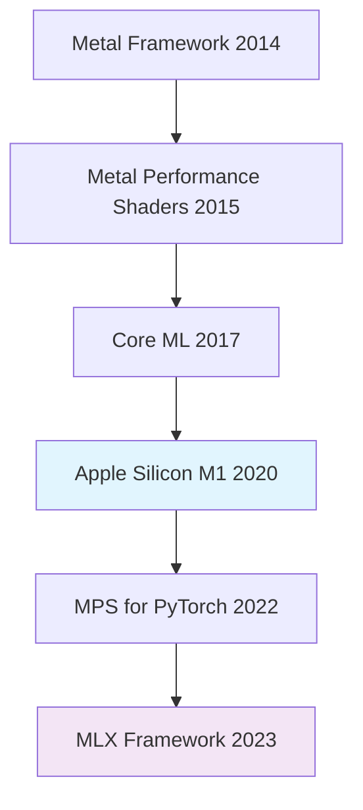
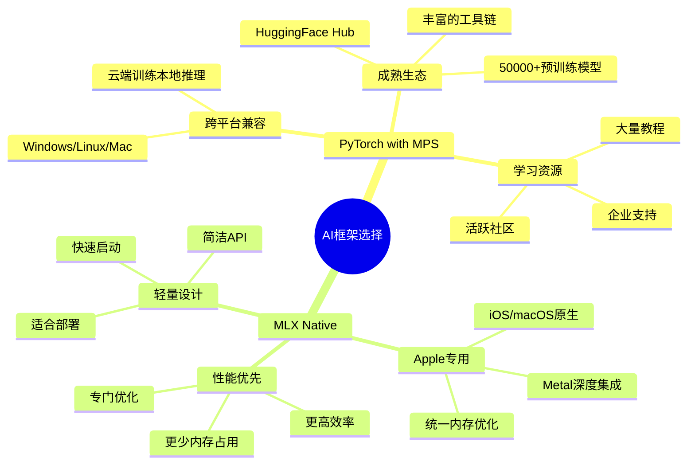
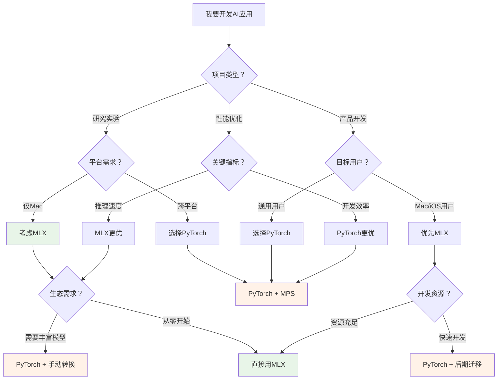
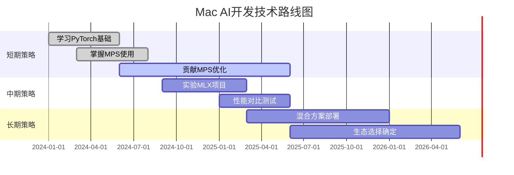

Если у вас есть Mac с чипом M, вы могли ощутить потрясающую производительность чипов Apple в задачах искусственного интеллекта. Но как разработчик, вы когда-нибудь были в замешательстве: столкнувшись с двумя наборами фреймворков, MLX и PyTorch, как выбрать? Это не только технический вопрос, но и вопрос о будущем направлении развития экосистемы ИИ на платформе Mac.

<!--more-->

## MPS：苹果为Mac AI加速埋下的种子

Для начала нужно понять, что такое MPS (Metal Performance Shaders). Представьте, что традиционный компьютер похож на старомодную фабрику, где CPU - это универсальный рабочий, способный выполнить любую работу, но с ограниченной скоростью, а GPU - это профессиональный сборочный конвейер, хорошо справляющийся с повторяющейся работой. MPS от Apple - это создание графического процессора Mac специально для вычислений с искусственным интеллектом, чтобы открыть "шоссе".

### MPS与Apple生态的关系

MPS не возникла из ниоткуда. Он основан на многолетнем опыте Apple в области обработки графики:



Стратегия Apple ясна: создать полностью контролируемый вычислительный стек ИИ, начиная с базового оборудования и заканчивая верхним каркасом. Архитектура унифицированной памяти чипа M (общая память CPU и GPU) обеспечивает аппаратную основу для этой стратегии, а технология MPS является основной на программном уровне.

## AI浪潮中的平台之争

С ChatGPT и другими крупными моделями, спровоцировавшими бум ИИ, разработчики неожиданно обнаружили в руках Mac уже не просто "рабочий компьютер", а способный запускать продвинутые модели ИИ "суперкомпьютер". Но возникает вопрос: какой фреймворк использовать?

### 传统格局：CUDA的统治与挑战

Долгое время разработка ИИ была почти эквивалентна разработке NVIDIA CUDA. Это все равно что строить дорогу с одной главной и всем идти в одну сторону:

<div style="background: linear-gradient(135deg, #667eea 0%, #764ba2 100%); padding: 20px; border-radius: 10px; color: white; margin: 20px 0;">
<strong>Преимущества экосистемы CUDA:</strong><br>
- Зрелый инструментарий и экосистема<br
- Богатая библиотека предварительно обученных моделей<br
- Мощные средства оптимизации производительности<br
- Широкая поддержка сообщества
</div>

Но Apple выбрала другой путь: создание собственной экосистемы. Это как создание "специальной полосы" для пользователей Mac рядом с основной дорогой CUDA.

## 两大框架的正面交锋

Теперь перед разработчиками Mac стоят два выбора: оптимизированный под MPS PyTorch или родной MLX от Apple. Это не просто выбор технологии, это столкновение двух философий.

### 生态系统对比



### 性能数据对比

Основываясь на официальных данных тестирования Apple, мы можем увидеть разницу в производительности двух фреймворков на одном и том же оборудовании:

<div style="display: flex; justify-content: space-between; margin: 20px 0;">
<div style="flex: 1; background: #f8f9fa; padding: 15px; margin-right: 10px; border-radius: 8px;">
<h4 style="color: #1976d2; margin-top: 0;">PyTorch MPS</h4>
<ul>
<li><strong>Llama 3.1-8B inference:</strong> ~26 tokens/s</li>
<li><strong>Эффективность памяти:</strong> средняя</li>.
<li><strong>Время запуска:</strong> медленнее</li>
<li><strong>Совместимость:</strong> Некоторые операции требуют резервного копирования процессора</li>.
</ul
</ul> </div>
<div style="flex: 1; background: #f3e5f5; padding: 15px; margin-left: 10px; border-radius: 8px;">
<h4 style="color: #7b1fa2; margin-top: 0;">MLX Native</h4>
<ul>
<li><strong>Llama 3.1-8B inference:</strong> ~33 tokens/s</li>
<li><strong>Эффективность использования памяти:</strong> высокая</li>.
<li><strong>Время запуска:</strong> быстро</li>
<li><strong>Совместимость:</strong> все операции поддерживаются нативно</li>.
</ul
</li> </ul> </div>
</div> </ul> </div>

### SDPA算法实现质量

Эти два механизма существенно отличаются друг от друга в реализации основного механизма внимания (Scaled Dot-Product Attention):

Преимущества **MLX:**
- Родное ядро слитого внимания
- Поддержка различных вариантов внимания (Multi-Head, Grouped Query, Multi-Query)
- Эффективная реализация кэша KV
- Отсутствие требований к процессору

**Проблемы использования PyTorch MPS:**.
- Некоторые сложные операции внимания все еще требуют выполнения на CPU
- Высокие накладные расходы на копирование памяти
- Некоторые оптимизации не реализованы на MPS
- Уязвимость к обновлениям macOS

### 代码风格对比：同样的任务，不同的实现

Чтобы наглядно увидеть различия между двумя фреймворками, давайте посмотрим, как одна и та же задача реализуется в этих двух фреймворках. В качестве примера возьмем простую модель классификации изображений:

**PyTorch + MPS 实现风格：**
```python
import torch
import torch.nn as nn
import torchvision.models as models
from torchvision import transforms

# 检查MPS设备可用性
device = torch.device("mps" if torch.backends.mps.is_available() else "cpu")
print(f"使用设备: {device}")

# 加载预训练模型（丰富的模型库）
model = models.resnet50(pretrained=True)
model.to(device)
model.eval()

# 图像预处理（成熟的工具链）
transform = transforms.Compose([
    transforms.Resize(256),
    transforms.CenterCrop(224),
    transforms.ToTensor(),
    transforms.Normalize(mean=[0.485, 0.456, 0.406], 
                        std=[0.229, 0.224, 0.225])
])

# 推理过程
def classify_image(image_path):
    image = Image.open(image_path)
    input_tensor = transform(image).unsqueeze(0).to(device)
    
    with torch.no_grad():
        outputs = model(input_tensor)
        probabilities = torch.nn.functional.softmax(outputs[0], dim=0)
        
    return probabilities

# 使用方式：直接调用成熟的API
result = classify_image("cat.jpg")
```

**MLX 实现风格：**
```python
import mlx.core as mx
import mlx.nn as nn
from mlx.utils import tree_map

# MLX自动使用最优设备，无需手动指定
print("MLX自动优化设备使用")

# 定义模型结构（需要手动构建）
class SimpleClassifier(nn.Module):
    def __init__(self, num_classes=1000):
        super().__init__()
        self.conv1 = nn.Conv2d(3, 64, kernel_size=7, stride=2, padding=3)
        self.bn1 = nn.BatchNorm(64)
        self.pool = nn.MaxPool2d(kernel_size=3, stride=2, padding=1)
        self.fc = nn.Linear(64 * 56 * 56, num_classes)
    
    def __call__(self, x):
        x = mx.maximum(self.bn1(self.conv1(x)), 0)  # ReLU
        x = self.pool(x)
        x = x.reshape(x.shape[0], -1)
        return self.fc(x)

# 创建模型
model = SimpleClassifier()

# 图像预处理（需要手动实现）
def preprocess_image(image_path):
    # 简化的预处理流程
    image = mx.array(load_image(image_path))  # 需要自己实现load_image
    image = mx.transpose(image, (2, 0, 1))  # HWC -> CHW
    image = image / 255.0  # 归一化
    return mx.expand_dims(image, 0)  # 添加batch维度

# 推理过程
def classify_image_mlx(image_path):
    input_tensor = preprocess_image(image_path)
    
    # MLX的延迟计算特性
    logits = model(input_tensor)
    probabilities = mx.softmax(logits, axis=-1)
    
    # 执行计算
    mx.eval(probabilities)
    return probabilities

# 使用方式：更多手动工作，但性能更优
result = classify_image_mlx("cat.jpg")
```

### 代码风格差异解读

Даже если вы ничего не смыслите в программировании, вы сможете получить представление о двух разных философиях дизайна из сравнения кода:

<div style="display: grid; grid-template-columns: 1fr 1fr; gap: 20px; margin: 20px 0;">
<div style="background: #e3f2fd; padding: 15px; border-radius: 8px;">
<h4 style="color: #1976d2; margin-top: 0;">🧰 PyTorch: toolbox-style</h4>
<ul>
<li><strong>"Используй как есть"</strong>: предварительно обученные модели в одной строке кода</li>.
<li><strong>"Appliance-based"</strong>: необходимо явно указывать системе, какое устройство использовать</li>.
<li><strong>"Стандартизированный"</strong>: существует стандартный процесс обработки изображений, который легко доступен</li>.
<li><strong>"Строительные блоки"</strong>: различные функциональные модули можно комбинировать по своему усмотрению</li>.
</ul
</li> </ul> </div> </ul> </div> </div> </div> </div> </div> </div> </div
<div style="background: #f3e5f5; padding: 15px; border-radius: 8px;">
<h4 style="color: #7b1fa2; margin-top: 0;">⚡ MLX: ручная работа</h4>.
<ul>
<li><strong>"Индивидуальный"</strong>: требует ручного построения подходящих модельных структур</li>.
<li><strong>"Интеллектуальный"</strong>: автоматический выбор наилучшего расчета</li>
<li><strong>"Упрощенный"</strong>: более лаконичный код, но требует больше фоновых знаний</li>.
<li><strong>"Ориентированный на производительность"</strong>: каждая строка кода оптимизирована для повышения эффективности</li>.
</ul>
</div>
</div>

Это как **покупка одежды**: PyTorch - это как поход в торговый центр, где продаются все виды готовой одежды, и вы можете просто взять и надеть ее; MLX - это как поход к портному за индивидуальной подгонкой, где вам нужно предоставить свои собственные идеи для дизайна, но конечная подгонка будет лучше.

## 开发者的现实选择

Хотя MLX имеет преимущества в производительности, при выборе фреймворка необходимо учитывать больше факторов. Позвольте мне проиллюстрировать это аналогией:

<div style="background: #fff3e0; border-left: 4px solid #ff9800; padding: 15px; margin: 20px 0;">
<strong>Аналогия с травяными формулами:</strong><br
<strong>MLX</strong> - это как маленький травяной сад, который только что был восстановлен, с несколькими травами отличного качества и чистыми лекарственными свойствами, но вы должны ждать, пока он вырастет, чтобы составить полную формулу. <br><br>
<strong>PyTorch</strong>, с другой стороны, похож на столетнюю аптеку, где можно найти нужное лекарство для любой проблемы, и хотя качество отдельных трав (при поддержке MPS) еще нуждается в улучшении, по крайней мере, вы можете выписать лекарство немедленно.
</div>

### 实际使用场景分析



## 对Mac AI生态的影响

Исход этой битвы за фреймворк окажет глубокое влияние на развитие ИИ на платформе Mac:

### 短期影响（1-2年）

**Если PyTorch MPS продолжит совершенствоваться, **.
- Mac будет лучше интегрирован в основную экосистему разработки ИИ
- Снижение затрат на обучение для разработчиков
- Больше приложений для ИИ будут изначально поддерживать Mac

**Если MLX пойдет быстро:**.
- Apple может настаивать на расширении собственных возможностей ИИ
- Компьютеры Mac имеют уникальное преимущество в сценариях с искусственным интеллектом
- Возможная фрагментация платформы

### 长期影响（3-5年）

Наиболее вероятным сценарием является формирование **смешанной экологии**:

1. **PyTorch + MPS**: разработка, исследования, обучение в области ИИ.
2. **MLX**: высокопроизводительные выводы, экоприложения Apple, мобильное развертывание
3. **Взаимное улучшение**: опыт оптимизации MLX используется в PyTorch MPS

### 给开发者的建议

Мой совет для разных типов разработчиков:

**Студенты/Исследователи:**.
- Приоритетное изучение PyTorch с полной экосистемой и богатыми ресурсами для обучения
- Понять основы MLX и следить за его развитием

**Предпринимательские разработчики:**.
- В соответствии с требованиями к продукту: кроссплатформенный PyTorch, учет специфики MLX для Apple.
- Может быть принята стратегия "разработка PyTorch, развертывание MLX".

**Индивидуальные разработчики:**.
- Если вы делаете только приложения для Mac/iOS, смело пробуйте MLX.
- Если вам нужно быстро создать продукт, PyTorch по-прежнему рекомендуется!

## 技术路线建议

Исходя из текущей экологической ситуации, я рекомендую **Инкрементальную стратегию**:



**Конкретные рекомендации к действию:**

1. **Текущая фаза**: фокусировка на PyTorch MPS, внесение оптимизированного кода для ключевых алгоритмов (например, SDPA)
2. **Экспериментальная фаза**: опробовать MLX в некритичных проектах для накопления опыта
3. **Фаза принятия решения**: выбор наиболее подходящего технологического стека на основе требований проекта и экологического развития

## 结语

Битва за фреймворки ИИ для платформы Mac по сути отражает два пути технологического развития: открытая экология против закрытой оптимизации. PyTorch представляет открытый, совместимый подход к разработке, в то время как MLX отражает последовательную стратегию вертикальной интеграции Apple.

Как разработчики, мы должны сосредоточиться на производительности, а также на экологической чистоте. На данном этапе** внесение кода в PyTorch MPS при сохранении внимания к развитию MLX**, вероятно, является самым мудрым выбором. В конце концов, хорошие инструменты должны не только быстро работать, но и позволять разработчикам быстро создавать действительно полезные приложения.

Конечным победителем в этой экологической битве может стать не полная победа одного из фреймворков, а взаимное усиление двух путей, что в конечном итоге приведет к улучшению работы ИИ для пользователей Mac.

---

* Ваш Mac готов к эпохе искусственного интеллекта, теперь ваша очередь выбрать правильные инструменты и начать свой путь к разработке искусственного интеллекта. *