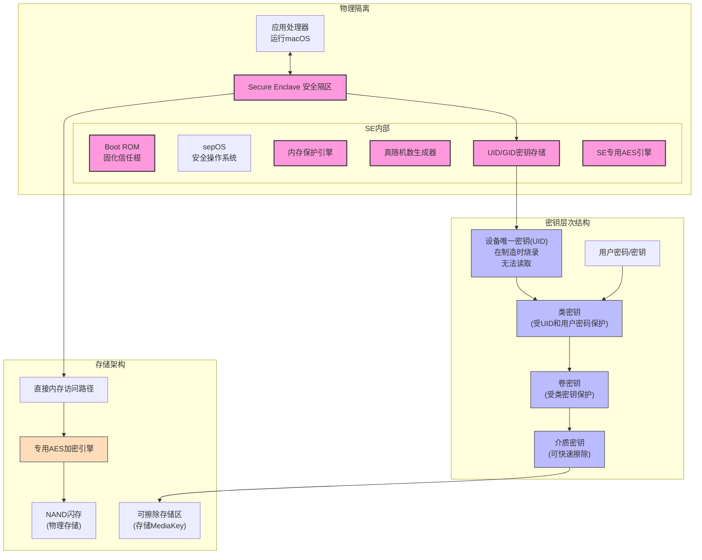
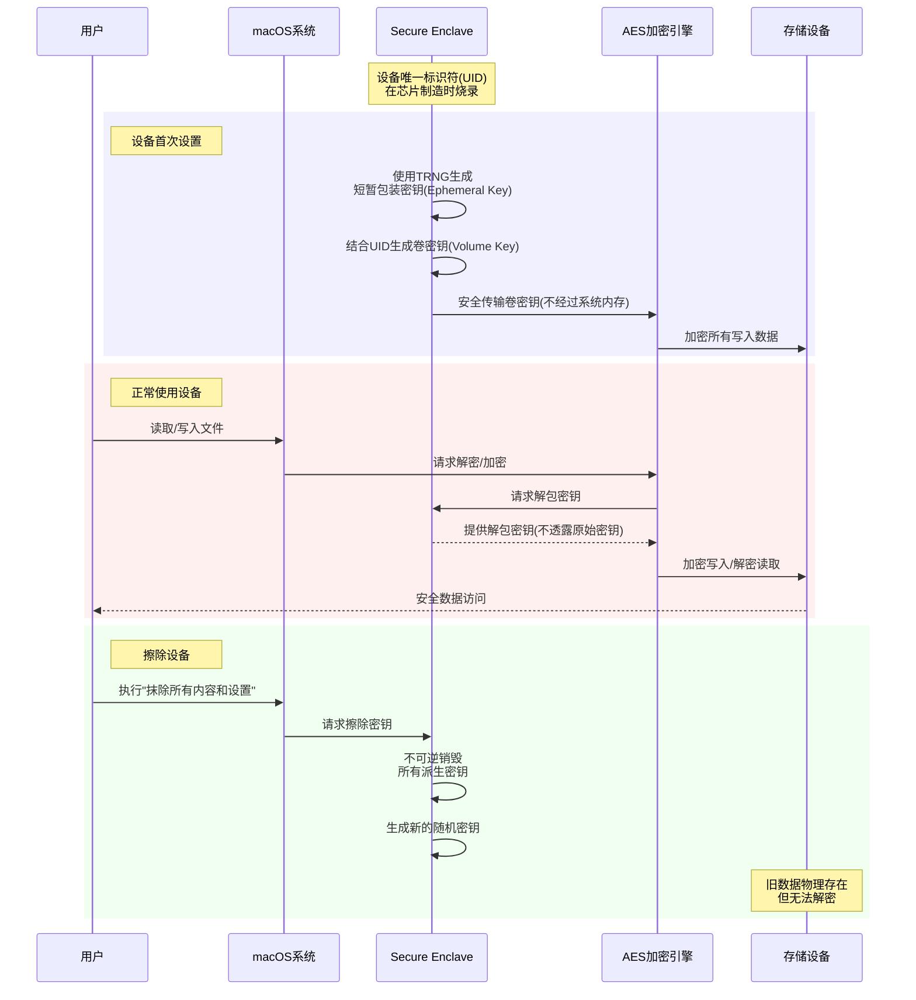

当你准备出售、赠送或以旧换新你的MacBook时，如何确保个人数据的安全？Apple的硬件加密技术提供了一种优雅而强大的解决方案，特别是在Apple Silicon芯片或T2安全芯片的Mac设备上。本文将揭示这些设备如何保护你的数据，并提供实用指南帮助你安全地擦除旧设备。

<!--more-->

## 为什么普通的"删除文件"不够安全？

小李是一位财务助理，他决定升级自己工作用的旧MacBook Air。作为处理公司财务数据的专业人士，他担心：**"如果我只是删除文件，数据恢复公司是否能够提取出我的敏感信息？"**

这是一个合理的担忧。传统的文件删除只是移除了文件系统中的索引，而实际数据仍保留在存储介质上，直到被新数据覆盖。专业的数据恢复服务确实可以恢复这些"删除"的文件。

但是，Apple的现代Mac设备采用了一种从根本上不同的方法——硬件级加密。

## Apple的硬件加密：安全的基石

### 现代Mac的加密是怎么工作的？

在配备Apple Silicon（M1、M2、M3系列）或T2安全芯片的Mac设备上，所有数据**始终**处于加密状态，即使你没有启用FileVault。这是因为这些设备采用了硬件级的强制加密（存储器上的所有数据一直都是加密的），区别仅在于加密密钥是如何保护的。

**Apple Silicon/T2 Mac安全架构图：展示了安全隔区和加密组件之间的关系**

这种加密系统的核心是：

1. **Secure Enclave（安全隔区）**：这是芯片内的一个独立安全处理器，与主系统隔离
2. **设备唯一标识符(UID)**：每台设备在制造时烧录的独特密钥，无法被读取或提取
3. **专用AES加密引擎**：处理实时数据加密/解密，无需降低性能

关键是，整个加密系统建立在**物理隔离**的基础上。密钥存储在安全区域中，即使是Apple公司也无法提取。

### 擦除过程：密钥销毁而非数据覆写

当你在Apple Silicon或T2 Mac上执行"抹除所有内容和设置"时，系统并不需要覆写所有数据（这在SSD上效率低且可能降低寿命）。相反，它只是销毁加密密钥。

**加密密钥生成与销毁流程：展示了从设备设置到数据擦除的完整过程**

这就像：你的文件被放在一个特殊的数学宝库中，只有通过特定的数学公式（密钥）才能将其中的内容转换为可读形式。当你销毁这个数学公式时，即使宝库本身及其内容仍然存在，但它已变成了无法破解的随机数字集合。随着新数据的写入，这些随机数字会逐渐被覆盖，但即使它们仍然存在，也永远无法还原为原始内容。

这种方法有几个显著优势：
- **瞬时完成**：仅销毁密钥比覆写整个驱动器快数千倍
- **更安全**：即使使用最先进的设备也无法恢复数据
- **保护SSD寿命**：避免不必要的写入周期

## 实操指南：安全擦除你的Mac

以下是擦除配备Apple Silicon或T2芯片Mac的步骤：

### 准备工作

1. **备份重要数据**：确保所有重要文件已安全备份
2. **注销账户**：退出iCloud、iTunes/App Store、iMessage等所有账户
3. **取下外接设备**：断开所有外部存储设备和配件

### 执行抹除过程

1. 前往**系统设置** > **通用** > **传输或重置**
2. 点击**抹除所有内容和设置**
3. 输入管理员密码确认
4. 按照屏幕提示完成重置过程

系统会自动重启进入恢复模式，并要求连接Wi-Fi。这是因为Mac需要：
- 与Apple服务器通信以解除激活锁
- 验证设备未被标记为丢失
- 完全清除与你Apple ID的关联

连接网络后，你会看到"本Mac已被激活"的提示，然后可以选择重新安装macOS或关机。

### 完整的恢复流程

如果你要将设备交给新用户，最好完成整个重置流程：

1. 在前面步骤后，选择**重新安装macOS**
2. 系统会自动下载安装最新版本的macOS
3. 完成后，设备将呈现"欢迎使用"界面，就像全新的Mac一样

## 常见问题解答

### 如果我的Mac没有启用FileVault，数据安全吗？

对于Apple Silicon或T2 Mac，即使没有启用FileVault，执行"抹除所有内容和设置"也能安全地销毁数据。硬件加密始终处于激活状态，区别仅在于密钥受到额外的用户密码保护与否。

### 为什么还需要FileVault？

虽然所有数据已经加密，但启用FileVault会增加额外的安全层：
- 开机必须输入密码才能访问数据
- 防止物理访问攻击（如设备被盗）
- 满足企业和合规性要求

### 旧款Mac如何安全擦除？

如果你的Mac没有Apple Silicon或T2芯片：
1. 确保启用FileVault并等待加密完成
2. 然后使用恢复模式中的磁盘工具擦除驱动器
3. 对于HDD，考虑使用安全抹除选项（写入零值）

## 结论

Apple的硬件加密架构为Mac用户提供了前所未有的数据安全保障。通过销毁加密密钥而非覆写数据，Apple创造了一种既安全又高效的数据清除机制。当你准备转手你的MacBook时，只需简单几步，就能确保个人数据永远不会落入他人之手。

对于现代Mac用户，这种安全设计意味着更少的担忧和更多的安心。无论你是升级到新设备，还是将旧Mac赠送给亲友，你的数据隐私都有最高级别的保护。

你是否还有关于Mac数据安全的疑问？欢迎在评论区分享你的想法和经验！
