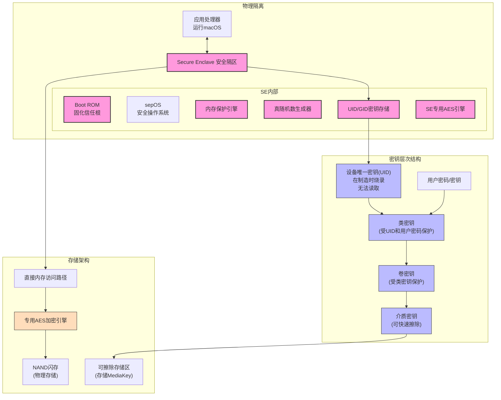
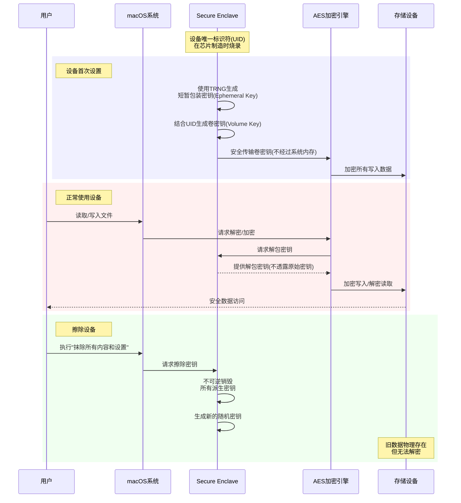

Когда вы готовы продать, подарить или сдать свой MacBook, как сохранить свои личные данные в безопасности? Технология аппаратного шифрования Apple предлагает элегантное и мощное решение, особенно в устройствах Mac с чипом Apple Silicon или чипом безопасности T2. В этой статье мы расскажем, как эти устройства защищают ваши данные, и дадим практические рекомендации, которые помогут вам безопасно стереть старое устройство.

<!--more-->

## 为什么普通的"删除文件"不够安全？

Ли, финансовый ассистент, решил обновить свой старый MacBook Air для работы. Как профессионал, работающий с финансовыми данными компании, он был обеспокоен:** "Если я просто удалю файлы, сможет ли компания по восстановлению данных извлечь мою конфиденциальную информацию?" **

Это вполне обоснованное беспокойство. При традиционном удалении файлов из файловой системы удаляются только индексы, а фактические данные остаются на носителе до тех пор, пока не будут перезаписаны новыми данными. Профессиональные службы восстановления данных действительно могут восстановить эти "удаленные" файлы.

Однако в современных устройствах Apple Mac используется принципиально иной подход - шифрование на аппаратном уровне.

## Apple的硬件加密：安全的基石

### 现代Mac的加密是怎么工作的？

На устройствах Mac с микросхемами безопасности Apple Silicon (серии M1, M2, M3) или T2 все данные **всегда** зашифрованы, даже если у вас не включен FileVault. Это потому, что в таких устройствах используется принудительное шифрование на аппаратном уровне (все данные в памяти всегда зашифрованы), и разница только в том, как защищен ключ шифрования.

**Диаграмма архитектуры безопасности Apple Silicon/T2 Mac: показывает взаимосвязь между отсеками безопасности и компонентами шифрования**.

В основе этой системы шифрования лежит:

1. **Защитный анклав**: это отдельный защищенный процессор внутри чипа, изолированный от основной системы.
2. **Уникальный идентификатор устройства (UID)**: уникальный ключ, записанный в каждое устройство при производстве, который невозможно прочитать или извлечь.
3. **Специализированный механизм шифрования AES**: обеспечивает шифрование/дешифрование данных в режиме реального времени без снижения производительности.

Ключ в том, что вся система шифрования построена на **физической изоляции**. Ключи хранятся в защищенном месте, которое не может извлечь даже Apple.

### 擦除过程：密钥销毁而非数据覆写

Когда вы выполняете команду "стереть все содержимое и настройки" на Apple Silicon или T2 Mac, система не перезаписывает все данные (что неэффективно для твердотельных накопителей и может сократить срок их службы). Вместо этого уничтожается ключ шифрования.

**Процесс создания и уничтожения ключей шифрования: показывает весь процесс от настройки устройства до стирания данных**.

Это выглядит так: ваши файлы помещены в специальную математическую сокровищницу, содержимое которой может быть преобразовано в читаемую форму только с помощью определенной математической формулы (ключа). Когда вы уничтожаете эту математическую формулу, даже если сама сокровищница и ее содержимое продолжают существовать, они превращаются в неуничтожимую коллекцию случайных чисел. Эти случайные числа постепенно перезаписываются по мере записи новых данных, но даже если они все еще существуют, восстановить их первоначальное содержание невозможно.

Такой подход имеет несколько существенных преимуществ:
- **Мгновенность**: уничтожение только ключа происходит в тысячи раз быстрее, чем перезапись всего диска.
- **Более безопасно**: данные невозможно восстановить даже с помощью самого современного оборудования
- **Защита срока службы SSD**: исключение ненужных циклов записи

## 实操指南：安全擦除你的Mac

Ниже описаны шаги по стиранию Mac с чипом Apple Silicon или T2:

### 准备工作

1. **Резервное копирование важных данных**: убедитесь, что все важные файлы надежно сохранены.
2. **Выйдите из учетных записей**: выйдите из всех учетных записей, таких как iCloud, iTunes/App Store, iMessage и т. д.
3. **Отключите внешние устройства**: отсоедините все внешние устройства хранения данных и аксессуары.

### 执行抹除过程

1. Перейдите в **Системные настройки** > **Общие** > **Передача или сброс**.
2. Нажмите **Стереть все содержимое и настройки**.
3. Введите пароль администратора для подтверждения.
4. Следуйте подсказкам на экране, чтобы завершить процесс сброса.

Система автоматически перезагрузится в режим восстановления и попросит подключиться к Wi-Fi. Это происходит потому, что Mac необходимо:
- установить связь с серверами Apple, чтобы снять блокировку активации
- Убедиться, что устройство не помечено как потерянное
- Полностью очистить ассоциацию с вашим Apple ID

После подключения к сети вы увидите сообщение "Этот Mac был активирован", а затем сможете выбрать, переустановить macOS или выключить компьютер.

### 完整的恢复流程

Если вы передаете устройство новому пользователю, лучше всего выполнить полный сброс настроек:

1. После выполнения предыдущих шагов выберите **Переустановить macOS**.
2. Система автоматически загрузит и установит последнюю версию macOS.
3. После этого устройство появится на экране "Добро пожаловать", как новый Mac.

## 常见问题解答

### 如果我的Mac没有启用FileVault，数据安全吗？

Для Apple Silicon или T2 Mac, даже если FileVault не включен, выполнение команды "стереть все содержимое и настройки" безопасно уничтожит данные. Аппаратное шифрование всегда активно, разница лишь в том, защищен ли ключ дополнительным паролем пользователя.

### 为什么还需要FileVault？

Хотя все данные уже зашифрованы, включение FileVault добавляет дополнительный уровень безопасности:
- Для доступа к данным необходимо ввести пароль при загрузке.
- Защита от атак с физическим доступом (например, кража устройства)
- Соответствует корпоративным и нормативным требованиям

### 旧款Mac如何安全擦除？

Если в вашем Mac нет чипа Apple Silicon или T2:
1. убедитесь, что FileVault включен, и дождитесь завершения шифрования.
2. затем используйте Дисковую утилиту в режиме восстановления, чтобы стереть диск.
3. для жестких дисков используйте опцию Secure Wipe (запись в ноль).

## 结论

Архитектура аппаратного шифрования Apple обеспечивает пользователям Mac беспрецедентную безопасность данных. Уничтожая ключ шифрования, а не перезаписывая данные, Apple создала механизм стирания данных, который является одновременно безопасным и эффективным. Когда вы будете готовы расстаться с MacBook, вам потребуется всего несколько простых шагов, чтобы гарантировать, что ваши личные данные никогда не попадут в чужие руки.

Для современных пользователей Mac этот безопасный дизайн означает меньше забот и больше душевного спокойствия. Неважно, переходите ли вы на новое устройство или дарите свой старый Mac другу или родственнику, конфиденциальность ваших данных будет защищена на самом высоком уровне.

Остались ли у вас вопросы о безопасности данных Mac? Не стесняйтесь делиться своими мыслями и опытом в разделе комментариев!