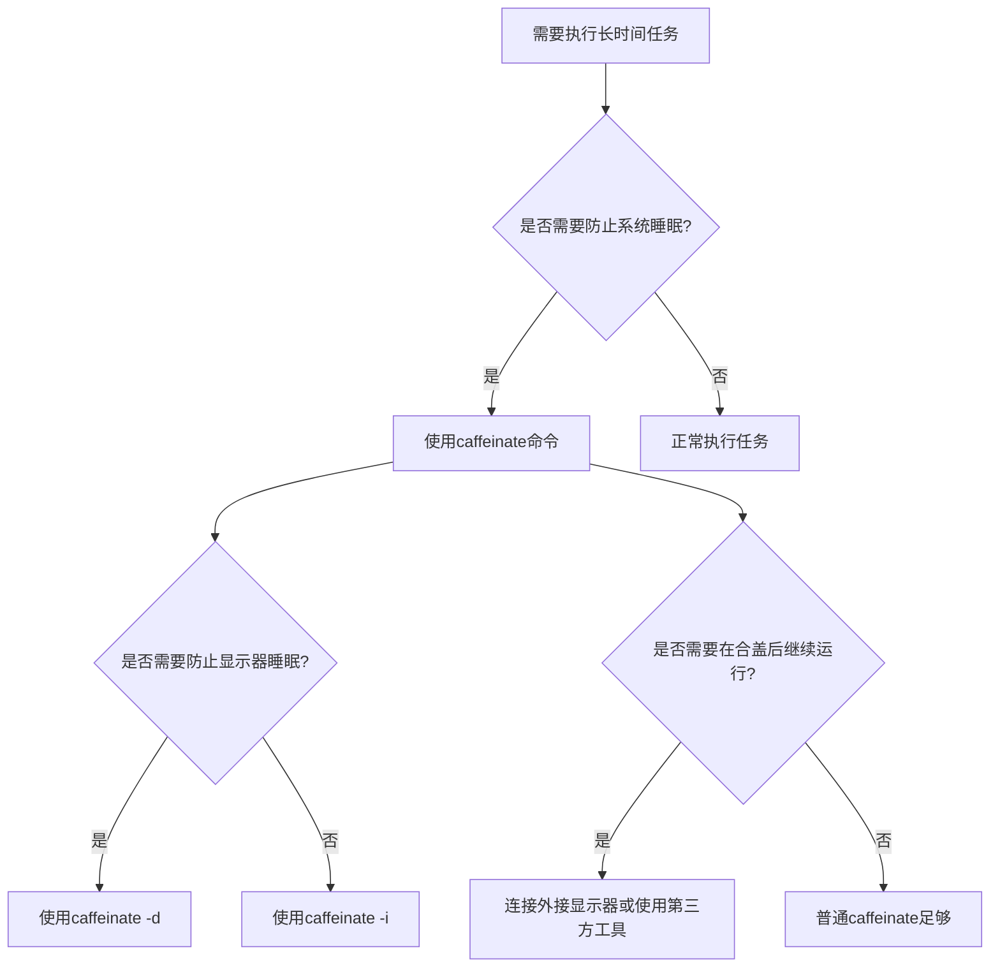
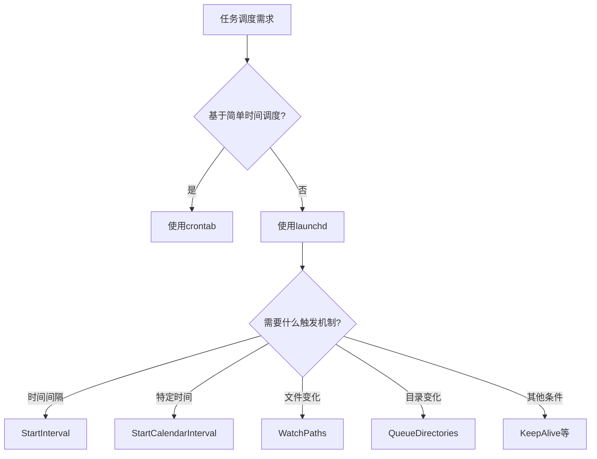

你是否遇到过这样的情况：一个重要的Terraform部署正在运行，你需要暂时离开，锁上了屏幕，回来后发现任务被系统休眠中断了？或者你明明只是合上了笔记本盖子，却意外终止了正在执行的重要任务？

<!--more-->

作为开发者或运维工程师，我们时常需要在macOS上执行长时间运行的任务。然而，系统的电源管理机制有时会与我们的工作需求相冲突。今天，我要向大家介绍一个可能被忽视但非常实用的macOS内置命令行工具——`caffeinate`，以及其他一些能显著提升工作效率的命令行宝藏。

## caffeinate：防止你的Mac睡眠的秘密武器

### 什么是caffeinate？

顾名思义，`caffeinate`就像给你的Mac注入咖啡因一样，让它保持清醒状态。这是macOS专有的命令行工具，可以防止系统进入睡眠状态，确保你的长时间任务不会被意外中断。

### 基本用法

```bash
caffeinate [选项] [命令]
```

当不带任何参数使用时，`caffeinate`会一直运行并防止系统睡眠，直到你按下Ctrl+C终止它。更实用的方式是将它与其他命令结合使用：

```bash
caffeinate terraform apply
```

这样，在Terraform应用配置的整个过程中，系统都不会进入睡眠状态。

### 常用选项

`caffeinate`提供了多种选项，让你可以精细控制系统的行为：

- `-d`：防止显示器睡眠
- `-i`：防止系统进入空闲睡眠状态
- `-m`：防止硬盘进入睡眠状态
- `-s`：防止系统进入睡眠状态（即使用户不活动）
- `-u`：声明用户处于活跃状态
- `-t`：指定超时时间（秒）

例如，如果你想让系统在执行备份的同时保持显示器和系统都不睡眠，可以使用：

```bash
caffeinate -di ./backup_script.sh
```

如果你只是想让系统保持活跃3小时（比如在下载大文件时），可以使用：

```bash
caffeinate -t 10800
```

### 限制

需要注意的是，`caffeinate`不能阻止合上笔记本盖子导致的系统睡眠。这是因为macOS对物理操作（如合盖）有特殊处理，通常会优先考虑硬件信号。如果确实需要在合盖情况下继续运行任务，可以考虑：

1. 连接外接显示器，并在系统偏好设置中配置"当显示器关闭时，防止电脑自动进入睡眠"
2. 使用第三方工具如Amphetamine或InsomniaX，它们提供了更强大的防睡眠控制



## 其他macOS命令行宝藏

除了`caffeinate`，macOS还内置了许多其他鲜为人知但非常有用的命令行工具。下面介绍几个最实用的：

### 1. pmset - 电源管理高级控制

如果你需要对电源管理进行更持久、更精细的控制，`pmset`是比`caffeinate`更强大的工具：

```bash
# 显示当前所有电源管理设置
pmset -g

# 临时禁用睡眠（直到重启）
sudo pmset -a disablesleep 1

# 恢复默认设置
sudo pmset -a disablesleep 0
```

### 2. mdfind - Spotlight的命令行版本

尽管您提到更喜欢使用`rg`在特定目录中搜索，但`mdfind`对于全盘快速搜索还是很有用的：

```bash
# 搜索文件名包含"terraform"的文件
mdfind -name "terraform"

# 搜索内容包含特定文本的文件
mdfind "contains terraform apply"
```

如果不需要这个功能，可以通过以下命令禁用Spotlight索引：

```bash
sudo mdutil -a -i off
```

### 3. pbcopy & pbpaste - 命令行访问剪贴板

这两个命令允许你在命令行和系统剪贴板之间传输数据：

```bash
# 复制SSH公钥到剪贴板
cat ~/.ssh/id_rsa.pub | pbcopy

# 将剪贴板内容保存到文件
pbpaste > notes.txt
```

### 4. say - 文本转语音

这个有趣的命令可以让你的Mac朗读文本，对于长时间运行的任务完成通知特别有用：

```bash
# 英文朗读
say "Terraform deployment completed"

# 中文朗读（使用Tingting语音）
say -v Tingting "部署已完成"
```

配合之前的工具，你可以创建一个在任务完成后通知你的命令：

```bash
caffeinate terraform apply && say -v Tingting "Terraform部署已完成"
```

### 5. networkQuality - 网络质量测试

macOS Monterey及更高版本提供了这个内置的网络性能测试工具：

```bash
networkQuality -v
```

它会测试你的上传和下载速度，以及延迟等指标，比在浏览器中打开测速网站更加便捷。

### 6. sips - 命令行图像处理

这个强大的图像处理工具可以在不打开任何图形界面软件的情况下处理图片：

```bash
# 调整图像大小，保持比例
sips -Z 800 image.jpg

# 转换图像格式
sips -s format png image.jpg --out image.png
```

### 7. defaults - 系统设置管理

通过这个命令，你可以读取和修改许多系统和应用程序的设置：

```bash
# 启用Dock自动隐藏
defaults write com.apple.dock autohide -bool true
killall Dock

# 显示隐藏文件
defaults write com.apple.finder AppleShowAllFiles -bool true
killall Finder
```

### 8. launchctl vs crontab - 任务调度的进化

尽管Linux用户对`crontab`可能更熟悉，但macOS的`launchctl`提供了更强大的功能：

```bash
# 列出所有运行中的服务
launchctl list

# 查看特定服务详情
launchctl list | grep ssh
```

相比`crontab`只能基于时间触发任务，`launchctl`可以：
- 基于各种条件触发任务（文件更改、设备连接等）
- 自动重启失败的任务
- 按需启动服务
- 更好地管理资源和依赖关系

配置`launchd`服务需要创建plist文件，虽然比`crontab`复杂一些，但提供了更大的灵活性。



## 实际应用场景

让我们看看如何在实际工作中组合使用这些工具：

### 场景1：远程服务器部署

假设你需要在本地执行一个可能需要几小时的Terraform部署到云服务器：

```bash
caffeinate terraform apply && say -v Tingting "部署已完成"
```

这样，即使你离开电脑，系统也不会进入睡眠状态，部署完成后还会通过语音提醒你。

### 场景2：批量图像处理

需要处理大量图片进行网站更新：

```bash
for file in *.jpg; do
  caffeinate sips -Z 1200 "$file" --out "resized/$file"
done && say "图像处理完成"
```

### 场景3：定期备份与监控

使用`launchd`创建一个每日备份脚本，条件是连接到特定WiFi网络：

1. 创建plist文件：`~/Library/LaunchAgents/com.user.backup.plist`
2. 配置触发条件、环境变量和执行命令
3. 加载服务：`launchctl load ~/Library/LaunchAgents/com.user.backup.plist`

## 结语

macOS内置了许多强大的命令行工具，能够显著提升开发者和运维工程师的工作效率。从防止系统睡眠的`caffeinate`，到强大的任务调度系统`launchd`，这些工具为macOS用户提供了丰富的功能，让命令行操作更加高效和灵活。

通过学习和掌握这些工具，你可以创建更加自动化和可靠的工作流程，避免因系统行为导致的意外中断，并充分利用macOS系统的强大功能。

**探索问题**：你使用过macOS中哪些鲜为人知但很实用的命令行工具？它们是如何帮助你解决工作中的实际问题的？欢迎在评论区分享你的经验！

<!-- 注：文章中适当位置可以添加macOS Terminal或各个工具操作的截图，以增强可读性 -->
