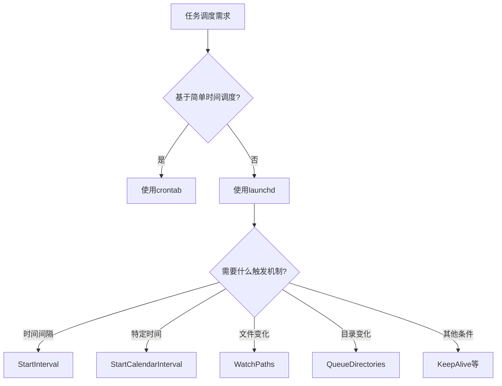

Случалось ли вам попадать в ситуацию, когда выполнялось важное развертывание Terraform, а вам нужно было отлучиться на время, вы заблокировали экран и, вернувшись, обнаружили, что задача прервана из-за гибернации системы? Или, может быть, вы просто закрыли крышку ноутбука и случайно прервали выполнение важной задачи?

<! -еще-->

Нам, разработчикам или операционным инженерам, часто приходится выполнять длительные задачи на macOS. Однако механизм управления питанием системы иногда вступает в противоречие с нашими требованиями к работе. Сегодня я хочу познакомить вас с возможно упущенным из виду, но очень полезным встроенным инструментом командной строки macOS - `caffeinate` - а также с рядом других сокровищ командной строки, которые могут значительно повысить эффективность работы.

## caffeinate: секретное оружие, которое не даст вашему Mac уснуть

### Что такое caffeinate?

Как следует из названия, __PROTECTED_INLINE_CODE__19__ - это как впрыскивание кофеина в ваш Mac, чтобы он не заснул. Это собственный инструмент командной строки для macOS, который не дает системе заснуть и гарантирует, что ваши длительные задачи не будут неожиданно прерваны.

### Базовое использование

```bash
caffeinate [选项] [命令]
```

При использовании без аргументов команда `caffeinate` запускается и не дает системе спать, пока вы не нажмете Ctrl+C для ее завершения. Более практичным способом его использования является сочетание с другими командами:

```bash
caffeinate terraform apply
```.

Таким образом, система не будет уходить в сон на протяжении всего процесса настройки приложения Terraform.

### Общие опции

`caffeinate` предоставляет множество опций, которые позволяют точно настроить поведение системы:

- `-d`: Предотвращает переход монитора в спящий режим.
- `-i`: предотвращает переход системы в состояние бездействующего сна.
- `-m`: предотвращает переход жесткого диска в спящий режим
- __PROTECTED_INLINE_CODE__25__: предотвращает переход системы в спящий режим (даже если пользователь неактивен)
- __PROTECTED_INLINE_CODE__26__: объявляет, что пользователь активен
- `-t`: задает тайм-аут в секундах

Например, если вы хотите, чтобы монитор и система не спали, пока система выполняет резервное копирование, вы можете использовать:

```bash
caffeinate -di ./backup_script.sh
```.

Если вы просто хотите, чтобы система оставалась активной в течение 3 часов (например, во время загрузки большого файла), вы можете использовать:

```bash
caffeinate -t 10800
```

### Limit

Обратите внимание, что `caffeinate` не предотвращает системный сон, вызванный закрытием крышки ноутбука. Это связано с тем, что macOS имеет специальную обработку физических операций (таких как закрытие крышки) и обычно отдает приоритет аппаратным сигналам. Учтите это, если вам нужно продолжать выполнение задач при закрытой крышке:

1. подключить внешний монитор и настроить System Preferences на "запрет автоматического перехода компьютера в спящий режим при выключении монитора".
2. использование сторонних инструментов, таких как Amphetamine или InsomniaX, которые предлагают более мощные средства борьбы со сном.

```mermaid
flowchart TD
    A[需要执行长时间任务] --> B{是否需要防止系统睡眠?}
    B -->|是| C[使用caffeinate命令]
    B -->|否| D[正常执行任务]
    C --> E{是否需要防止显示器睡眠?}
    E -->|是| F[使用caffeinate -d]
    E -->|否| G[使用caffeinate -i]
    C --> H{是否需要在合盖后继续运行?}
    H -->|是| I[连接外接显示器或使用第三方工具]
    H -->|否| J[普通caffeinate足够]
```.

## Другие сокровища командной строки macOS

Помимо `caffeinate`, в macOS встроен ряд других малоизвестных, но очень полезных инструментов командной строки. Вот несколько наиболее полезных из них:

### 1. pmset - расширенный контроль управления питанием

Если вам нужен более настойчивый и тонкий контроль над управлением питанием, `pmset` - более мощный инструмент, чем `caffeinate`:

```bash
# 显示当前所有电源管理设置
pmset -g

# 临时禁用睡眠（直到重启）
sudo pmset -a disablesleep 1

# 恢复默认设置
sudo pmset -a disablesleep 0
```.

### 2. mdfind - версия Spotlight для командной строки

Хотя вы упомянули, что предпочитаете использовать `rg` для поиска в определенном каталоге, `mdfind` полезен для быстрого поиска по всему диску:

```bash
# 搜索文件名包含"terraform"的文件
mdfind -name "terraform"

# 搜索内容包含特定文本的文件
mdfind "contains terraform apply"
```.

Если вам не нужна эта функция, вы можете отключить индексирование Spotlight с помощью следующей команды:

```bash
sudo mdutil -a -i off
```

### 3. pbcopy & pbpaste - доступ к буферу обмена из командной строки

Эти две команды позволяют переносить данные между командной строкой и системным буфером обмена:

```bash
# 复制SSH公钥到剪贴板
cat ~/.ssh/id_rsa.pub | pbcopy

# 将剪贴板内容保存到文件
pbpaste > notes.txt
```.

### 4. say - преобразование текста в речь

Эта забавная команда позволяет вашему Mac читать текст вслух и особенно полезна для уведомлений о завершении длительных задач:

```bash
# 英文朗读
say "Terraform deployment completed"

# 中文朗读（使用Tingting语音）
say -v Tingting "部署已完成"
```

Вместе с предыдущим инструментом вы можете создать команду, которая будет уведомлять вас о завершении задачи:

```bash
caffeinate terraform apply && say -v Tingting "Terraform部署已完成"
```

### 5. networkQuality - тест качества сети

В macOS Monterey и выше есть этот встроенный инструмент для тестирования производительности сети:

```bash
networkQuality -v
```.

С его помощью вы сможете проверить скорость загрузки и выгрузки, а также задержку и другие показатели, что гораздо проще, чем открывать сайт тестирования скорости в браузере.

### 6. sips - обработка изображений в командной строке

Этот мощный инструмент обработки изображений позволяет обрабатывать их, не открывая никаких программ с графическим интерфейсом:

```bash
# 调整图像大小，保持比例
sips -Z 800 image.jpg

# 转换图像格式
sips -s format png image.jpg --out image.png
```.

### 7. defaults - управление системными настройками

С помощью этой команды можно считывать и изменять многие настройки системы и приложений:

```bash
# 启用Dock自动隐藏
defaults write com.apple.dock autohide -bool true
killall Dock

# 显示隐藏文件
defaults write com.apple.finder AppleShowAllFiles -bool true
killall Finder
```.

### 8. launchctl vs crontab - эволюция планирования задач

Хотя пользователи Linux могут быть более знакомы с `crontab`, в macOS `launchctl` предлагает гораздо больше возможностей:

```bash
# 列出所有运行中的服务
launchctl list

# 查看特定服务详情
launchctl list | grep ssh
```

По сравнению с `crontab`, который может запускать задачи только на основе времени, `launchctl` может:
- Запускать задачи на основе различных условий (изменения файлов, подключения устройств и т. д.)
- Автоматически перезапускать неудачные задачи
- Запускать службы по требованию
- Лучше управлять ресурсами и зависимостями

Настройка службы `launchd` требует создания plist-файла, который немного сложнее, чем `crontab`, но обеспечивает большую гибкость.



## Практические сценарии применения

Давайте посмотрим, как можно использовать комбинацию этих инструментов на практике:

### Сценарий 1: Удаленное развертывание сервера

Допустим, вам нужно выполнить развертывание Terraform на облачном сервере локально, что может занять несколько часов:

```bash
caffeinate terraform apply && say -v Tingting "部署已完成"
```.

Таким образом, система не перейдет в спящий режим, даже если вы отойдете от компьютера, и вы получите голосовое уведомление о завершении развертывания.

### Сценарий 2: Пакетная обработка изображений

Необходимо обработать большое количество изображений для обновления веб-сайта:

```bash
for file in *.jpg; do
  caffeinate sips -Z 1200 "$file" --out "resized/$file"
done && say "图像处理完成"
```.

### Сценарий 3: Регулярное резервное копирование и мониторинг

Создайте ежедневный сценарий резервного копирования с использованием `launchd`, обусловленный подключением к определенной сети WiFi:

1. создайте plist-файл: __PROTECTED_INLINE_CODE__41__.
2. настройте условия срабатывания, переменные окружения и команды выполнения.
3. загрузите службу: `launchctl load ~/Library/LaunchAgents/com.user.backup.plist`.

## Заключение

macOS имеет ряд мощных встроенных инструментов командной строки, которые могут значительно повысить производительность разработчиков и операционных инженеров. От `caffeinate`, предотвращающего переход системы в спящий режим, до `launchd`, мощной системы планирования задач, - эти инструменты предоставляют пользователям macOS широкие функциональные возможности, которые делают работу в командной строке более эффективной и гибкой.

Изучив и освоив эти инструменты, вы сможете создавать более автоматизированные и надежные рабочие процессы, избегать незапланированных перерывов в работе из-за поведения системы и в полной мере использовать всю мощь системы macOS.

**Вопрос**: Какие из малоизвестных, но полезных инструментов командной строки в macOS вы использовали? Как они помогли вам решить практические проблемы в работе? Не стесняйтесь делиться своим опытом в разделе комментариев!

<! -- Примечание: В соответствующих местах статьи могут быть добавлены скриншоты Терминала macOS или отдельных операций с инструментами для улучшения читабельности -->
