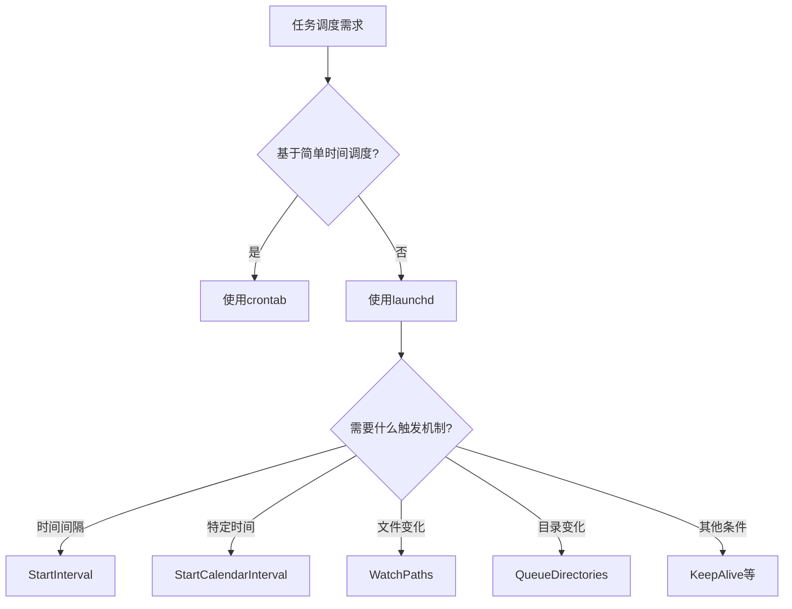

Случалось ли вам попадать в ситуацию, когда выполнялось важное развертывание Terraform, а вам нужно было отлучиться на время, вы заблокировали экран и, вернувшись, обнаружили, что задача прервана из-за гибернации системы? Или, может быть, вы просто закрыли крышку ноутбука и случайно прервали выполнение важной задачи?

<!--more-->

Будучи разработчиками или инженерами по эксплуатации, мы время от времени сталкиваемся с необходимостью выполнять длительные задачи на macOS. Однако механизм управления питанием системы иногда вступает в противоречие с нашими требованиями к работе. Сегодня я хочу познакомить вас с возможно упущенным из виду, но очень полезным встроенным инструментом командной строки macOS - `caffeinate`, а также с рядом других сокровищ командной строки, которые могут значительно повысить эффективность работы.

## caffeinate：防止你的Mac睡眠的秘密武器

### 什么是caffeinate？

Как следует из названия, `caffeinate` - это как впрыскивание кофеина в ваш Mac, чтобы он не заснул. Это собственный инструмент командной строки для macOS, который предотвращает переход системы в спящий режим и гарантирует, что ваши длительные задачи не будут неожиданно прерваны.

### 基本用法

```bash
caffeinate [选项] [命令]
```

При использовании без аргументов `caffeinate` запустится и не даст системе уснуть, пока вы не нажмете Ctrl+C для ее завершения. Более практичный способ - использовать его в сочетании с другими командами:

```bash
caffeinate terraform apply
```

Таким образом, система не переходит в спящий режим в течение всего процесса настройки приложения Terraform.

### 常用选项

`caffeinate` предоставляет множество опций, позволяющих тонко управлять поведением системы:

- `-d`: предотвращение перехода монитора в спящий режим
- `-i`: предотвращает переход системы в состояние бездействующего сна
- `-m`: предотвращает переход жестких дисков в спящий режим
- `-s`: предотвращает переход системы в спящий режим (даже если пользователь неактивен)
- `-u`: объявить пользователей активными
- `-t`: задает тайм-аут (в секундах)

Например, если вы хотите, чтобы монитор и система не спали, пока система выполняет резервное копирование, вы можете использовать:

```bash
caffeinate -di ./backup_script.sh
```

Вы можете использовать его, если хотите, чтобы система оставалась активной в течение 3 часов (например, при загрузке больших файлов):

```bash
caffeinate -t 10800
```

### 限制

Обратите внимание, что `caffeinate` не предотвращает системный сон, вызванный закрытием крышки ноутбука. Это связано с тем, что macOS имеет специальную обработку физических операций (таких как закрытие крышки) и обычно отдает приоритет аппаратным сигналам. Если вам необходимо продолжать выполнение задач при закрытой крышке, обратите внимание на следующее:

1. Подключите внешний монитор и настройте "Запрет автоматического перехода компьютера в спящий режим при выключении монитора" в "Системных настройках".
2. используйте сторонние инструменты, такие как Amphetamine или InsomniaX, которые обеспечивают более мощные средства борьбы со сном.


## 其他macOS命令行宝藏

Помимо `caffeinate`, в macOS встроен ряд других малоизвестных, но очень полезных инструментов командной строки. Вот несколько наиболее полезных из них:

### 1. pmset - 电源管理高级控制

Если вам нужен более постоянный и тонкий контроль над управлением питанием, `pmset` - более мощный инструмент, чем `caffeinate`:

```bash
# 显示当前所有电源管理设置
pmset -g

# 临时禁用睡眠（直到重启）
sudo pmset -a disablesleep 1

# 恢复默认设置
sudo pmset -a disablesleep 0
```

### 2. mdfind - Spotlight的命令行版本

Хотя вы упомянули, что предпочитаете использовать `rg` для поиска в определенном каталоге, `mdfind` полезен для быстрого поиска по всему диску:

```bash
# 搜索文件名包含"terraform"的文件
mdfind -name "terraform"

# 搜索内容包含特定文本的文件
mdfind "contains terraform apply"
```

Если вам не нужна эта функция, вы можете отключить индексирование Spotlight с помощью следующей команды:

```bash
sudo mdutil -a -i off
```

### 3. pbcopy & pbpaste - 命令行访问剪贴板

Эти две команды позволяют передавать данные между командной строкой и системным буфером обмена:

```bash
# 复制SSH公钥到剪贴板
cat ~/.ssh/id_rsa.pub | pbcopy

# 将剪贴板内容保存到文件
pbpaste > notes.txt
```

### 4. say - 文本转语音

Эта забавная команда позволяет вашему Mac читать текст вслух и особенно полезна для уведомлений о завершении долгой задачи:

```bash
# 英文朗读
say "Terraform deployment completed"

# 中文朗读（使用Tingting语音）
say -v Tingting "部署已完成"
```

В сочетании с предыдущим инструментом вы можете создать команду, которая будет уведомлять вас о завершении задачи:

```bash
caffeinate terraform apply && say -v Tingting "Terraform部署已完成"
```

### 5. networkQuality - 网络质量测试

В macOS Monterey и более поздних версиях есть этот встроенный инструмент для тестирования производительности сети:

```bash
networkQuality -v
```

Он проверит скорость загрузки и выгрузки, а также задержку и другие показатели, что проще, чем открывать сайт тестирования скорости в браузере.

### 6. sips - 命令行图像处理

Этот мощный инструмент для работы с изображениями может обрабатывать их без открытия графического интерфейса:

```bash
# 调整图像大小，保持比例
sips -Z 800 image.jpg

# 转换图像格式
sips -s format png image.jpg --out image.png
```

### 7. defaults - 系统设置管理

С помощью этой команды можно считывать и изменять многие параметры системы и приложений:

```bash
# 启用Dock自动隐藏
defaults write com.apple.dock autohide -bool true
killall Dock

# 显示隐藏文件
defaults write com.apple.finder AppleShowAllFiles -bool true
killall Finder
```

### 8. launchctl vs crontab - 任务调度的进化

Хотя пользователи Linux могут быть более знакомы с `crontab`, в macOS `launchctl` предлагает гораздо больше возможностей:

```bash
# 列出所有运行中的服务
launchctl list

# 查看特定服务详情
launchctl list | grep ssh
```

По сравнению с `crontab`, который может запускать задачи только по времени, `launchctl` может:
- Запускать задания на основе различных условий (изменения файлов, подключения устройств и т.д.)
- Автоматически перезапускать неудачные задачи
- Запускать службы по требованию
- Лучше управлять ресурсами и зависимостями

Настройка службы `launchd` требует создания plist-файла, который немного сложнее, чем `crontab`, но обеспечивает большую гибкость.



## 实际应用场景

Давайте посмотрим, как можно использовать эти инструменты в сочетании друг с другом на практике:

### 场景1：远程服务器部署

Допустим, вам нужно выполнить развертывание Terraform на облачном сервере локально, что может занять несколько часов:

```bash
caffeinate terraform apply && say -v Tingting "部署已完成"
```

Таким образом, система не перейдет в спящий режим, даже если вы отойдете от компьютера, и вы получите голосовое напоминание о завершении развертывания.

### 场景2：批量图像处理

Необходимо обработать большое количество изображений для обновления сайта:

```bash
for file in *.jpg; do
  caffeinate sips -Z 1200 "$file" --out "resized/$file"
done && say "图像处理完成"
```

### 场景3：定期备份与监控

Используйте `launchd` для создания ежедневного сценария резервного копирования, обусловленного подключением к определенной сети WiFi:

1. Создайте plist-файл: `~/Library/LaunchAgents/com.user.backup.plist`.
2. Настройте условия запуска, переменные окружения и команды выполнения.
3. Загрузите службу: `launchctl load ~/Library/LaunchAgents/com.user.backup.plist`.

## 结语

macOS имеет ряд мощных встроенных инструментов командной строки, которые могут значительно повысить производительность труда разработчиков и операционных инженеров. От `caffeinate`, предотвращающего засыпание системы, до `launchd`, мощной системы планирования задач, эти инструменты предоставляют пользователям macOS широкие функциональные возможности для повышения эффективности и гибкости работы в командной строке.

Изучив и освоив эти инструменты, вы сможете создавать более автоматизированные и надежные рабочие процессы, избегать незапланированных перерывов в работе из-за поведения системы и в полной мере использовать возможности системы macOS.

**Исследовательский вопрос**: какие из менее известных, но полезных инструментов командной строки в macOS вы использовали? Как они помогли вам решить практические проблемы в работе? Не стесняйтесь делиться своим опытом в разделе комментариев!

<!-- 注：文章中适当位置可以添加macOS Terminal或各个工具操作的截图，以增强可读性 -->