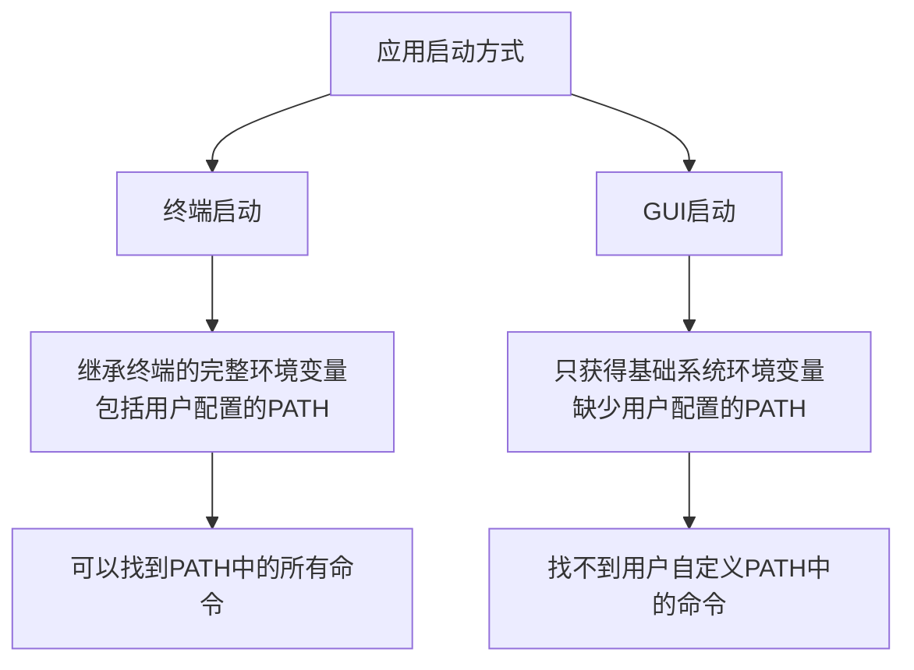

你是否遇到过这种情况：明明在终端里能正常使用的命令，通过图形界面启动的应用却无法找到？比如在终端中输入`node -v`能正常显示版本，但从Dock或Finder启动的应用却报错找不到node命令？最近我解决了一个类似的问题，想和大家分享其中的原理和解决方法。

<!--more-->

## 问题现象

我们在使用桌面端的Claude应用时发现了一个有趣的现象：

- 如果从终端使用命令`open -a Claude`启动应用，应用能正常找到并使用系统PATH中的命令（如node、python等）
- 但如果通过双击应用图标启动，应用就会提示找不到这些明明已经安装的命令

这个问题并非Claude特有，另一款名为ChatMCP的开源软件也存在相同的问题。开发者提交了一个[PR](https://github.com/daodao97/chatmcp/pull/48)来解决这个问题，让我们来分析一下这个问题的本质和解决方案。

## 问题原因：macOS中的两种环境变量加载机制



在macOS（以及其他Unix/Linux系统）中，应用程序的启动方式会直接影响其能够访问的环境变量：

### 终端启动模式

当你在终端中运行命令启动应用时，应用会继承终端的完整环境变量，包括：

1. 系统环境变量
2. 用户配置文件（如`.bash_profile`、`.zshrc`等）中定义的环境变量
3. 当前终端会话中设置的环境变量

这是为什么从终端启动的应用能正常找到PATH中的命令 - 它们能"看到"完整的PATH配置。

### GUI启动模式

然而，当你通过点击图标启动应用时，情况就完全不同了：

1. GUI应用只能访问系统提供的一组基础环境变量
2. 用户shell配置文件（`.bash_profile`、`.zshrc`等）**不会被自动加载**
3. 只有一个非常基础的PATH变量，通常只包含几个系统目录

这就是为什么通过图形界面启动的应用找不到那些你在终端下能正常使用的命令 - 它们根本"看不到"完整的PATH配置！

## 解决方案：模拟shell启动过程

ChatMCP项目的PR提供了一个非常巧妙的解决方案，本质上是通过代码模拟shell的启动过程，手动加载那些通常只有在终端启动时才会加载的环境变量。

### 解决思路

1. 创建一个临时shell脚本，模拟shell启动时的环境变量加载顺序
2. 执行这个脚本并获取其环境变量输出
3. 将这些环境变量应用到应用程序中

### 代码实现关键步骤

```dart
// 获取用户的默认shell
final String shell = Platform.environment['SHELL'] ?? '/bin/bash';
final String homeDir = Platform.environment['HOME'] ?? '';

// 创建临时shell脚本
final tempDir = await Directory.systemTemp.createTemp('env_loader');
final scriptFile = File('${tempDir.path}/load_env.sh');

// 写入脚本内容 - 关键部分
await scriptFile.writeAsString('''
#!/bin/sh
# 设置基本环境
export HOME="$homeDir"
export SHELL="$shell"
export TERM="xterm-256color"
export LANG="en_US.UTF-8"

# 加载系统级配置
if [ -f /etc/profile ]; then
  . /etc/profile
fi

# 根据不同的shell加载配置
if [ -n "\$BASH_VERSION" ]; then
  if [ -f "\$HOME/.bash_profile" ]; then
    . "\$HOME/.bash_profile"
  elif [ -f "\$HOME/.profile" ]; then
    . "\$HOME/.profile"
  fi
elif [ -n "\$ZSH_VERSION" ]; then
  if [ -f "\$HOME/.zshrc" ]; then
    . "\$HOME/.zshrc"
  fi
fi

# 输出所有环境变量
env
''');

// 执行脚本并获取环境变量
final result = await Process.run(shell, [
  scriptFile.path
]);

// 将获取的环境变量应用到应用程序中
final Map<String, String> env = {};
final lines = result.stdout.toString().split('\n');
for (final line in lines) {
  final parts = line.split('=');
  if (parts.length >= 2) {
    final key = parts[0];
    final value = parts.sublist(1).join('=');
    env[key] = value;
  }
}
```

这个解决方案非常巧妙，它本质上是"骗过了"系统，让GUI应用能够获取到通常只有终端应用才能获取的完整环境变量。

## 进一步解读：环境变量加载原理

理解了这个问题后，让我们更深入地看看macOS中环境变量的加载机制：

### 系统级环境变量

macOS有一套系统级的环境变量设置机制：

- `/etc/profile` - 系统级配置
- `/etc/paths` - 系统PATH配置
- `/etc/paths.d/` - 系统PATH配置目录

无论终端还是GUI应用，系统级环境变量通常都是可访问的。

### 用户级环境变量

用户级环境变量通常在以下文件中定义：

- `~/.bash_profile` - Bash用户配置
- `~/.zshrc` - Zsh用户配置 
- `~/.fish/config.fish` - Fish shell用户配置

**关键点**：这些用户配置只在终端启动时自动加载，GUI应用不会自动加载它们！

### 如何确定正确的shell类型？

PR中使用了一个巧妙的方法来确定用户的默认shell：

```dart
final String shell = Platform.environment['SHELL'] ?? '/bin/bash';
```

即使在GUI环境下，`SHELL`环境变量通常也是可用的，因为它是macOS在用户登录时从用户数据库中读取并设置的基本环境变量之一。如果实在获取不到，则默认使用最常见的`/bin/bash`。

## 应用到其他项目

如果你的应用也遇到了类似问题，可以采用类似的解决方案：

1. 创建一个临时脚本来模拟shell启动过程
2. 执行脚本并获取环境变量
3. 将这些环境变量应用到你的应用程序中

在Electron应用、Flutter应用或其他桌面应用中，这种方法都适用。

## 总结

这个看似简单的问题背后，实际上反映了操作系统环境变量加载机制的复杂性。macOS（以及其他Unix系统）区分了终端启动和GUI启动的应用程序，为它们提供了不同的环境变量集合。

通过理解这一机制，并编写代码来模拟shell的启动过程，我们可以解决GUI应用找不到PATH中命令的问题，让应用无论通过何种方式启动，都能访问到用户配置的完整环境变量。

这种解决方案优雅而有效，展示了深入理解操作系统机制对于解决实际开发问题的重要性。

你有没有遇到过类似的环境变量问题？欢迎在评论区分享你的经验和解决方案！
