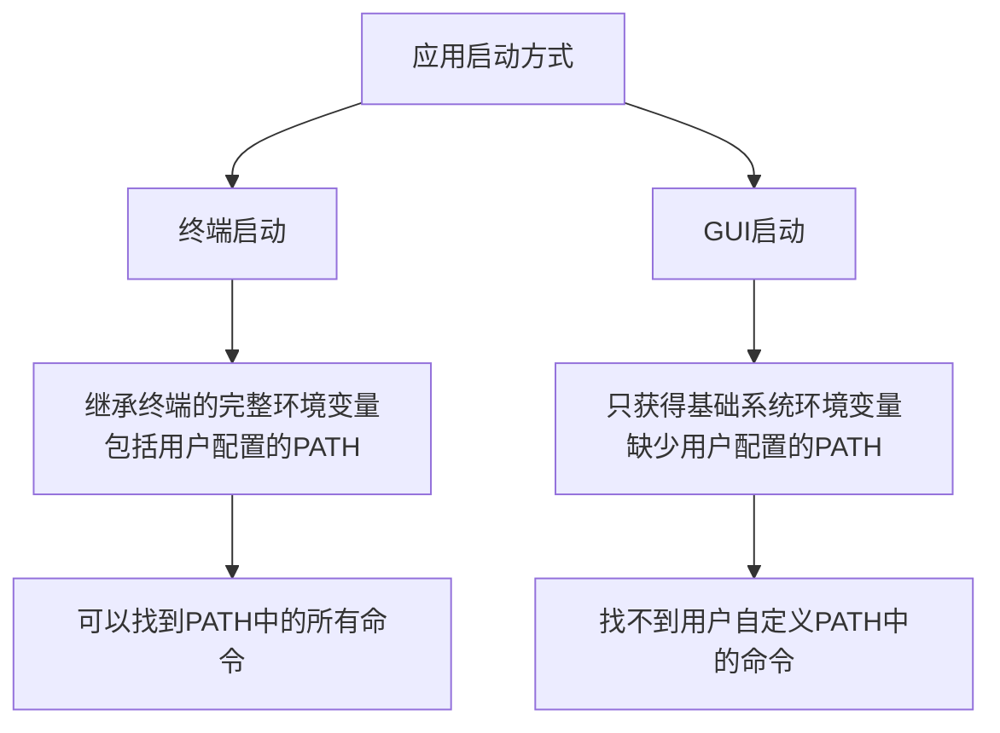

Сталкивались ли вы с ситуацией, когда команда, отлично работающая в терминале, не может быть найдена приложением, запущенным через графический интерфейс? Например, при наборе `node -v` в терминале версия отображается нормально, но приложения, запущенные из Dock или Finder, сообщают, что команда node не найдена? Недавно я решил подобную проблему и хотел бы поделиться с вами ее обоснованием и решением.

<!--more-->

## 问题现象

Во время работы с настольным приложением Claude мы обнаружили интересное явление:

- Если запустить приложение из терминала командой `open -a Claude`, оно прекрасно находит и использует команды в системном PATH (например, node, python и т. д.)!
- Но если запустить приложение двойным щелчком на значке приложения, оно говорит, что не может найти эти команды, которые уже установлены.

Эта проблема характерна не только для Claude, аналогичная проблема есть и у другого программного обеспечения с открытым исходным кодом под названием ChatMCP. Разработчик представил [PR](https://github.com/daodao97/chatmcp/pull/48) для решения этой проблемы, так что давайте проанализируем природу проблемы и ее решение.

## 问题原因：macOS中的两种环境变量加载机制



В macOS (и других системах Unix/Linux) способ запуска приложения напрямую влияет на переменные окружения, к которым оно может обращаться:

### 终端启动模式

Когда вы запускаете приложение, выполнив команду в терминале, приложение наследует все переменные окружения терминала, включая:

1. переменные окружения системы
2. переменные окружения, определенные в пользовательских конфигурационных файлах (например, `.bash_profile`, `.zshrc` и т. д.)
3. переменные окружения, установленные в текущей терминальной сессии

Именно поэтому приложения, запускаемые с терминала, нормально находят команды в PATH - они "видят" полную конфигурацию PATH.

### GUI启动模式

Однако, когда вы запускаете приложение, нажав на иконку, это совершенно другая история:

1. приложения с графическим интерфейсом могут получить доступ только к набору базовых переменных окружения, предоставляемых системой.
2. конфигурационные файлы пользовательской оболочки (`.bash_profile`, `.zshrc` и т. д.)** не загружаются автоматически**.
3. существует только базовая переменная PATH, обычно содержащая лишь несколько системных каталогов

Именно поэтому приложения, запущенные через графический интерфейс, не находят команд, которые можно правильно использовать в терминале - они просто "не видят" полной конфигурации PATH!

## 解决方案：模拟shell启动过程

PR для проекта ChatMCP предлагает очень умное решение, по сути, имитирующее процесс запуска оболочки с помощью кода, который вручную загружает переменные окружения, которые обычно загружаются только при запуске терминала.

### 解决思路

1. Создайте временный сценарий оболочки, который имитирует порядок загрузки переменных окружения при запуске оболочки.
2. Выполните сценарий и получите вывод переменных окружения.
3. Примените эти переменные окружения к приложению.

### 代码实现关键步骤

```dart
// 获取用户的默认shell
final String shell = Platform.environment['SHELL'] ?? '/bin/bash';
final String homeDir = Platform.environment['HOME'] ?? '';

// Создаем временный сценарий оболочки
final tempDir = await Directory.systemTemp.createTemp('env_loader');
final scriptFile = File('${tempDir.path}/load_env.sh');

// Записываем содержимое скрипта - ключевую часть
await scriptFile.writeAsString(''')
#''' /bin/sh
# Настройка базового окружения
export HOME="$homeDir"
export SHELL="$shell"
export TERM="xterm-256color"
export LANG="en_US.UTF-8"

# 加载系统级配置
if [ -f /etc/profile ]; then
  . /etc/profile
fi

# 根据不同的shell加载配置
if [ -n "\$BASH_VERSION" ]; then
  if [ -f "\$HOME/.bash_profile" ]; then
    . "\$HOME/.bash_profile"
  elif [ -f "\$HOME/.profile" ]; then
    . "\$HOME/.profile"
  fi
elif [ -n "\$ZSH_VERSION" ]; then
  if [ -f "\$HOME/.zshrc" ]; then
    . "\$HOME/.zshrc"
  fi
fi

# 输出所有环境变量
env
''');

// Выполнение сценария и получение переменных окружения
final result = await Process.run(shell, [
  scriptFile.path
path]);

// 将获取的环境变量应用到应用程序中
final Map<String, String> env = {};
final lines = result.stdout.toString().split('\n');
for (final line in lines) {
  final parts = line.split('=');
  if (parts.length >= 2) {
    final key = parts[0];
    final value = parts.sublist(1).join('=');
    env[key] = value;
  }
}
```

Это очень умное решение, которое, по сути, "обманывает" систему, предоставляя GUI-приложению доступ к полному набору переменных окружения, которые обычно доступны только терминальному приложению.

## 进一步解读：环境变量加载原理

Разобравшись с этим, давайте подробнее рассмотрим механизм загрузки переменных окружения в macOS:

### 系统级环境变量

В macOS есть механизм системного уровня для установки переменных окружения:

- `/etc/profile` - конфигурация системного уровня
- `/etc/paths` - конфигурация системного PATH
- `/etc/paths.d/` - каталог конфигурации системного PATH

Переменные окружения системного уровня обычно доступны как в терминале, так и в приложении с графическим интерфейсом.

### 用户级环境变量

Переменные среды пользовательского уровня обычно определяются в следующих файлах:

- `~/.bash_profile` - конфигурация пользователя Bash
- `~/.zshrc` - Конфигурация пользователя Zsh
- `~/.fish/config.fish` - Конфигурация пользователя оболочки Fish

**Ключевой момент**: эти пользовательские конфигурации загружаются автоматически только при запуске терминала, GUI-приложение не загружает их автоматически!

### 如何确定正确的shell类型？

Для определения оболочки пользователя по умолчанию в PR используется хитрый метод:

```dart
final String shell = Platform.environment['SHELL'] ?? '/bin/bash';
```

Переменная окружения `SHELL` обычно доступна даже в окружениях с графическим интерфейсом, поскольку это одна из основных переменных окружения, которую macOS считывает и устанавливает из базы данных пользователей при входе в систему. Если вы действительно не можете ее получить, по умолчанию используется наиболее распространенная `/bin/bash`.

## 应用到其他项目

Если вы столкнулись с подобной проблемой в своем приложении, вы можете воспользоваться аналогичным решением:

1. Создайте временный скрипт, имитирующий процесс запуска оболочки.
2. Выполните сценарий и получите переменные окружения.
3. Примените эти переменные окружения к своему приложению.

Это работает в приложениях Electron, Flutter или других десктопных приложениях.

## 总结

За этим простым на первый взгляд вопросом скрывается сложность механизма загрузки переменных окружения операционной системы. macOS (как и другие Unix-системы) различает приложения, запускаемые через терминал, и приложения, запускаемые через графический интерфейс, предоставляя им разные наборы переменных окружения.

Поняв этот механизм и написав код для имитации процесса запуска оболочки, мы можем решить проблему, когда GUI-приложение не находит команды в PATH, позволяя приложению получить доступ к полному набору переменных окружения, настроенных пользователем, независимо от того, как оно запускается.

Это элегантное и эффективное решение демонстрирует важность глубокого понимания механизмов операционной системы для решения реальных проблем разработки.

Сталкивались ли вы с подобными проблемами при работе с переменными окружения? Не стесняйтесь делиться своим опытом и решениями в разделе комментариев!