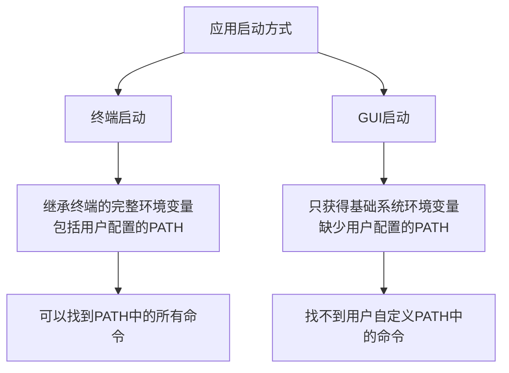

Сталкивались ли вы с ситуацией, когда команда, которая отлично работает в терминале, не может быть найдена приложением, запущенным через графический интерфейс? Например, при вводе __PROTECTED_INLINE_CODE__3__ в терминале версия отображается нормально, но приложения, запущенные из Dock или Finder, сообщают, что команда узла не найдена? Недавно я решил подобную проблему и хотел бы поделиться с вами ее обоснованием и решением.

<! --подробнее-->

## Проблемное явление

При использовании настольного приложения Claude мы обнаружили интересное явление:

- Если запустить приложение из терминала с помощью команды `open -a Claude`, оно нормально находит и использует команды в системном PATH (например, node, python и т.д.).
- Но если дважды щелкнуть на значке приложения, оно говорит, что не может найти команды, которые уже установлены!

Эта проблема не уникальна для Claude, другая программа с открытым исходным кодом под названием ChatMCP имеет ту же проблему. Разработчик подал [PR](https://github.com/daodao97/chatmcp/pull/48) для решения этой проблемы, так что давайте проанализируем природу проблемы и ее решение.

## Причина проблемы: два механизма загрузки переменных окружения в macOS



В macOS (и других системах Unix/Linux) способ запуска приложения напрямую влияет на переменные окружения, к которым оно может получить доступ:

### Режим запуска терминала

Когда вы запускаете приложение, выполнив команду в терминале, приложение наследует все переменные окружения терминала, включая:

1. системные переменные окружения
2. переменные окружения, определенные в пользовательских конфигурационных файлах (например, `.bash_profile`, `.zshrc` и т. д.)
3. переменные окружения, установленные в текущей терминальной сессии

Именно поэтому приложения, запускаемые с терминала, могут нормально находить команды в PATH - они "видят" полную конфигурацию PATH.

### Режим запуска графического интерфейса

Однако, когда вы запускаете приложение, щелкнув на значке, ситуация совершенно иная:

1. приложение GUI может получить доступ только к набору базовых переменных окружения, предоставляемых системой
2. конфигурационные файлы пользовательской оболочки (`.bash_profile`, `.zshrc` и т. д.)** не загружаются автоматически**. 3.
3. Существует только очень базовая переменная PATH, обычно содержащая лишь несколько системных каталогов

Именно поэтому приложения, запущенные через графический интерфейс, не находят команд, которые можно использовать в терминале - они просто "не видят" полной конфигурации PATH!

## Решение: смоделируйте процесс запуска оболочки

PR проекта ChatMCP предлагает очень умное решение, которое заключается в том, чтобы имитировать процесс запуска оболочки с помощью кода и вручную загружать переменные окружения, которые обычно загружаются только при запуске терминала.

### Идея решения

1. создайте временный сценарий оболочки, который имитирует порядок загрузки переменных окружения при запуске оболочки.
2. Выполните этот сценарий и получите вывод переменных окружения.
3. Примените эти переменные окружения к приложению.

### Ключевые шаги в реализации кода

```dart
// 获取用户的默认shell
final String shell = Platform.environment['SHELL'] ?? '/bin/bash';
final String homeDir = Platform.environment['HOME'] ?? '';

// 创建临时shell脚本
final tempDir = await Directory.systemTemp.createTemp('env_loader');
final scriptFile = File('${tempDir.path}/load_env.sh');

// 写入脚本内容 - 关键部分
await scriptFile.writeAsString('''
#!/bin/sh
# 设置基本环境
export HOME="$homeDir"
export SHELL="$shell"
export TERM="xterm-256color"
export LANG="en_US.UTF-8"

# 加载系统级配置
if [ -f /etc/profile ]; then
  . /etc/profile
fi

# 根据不同的shell加载配置
if [ -n "\$BASH_VERSION" ]; then
  if [ -f "\$HOME/.bash_profile" ]; then
    . "\$HOME/.bash_profile"
  elif [ -f "\$HOME/.profile" ]; then
    . "\$HOME/.profile"
  fi
elif [ -n "\$ZSH_VERSION" ]; then
  if [ -f "\$HOME/.zshrc" ]; then
    . "\$HOME/.zshrc"
  fi
fi

# 输出所有环境变量
env
''');

// 执行脚本并获取环境变量
final result = await Process.run(shell, [
  scriptFile.path
]);

// 将获取的环境变量应用到应用程序中
final Map<String, String> env = {};
final lines = result.stdout.toString().split('\n');
for (final line in lines) {
  final parts = line.split('=');
  if (parts.length >= 2) {
    final key = parts[0];
    final value = parts.sublist(1).join('=');
    env[key] = value;
  }
}
```.

Это очень умное решение, которое по сути "обманывает" систему, предоставляя GUI-приложению доступ к полному набору переменных окружения, которые обычно доступны только терминальному приложению.

## Дальнейшее чтение: Принципы загрузки переменных окружения

Учитывая это, давайте рассмотрим подробнее, как загружаются переменные окружения в macOS:

### Переменные окружения системного уровня

В macOS есть механизм настройки переменных окружения на системном уровне:

- `/etc/profile` - конфигурация системного уровня
- `/etc/paths` - настройка системного PATH
- `/etc/paths.d/` - каталог конфигурации PATH системы

Переменные окружения системного уровня обычно доступны как в терминале, так и в GUI-приложении.

### Переменные окружения пользовательского уровня

Переменные окружения пользовательского уровня обычно определяются в следующих файлах:

- `~/.bash_profile` - конфигурация пользователя Bash
- `~/.zshrc` - Конфигурация пользователя Zsh
- `~/.fish/config.fish` - Конфигурация пользователя Fish shell

**Ключевой момент**: Эти пользовательские конфигурации загружаются автоматически только при запуске терминала, GUI-приложения не загружают их автоматически!

### Как определить правильный тип оболочки?

В PR используется хитрый метод определения оболочки пользователя по умолчанию:

```dart
final String shell = Platform.environment['SHELL'] ?? '/bin/bash';
```.

Переменная окружения `SHELL` обычно доступна даже в средах с графическим интерфейсом, поскольку это одна из основных переменных окружения, которую macOS считывает и устанавливает из базы данных пользователей при входе в систему. Если вы действительно не можете ее получить, по умолчанию используется наиболее распространенная `/bin/bash`.

## Примените к другим проектам

Если ваше приложение столкнулось с подобной проблемой, вы можете использовать аналогичное решение:

1. создайте временный скрипт, имитирующий процесс запуска оболочки
2. выполните скрипт и получите переменные окружения.
3. примените эти переменные окружения к своему приложению.

Этот подход работает в приложениях Electron, Flutter и других настольных приложениях.

## Резюме

За этим, казалось бы, простым вопросом на самом деле скрывается сложность механизма загрузки переменных окружения операционной системы. macOS (как и другие Unix-системы) различает приложения, запускаемые через терминал, и приложения, запускаемые через графический интерфейс, предоставляя им разные наборы переменных окружения.

Поняв этот механизм и написав код для имитации процесса запуска оболочки, мы сможем решить проблему, когда GUI-приложения не могут найти команды в PATH, и предоставить приложениям доступ к полному набору переменных окружения, настроенных пользователем, независимо от способа их запуска.

Это элегантное и эффективное решение демонстрирует важность глубокого понимания механизмов операционной системы для решения реальных проблем разработки.

Сталкивались ли вы с подобными проблемами, связанными с переменными окружения? Не стесняйтесь делиться своим опытом и решениями в разделе комментариев!
