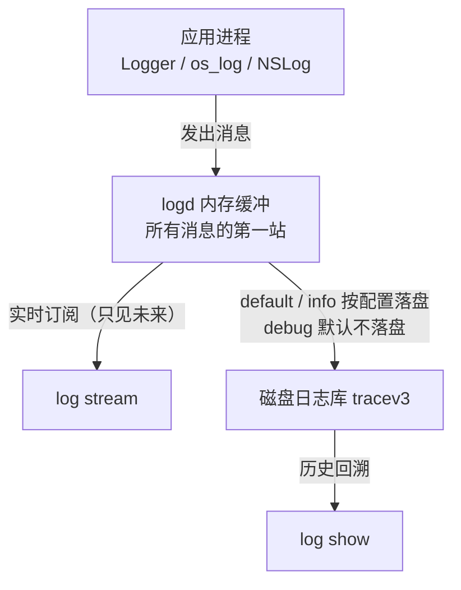

打开终端敲下 `log stream`，屏幕开始滚动密密麻麻的日志行。这是多数 macOS 开发者的日志调试初体验——看起来什么都有，真到用时又什么都找不到：想知道应用内部发生了什么，满屏都是系统噪声；明明代码里埋了日志，一条也不出现；好不容易定位到，关键字段却显示为 `<private>`。

问题不在工具，而在于没人告诉你这套日志系统有四层，默认状态下还藏着三个陷阱。这篇文章从结构讲到工作流，让你每次打开 `log stream`，都知道自己在看什么、会漏掉什么、下一步该敲什么。

<!--more-->

## 一、四层结构：一条日志要经过几道门才到你眼前

macOS 从 2016 年的 Sierra 开始，用 **Unified Logging System（统一日志系统）** 取代了老旧的 syslog / ASL。理解它只需要抓住一条流水线，共分四层：

**第一层：产生——应用调用日志 API。**

日志的源头永远是应用自己。系统提供了标准 API（现代写法是 `Logger`，经典写法是 `os_log` / `NSLog`），应用调用它们把事件"发"进系统。**没有埋点的应用就是一口沉默的井——任何工具对它都无能为力。**

**第二层：缓冲——logd 的内存池。**

所有消息的第一站是系统日志守护进程 `logd` 的内存缓冲。这里要记住一个关键机制：**消息先进入内存；是否写入磁盘，是另一回事。**

**第三层：持久化——按级别与配置落盘。**

内存中的消息按级别筛选：**debug 级别的消息默认只留在内存里，永远不会写入磁盘**；default、error、fault（以及多数配置下的 info）会持久化到磁盘日志库（`/var/db/diagnostics/` 下的 tracev3 文件）。

**第四层：读取——三个观察窗口。**

- `log stream`：实时订阅。从你敲下回车的那一刻开始看——注意，**只看未来**。
- `log show`：查询磁盘上的历史日志——**看不到没落盘的消息**。
- `Console.app`：图形界面，适合日常翻看和搜索。



一条贯穿全文的推论：**你能看到什么 = 应用发了什么 × 级别是否放行 × 你站在哪个观察窗口。**

熟悉 Linux 的读者可以这样类比：统一日志系统 ≈ `journald`（系统级收集守护进程），`log stream` / `log show` ≈ `journalctl -f` 与历史查询两种视图。macOS 的模式不是"应用往某个文件写日志"，而是"应用把日志交给系统统一收集，工具从系统的不同层面读取"。

## 二、三个默认陷阱

结构清楚了，接下来是最容易被绊倒的地方——这套系统的默认行为，处处藏着"你没说要，我就不给你看"。

### 陷阱一：默认级别只让你看到一小部分

不加任何参数运行 `log stream`，你看到的只是 default 级别及以上（default / error / fault），**info 和 debug 默认不可见**。

在我的一台空载机器上各取 1 秒样本对比：

| 命令 | 1 秒内输出 |
|------|-----------|
| `log stream`（默认） | 约 1000 条，几乎全是 Default；Info、Debug 为 **0** |
| `log stream --level debug` | 上万条 Debug + 数千条 Info |

也就是说，默认状态与全量状态的信息量差了 **10 倍以上**，而差掉的恰好是调试最需要的细粒度信息。这不是 bug，是设计——系统假设你平时不需要那么细。

所以第一条习惯是显式声明级别：

```bash
log stream --level info    # info 及以上
log stream --level debug   # 全都要（有代价，见第六节）
```

`--level` 是层级式的：`debug` 包含 `debug + info + default`，`info` 包含 `info + default`——**指定 debug 意味着全部放行**。

### 陷阱二：log stream 没有过去时

`log stream` 只订阅**启动之后**产生的消息。在它启动之前发生的崩溃、报错、异常——一条都看不到，无论那些消息是否还在内存里。

这意味着真实诊断是**两段式**的：

```bash
# 第一段：回溯——先看已经发生了什么
log show --last 10m --predicate 'subsystem == "com.example.myapp"' --info --debug

# 第二段：盯梢——再开实时监控，去复现问题
log stream --predicate 'subsystem == "com.example.myapp"' --level debug
```

很多人只做第二段：开了 `log stream` 再手忙脚乱地去复现操作，结果错过了启动前已经堆积的线索。正确顺序是**先回看、再盯梢**。

另外，`log show` 有两个必须知道的默认行为：**它默认只输出 default 级别**，要加 `--info --debug` 才展开低级别消息（这是"log show 什么都查不到"的第一大原因）；同时它需要时间窗，`--last 10m`、`--last 1h`、`--last boot` 都行，不加时间窗的查询可能又慢又重。

### 陷阱三：`<private>` 遮蔽

抓到的日志里，关键字段经常是一串 `<private>`——这是系统的隐私保护设计：日志 API 默认把字符串内容视为隐私，只在内存中记录占位符。

两个应对方向：

- **自己的应用**：明确标注哪些字段可以公开——Swift 里用 `\(value, privacy: .public)`，`os_log` 格式串里用 `%{public}s`。调试信息值得公开的就公开，敏感字段保持默认。
- **别人的应用**：需要修改系统日志配置才能解开遮蔽（传统方式是 `log config --mode "private_data:on"`，macOS Catalina 之后收紧为需要安装配置描述文件）。门槛不低，这是有意为之。

## 三、让应用"开口"：埋点是前提

"为什么 `log stream` 看不到我的应用？"——九成情况是埋点缺失或用了不合适的 API。

Swift 的现代写法（macOS 11+）：

```swift
import os

let logger = Logger(subsystem: "com.example.myapp", category: "network")

logger.debug("开始连接 \(host, privacy: .public)")
logger.info("连接已建立")
logger.error("请求失败：\(String(describing: error), privacy: .public)")
```

两个字段是整套过滤体系的地基：

- **subsystem**：通常用反向域名约定，如 `com.example.myapp`；
- **category**：按功能域切分，如 `network` / `storage` / `ui`。

设计好这两个字段，你就能用 predicate 精准过滤（下一节），完全不用理会进程名和 PID。

几个历史包袱顺带说清：`os_log`（C / Objective-C 接口）至今仍被广泛使用，能用；`NSLog` 会进入统一日志，但有已知的性能开销，适合调试、不适合高频路径；再上一代的 `syslog` / ASL 已被标记废弃（ASL 在 SDK 头文件里标注了 `os_log(3) has replaced asl(3)`），新代码不该再用。

还有一种情况要接受现实：**第三方应用完全不用统一日志**（跨平台框架尤其常见）。这时 `log stream` 只能看到它的系统侧事件——进程启动退出、launchd 交互、崩溃上报——看不到内部逻辑。这是能力边界，不是用法问题。

## 四、一份诊断工作流

把前面的知识串成一条流水线。场景：某个应用在特定操作下行为异常（崩溃或卡死）。

### Step 0：确认"有日志可看"

先快速探测目标是否在向统一日志发声：

```bash
log show --last 2m --predicate 'subsystem == "com.example.myapp"'
```

有输出（哪怕很少）→ 埋点存在，继续。全空 → 检查 subsystem 拼写；如果确认拼写无误，则回到第三节的边界问题——该应用可能根本不用统一日志。

### Step 1：回溯已经发生的问题

```bash
log show --last 15m \
  --predicate 'subsystem == "com.example.myapp"' \
  --info --debug \
  --style compact
```

- `--last 15m`：限定时间窗，避免慢查询；
- `--info --debug`：把默认看不到的级别带出来，**漏掉这步是查不到东西的第一大原因**；
- `--style compact`：紧凑单行输出，比默认样式更适合快速扫读。

扫到可疑条目后，转成结构化数据精查：

```bash
log show --last 15m \
  --predicate 'subsystem == "com.example.myapp"' \
  --info --debug --style ndjson > app.ndjson

jq -r '.eventMessage' app.ndjson | head -50
```

`--style ndjson` 每行一个 JSON 对象，直接喂给 `jq` 做筛选、统计、时间线整理——比肉眼扫日志可靠得多。

### Step 2：实时盯梢复现

```bash
log stream \
  --predicate 'subsystem == "com.example.myapp"' \
  --level debug \
  --style compact
```

保持它运行，另开终端执行触发异常的操作，观察最后出现的是哪些条目。诊断崩溃的要点：盯住**最后一条正常日志与崩溃之间**发生了什么——哪个 subsystem 最先沉默、哪个开始报错、有没有成串的重试或超时。

### Step 3：崩溃分流——去找崩溃报告

如果应用真的崩了，记住一条分工原则：**`log stream` 负责"崩溃前的行为链"，崩溃报告负责"崩溃本身的证据"。** 异常类型（比如 `EXC_BAD_ACCESS`）的主战场不在日志流里，而在崩溃报告中：

```bash
ls -t ~/Library/Logs/DiagnosticReports/ | head
```

最近一次崩溃的 `.ips` 报告在最上面，其中的 `Exception Type`（异常类型）、`Crashed Thread`（崩溃线程）、`Termination Reason`（终止原因）才是核心证据。系统的 ReportCrash 过程也会在日志里留痕（"已保存崩溃报告"），可以顺着日志找到对应报告。

两边的信息合起来，才构成一次完整的事故重建。

## 五、参数速查表

`log stream` 与 `log show` 共享大部分过滤参数，常用的这些：

| 参数 | 作用 | 示例 |
|------|------|------|
| `--predicate` | NSPredicate 语法过滤（**首选**） | `--predicate 'subsystem == "com.example.myapp" AND category == "network"'` |
| `--process` | 按进程过滤（**PID 或进程名都行**） | `--process Safari` 或 `--process 12345` |
| `--level` | 级别门槛（仅 stream） | `--level info` |
| `--info` / `--debug` | 展开低级别输出（仅 show） | `--info --debug` |
| `--last` | 最近时间窗（仅 show） | `--last 30m`、`--last boot` |
| `--style` | 输出格式 | `default / syslog / json / ndjson / compact` |
| `--source` | 标注源码文件与行号 | `--source` |
| `--timeout` | 到点自动退出（仅 stream） | `--timeout 30s` |
| `--type` | 事件类型（仅 stream） | `activity / log / trace` |

## 六、几个值得知道的细节

1. **`--timeout` 支持秒**。man page 只写了 `[m|h|d]`，实测 `--timeout 30s` 可用——盯 30 秒、抓完就撤，很适合复现式排查。
2. **`--process` 可以直接接进程名**。不用先 `ps aux | grep` 找 PID，`log stream --process Safari` 即可；接数字时按 PID 解释。
3. **predicate 用结构化字段更快**。`subsystem` / `process` / `category` 是元数据字段，匹配速度远快于 `eventMessage contains`（后者要扫消息全文）。日志量大时，这是秒级和分钟级的区别。
4. **`--level debug` 是有代价的**。debug 全开时系统每秒可以产生上万条消息，输出像消防水管；系统为保护自己会开始**丢消息**（`log stream` 会提示 dropped），还可能拖慢被观测的应用。原则：**先用 predicate 缩小范围，再考虑抬级别**；需要短时全量时配 `--timeout` 限时。
5. **部分系统日志需要 `sudo`**。系统进程与隐私相关的条目对普通用户不可见，需要时给命令加 `sudo`。
6. **`log stream` 不止流"日志"**。输出里还会混杂 `Activity` 类型的事件（活动追踪），用 `--type log` 可以只要纯日志条目。

## 七、延伸：联机开发时，怎么看 iPhone 的日志

前面的工作流都以本机为舞台。但做 iOS 开发时，日志在另一台设备上——`log stream` 能看连接的 iPhone 吗？

**不能直接看。** `log stream` 只订阅本机 logd，没有任何设备选项（`log` 工具家族里，带设备能力的是 `log collect`）。官方的设计是**拉取归档**，而非订阅流：

```bash
# 1) 从连接的 iPhone 收集一段时间的日志归档
log collect --device --last 30m --output iphone.logarchive
# 多设备时用 --device-name "My iPhone" 或 --device-udid <UDID> 指定

# 2) 像查本机一样查这个归档
log show --archive iphone.logarchive \
  --predicate 'subsystem == "com.example.myapp"' \
  --info --debug --style compact
```

前提只有一个：设备已配对并信任这台 Mac——"联机开发"的设备天然满足。

好消息是**机制完全一致**：iPhone 上跑的也是 Unified Logging System，所以本文讲的一切——subsystem / category 过滤、`--info --debug` 展开、ndjson + jq 分析——在设备归档上全部照用，只是把"回看 + 盯梢"换成了"先收集、后查询"。收集时也可以直接带 `--predicate` 过滤，减小归档体积。

如果确实需要**实时**看真机日志，有三条路：

| 方式 | 形态 | 说明 |
|------|------|------|
| Console.app | 图形界面 | 连接 iPhone 后侧边栏出现设备，选中即可实时查看——官方的实时方案 |
| `idevicesyslog` | 命令行实时 | libimobiledevice 套件的工具（`brew install libimobiledevice`），终端里的真机实时流 |
| Xcode Debug Console | 调试会话内 | 只覆盖当前调试应用的输出，不是系统视角 |

最后记一条容易混淆的分界线：**模拟器不等于真机**。模拟器里的进程实际跑在 Mac 上，所以 `log stream` 原生可用：

```bash
xcrun simctl spawn booted log stream --predicate 'subsystem == "com.example.myapp"' --level debug
```

真机"不能流、能收集"，模拟器"什么都能"——工具没变，变的是数据在哪一层。

## 结语

回到起点：`log stream` 不是一个"看日志"的工具，而是一个"从系统日志总线上实时取一段"的观测窗口。掌握它意味着四件事：知道总线分四层（就明白为什么有些东西看不到）、知道三个默认陷阱在哪（就知道该补什么参数）、用两段式工作流（先回看、再盯梢）、以及知道崩溃证据要去崩溃报告里找。

最后留一个问题给你：**如果你的应用还没有埋点，你的第一句 logger 会放在哪里？**

想清楚"出问题时我最想知道的那个中间状态是什么"，第一句日志自然就有了位置——而那个位置，正是下一次排查异常时你最需要的探针。
