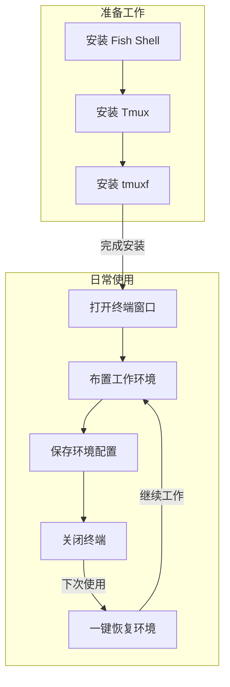

你是否经常需要同时处理多个项目，每次都要重复打开多个终端窗口，输入各种命令来切换目录和启动程序？今天介绍一个简单的工具，让你轻松保存和恢复自己的终端工作环境！

<!--more-->

## 现实工作中的烦恼

小王是一名开发者，每天早上到公司第一件事就是打开终端，然后：

1. 打开项目A的目录，启动开发服务器
2. 新建一个窗口查看项目B的日志
3. 再开一个窗口运行系统监控工具
4. 还要准备一个窗口随时执行各种命令...

这些操作每天都要重复一遍，不仅耗时，有时还会忘记某些步骤。如果电脑重启或者终端意外关闭，就要重新设置一遍，很是麻烦。

## 解决方案：tmuxf 终端环境管理器

今天介绍的工具可以帮你：

- 一键保存当前的所有终端窗口布局
- 记住每个窗口的工作目录和运行的程序
- 随时一键恢复之前的工作环境
- 支持保存多套不同的环境配置

[这里需要一张工具运行效果图，展示保存和加载会话的过程]

## 安装步骤

1. 首先确保你的电脑上已经安装了：
   - Fish Shell（终端环境）
   - Tmux（终端复用工具）

如果还没有安装，可以用以下命令安装：

```bash
# macOS 使用 homebrew 安装
brew install fish tmux

# Ubuntu/Debian Linux 系统
sudo apt-get install fish tmux
```

2. 创建配置目录：

```fish
mkdir -p ~/.config/fish/{functions,completions}
```

3. 下载工具文件（在终端中依次执行以下命令）：

```fish
# 创建程序文件
curl -o ~/.config/fish/functions/tmuxf.fish https://github.com/donghao1393/fish-assistant/raw/refs/heads/main/plugins/tmuxf/functions/tmuxf.fish

# 创建自动补全文件
curl -o ~/.config/fish/completions/tmuxf.fish https://github.com/donghao1393/fish-assistant/raw/refs/heads/main/plugins/tmuxf/completions/tmuxf.fish
```

## 使用方法

安装完成后，就可以开始使用了！常用命令有：

1. 保存当前工作环境：

```fish
tmuxf save 工作环境名称
```

2. 恢复之前保存的环境：

```fish
tmuxf load 工作环境名称
```

3. 查看已保存的环境列表：

```fish
tmuxf list
```


## 实用小贴士

1. 可以为不同的项目创建不同的环境配置，比如：

   - `tmuxf save work` - 保存工作环境
   - `tmuxf save study` - 保存学习环境
   - `tmuxf save blog` - 保存写博客环境
2. 如果某个程序启动比较慢，可以添加延迟：

```fish
tmuxf load work --delay 0.5
```

3. 如果想修改已保存的环境，可以使用 force 选项：

```fish
tmuxf save work --force
```

## 常见问题

- **Q: 可以同时打开多个环境吗？**
  - A: 可以！每个环境都是独立的，你可以同时加载多个不同的环境。
- **Q: 保存的配置文件在哪里？**
  - A: 所有配置都保存在 `~/.config/tmuxf/` 目录下，以 `.fish` 结尾的文件。
- **Q: 如何删除不需要的环境配置？**
  - A: 使用 `tmuxf delete 环境名称` 即可删除。

## 总结

通过这个简单的工具，你可以：

- 告别重复的环境设置工作
- 快速恢复工作状态
- 提高日常工作效率

工具再强大，也不如实际去使用来得实在。现在就动手试试吧！


