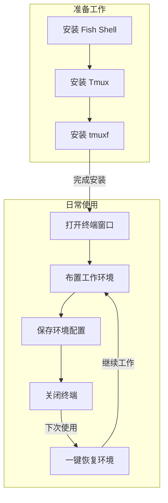

Вам часто приходится работать над несколькими проектами одновременно, неоднократно открывая несколько окон терминала и каждый раз набирая различные команды для переключения каталогов и запуска программ? Сегодня мы представим вам простой инструмент, который позволит вам легко сохранять и восстанавливать рабочую среду терминала!

<!--more-->

## 现实工作中的烦恼

Ванг - разработчик, который первым делом по приходу на работу открывает свой терминал и..:

1. откройте каталог проекта A и запустите сервер разработки.
2. создайте новое окно для просмотра журналов проекта B
3. откройте еще одно окно для запуска инструмента мониторинга системы
4. также откройте окно для выполнения различных команд...

Эти операции приходится повторять каждый день, что не только отнимает время, но и иногда вы забываете некоторые шаги. Если компьютер перезагружается или терминал случайно выключается, приходится настраивать его заново, что очень хлопотно.

## 解决方案：tmuxf 终端环境管理器

Представленные сегодня инструменты могут вам помочь:

- Сохраните все текущие раскладки окон терминала одним щелчком мыши
- Запомните рабочий каталог и запущенные программы каждого окна.
- Восстановление предыдущей рабочей среды в любое время одним щелчком мыши
- Поддержка сохранения нескольких различных конфигураций среды

[这里需要一张工具运行效果图，展示保存和加载会话的过程]

## 安装步骤

1. Прежде всего убедитесь, что на вашем компьютере установлена:
   - Fish Shell (терминальная среда)
   - Tmux (инструмент для мультиплексирования терминалов)

Если он еще не установлен, вы можете установить его с помощью следующей команды:

```bash
# macOS 使用 homebrew 安装
brew install fish tmux

# Ubuntu/Debian Linux 系统
sudo apt-get install fish tmux
```

2. Создайте каталог конфигурации:

```fish
mkdir -p ~/.config/fish/{functions,completions}
```

3. Загрузите файл инструмента (последовательно выполните следующие команды в терминале):

```fish
# 创建程序文件
curl -o ~/.config/fish/functions/tmuxf.fish https://github.com/donghao1393/fish-assistant/raw/refs/heads/main/plugins/tmuxf/functions/tmuxf.fish

# 创建自动补全文件
curl -o ~/.config/fish/completions/tmuxf.fish https://github.com/donghao1393/fish-assistant/raw/refs/heads/main/plugins/tmuxf/completions/tmuxf.fish
```

## 使用方法

После завершения установки вы можете начать использовать его! Общими командами являются:

1. сохранить существующую рабочую среду:

```fish
tmuxf save 工作环境名称
```

2. Восстановите ранее сохраненную среду:

```fish
tmuxf load 工作环境名称
```

3. Просмотрите список сохраненных сред:

```fish
tmuxf list
```


## 实用小贴士

1. Для разных проектов можно создавать различные конфигурации среды, например:

- `tmuxf save work` - сохраняет рабочую среду
   - `tmuxf save study` - сохраняет учебную среду
   - `tmuxf save blog` - сохраняет среду для ведения блога
2. если программа начинается медленно, добавьте задержку:

```fish
tmuxf load work --delay 0.5
```

3. Если вы хотите изменить сохраненную среду, воспользуйтесь опцией force:

```fish
tmuxf save work --force
```

## 常见问题

- **Вопрос: Могу ли я открыть несколько сред одновременно? **
  - О: Да! Каждая среда является независимой, и вы можете одновременно загружать несколько разных сред.
- **Q: Где находятся сохраненные файлы конфигурации? ** A: Да!
  - О: Все конфигурации сохраняются в директории `~/.config/tmuxf/` в файлах, заканчивающихся на `.fish`.
- **Q: Как удалить ненужные конфигурации окружения? **
  - О: Для удаления используйте команду `tmuxf delete environment name`.

## 总结

С помощью этого простого инструмента вы можете:

- Попрощайтесь с повторяющимися задачами по настройке окружающей среды
- Быстрое возвращение к работе
- Повышение эффективности ежедневной работы

Каким бы мощным ни был инструмент, он не так хорош, как его реальное использование. Попробуйте прямо сейчас!

