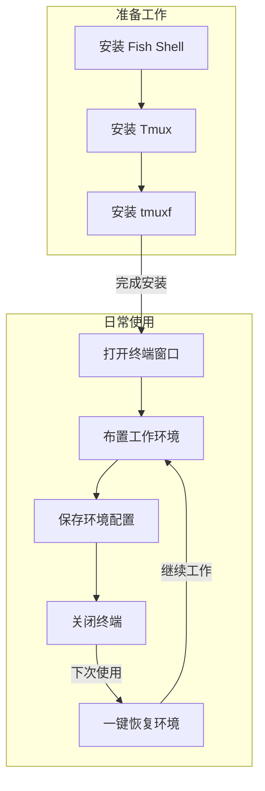

Вам часто приходится работать над несколькими проектами одновременно, неоднократно открывая несколько окон терминала и каждый раз набирая различные команды для переключения каталогов и запуска программ? Сегодня мы представим вам простой инструмент, который позволит вам легко сохранять и восстанавливать рабочую среду терминала!

<! ---далее-->

## Реальные рабочие заботы

Сяо Ванг - разработчик, каждое утро, когда он приходит в компанию, первым делом открывает терминал, а затем:

1. открывает директорию проекта A и запускает сервер разработки
2. создает новое окно для просмотра журналов проекта B. 3.
3. открыть другое окно для запуска инструмента мониторинга системы
4. а также подготовить окно для выполнения различных команд в любое время...

Эти операции приходится повторять каждый день, что не только отнимает время, но и иногда вы забываете о некоторых шагах. Если компьютер перезагружается или терминал случайно закрывается, приходится настраивать его заново, что очень хлопотно.

## Решение: tmuxf Terminal Environment Manager

Представленные сегодня инструменты могут вам помочь:

- Сохранить текущее расположение всех окон терминала одним щелчком мыши
- Запомнить рабочий каталог и запущенные программы каждого окна.
- Восстановить предыдущую рабочую среду в любое время одним щелчком мыши
- Поддержка сохранения нескольких различных конфигураций среды

[Здесь необходимо изображение работающего инструмента, чтобы показать процесс сохранения и загрузки сессии].

## Шаги установки

1. прежде всего убедитесь, что на вашем компьютере установлены:
   - Fish Shell (терминальная среда)
   - Tmux (инструмент для мультиплексирования терминалов)

Если он еще не установлен, вы можете установить его с помощью следующей команды:

```bash
# macOS 使用 homebrew 安装
brew install fish tmux

# Ubuntu/Debian Linux 系统
sudo apt-get install fish tmux
```.

2. Создайте каталог конфигурации:

```fish
mkdir -p ~/.config/fish/{functions,completions}
```

3. Загрузите файл инструментов (выполните в терминале последовательно следующие команды):

```fish
# 创建程序文件
curl -o ~/.config/fish/functions/tmuxf.fish https://github.com/donghao1393/fish-assistant/raw/refs/heads/main/plugins/tmuxf/functions/tmuxf.fish

# 创建自动补全文件
curl -o ~/.config/fish/completions/tmuxf.fish https://github.com/donghao1393/fish-assistant/raw/refs/heads/main/plugins/tmuxf/completions/tmuxf.fish
```

## Использование

После завершения установки вы можете начать использовать его! Общими командами являются:

1. Сохранить текущую рабочую среду:

```fish
tmuxf save 工作环境名称
```.

2. Восстановите ранее сохраненную среду:

```fish
tmuxf load 工作环境名称
```

3. просмотрите список сохраненных окружений:

```fish
tmuxf list
```

```fish
tmuxf list
``` 

## Практические советы

1. можно создавать различные конфигурации окружения для разных проектов, например:

   - `tmuxf save work` - сохраняет рабочую среду
   - `tmuxf save study` - сохраняет учебную среду
   - `tmuxf save blog` - сохраняет среду для ведения блога.
2. если программа начинается медленно, добавьте задержку:

```fish
tmuxf load work --delay 0.5
``` - спасет учебную среду.

3. если вы хотите изменить сохраненную среду, вы можете использовать опцию force:

```fish
tmuxf save work --force
```

## Часто задаваемые вопросы

- **В: Можно ли открыть несколько сред одновременно? **
  - О: Да! Каждая среда является независимой, и вы можете одновременно загружать несколько разных сред.
- **Q: Где находятся сохраненные файлы конфигурации? **
  - О: Все конфигурации сохраняются в каталоге `~/.config/tmuxf/` в файлах, заканчивающихся на `.fish`.
- **В: Как удалить ненужные конфигурации среды? **
  - О: Для удаления используйте `tmuxf delete 环境名称`.

## Резюме

С помощью этого простого инструмента вы можете:

- Попрощаться с повторяющимися задачами по настройке окружающей среды
- Быстро вернуться к работе
- Повысить свою ежедневную производительность

Каким бы мощным ни был инструмент, он не так хорош, как его реальное использование. Попробуйте прямо сейчас!


