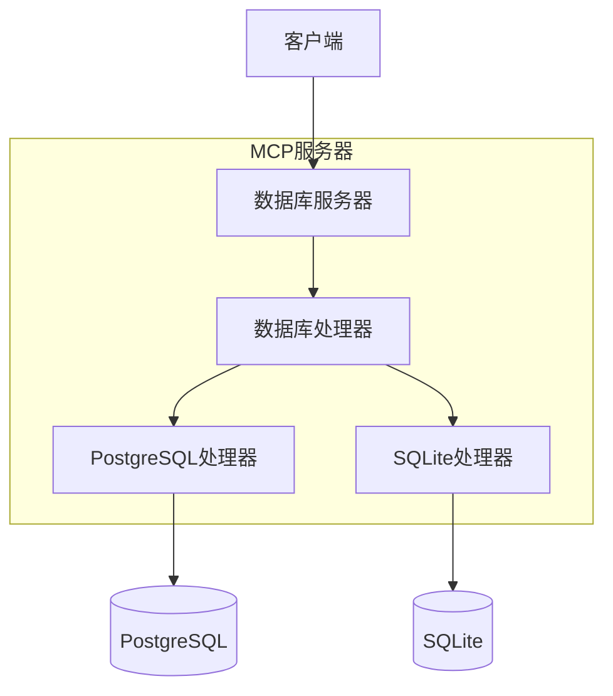
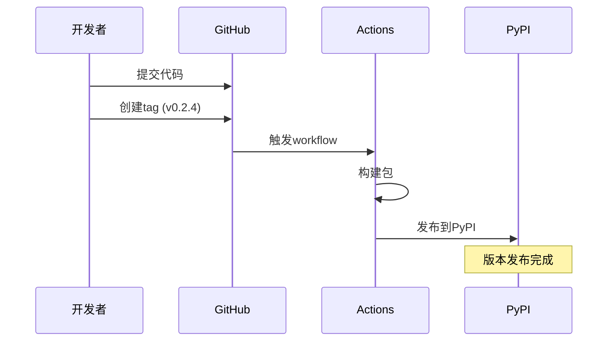

本文深入探讨MCP数据库服务的设计理念，以及一个完整的MCP服务从开发到发布的全过程。对于想了解MCP服务开发或正在构建自己的MCP服务的开发者来说，这里的经验可能会有所帮助。

<!--more-->

## 架构设计

### 抽象层设计



抽象层是整个服务的核心，它解决了以下关键问题：

1. **接口统一：** 通过DatabaseHandler抽象基类定义统一接口，确保所有数据库实现遵循相同的API规范。
2. **实现隔离：** 具体数据库实现（如PostgreSQL和SQLite）相互独立，方便添加新的数据库支持。
3. **配置灵活：** 运行时配置和具体实现分离，支持动态切换数据库而无需修改代码。

### 发布流程



从v0.1.0到v0.2.4的演进过程：

1. v0.1.0: 初始PostgreSQL实现
   - 基础查询功能
   - 连接池管理
   - 错误处理
   
2. v0.2.0: 架构重组
   - 项目更名为mcp-dbutils
   - 引入抽象层设计
   - 改进配置管理

3. v0.2.1: SQLite支持
   - 添加SQLite基础功能
   - 统一错误处理
   - URI连接支持

4. v0.2.2-v0.2.4: 持续改进
   - 完善文档
   - 改进配置体验
   - 添加自动化发布

### 自动化发布流程

GitHub Actions配置示例：

```yaml
name: Publish to PyPI

on:
  release:
    types: [published]

jobs:
  publish:
    runs-on: ubuntu-latest
    environment: pypi
    permissions:
      id-token: write

    steps:
      - uses: actions/checkout@v4
      - uses: astral-sh/setup-uv@v4
        with:
          enable-cache: false
      
      - name: Build and Publish
        run: |
          uv python install
          uv sync --all-extras
          uv build
          uv publish
```

关键点说明：
1. 使用`setup-uv`代替传统的pip，提升安装速度
2. 启用trusted publishing，提高安全性
3. 自动化构建和发布流程

## 最佳实践分享

### 版本管理

1. 语义化版本号
   - MAJOR.MINOR.PATCH格式
   - 重大更新增加MAJOR
   - 新功能增加MINOR
   - 修复增加PATCH

2. 更新日志维护
   - 使用统一格式
   - 按版本号逆序排列
   - 分类记录（Added/Changed/Fixed）

### 发布流程

1. 代码准备
   ```bash
   # 更新版本号
   edit pyproject.toml
   # 更新CHANGELOG
   edit CHANGELOG.md
   # 提交更改
   git add .
   git commit -m "chore: bump version to x.y.z"
   ```

2. 创建发布
   ```bash
   # 创建tag
   git tag vx.y.z
   git push origin vx.y.z
   ```

3. 自动化发布
   - GitHub Actions自动触发
   - PyPI自动更新
   - 用户可立即使用新版本

### 文档维护

良好的文档应包含：
1. 详细的安装说明
2. 配置文件示例
3. 基本使用教程
4. API文档
5. 架构说明
6. 贡献指南

## 未来展望

1. 数据库支持扩展
   - MongoDB支持
   - Redis支持
   - 更多关系型数据库

2. 功能增强
   - 查询结果缓存
   - 更多数据库操作（在安全限制内）
   - 性能监控

3. 工具改进
   - 命令行工具增强
   - 配置验证工具
   - 开发者调试工具

持续迭代和改进是项目成功的关键。通过规范的发布流程和完善的文档，我们可以更好地维护和发展这个MCP服务。
