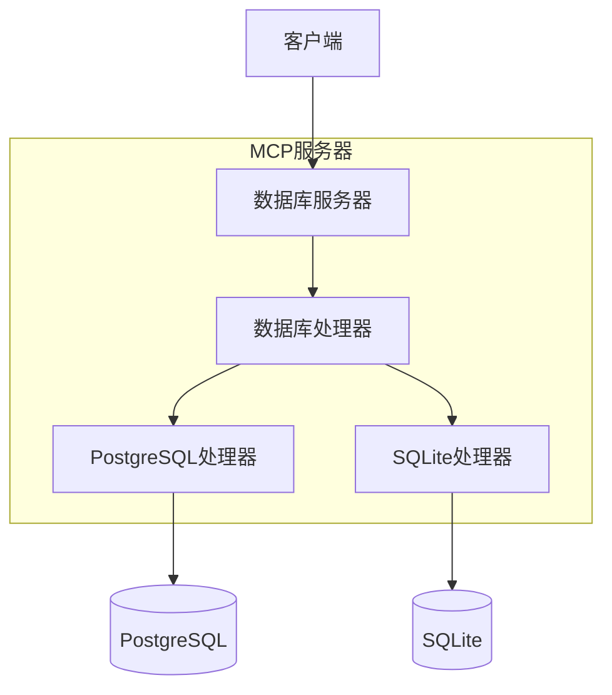
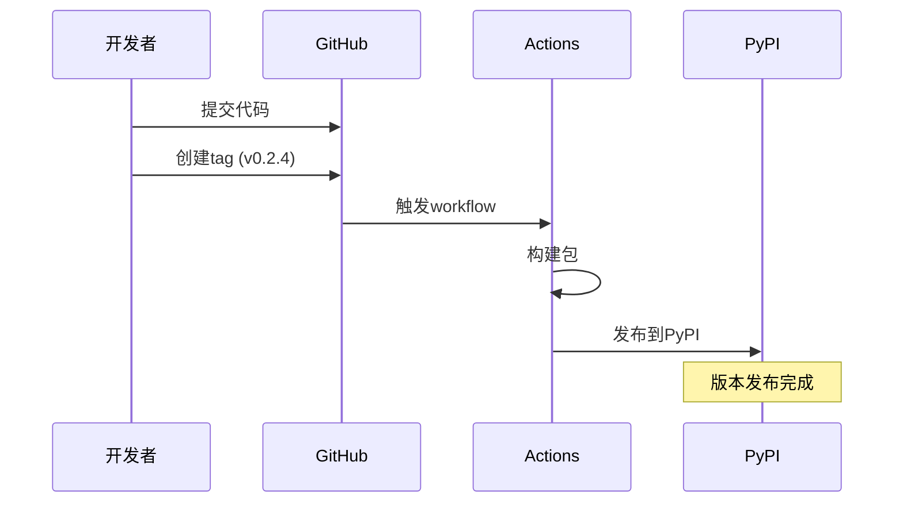

В этой статье подробно рассматривается философия проектирования служб баз данных MCP и весь процесс создания полноценной службы MCP от разработки до выпуска. Разработчикам, которые хотят узнать о разработке службы MCP или создают свою собственную службу MCP, может быть полезен данный опыт.

<!--more-->

## 架构设计

### 抽象层设计



Уровень абстракции лежит в основе всего сервиса и решает следующие ключевые задачи:

1. **Унификация интерфейсов:** унифицированные интерфейсы определяются через абстрактный базовый класс DatabaseHandler, чтобы гарантировать, что все реализации баз данных следуют одним и тем же спецификациям API.
2. **Изоляция реализации:** конкретные реализации баз данных (например, PostgreSQL и SQLite) независимы друг от друга, что упрощает добавление поддержки новых баз данных.
3. ** Гибкость конфигурации:** Конфигурация во время выполнения и реализация разделения, для поддержки динамического переключения баз данных без модификации кода.

### 发布流程



Эволюция от v0.1.0 до v0.2.4:

1. v0.1.0: Начальная реализация PostgreSQL
   - Базовая функциональность запросов
   - Управление пулом соединений
   - Обработка ошибок

2. v0.2.0: Реорганизация архитектуры
   - Проект переименован в mcp-dbutils
   - Внедрение дизайна слоя абстракции
   - Улучшенное управление конфигурацией

3. v0.2.1: Поддержка SQLite
   - Добавлена базовая функциональность SQLite
   - Унифицированная обработка ошибок
   - Поддержка URI-соединений

4. v0.2.2-v0.2.4: Постоянное совершенствование
   - Улучшение документации
   - Улучшение опыта конфигурирования
   - Добавить автоматический выпуск

### 自动化发布流程

Пример конфигурации GitHub Actions:

```yaml
name: Publish to PyPI

на.
  релиз.
    типы: [опубликовано]

задания.
  выполняется на: ubuntu-latest
    запускается на: ubuntu-latest
    окружение: pypi
    разрешения.
      run-on: ubuntu-latest environment: pypi permissions: id-token: write

steps:
      - uses: actions/checkout@v4
      - uses: astral-sh/setup-uv@v4
        with:
          enable-cache: false
      
      - name: Build and Publish
        run: |
          uv python install
          uv sync --all-extras
          uv build
          uv publish
```

Ключевые моменты:
1. используйте `setup-uv` вместо традиционного pip, чтобы повысить скорость установки
2. включите доверенную публикацию для повышения безопасности
3. автоматизируйте процесс сборки и выпуска

## 最佳实践分享

### 版本管理

1. семантический номер версии
   - Формат MAJOR.MINOR.PATCH
   - Крупное обновление, добавляющее MAJOR
   - Новая функция добавляет MINOR
   - Исправления добавляют PATCH

2. Обновление журнала
   - Унифицированный формат
   - Обратный порядок по номеру версии
   - Категоризация журналов (Добавлено/Изменено/Исправлено)

### 发布流程

1. 代码准备
   ```bash
   # 更新版本号
   edit pyproject.toml
   # 更新CHANGELOG
   edit CHANGELOG.md
   # 提交更改
   git add .
   git commit -m "chore: bump version to x.y.z"
   ```

2. 创建发布
   ```bash
   # 创建tag
   git tag vx.y.z
   git push origin vx.y.z
   ```

3. Автоматизированная публикация
   - Автоматически запускаемые действия GitHub
   - PyPI автоматически обновляется
   - Пользователи могут сразу же использовать новую версию

### 文档维护

Хорошая документация должна содержать:
1. подробные инструкции по установке
2. примеры конфигурационных файлов
3. базовые руководства по использованию
4. документация по API
5. описание архитектуры
6. руководство по использованию

## 未来展望

1. расширения для поддержки баз данных
   - Поддержка MongoDB
   - Поддержка Redis
   - Другие реляционные базы данных

2. Функциональные усовершенствования
   - Кэширование результатов запросов
   - Больше операций с базой данных (в рамках ограничений безопасности)
   - Мониторинг производительности

3. Улучшения инструментов
   - Улучшения инструмента командной строки
   - Инструмент проверки конфигурации
   - Инструменты отладки для разработчиков

Непрерывные итерации и улучшения - залог успеха проекта. Благодаря стандартизированному процессу выпуска и хорошей документации мы сможем лучше поддерживать и развивать эту услугу MCP.