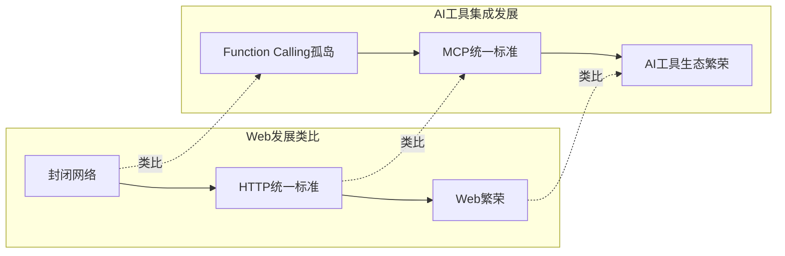
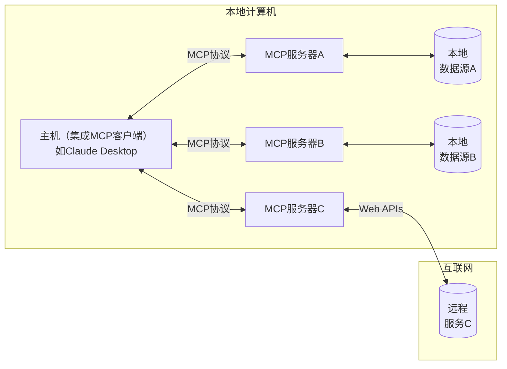
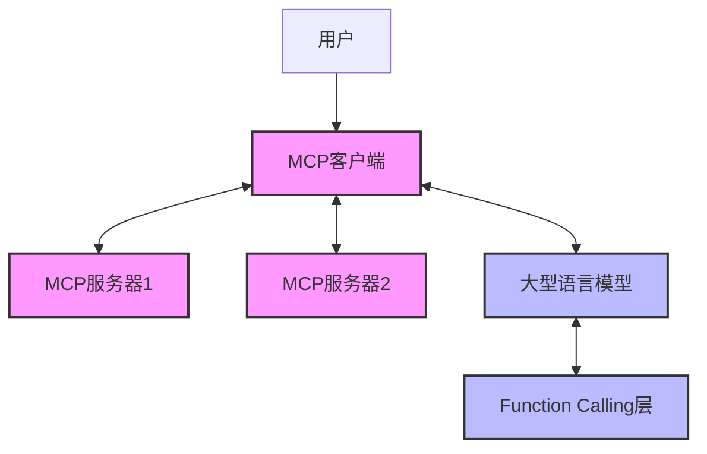

随着Model Context Protocol (MCP)的出现，AI工具集成领域正经历一场深刻的范式转变。本文将深入探讨从Function Calling到MCP的演进历程，分析它们的本质区别，并探索MCP生态系统的现状与未来发展。无论你是AI研究者、开发者，还是对AI技术感兴趣的观察者，这篇文章都将帮助你更全面地理解这一新兴领域。

<!--more-->

## 从Function Calling到MCP：技术演进的历史必然

在我们详细比较这两种技术范式之前，有必要理解它们产生的历史背景。

### Function Calling：早期AI工具集成的主流方案

Function Calling是大型语言模型(LLM)与外部工具交互的早期解决方案，它允许模型决定何时调用预定义的函数并生成结构化的参数。在这种模式下，模型分析用户的意图，决定是否需要调用特定函数来完成任务，并提供必要的参数。

以OpenAI的Function Calling为例，开发者需要：
1. 在每次API请求中定义函数结构（名称、参数、描述等）
2. 等待模型识别用户意图并生成函数调用请求
3. 接收函数调用请求，执行实际函数，并将结果返回给模型

```python
# OpenAI Function Calling示例（简化版）
response = client.chat.completions.create(
    model="gpt-4o",
    messages=[
        {"role": "user", "content": "北京现在的天气如何？"}
    ],
    tools=[{
        "type": "function",
        "function": {
            "name": "get_weather", 
            "description": "获取指定位置的天气信息",
            "parameters": {
                "type": "object", 
                "properties": {
                    "location": {"type": "string", "description": "城市名称"},
                    "unit": {"type": "string", "enum": ["celsius", "fahrenheit"]}
                }, 
                "required": ["location"]
            }
        }
    }]
)
```

### Function Calling的局限性与微调的必要

虽然Function Calling为AI增加了与外部系统交互的能力，但实践中发现了几个关键局限：

1. **封闭生态**：每家AI提供商（如OpenAI、Anthropic、Google）都有自己的Function Calling实现，彼此不兼容
2. **标准缺失**：缺乏统一标准导致开发者需要为每个平台适配不同代码
3. **需要微调**：要获得最佳性能，通常需要对模型进行针对性微调

特别是最后一点，微软Azure OpenAI文档明确指出："微调具有工具调用示例的模型可以**改进模型输出**，使您能够：
- 获得格式一致的响应，即使没有提供完整的函数定义
- 获得更准确和一致的输出"

这引发了一个问题：为什么Function Calling需要微调？

根本原因在于，虽然LLM能理解自然语言，但Function Calling是一种人为定义的接口，需要模型学习特定的调用模式。模型需要理解：
1. 何时应该调用函数（而不是直接回答）
2. 应该调用哪个函数
3. 如何正确构造参数

微调通过提供大量示例教会模型这些技能，但这意味着为每个新函数或函数集合，可能都需要额外的微调工作。

## MCP：开放协议重新定义AI工具集成

Model Context Protocol (MCP)采用了完全不同的方法来解决AI工具集成问题。MCP不是API功能，而是一个**开放标准协议**，定义了AI系统与外部工具和资源交互的统一方式。

### MCP的核心理念

MCP遵循以下核心设计理念：

1. **协议优先**：通过定义标准协议而非API，实现跨平台兼容
2. **客户端-服务器架构**：明确分离AI模型（客户端）和工具提供者（服务器）
3. **多种原语**：不只是函数调用，还包括资源访问、提示模板等多种交互模式
4. **人在环中**：强调安全性，由客户端控制工具访问权限
5. **开放标准**：社区驱动的开放标准，避免厂商锁定

### MCP与HTTP的类比：从信息孤岛到开放生态

MCP与HTTP之间存在引人深思的相似之处。在Web早期，各种计算机网络使用专有协议（如AOL、CompuServe）进行通信，形成信息孤岛。HTTP作为一个开放标准协议的出现，统一了网络通信，催生了Web的爆炸性发展。

同样，在MCP之前，各大AI提供商都有自己的Function Calling实现，创建了"AI能力孤岛"。MCP作为统一标准，有潜力重塑整个AI工具集成生态系统。



### MCP的技术架构

MCP采用客户端-服务器架构，主要组件包括：

1. **主机（Host）**：如Claude Desktop，集成MCP客户端
2. **客户端（Client）**：维护与服务器的1:1连接
3. **服务器（Server）**：提供工具、资源和提示
4. **传输层（Transport）**：支持多种通信方式（如stdio、SSE）



### 为什么MCP不需要微调？

回到最初的问题：MCP为什么不需要微调？答案在于其协议设计和标准化接口：

1. **统一接口**：MCP定义了标准化的工具、资源和提示接口，使模型自然理解如何使用它们
2. **结构化交互**：客户端-服务器架构确保交互模式一致，易于模型学习
3. **自描述工具**：MCP工具包含丰富的元数据，使模型理解工具用途
4. **分离关注点**：MCP将"如何执行"与"何时执行"分离，模型只需关注后者

正如我们不需要专门训练浏览器理解各种HTTP服务器一样，支持MCP的模型自然能理解符合MCP标准的工具。

## MCP生态系统现状与索引问题

随着MCP的流行，越来越多的开发者和组织开始创建MCP服务。然而，这也带来了一个新问题：如何有效地发现和索引这些服务？

### 当前MCP服务索引方案

目前有几种主要的MCP服务索引方法：

#### 1. GitHub搜索和Awesome列表

通过GitHub搜索或社区维护的"Awesome"列表发现MCP服务：
- [punkpeye/awesome-mcp-servers](https://github.com/punkpeye/awesome-mcp-servers)
- [appcypher/awesome-mcp-servers](https://github.com/appcypher/awesome-mcp-servers)

优势：
- 开源社区驱动，内容更新快
- 基本分类和筛选
- 有质量控制（通过PR和审核）

不足：
- 信息碎片化
- 用户体验不够直观
- 缺乏实时性能和兼容性数据

#### 2. 专门收集网站

一些网站专门收集和整理MCP服务：
- [glama.ai/mcp/servers](https://glama.ai/mcp/servers)
- [pulsemcp.com](https://www.pulsemcp.com)

优势：
- 更结构化的数据展示
- 更好的用户体验和搜索功能
- 提供额外信息（如兼容性、安全评级）

不足：
- 依赖网站维护者更新
- 可能存在商业化倾向
- 缺乏深度社区参与

### MCP服务发现的未来：会出现"谷歌"吗？

当前的MCP服务索引机制还处于早期阶段，类似于早期Web的目录和链接列表。随着生态系统的壮大，我们可能会看到更成熟的服务发现解决方案：

1. **专业化搜索引擎**：类似谷歌的MCP服务搜索引擎，但更关注技术兼容性、API稳定性等开发者指标

2. **协议内置发现机制**：MCP本身可能演化出内置的服务发现协议，类似DNS系统

3. **分布式目录**：基于区块链或类似技术的去中心化可信服务目录

4. **生态系统中心**：已处于AI生态系统中心的平台（如Anthropic、OpenAI或GitHub）可能成为主导者

理想的MCP索引系统应该具备：
- 标准化元数据
- 实时监控
- 用户反馈系统
- 自动化测试
- 版本控制
- 语义搜索

## 实例：使用MCP天气服务

为了展示MCP的实用性，以下是安装和使用"adhikasp/mcp-weather"服务的详细步骤：

### 安装准备

1. **前提条件**
   - 获取AccuWeather API密钥（[developer.accuweather.com](https://developer.accuweather.com/)）
   - 安装Python 3.8+和uv包管理工具

2. **安装方法**

   方法1: 直接使用GitHub仓库
   ```bash
   git clone https://github.com/adhikasp/mcp-weather.git
   cd mcp-weather
   uv venv
   uv sync
   echo "ACCUWEATHER_API_KEY=your_api_key_here" > .env
   python -m mcp_weather.weather  # 仅测试
   ```

   方法2: 使用预打包的PyPI包（如已发布）
   ```bash
   pip install mcp-weather
   ```

3. **配置Claude for Desktop**

   在Claude for Desktop配置文件中添加：
   ```json
   {
     "mcpServers": {
       "weather": {
         "command": "uvx",
         "args": [
           "--from", 
           "git+https://github.com/adhikasp/mcp-weather.git", 
           "mcp-weather"
         ],
         "env": {
           "ACCUWEATHER_API_KEY": "your_api_key_here"
         }
       }
     }
   }
   ```

### 服务实现细节

让我们看看这个MCP服务的核心实现代码：

```python
@mcp.tool()
async def get_hourly_weather(location: str) -> Dict:
    """Get hourly weather forecast for a location."""
    api_key = os.getenv("ACCUWEATHER_API_KEY")
    base_url = "http://dataservice.accuweather.com"
    
    # 获取位置信息
    location_key = get_cached_location_key(location) or await fetch_location_key(location)
    
    # 获取当前天气和预报
    current_conditions = await fetch_current_conditions(location_key)
    forecast = await fetch_hourly_forecast(location_key)
    
    # 格式化返回数据
    return {
        "location": location,
        "current_conditions": format_current_conditions(current_conditions),
        "hourly_forecast": format_hourly_forecast(forecast)
    }
```

这个简化版代码展示了MCP工具实现的基本结构。通过Python装饰器`@mcp.tool()`定义工具，FastMCP框架自动处理类型定义、参数验证和结果转换。

### 服务工具使用

安装并配置好MCP服务后，可以在Claude中自然地使用它：

1. 询问："北京明天会下雨吗？"
2. Claude识别这是天气查询，自动调用MCP服务
3. MCP服务请求AccuWeather API获取数据
4. Claude接收数据并生成自然语言回答

整个过程对用户透明，提供无缝体验。

## MCP与Function Calling的共存与互补

尽管MCP解决了Function Calling的许多问题，但两者很可能长期共存，各自服务于不同场景：

### 共存的理由

1. **不同应用场景**
   - FC适合直接API调用的简单场景和需要深度模型定制的专业应用
   - MCP适合复杂的多工具集成和跨平台应用

2. **技术演进路径**
   - FC可能会向MCP学习，采纳更标准化的接口
   - MCP也可能整合FC的一些优点，如更紧密的模型集成

3. **企业策略因素**
   - 商业模型提供商有动力维持其专有API生态
   - 开源社区则推动开放标准的发展

### 可能的未来架构

未来我们可能看到一种混合架构：底层使用Function Calling（可能经过微调）提供性能优势，上层通过MCP提供统一抽象和工具生态系统。



## 结语

MCP代表了AI工具集成的未来方向，通过开放协议解决了Function Calling面临的多种挑战。它不仅消除了对微调的依赖，还创建了一个蓬勃发展的服务生态系统。

当然，MCP生态系统仍处于早期阶段，面临着服务发现、标准演进等挑战。随着越来越多的开发者和组织加入MCP生态，我们期待看到更多创新解决方案出现。

作为AI发展的关键基础设施，MCP有望像HTTP之于Web那样，成为AI能力集成和扩展的关键推动力。对于开发者和使用者来说，现在是了解和参与这一技术浪潮的最佳时机。

你对MCP的未来有什么预期？你认为它会完全取代Function Calling吗？欢迎在评论区分享你的见解！
