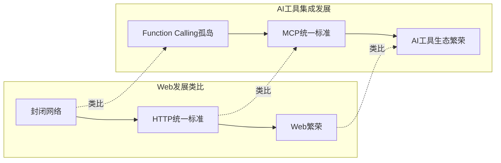

С появлением Model Context Protocol (MCP) пространство интеграции инструментов ИИ претерпевает глубокую смену парадигмы. В этой статье мы рассмотрим эволюцию от вызова функций к MCP, проанализируем их существенные различия, а также изучим текущее состояние и будущее развитие экосистемы MCP. Независимо от того, являетесь ли вы исследователем, разработчиком или просто наблюдателем, интересующимся технологиями ИИ, эта статья поможет вам лучше понять эту развивающуюся область.

<! -еще-->

## От вызова функций до MCP: историческая неизбежность эволюции технологий

Прежде чем мы сможем детально сравнить эти две технологические парадигмы, необходимо понять исторический контекст, в котором они возникли.

### Вызов функций: доминирующее решение для ранней интеграции инструментов ИИ

Вызов функций был ранним решением для взаимодействия больших языковых моделей (LLM) с внешними инструментами, позволяя модели решать, когда вызывать предопределенные функции и генерировать структурированные аргументы. В этой парадигме модель анализирует намерения пользователя, решает, нужно ли вызвать определенную функцию для выполнения задачи, и предоставляет необходимые параметры.

На примере вызова функций OpenAI разработчику необходимо:
1. определить структуру функции (название, параметры, описание и т. д.) в каждом запросе API
2. дождаться, пока модель распознает намерение пользователя и сгенерирует запрос на вызов функции
3. получить запрос на вызов функции, выполнить фактическую функцию и вернуть результат в модель.

```python
# OpenAI Function Calling示例（简化版）
response = client.chat.completions.create(
    model="gpt-4o",
    messages=[
        {"role": "user", "content": "北京现在的天气如何？"}
    ],
    tools=[{
        "type": "function",
        "function": {
            "name": "get_weather", 
            "description": "获取指定位置的天气信息",
            "parameters": {
                "type": "object", 
                "properties": {
                    "location": {"type": "string", "description": "城市名称"},
                    "unit": {"type": "string", "enum": ["celsius", "fahrenheit"]}
                }, 
                "required": ["location"]
            }
        }
    }]
)
```.

### Ограничения вызова функций и необходимость тонкой настройки

Хотя вызов функций добавляет ИИ возможность взаимодействовать с внешними системами, на практике было выявлено несколько ключевых ограничений:

1. **Закрытая экосистема**: каждый поставщик ИИ (например, OpenAI, Anthropic, Google) имеет собственную реализацию Function Calling, которая не совместима друг с другом.
2. **Отсутствие стандартов**: отсутствие единых стандартов приводит к тому, что разработчикам приходится адаптировать разный код для каждой платформы.
3. **Необходимость тонкой настройки**: чтобы добиться наилучшей производительности, модель обычно необходимо точно настроить под цель.

В частности, по последнему пункту в документации Microsoft Azure OpenAI четко сказано: "Тонкая настройка моделей с помощью примеров вызовов инструментов может **улучшить результаты работы модели**, позволяя вам:
- Получать последовательно оформленные ответы, даже если не предоставлены полные определения функций
- Получить более точные и последовательные результаты".

В связи с этим возникает вопрос: почему вызов функций нуждается в тонкой настройке?

Основная причина заключается в том, что в то время как LLM понимает естественный язык, вызов функций - это интерфейс, определяемый человеком, который требует от модели изучения определенных шаблонов вызова. Модель должна понимать:
1. когда следует вызывать функцию (а не отвечать напрямую)
2. какую функцию следует вызвать
3. как правильно сконструировать параметры

Тонкая настройка обучает модель этим навыкам, предоставляя множество примеров, но это означает, что для каждой новой функции или набора функций может потребоваться дополнительная работа по тонкой настройке.

## MCP: Open Protocol Redefines AI Tool Integration

Контекстный протокол модели (MCP) использует совершенно иной подход к проблеме интеграции инструментов ИИ. MCP - это не API-функция, а скорее **Открытый протокол стандартов**, определяющий единый способ взаимодействия систем ИИ с внешними инструментами и ресурсами.

### Основные концепции MCP

MCP следует следующей основной философии дизайна:

1. **Протокол превыше всего**: кросс-платформенная совместимость за счет определения стандартных протоколов вместо API.
2. **Архитектура клиент-сервер**: четкое разделение модели ИИ (клиент) и поставщика инструментов (сервер).
3. **Многочисленные прото-языки**: не только вызовы функций, но и доступ к ресурсам, шаблоны подсказок и другие многочисленные режимы взаимодействия
4. **Человек в петле**: акцент на безопасности, клиент контролирует доступ к инструментам.
5. **Открытые стандарты**: открытые стандарты, управляемые сообществом, чтобы избежать привязки к производителю.

### Аналогия между MCP и HTTP: от информационного силоса к открытой экологии

Между MCP и HTTP существуют удивительные параллели. На заре существования Сети различные компьютерные сети общались с помощью проприетарных протоколов (например, AOL, CompuServe), создавая информационные силосы. Появление HTTP как открытого стандартного протокола унифицировало сетевые коммуникации и вызвало взрывной рост Сети.

Аналогичным образом, до появления MCP все основные поставщики ИИ имели собственные реализации функциональных вызовов, создавая "силосы возможностей ИИ". MCP, как единый стандарт, имеет потенциал для изменения всей экосистемы интеграции инструментов ИИ.



### Техническая архитектура MCP

MCP использует клиент-серверную архитектуру, и основные компоненты включают в себя:

1. **Хост**: например, Claude Desktop, в который интегрирован клиент MCP.
2. **Клиент**: поддерживает соединение 1:1 с сервером.
3. **Сервер**: предоставляет инструменты, ресурсы и советы.
4. **Транспорт**: поддерживает несколько методов обмена данными (например, stdio, SSE).

```mermaid
flowchart LR
    subgraph "本地计算机"
        Host["主机（集成MCP客户端）<br>如Claude Desktop"]
        S1["MCP服务器A"]
        S2["MCP服务器B"]
        S3["MCP服务器C"]
        Host <-->|"MCP协议"| S1
        Host <-->|"MCP协议"| S2
        Host <-->|"MCP协议"| S3
        S1 <--> D1[("本地<br>数据源A")]
        S2 <--> D2[("本地<br>数据源B")]
    end
    subgraph "互联网"
        S3 <-->|"Web APIs"| D3[("远程<br>服务C")]
    end
```.

### Почему MCP не нуждается в тонкой настройке?

Вернемся к первоначальному вопросу: почему MCP не нуждается в тонкой настройке? Ответ кроется в дизайне протокола и стандартизированном интерфейсе:

1. **Унифицированные интерфейсы**: MCP определяет стандартизированные интерфейсы для инструментов, ресурсов и подсказок, так что модели естественным образом понимают, как их использовать.
2. **Структурированное взаимодействие**: архитектура клиент-сервер обеспечивает последовательные паттерны взаимодействия, которые легко осваиваются моделями.
3. **Самоописывающиеся инструменты**: инструменты MCP содержат богатые метаданные, которые позволяют моделям понять, как использовать инструмент.
4. **Разделение забот**: MCP отделяет "как выполнять" от "когда выполнять", так что модели нужно сосредоточиться только на последнем.

Точно так же, как нам не нужно обучать браузеры понимать HTTP-серверы, модели с поддержкой MCP естественным образом понимают MCP-совместимые инструменты.

## Состояние экосистемы MCP и проблемы индексирования

С ростом популярности MCP все больше разработчиков и организаций создают MCP-сервисы. Однако это породило новую проблему: как эффективно обнаруживать и индексировать эти сервисы?

### Существующие решения для индексирования MCP-сервисов

Существует несколько основных подходов к индексированию MCP-сервисов:

#### 1. Поиск на GitHub и листинги Awesome

MCP-сервисы обнаруживаются с помощью поиска на GitHub или поддерживаемых сообществом списков "Awesome":
- [punkpeye/awesome-mcp-servers](https://github.com/punkpeye/awesome-mcp-servers)
- [appcypher/awesome-mcp-servers](https://github.com/appcypher/awesome-mcp-servers)

Преимущества:
- Открытый исходный код, управляемый сообществом, быстрое обновление контента
- Базовая категоризация и фильтрация
- Есть контроль качества (через PR и аудит)

Слабые стороны:
- Фрагментация информации
- Пользовательский опыт не интуитивен
- Отсутствие данных о производительности и совместимости в реальном времени

#### 2. Специализированные места сбора

Некоторые сайты посвящены сбору и организации MCP-сервисов:
- [glama.ai/mcp/servers](https://glama.ai/mcp/servers)
- [pulsemcp.com](https://www.pulsemcp.com)

Преимущество:
- Более структурированное представление данных
- Лучшее удобство для пользователей и функциональность поиска
- Предоставляет дополнительную информацию (например, совместимость, рейтинги безопасности)

Слабые стороны:
- Зависимость обновлений от владельцев веб-сайтов
- Возможность коммерциализации
- Отсутствие глубокой вовлеченности сообщества

### Будущее обнаружения услуг MCP: появится ли "Google"?

Существующие механизмы индексирования MCP-сервисов находятся на ранних стадиях, подобно каталогам и спискам ссылок в раннем Вебе. По мере развития экосистемы мы можем увидеть более зрелые решения для обнаружения сервисов:

1. **Специализированная поисковая система**: подобно поисковой системе Google для MCP-сервисов, но с большим акцентом на показатели разработчиков, такие как техническая совместимость и стабильность API.

2. **Встроенный в протокол механизм обнаружения**: сам MCP может развить встроенный протокол обнаружения сервисов, подобный системе DNS.

3. **Распределенный каталог**: децентрализованный доверенный каталог сервисов на основе блокчейна или аналогичной технологии.

4. **Экосистемные хабы**: платформы, уже находящиеся в центре экосистемы ИИ (например, Anthropic, OpenAI или GitHub), могут стать доминирующими.

Идеальная система индексирования MCP должна иметь:
- Стандартизированные метаданные
- Мониторинг в реальном времени
- Система обратной связи с пользователями
- Автоматизированное тестирование
- Контроль версий
- Семантический поиск

## Пример: использование погодного сервиса MCP

Чтобы продемонстрировать полезность MCP, вот шаги по установке и использованию службы "adhikasp/mcp-weather":

### Подготовка к установке

1. **Пререквизиты
   - Получите API-ключ AccuWeather ([developer.accuweather.com](https://developer.accuweather.com/)).
   - Установите Python 3.8+ и инструмент управления пакетами uv

2. **Метод установки**

   Метод 1: Используйте репозиторий GitHub напрямую
   ```bash
   git clone https://github.com/adhikasp/mcp-weather.git
   cd mcp-weather
   uv venv
   uv sync
   echo "ACCUWEATHER_API_KEY=your_api_key_here" > .env
   python -m mcp_weather.weather  # 仅测试
   ```

   Метод 2: Использовать предварительно собранный пакет PyPI (если он выпущен)
   ```bash
   pip install mcp-weather
   ```

3. **Настройте Claude для рабочего стола**

   Добавьте в конфигурационный файл Claude for Desktop:
   ```json
   {
     "mcpServers": {
       "weather": {
         "command": "uvx",
         "args": [
           "--from", 
           "git+https://github.com/adhikasp/mcp-weather.git", 
           "mcp-weather"
         ],
         "env": {
           "ACCUWEATHER_API_KEY": "your_api_key_here"
         }
       }
     }
   }
   ```

### Детали реализации сервиса

Давайте посмотрим на основной код реализации этой службы MCP:

```python
@mcp.tool()
async def get_hourly_weather(location: str) -> Dict:
    """Get hourly weather forecast for a location."""
    api_key = os.getenv("ACCUWEATHER_API_KEY")
    base_url = "http://dataservice.accuweather.com"
    
    # 获取位置信息
    location_key = get_cached_location_key(location) or await fetch_location_key(location)
    
    # 获取当前天气和预报
    current_conditions = await fetch_current_conditions(location_key)
    forecast = await fetch_hourly_forecast(location_key)
    
    # 格式化返回数据
    return {
        "location": location,
        "current_conditions": format_current_conditions(current_conditions),
        "hourly_forecast": format_hourly_forecast(forecast)
    }
```.

Эта упрощенная версия кода показывает основную структуру реализации инструмента MCP. Фреймворк FastMCP автоматически обрабатывает определения типов, проверку параметров и преобразование результатов, определяя инструменты через декоратор Python `@mcp.tool()`.

### Использование сервисных инструментов

После установки и настройки сервиса MCP вы можете использовать его естественным образом в Claude:

1. спросите: "Будет ли завтра дождь в Пекине?".
2. Claude распознает это как запрос о погоде и автоматически вызывает службу MCP.
3. служба MCP запрашивает данные у AccuWeather API.
4. Claude получает данные и генерирует ответ на естественном языке.

Весь процесс прозрачен для пользователя, обеспечивая бесперебойную работу.

## Сосуществование и взаимодополняемость MCP и вызова функций

Хотя MCP решает многие проблемы функционального вызова, эти два метода, скорее всего, будут сосуществовать еще долгое время, каждый из них будет обслуживать различные сценарии:

### Причины сосуществования

1. **Различные сценарии применения
   - FC подходит для простых сценариев с прямыми вызовами API и специализированных приложений, требующих глубокой настройки модели.
   - MCP подходит для сложной многоинструментальной интеграции и кроссплатформенных приложений.

2. **Путь эволюции технологии
   - FC может перенять опыт MCP и принять более стандартизированные интерфейсы
   - MCP также может интегрировать некоторые преимущества FC, такие как более тесная интеграция моделей

3. **Факторы бизнес-стратегии**
   - Поставщики бизнес-моделей заинтересованы в сохранении собственных экосистем API.
   - Сообщества с открытым исходным кодом, с другой стороны, поддерживают открытые стандарты

### Возможные архитектуры будущего

В будущем мы можем увидеть гибридную архитектуру, в которой нижний уровень использует вызов функций (возможно, с тонкой настройкой) для обеспечения преимуществ производительности, а верхний уровень предоставляет единую экосистему абстракций и инструментов через MCP.

```mermaid
flowchart TD
    User[用户]
    Client[MCP客户端]
    Server1[MCP服务器1]
    Server2[MCP服务器2]
    LLM[大型语言模型]
    FC[Function Calling层]
    
    User --> Client
    Client <--> Server1
    Client <--> Server2
    Client <--> LLM
    LLM <--> FC
    
    classDef standardLayer fill:#f9f,stroke:#333,stroke-width:2px;
    classDef optimizedLayer fill:#bbf,stroke:#333,stroke-width:2px;
    
    class Client,Server1,Server2 standardLayer;
    class LLM,FC optimizedLayer;
```.

## Заключение

MCP представляет собой будущее направление интеграции инструментов ИИ, решая многочисленные проблемы, с которыми сталкивается Function Calling, с помощью открытых протоколов. Это не только устраняет зависимость от тонкой настройки, но и создает процветающую экосистему сервисов.

Конечно, экосистема MCP все еще находится на ранней стадии и сталкивается с такими проблемами, как обнаружение сервисов и эволюция стандартов. По мере того как все больше разработчиков и организаций присоединяются к экосистеме MCP, мы ожидаем появления новых инновационных решений.

Ожидается, что MCP, являясь ключевой инфраструктурой для развития ИИ, будет способствовать интеграции и масштабированию возможностей ИИ так же, как HTTP для Web. Никогда еще не было лучшего времени для разработчиков и пользователей, чтобы понять и принять участие в этой технологической волне".

Чего вы ожидаете от будущего MCP? Считаете ли вы, что он полностью заменит вызов функций? Не стесняйтесь поделиться своими соображениями в разделе комментариев!
